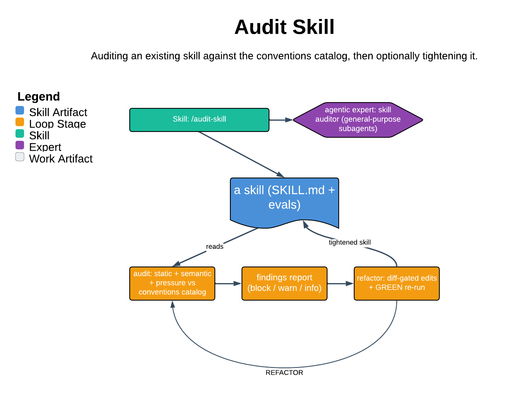

# Audit Skill

> Auditing an existing skill against the conventions catalog, then optionally tightening it.

The brown-field sibling of `/author-skill`: it measures a skill that already exists against the documented conventions catalog and produces a findings report, rather than authoring from a blank page. Its core guarantee is that auditing is read-only by default — no edits happen unless you opt into the refactor phase, and every proposed change is shown as a unified diff and applied only on explicit confirmation.

| | |
|---|---|
| **Diagram archetype** | meta-skill |
| **Visual grammar** | Design 14 · Grammar-version 14.1.0 |
| **Live diagram** | [Open in Lucid](https://lucid.app/lucidchart/2fdf4ca7-c17c-4f51-b6b2-cb9631126975/edit) |
| **Skill** | [`SKILL.md`](./SKILL.md) |

## What it does

- Resolves a target skill under `.claude/skills/<name>/`, classifies its shape, and runs static + semantic + pressure checks against `references/conventions-catalog.md`, emitting a severity-grouped findings report into the DRI's `<engineer>-designs` repo.
- Optionally tightens the skill via an opt-in (`--apply`) refactor phase that proposes per-finding diffs, re-runs pressure scenarios to verify (GREEN), and appends surviving scenarios to the skill's `evals.json`.
- The refusal that matters most: it never auto-remediates. Audit-only is the default, `--apply` is rejected without a prior audit pass in the same session, and every edit passes a diff-and-confirm gate.

## Reading the diagram

This is a meta-skill archetype — a skill whose subject is another skill. The diagram shows the target skill as the artifact under inspection on one side and the audit machinery (catalog, static-check script, semantic and pressure subagents) reading it on the other. The two-phase flow reads as a gate: Phase 1 audit produces the durable findings report, and only an explicit confirmation crosses into the Phase 2 refactor loop, where diffs feed back into the target.
