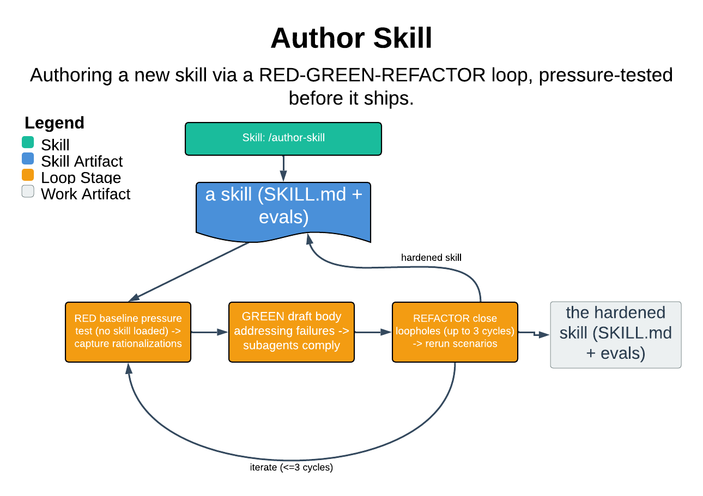

# Author Skill

> Authoring a new skill via a RED-GREEN-REFACTOR loop, pressure-tested before it ships.

Author Skill generates a new skill for a specific domain by driving an opinionated loop — Intake, Research, Draft, Test under pressure, Scaffold, Catalog — that treats skill documentation as code under RED-GREEN-REFACTOR. The one thing it guarantees: a skill that has been pressure-tested against subagents before it lands, never a Markdown file that hopes for the best. It refuses to author anything for which it cannot first write a guardrails stanza.

| | |
|---|---|
| **Diagram archetype** | meta-skill |
| **Visual grammar** | Design 14 · Grammar-version 14.1.0 |
| **Live diagram** | [Open in Lucid](https://lucid.app/lucidchart/de69332b-bb77-438c-ac73-f48cc4373f72/edit) |
| **Skill** | [`SKILL.md`](./SKILL.md) |

## What it does

- Runs Intake, Research, Draft, Test, Scaffold, Catalog as one loop; research is non-negotiable and the skill is never drafted from training data alone.
- Drafts the guardrails stanza FIRST, then pressure-tests the body: RED captures subagent rationalizations without the skill, GREEN re-runs the same scenarios with the skill loaded, REFACTOR closes loopholes for up to 3 cycles.
- Scaffolds the skill on disk, registers a catalog entry, and proposes a sync-list decision — each step gated on explicit user confirmation.
- The guarantee that matters most: it will not author a skill whose refusal conditions cannot be articulated, and it halts rather than ship a design that still fails after 3 REFACTOR cycles.

## Reading the diagram

This is the meta-skill archetype — a skill whose subject is other skills, so the diagram shows it operating on a skill artifact rather than on a domain system. Read the central RED-GREEN-REFACTOR loop as the heart: the same pressure scenarios cycle through baseline, verify, and loophole-closing passes, with subagent dispatch as the recurring move. The surrounding stages (Intake through Catalog) feed into and out of that loop left to right, and the guardrail gates are drawn as the halt points where the skill stops and hands the decision back to the user.
