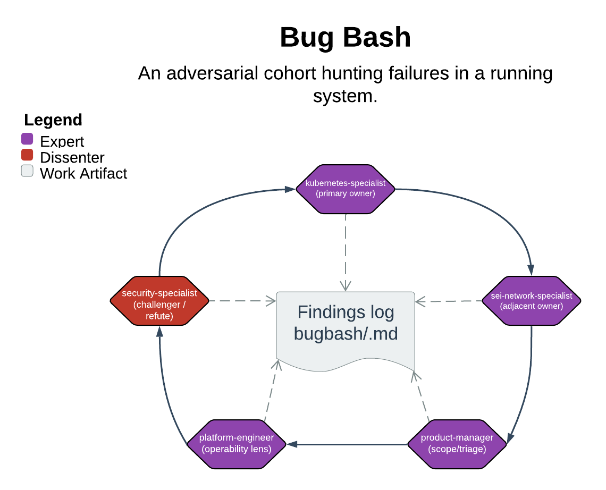

# Bug Bash

> An adversarial cohort hunting failures in a running system.

Bug bash is a read-only, looped hardening pass: a fixed slate of specialists adversarially reviews a named target — discovering, then challenging, then triaging findings over repeating passes until they converge on a launch verdict. It never touches source code; the only things it writes are the findings log and the resume state, both in the DRI's designs repo.

| | |
|---|---|
| **Diagram archetype** | circular-cohort |
| **Visual grammar** | Design 14 · Grammar-version 14.1.0 |
| **Live diagram** | [Open in Lucid](https://lucid.app/lucidchart/cd81eaa9-7781-42dd-91b4-6ab09eff9b39/edit) |
| **Skill** | [`SKILL.md`](./SKILL.md) |

## What it does

- Dispatches 3-6 domain experts in parallel against one target, each surfacing up to 5 candidate findings — no fixes, no severity, just observations.
- Merges overlapping candidates, then has a *different* expert challenge each one (confirm / refute / downgrade) before it earns a place in the log.
- Loops until convergence: two consecutive passes with zero new findings of Medium or higher, then collects a per-expert launch verdict (ship-it / conditional / don't-ship).
- The guarantee that matters most: it stays read-only. It refuses to edit, create, or delete anything under the target's source tree — a found bug is recorded and handed off, never patched from inside the run.

## Reading the diagram

The circular-cohort archetype shows a ring of specialists iterating against a target at the center — the visual metaphor for a fixed slate making repeating, adversarial passes rather than a one-shot review. The arrows around the ring trace one pass: discovery into merge, merge into the cross-expert challenger phase, challenger into triage-and-write — and then back around, because the loop only exits on the convergence test. The closed circle is the point: no expert reviews their own finding, and the slate is locked for the run, so the ring itself is what makes convergence meaningful.
