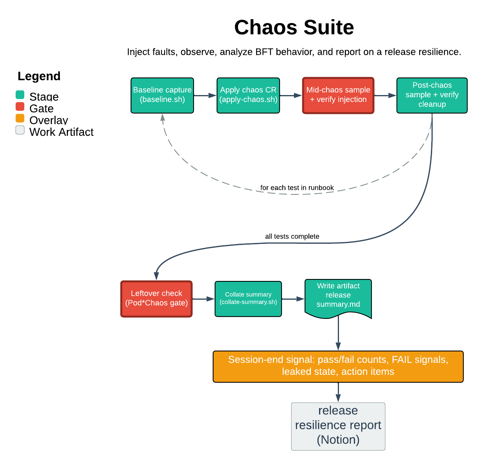

# Chaos Suite

> Inject faults, observe, analyze BFT behavior, and report on a release’s resilience.

Chaos Suite executes the full chaos test suite from runbook sei-protocol/platform#169 against a dev or staging Sei cluster, capturing baseline, mid-chaos, and post-chaos signals for each test and collating them into a release summary. The one thing it guarantees: it never touches production — it refuses to start on a prod or ambiguous kubectl context, and gates every run behind an explicit env flag and a typed scope confirmation.

| | |
|---|---|
| **Diagram archetype** | linear-pipeline |
| **Visual grammar** | Design 14 · Grammar-version 14.1.0 |
| **Live diagram** | [Open in Lucid](https://lucid.app/lucidchart/86285875-868f-4250-8da6-9459724b9a0c/edit) |
| **Skill** | [`SKILL.md`](./SKILL.md) |

## What it does

- Runs each runbook test as an ordered stage: baseline capture, chaos injection, mid-chaos sampling with injection verification, post-chaos recovery checks, and a Pod*Chaos leftover gate.
- Collates per-test state into a release summary artifact under the platform repo and reports pass/fail counts with Platform and Protocol action items.
- Operates on dev and staging clusters ONLY. It refuses to start on a prod or ambiguous context, without `CHAOS_SUITE_ALLOW=1`, on an unhealthy baseline, or with an unresolved prior run — and it never auto-remediates leaked chaos state.

## Reading the diagram

This is a linear-pipeline: read it left to right as the ordered stages of a single release cut's run. Each box is one phase of the per-test outer loop — baseline, apply chaos, mid-chaos sample, post-chaos recovery, leftover check — and the arrows are the sequencing that must hold, with HALT branches where a stage's verification fails. The collate-and-report stage sits at the end, downstream of every test having passed through the pipeline.
