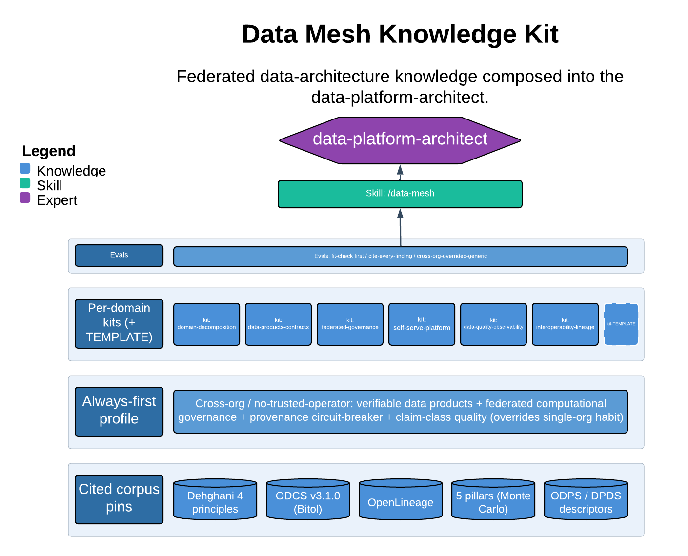

# Data Mesh Knowledge Kit

> Federated data-architecture knowledge composed into the data-platform-architect.

This skill designs and reviews data architecture — domain decomposition, data products and contracts, federated governance, self-serve platforms, and data quality/observability — with cross-organizational, no-trusted-operator data sharing as the core use-case. Its always-first profile overrides generic single-org mesh habit, and its load-bearing guarantee is the fit-check: it will tell you when a lakehouse plus a central team is the right answer rather than manufacture a mesh you don't need.

| | |
|---|---|
| **Diagram archetype** | layered-cake (kit) |
| **Visual grammar** | Design 14 · Grammar-version 14.1.0 |
| **Live diagram** | [Open in Lucid](https://lucid.app/lucidchart/58e076e5-d62f-4c74-94d6-cf1014b836a3/edit) |
| **Skill** | [`SKILL.md`](./SKILL.md) |

## What it does

- Grounds guidance in a citable corpus (Dehghani's four principles, the six data-product attributes, ODCS contracts, OpenLineage, the observability pillars) with currency discipline — every finding cites a primary source or a profile rule, and stays copyright-clean.
- Applies an always-first cross-org profile that inverts the trust model: trust the verifiable product not the pipeline, enforce governance computationally and operator-independently, and expose provenance per assertion as a cascade circuit-breaker.
- Composes pluggable per-concern kits — domain decomposition, data products and contracts, federated governance, self-serve platform, data quality/observability, interoperability/lineage.
- Refusal that matters most: it runs the fit-check (method stage 0) before designing anything and will recommend the simpler architecture instead of a mesh when a mesh is the wrong answer.

## Reading the diagram

The layered-cake archetype stacks the skill's knowledge sources and composes them upward into the agent that consumes them. Lower layers are the citable corpus (the generic floor) and the always-first cross-org profile that sits on and sometimes overrides it; the per-concern kits layer on top, and they all feed the `data-platform-architect` persona at the apex. Read it bottom-up: corpus grounds the profile, the profile and the relevant kit load first, and the agent designs or reviews against the profile first and the canon second.
