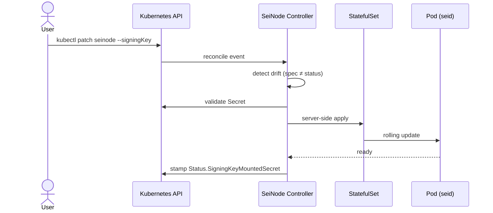
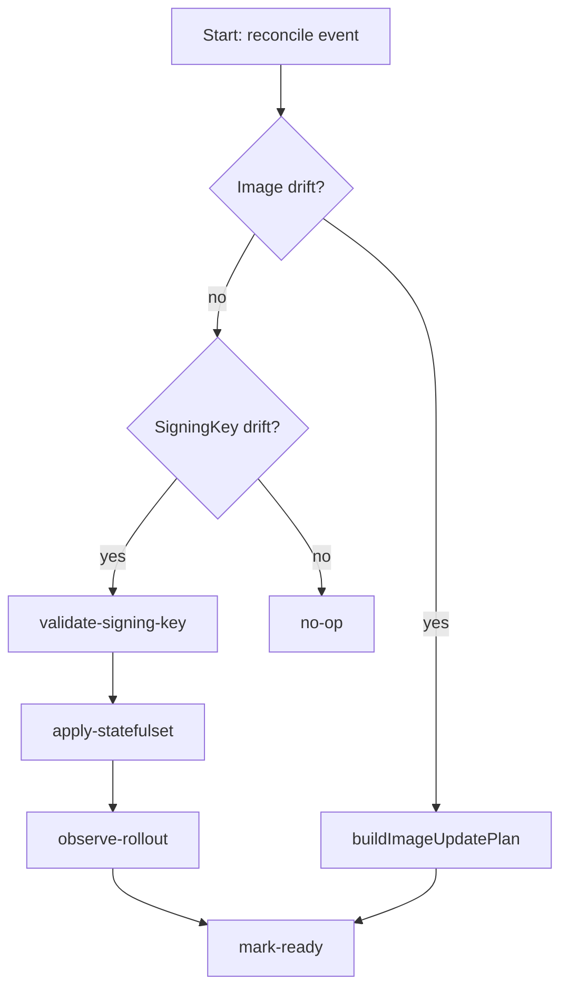
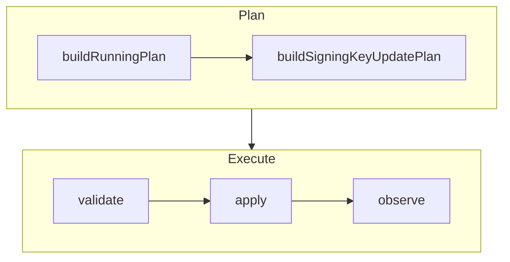
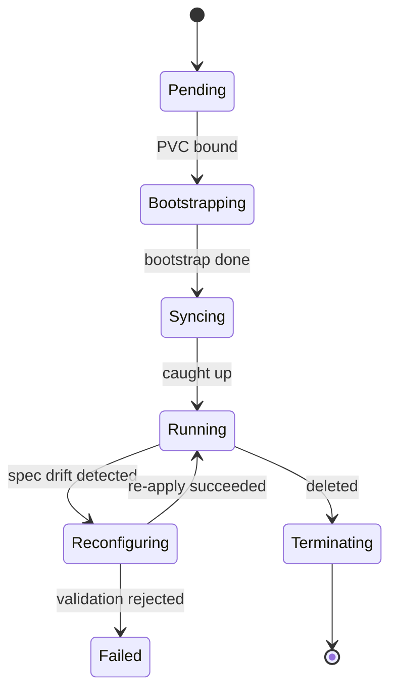
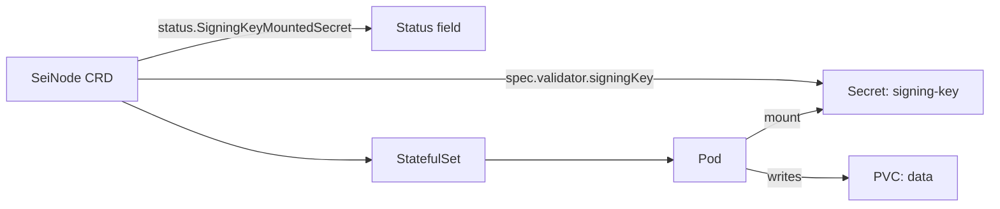
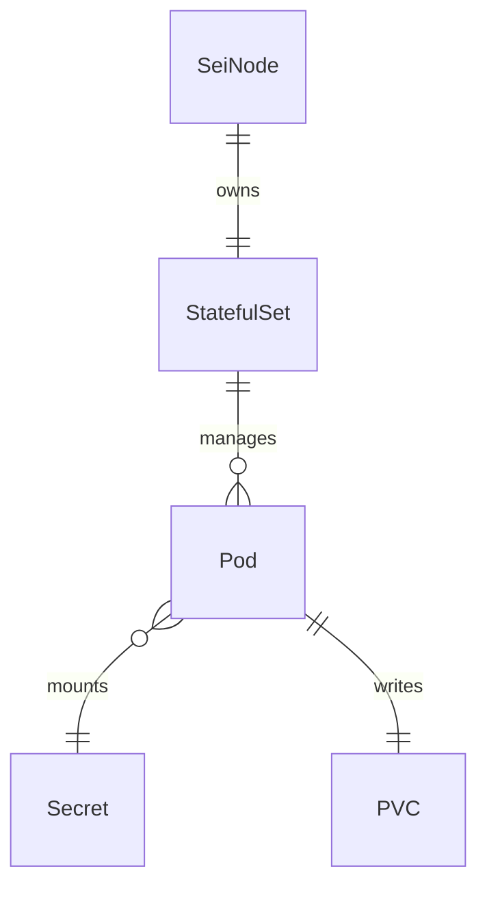
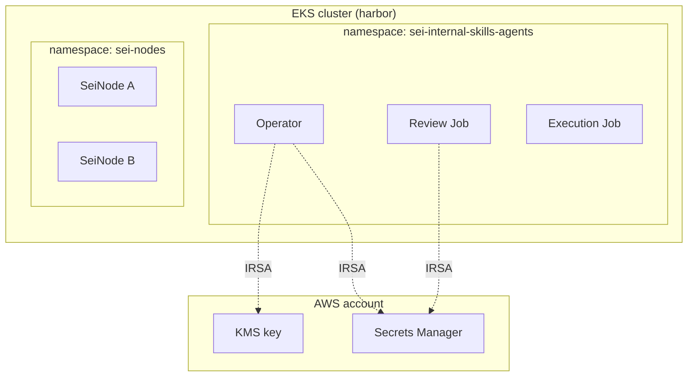
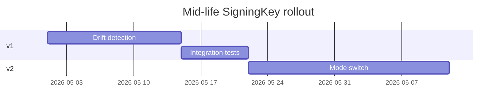

# Mermaid Patterns

Common diagram types used in design documents, with snippets and "when to use" guidance. Mermaid renders inline in GitHub markdown, GitLab, and most modern markdown viewers — no preprocessor needed.

## When to use which diagram

| Question the diagram answers | Diagram type |
|---|---|
| "What's the order of operations across components?" | Sequence |
| "What decision tree does the code take?" | Flowchart |
| "What states does this object move through?" | State |
| "What's the data shape and how do entities relate?" | ER diagram (or labeled flowchart) |
| "What's the deployment topology?" | Flowchart with subgraphs |
| "How long does each phase take?" | Gantt |

If the design doesn't have a diagram-shaped question, **don't add a diagram**. A misleading diagram is worse than no diagram. Prefer prose or a code reference (`internal/planner/planner.go:621-628`).

## Sequence diagrams — interaction across components

Use when an order-of-operations matters. Most common in distributed-systems designs.



**Tips:**
- Use `actor` for human/external invokers, `participant` for systems.
- Use `as <Alias>` to give participants short readable names.
- `->>` for synchronous calls, `-->>` for responses, `-)` for async.
- Add `Note over Ctrl: ...` for inline commentary.
- Keep to 5-7 participants max. Beyond that, split into multiple sequences or move to a flowchart.

## Flowcharts — decision trees and process logic

Use when the path through code or a workflow has branches.



**Tips:**
- `TD` = top-down, `LR` = left-right. TD reads naturally for sequential logic; LR for wide branching.
- `[]` for processes, `{}` for decisions, `()` for start/end nodes.
- Label edges with `-- text -->` for branch conditions.
- Use `subgraph` to group related nodes:



## State diagrams — object lifecycles

Use when a single object moves through discrete states. Common for CRD status fields, workflow phases.



**Tips:**
- `[*]` is the terminal start/end node.
- Label transitions with conditions: `StateA --> StateB: condition`.
- Use `note right of` for state-specific notes.
- Keep state count ≤ 10. More states = move to a table.

## ER-like flowcharts — data shape

Mermaid has an `erDiagram` type, but it's strict about cardinality syntax. For loose data-shape sketches, a labeled flowchart often reads better:



If you do want strict ER:



`||--||` = exactly one to exactly one; `||--o{` = one to zero-or-many; `}o--||` = zero-or-many to exactly one.

## Subgraphs for topology

When the design has a cluster, region, or VPC layout:



**Tips:**
- `subgraph X["Display Name"]` for quoted labels.
- `direction LR` inside a subgraph overrides the parent direction for that group.
- Dotted lines (`-.->`) for "uses / depends on" vs solid lines for "contains / owns".

## Gantt — phased work timelines

Less common in LLDs, but useful in roadmap-style designs.



Skip if the design isn't time-bound. Most LLDs aren't.

## Verification comments

When `/design` generates a diagram from session context, it marks the diagram with a verification comment:

```markdown
<!-- verify this matches your intent -->
```mermaid
sequenceDiagram
    ...
```
```

The user reviews and adjusts before finalizing. The comment can stay through the Draft status; remove it when the design moves to Under review or Accepted.

## Things mermaid is bad at

- **Network packet flow with detailed protocols** — use ASCII art or a real diagram tool (draw.io, excalidraw, sequencediagram.org).
- **UML class diagrams with inheritance hierarchies** — possible (`classDiagram`) but verbose.
- **Layered architecture stacks with sidecars/pods/containers** — possible with subgraphs but easy to get cluttered. Consider a simpler abstraction.
- **Anything that needs precise spatial layout** — mermaid auto-layouts.

When mermaid doesn't fit, prose with code references is usually better than forcing a diagram.
