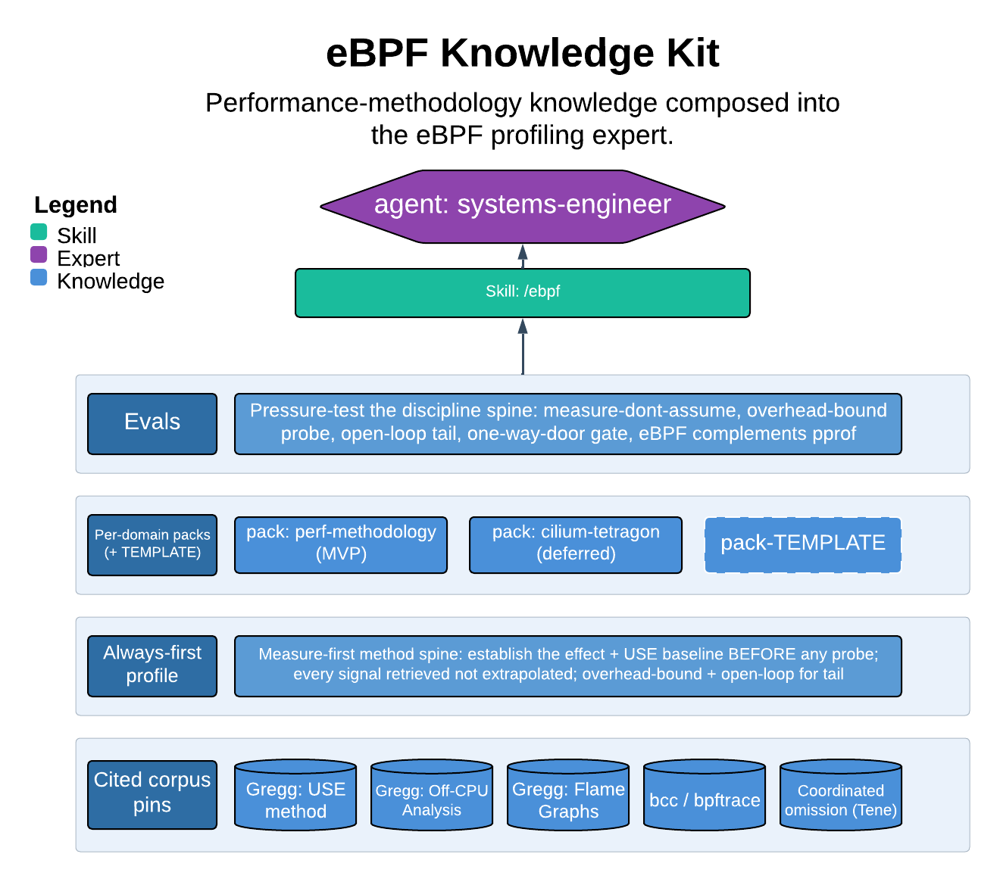

# eBPF Knowledge Kit

> Performance-methodology knowledge composed into the eBPF profiling expert.

This skill is the operating manual for designing and running kernel-level observability and performance benchmarks with eBPF/bpftrace — off-CPU time, lock contention, syscall and block-I/O latency distributions — the signals pod and Prometheus telemetry structurally cannot see. It pairs a measure-first method with a discipline spine, and its single most important guarantee is that every performance claim is backed by a retrieved, verbatim probe signal, never an extrapolated guess.

| | |
|---|---|
| **Diagram archetype** | layered-cake (kit) |
| **Visual grammar** | Design 14 · Grammar-version 14.1.0 |
| **Live diagram** | [Open in Lucid](https://lucid.app/lucidchart/88ff3de0-d69d-462b-9d89-100c846f089e/edit) |
| **Skill** | [`SKILL.md`](./SKILL.md) |

## What it does

- Designs and authors overhead-bounded probes and benchmarks (bpftrace, CO-RE, Tetragon policies) and attributes time to a mechanism using on/off-CPU flamegraphs and the USE-method baseline.
- Refuses to conclude a cause it never measured: no perf finding without the literal probe invocation and its verbatim output (histogram, folded stack, count).
- Treats every privileged kernel attach as a one-way door — it designs probes but never attaches or runs one on a shared or production node without human plus security sign-off, and never on a validator.

## Reading the diagram

This is a layered-cake archetype: each layer is a knowledge source — the substrate-agnostic perf-methodology pack, the tool-to-signal-to-concern map, the overhead model, and the discipline spine — stacked and composing upward into the `systems-engineer` agent that consumes them. Read it bottom-up: the lower layers are the citable authority and method, the upper layer is the composed expert. The stacking shows that adding a substrate means dropping one more conforming pack into the cake, not rewriting the agent above it.
