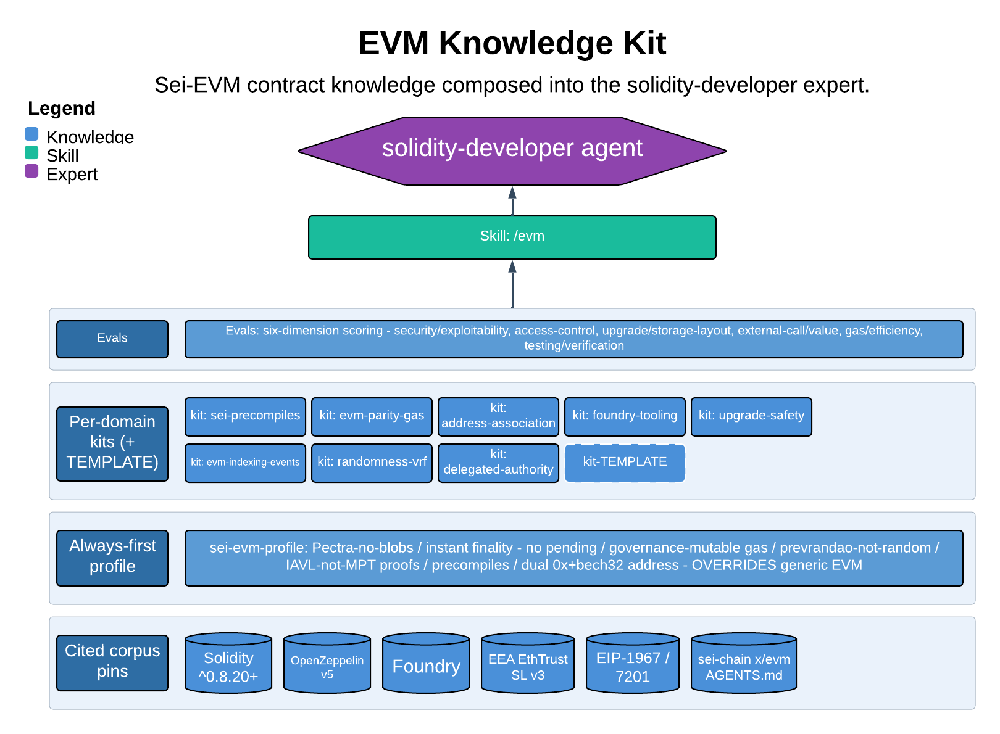

# EVM Knowledge Kit

> Sei-EVM contract knowledge composed into the solidity-developer expert.

This skill designs and reviews EVM smart contracts for Sei rather than generic L1 Ethereum: Solidity/Foundry contracts, precompile integration, gas and parity assumptions, upgrade safety, and on-chain event indexing for agentic consumers. Its one guarantee is that an always-first Sei-EVM profile is loaded before any design or review, so Sei's non-obvious execution facts (prevrandao-is-not-random, governance-mutable gas, IAVL-not-MPT proofs, instant finality / no pending state, dual 0x to bech32 addressing) override generic EVM habit. It owns the contract and Sei-EVM method, not the exploit-severity verdict or the idiom pass.

| | |
|---|---|
| **Diagram archetype** | layered-cake (kit) |
| **Visual grammar** | Design 14 · Grammar-version 14.1.0 |
| **Live diagram** | [Open in Lucid](https://lucid.app/lucidchart/011b3c5d-e154-4338-b0ce-c32c81063b76/edit) |
| **Skill** | [`SKILL.md`](./SKILL.md) |

## What it does

- Reviews and designs Sei-EVM contracts against the always-first Sei-EVM profile first and the external canon (Solidity, OpenZeppelin v5, Foundry, EEA EthTrust v3, EIP-1967/7201) second, scoring by six dimensions and citing a primary source or profile rule per finding.
- Pulls in pluggable kits per concern: precompiles, parity/gas, address/association, Foundry tooling, upgrade safety, event indexing, randomness/VRF, delegated authority.
- The guarantee that matters most: one-way doors (event signatures, storage layout, EIP-712 type hashes, selectors, address association, pointer registration) are flagged for human approval and never asserted as the fix; exploit-depth/severity defers to security-specialist and idiom/lint to idiomatic-reviewer.

## Reading the diagram

This is a layered-cake (kit) archetype: stacked knowledge sources composing upward into one agent. The base layers are the citable corpus and the always-first Sei-EVM profile that overrides it; the pluggable kits stack above as the per-concern slices you load on demand. The whole stack composes upward into the solidity-developer persona at the top, which loads the profile plus the relevant kit before it designs or reviews.
