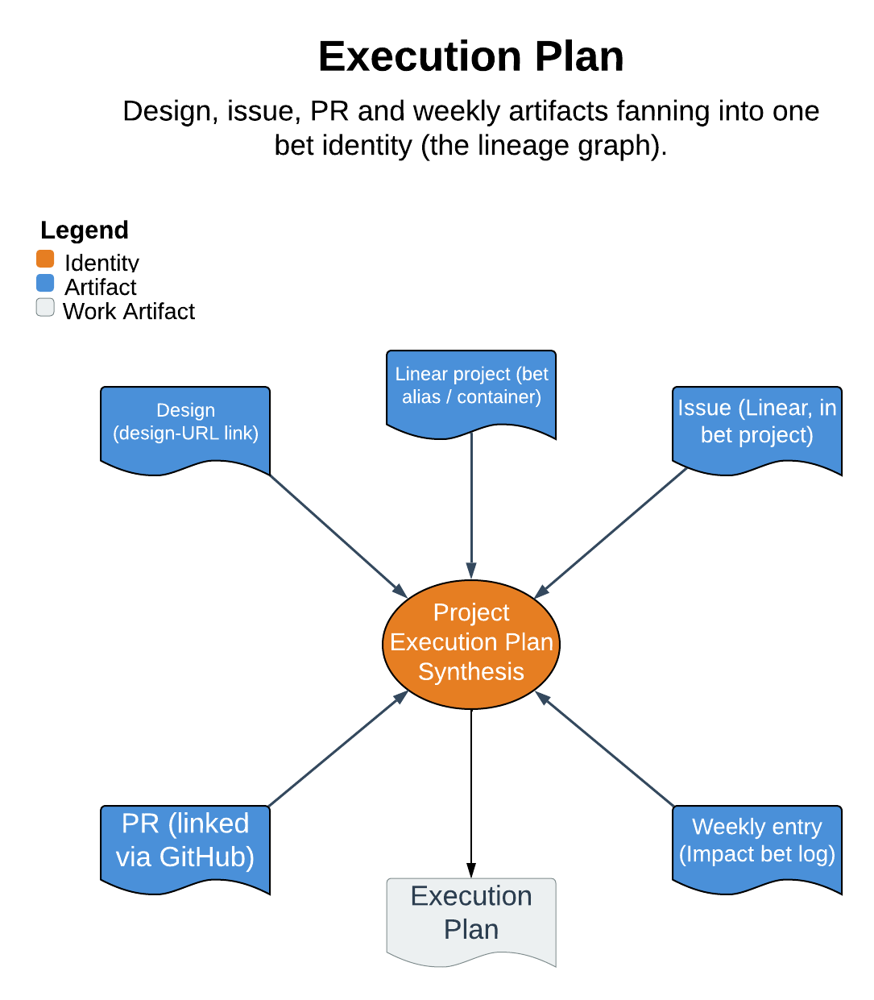

# Execution Plan

> Design, issue, PR and weekly artifacts fanning into one bet identity (the lineage graph).

Execution Plan is the shared mechanism substrate of the agentic-PM loop: it maps a bet to its Linear project and reads the `bet -> design -> issues -> PRs` lineage graph so `/issue`, `/design`, `/impact-weekly`, `/impact-portfolio`, and the technical-program-manager agent all share one implementation of identity, mapping, cache, and read contract. The one guarantee that matters most: it never becomes a third source of truth. Identity is always the bet's Notion page ID, the project is a re-derivable alias, and the skill stores nothing but a resolve cache.

| | |
|---|---|
| **Diagram archetype** | hub-and-spoke |
| **Visual grammar** | Design 14 · Grammar-version 14.1.0 |
| **Live diagram** | [Open in Lucid](https://lucid.app/lucidchart/5dd5b54d-1edf-413d-ad43-588bcb8db8dd/edit) |
| **Skill** | [`SKILL.md`](./SKILL.md) |

## What it does

- Maps a bet to an existing or newly created Linear project (`ensurePlan`), gated by a confirm on the one-way-door first mapping; reuse of a cached `{pageId -> projectId}` mapping is silent.
- Decorates issues with the bet's design-URL link (AUTO) and reads the lineage graph (`betGraph`) entirely on-demand, computing every view and storing none of it.
- The refusal that matters most: it maps, decorates, and reads only. It never moves an issue between projects to re-attribute it, never carries bet identity in a label, never makes lifecycle writes, never flips confidence, and never writes Notion or exec prose.

## Reading the diagram

This is a hub-and-spoke: the hub is the single bet identity (the Notion page ID and its Linear-project alias), and the spokes are the artifacts that fan into it — the design doc, the issues, the linked PRs, and the weekly entries. The arrows point inward toward the hub: each artifact is attributed to the bet by native project membership, not by a label, so one issue advances exactly one bet. The graph is derived, not stored, so the diagram shows relationships the skill computes on each read rather than a materialized object it owns.
