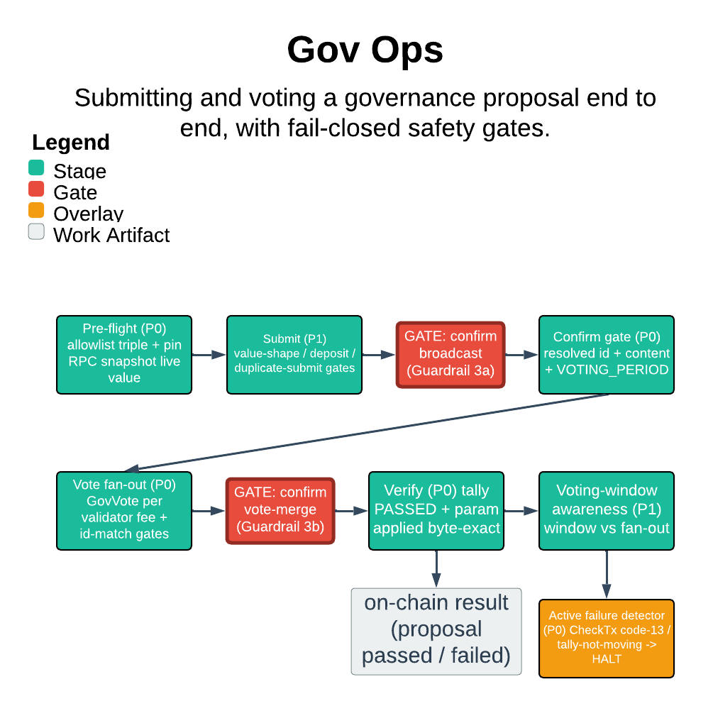

# Gov Ops

> Submitting and voting a governance proposal end to end, with fail-closed safety gates.

Gov Ops drives one Sei param-change governance proposal through its full lifecycle — submit, confirm, vote fan-out, verify — against a target chain, GitOps-native. The guarantee that matters most: every side-effecting step is a hard, fail-closed gate, and the skill refuses any kube context that co-hosts a non-target chain, so a proposal can never land on a mainnet-adjacent chain by accident.

| | |
|---|---|
| **Diagram archetype** | linear-pipeline |
| **Visual grammar** | Design 14 · Grammar-version 14.1.0 |
| **Live diagram** | [Open in Lucid](https://lucid.app/lucidchart/9a3922f9-cbce-4b2e-bee6-d30f0bb7ba06/edit) |
| **Skill** | [`SKILL.md`](./SKILL.md) |

## What it does

- Orchestrates one proposal lifecycle per invocation (param-change only): pre-flight, submit, confirm gate, vote fan-out across the live validator list via GitOps, active-failure detection, and verify-applied.
- Treats every safety property as a hard gate, not a preference — positive allowlist triple, pinned RPC endpoint, value-shape and deposit and fee-floor checks, and verbatim `confirm` before each irreversible act.
- The one refusal that matters: it refuses to start on any context that co-hosts a non-target chain (mainnet-adjacency), and refuses to auto-resume an interrupted run rather than risk a double-submit.

## Reading the diagram

This is a linear-pipeline: read it left to right as ordered stages — pre-flight, submit, confirm, vote fan-out, failure-detect, verify — each handing off to the next. The boxes are the stages and the arrows are the one-way flow of a single proposal through them; the gates drawn at stage boundaries are the fail-closed checks that must pass before flow continues. The pipeline does not loop: a failed gate halts in place rather than advancing, which is why the diagram reads as a straight line with guarded transitions.
