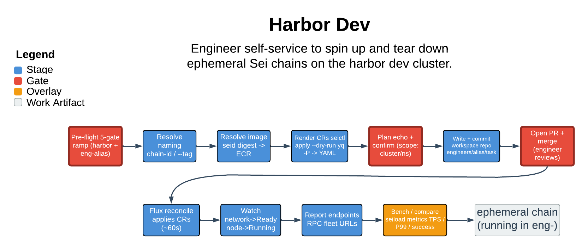

# Harbor Dev

> Engineer self-service to spin up and tear down ephemeral Sei chains on the harbor dev cluster.

Harbor Dev is the conversational layer over `seictl network` + `seictl node`: an engineer describes the chain, RPC fleet, or bench they want and the skill renders the matching SeiNetwork / SeiNode CRs into a PR against the harbor engineering-workspace repo, where Flux reconciles them onto the harbor EKS dev cluster. The single thing it guarantees: every side effect is scoped to the caller's own `eng-<alias>` namespace on harbor, and it refuses outright on a production context.

| | |
|---|---|
| **Diagram archetype** | linear-pipeline |
| **Visual grammar** | Design 14 · Grammar-version 14.1.0 |
| **Live diagram** | [Open in Lucid](https://lucid.app/lucidchart/5d089d34-d8bf-4f98-a0a7-739512f2aeb8/edit) |
| **Skill** | [`SKILL.md`](./SKILL.md) |

## What it does

- Translates plain-English intent ("give me 4 validators on seid sha=abc, then an RPC fleet") into `seictl` invocations, so the engineer never hand-rolls SeiNetwork / SeiNode YAML, preset wiring, or peer selectors.
- Defaults to GitOps: renders CRs via `--dry-run`, writes them under `engineers/<alias>/<task>/`, opens a PR, and lets Flux apply on merge — direct apply is a rare, double-confirmed escape hatch.
- Covers the full daily-driver surface: onboarding, chain spinup, RPC fleets, single and comparative benches, status reads, and `git rm`-based teardown.
- Refuses the boundary that matters: harbor-only (never prod), `eng-<alias>`-only (no cross-tenant work), and it never silently works around a missing prereq — it surfaces the next step and halts.

## Reading the diagram

This is a linear-pipeline: read it left to right as the ordered stages a request flows through — intent, pre-flight gates, render, PR, Flux reconcile, watch-to-healthy, report. Each box is one stage; the arrows are the hand-off that only happens once the prior stage passes (a failed pre-flight gate or unconfirmed plan echo stops the flow). The pipeline crosses the boundary from the engineer's laptop into the harbor cluster at the PR/Flux seam, which is where GitOps takes over from `seictl`.
