# Ephemeral chain flow (engineer-facing)

The skill's daily-driver flow for engineers spinning up an ephemeral Sei chain on harbor. Typical uses: testing a build, reproducing a bug, validating a release candidate, or driving a load run. Engineer says one English sentence. The agent renders the CRs (one `SeiNetwork` + N `SeiNode` followers) via `seictl network apply --dry-run` / `seictl node apply --dry-run`. It opens a PR against `sei-protocol/harbor-engineering-workspace`, and watches the network to Ready (and each follower to Running) after Flux applies on merge.

## The architectural model in three lines

1. **`seictl network apply --dry-run` / `seictl node apply --dry-run` are the rendering verbs** (or the `network_render` / `node_render` MCP tools when the host exposes them — same fields, YAML back, no `yq` strip; keep the server-side dry run, `seictl-cli.md`). `network apply` renders a `SeiNetwork` CR (genesis validator pool) from the `genesis-chain` preset; `node apply` renders one `SeiNode` follower from the `rpc` preset. An RPC fleet of N is N of these (no `--replicas` on a node). JSON on stdout — agent pipes through `yq -P 'del(.metadata.creationTimestamp, .metadata.generation, .metadata.managedFields, .metadata.resourceVersion, .metadata.uid, .status)' -o yaml` to strip server-side fields, writes to `engineers/<alias>/<task>/seinetwork-<id>.yaml` and `seinode-<id>-rpc-<k>.yaml` in the workspace repo, opens the PR. No cluster mutation at render time.
2. **The engineer reviews + merges; Flux applies.** Same audit-trail model the team uses across the platform. `harbor-engineering-workspace`'s per-engineer Flux Kustomization watches `engineers/<alias>/`; once the PR merges, the CRs land in `eng-<alias>` within ~60s. `kubectl get seinetwork,seinode -n eng-<alias> -o yaml` is the live view; git is the change history.
3. **The watch step is the post-merge agentic value-add — but the vocab splits.** `seictl network watch --until=Ready` (a SeiNetwork's terminal phase is `Ready`); `seictl node watch --until=Running` per follower (a SeiNode's terminal is `Running` — it has **no `Ready`**; `--until=Ready` on a node errors `Invalid` at parse). Watch streams NDJSON. Do NOT extract endpoints from the network's last event — the fleet is N CRs. Assemble it via `node list … -o json | jq` over each follower's `.status.endpoint` (see the networking section + recipe #1).

```mermaid
flowchart LR
  E[Engineer: natural language] --> A[harbor-dev skill]
  A -->|seictl network apply --dry-run<br/>seictl node apply --dry-run × N| Y[rendered SeiNetwork +<br/>N SeiNode YAMLs]
  Y -->|git commit + push| B[(engineers/&lt;alias&gt;/&lt;task&gt;/<br/>in harbor-engineering-workspace)]
  B -->|PR| PR[reviewable PR]
  PR -->|engineer merges| F[Flux Kustomization]
  F -->|kubectl apply| K[Kubernetes API]
  K --> C1[SeiNetwork CR]
  K --> C2[SeiNode CRs<br/>N followers]
  C1 --> R[sei-k8s-controller reconciles]
  C2 --> R
  R --> V[validator SeiNodes<br/>generated from genesis]
  R --> P[seid pods + per-node<br/>headless Service +<br/>.status.endpoint]
  A -->|network watch --until=Ready<br/>node watch --until=Running| W[NDJSON stream]
  W -.poll.-> C1
  W -.poll.-> C2
  W -->|exit 0 on phase| A
  P -->|PodMonitor| M[Prometheus]
  M --> G[Grafana dashboard]
  G --> E
```



## Preset taxonomy (v1: 2 presets)

Both presets ship embedded in the seictl binary at `presets/<name>.yaml` — the binary version IS the preset version. No remote distribution, no preset versioning lockfile.

The invocation shapes below show the bare apply form. **For engineer-facing flows, the agent always passes `--dry-run`** to capture the rendered CR as JSON, then pipes through `yq -P` (with the MCP tools present, `network_render` / `node_render` replace this pipeline). It writes the YAML (`seinetwork-<id>.yaml` / `seinode-<id>-rpc-<k>.yaml`) for the workspace-repo PR. Direct (no `--dry-run`) apply is the escape-hatch path covered below.

### `genesis-chain` (→ `seictl network`, renders a `SeiNetwork`)

Validators that run a fresh genesis ceremony on apply. Default 4 replicas (immutable once created).

```sh
seictl network apply <name> \
  --preset genesis-chain \
  --chain-id <chain-id> \
  --image <seid-ref> \
  [--replicas N] \
  -n eng-<alias>
```

Auto-wired on the rendered CR:
- `metadata.annotations.seictl.sei.io/preset: genesis-chain`
- `metadata.labels.sei.io/seinetwork: <chain-id>`
- The controller generates the validator SeiNodes and stamps `sei.io/seinetwork=<chain-id>`, `sei.io/role=validator` on each.

**Immutability:** `spec.genesis`, `spec.replicas`, `spec.resources`, and `spec.dataVolume.storage` are admission-immutable. To change the chain-id, the replica count, or the resource footprint, `delete` + re-create — the apiserver rejects a re-apply with `Invalid`.

### `rpc` (→ `seictl node`, renders one `SeiNode` per follower)

A full-node follower that **peers to an existing network by label selector**. One CR per follower; an RPC fleet of N is N `node apply` calls (`<id>-rpc-0 .. <id>-rpc-(N-1)`). No `--replicas`.

```sh
seictl node apply <name> \
  --preset rpc \
  --chain-id <chain-id> \
  --image <seid-ref> \
  --network <chain-id> \
  -n eng-<alias>
```

Auto-wired on the rendered CR (driven by `--network`):
- `metadata.labels.sei.io/seinetwork: <chain-id>`, `metadata.labels.sei.io/role: node`
- **`spec.peers[0].label.selector.sei.io/seinetwork: <chain-id>`** — the follower peers with every node in the namespace tagged with that network. Pointing the fleet at the genesis chain is "pass `--network <chain-id>`."

`--chain-id` (the node's own chain) and `--network` (who to peer with) are independent flags; for an in-namespace ephemeral chain, pass the same value for both. This is the load-bearing piece: `--network <id>` is enough to wire each follower to the genesis validators — no hand-rolled `--set spec.peers...` plumbing.

If an engineer asks for anything other than `genesis-chain` or `rpc` (archive node, single validator, fork-test), `apply` cannot serve it. Surface that and offer the hand-rolled-CR alternative.

## Override and composition

Atomic preset + `--set` overrides on the CR spec (the spec is flat — no `spec.template`):

| Override path | Mechanism | Example |
|---|---|---|
| Validator-pool replicas (network only) | `--replicas N` (create-time only — immutable) | `--replicas 21` |
| Image ref | `--image <ref>` | `--image ghcr.io/sei-protocol/seid:v6.4.0` |
| Chain ID | `--chain-id <id>` | `--chain-id sei-test-1` |
| Peer target (node only) | `--network <id>` | `--network sei-test-1` |
| seid CPU request | `--cpu <cores>` (create-time only — immutable) | `--cpu 8` |
| seid memory request | `--memory <quantity>` (create-time only — immutable) | `--memory 64Gi` |
| Data-volume size | `--storage <quantity>` (create-time only — immutable) | `--storage 1Ti` |
| Data-volume storage performance | `--iops <count>` + `--throughput <MiB/s>`, as a pair (create-time only — immutable) | `--iops 10000 --throughput 750` |
| Worker-node isolation | `--node-isolation Shared\|Dedicated` (mutable, but a change rolls every pod — set at create time; repeat on every re-apply, SSA drops it otherwise) | `--node-isolation Dedicated` |
| Anything else | `--set <dotted.path>=<value>` (repeatable) | `--set spec.fullNode.snapshot.s3.targetHeight=12345` |

Prefer the discrete resource flags over `--set spec.resources...`. `--set` bypasses seictl's local quantity validation. seictl also refuses a `--set` CPU limit at render, because the CRD forbids one (see `seictl-cli.md` → *Resource footprint*).

The storage-performance flags work the other way round from a name lookup: you supply the pair, and seictl resolves the VolumeAttributesClass that encodes it. `--set` cannot smuggle in a class name outside the supported set, and cannot pair a tier with a volume too small for its IOPS (see `seictl-cli.md` → *Storage performance*).

Layering, lowest precedence first: preset YAML → discrete flags → `--set`. Maps merge per-key; lists replace wholesale. Server-side-apply dry-run validates the merged CR against the apiserver's schema. The preset is not enough — the cluster's CRD is the schema oracle.

### Snapshot bootstrap (RPC followers)

For followers attaching to long-lived chains (`pacific-1`, `atlantic-2`), state-sync from a published snapshot is much faster than fresh sync. Discover available heights and wire the spec via `--set spec.fullNode.snapshot.s3.targetHeight=<height>` (flat on SeiNode) — see `references/aws-dependencies.md#snapshot-discovery-harbor-sei-snapshots` for the recipe + sidecar selection mechanics.

Do not wire snapshots for `genesis-chain` (fresh ceremony — nothing to restore from) or short-lived ephemeral chains where fresh sync is fast enough.

**This is create-time bootstrap of a NEW follower — distinct from `seictl workflow state-sync`.** The S3-snapshot flag here restores a node at apply time (a sidecar tarball restore). To re-bootstrap an *existing* node in place, or to run a giga store migration, use the imperative `seictl workflow state-sync` command. It is **destructive: it wipes the node's local chain state** (see `seictl-cli.md` → `seictl workflow state-sync` for the full gate).

Key on node identity: a new node uses the snapshot flag, an existing node uses the workflow command. For an ephemeral follower that has merely fallen behind, `delete` + re-apply through the PR flow gets a fresh snapshot bootstrap. That is safer than the imperative wipe. Both avoid a full fresh sync, which is why they get conflated. They are different mechanisms at different lifecycle stages.

### Anti-pattern: do not set `spec.sidecar` overrides

seictl does not populate this field (flat on SeiNode). If it appears in a rendered follower, strip it before writing to the workspace repo. It typically comes from a stale `--set`, a hand edit, or copy-paste from a debug session. sei-k8s-controller wires the sidecar image from cluster config. Overriding it pins a specific seictl/sidecar version, hides the platform's chosen default, and confuses the failure mode when reproducing a seid bug. (SeiNetwork validators take their sidecar from controller config — there is no per-follower override to make on them.)

The single legitimate use is testing a **platform / seictl / sidecar** change — never a sei-chain change. When the engineer's intent is sei-chain testing (the common case), `spec.sidecar` must be absent.

Echo the absence explicitly in the plan echo: `sidecar: cluster default (no override)`. If the engineer asked for a platform-test custom sidecar, echo `sidecar: <ref> (engineer-supplied; platform/seictl test mode)`.

### Anti-pattern: do not enable `spec.fullNode.snapshotGeneration`

Eng-workspace chains are ephemeral consumers of `harbor-sei-snapshots`, not producers. Enabling generation on a follower publishes non-canonical state and disables seid pruning. If the rendered SeiNode carries it (stale `--set`, hand edit), strip it (flat on SeiNode). Snapshot publishing is the snapshot-publisher workload's job — see `references/aws-dependencies.md#snapshot-discovery-harbor-sei-snapshots`.

## Networking: discoverability is the controller's job, exposure is yours

The controller publishes each node's reachability as `.status.endpoint.*` (in-cluster `svc` URLs) and stamps a per-node **headless Service** for peer connectivity. A SeiNetwork additionally gets a `<network>-internal` ClusterIP Service fronting its validator pool (published as `.status.internalService`, with composed `.status.endpoints`). Those are aggregate URLs for Tendermint RPC/REST only. The controller advertises EVM per-pod because filters/subscriptions/finalized-tag reads pin to a node. The Service also carries an evm-http port, inert while the backend is validators-only since ModeValidator disables EVM.

Beyond that the controller stops: it creates **no** load balancer, no ingress, no HTTPRoute. Those were the old SND `spec.networking` concerns and no longer exist. Standalone followers get no aggregate of any kind. **All exposure topology is engineer-owned Flux YAML** in the task dir, alongside the CRs. This is deliberate — discoverability is the controller's job. Exposure is a per-use-case choice the engineer makes explicit in git, reviewable and varying without a controller change.

**The discoverability rule (load-bearing): use the published endpoint verbatim — never reconstruct the URL.** The controller owns the DNS form: the node's per-node **headless** Service at `<node-name>.<namespace>.svc` (e.g. `http://chaos-rpc-0.eng-<alias>.svc:8545`). A reconstructed URL desyncs the moment the controller changes its naming. Read `.status.endpoint` (recipe #1); do not synthesize it.

### The decision rule, by use-case

**Internal ClusterIP/headless over HTTP is the default for in-namespace work. HTTPRoute/ingress only when the engineer explicitly needs external access. p2p is always TCP over the controller's headless Service — never an L7 concern.**

| Use-case | p2p (26656) | REST/RPC/EVM-HTTP (1317/26657/8545), EVM-WS (8546) | gRPC (9090) | Opinionated manifest |
|---|---|---|---|---|
| **In-namespace** (the default — load from a seiload Job in `eng-<alias>`, ad-hoc curl from a debug pod) | headless Service over TCP — already provided by the controller (per-node headless DNS). Nothing to add. p2p is raw TCP and **cannot** route through L7 — it stays pod-to-pod via headless DNS. | point load at the published `.status.endpoint.evmJsonRpc` **verbatim**. No ingress. This is the default the skill renders. | reach the per-node headless DNS directly (h2c is native in-cluster — no proxy, no annotation). gRPC is **not** in `.status.endpoint`, so dial the headless service by name. | none beyond the CRs — or a thin engineer-owned ClusterIP `Service` selecting `sei.io/seinetwork=<id>,sei.io/role=node` if the engineer wants a round-robin VIP across followers. That is the aggregate the SND used to auto-create; now explicit. |
| **External access** (laptop / external dApp must reach the chain) | external p2p needs `--external-address` + a NodePort/LB the engineer renders — rare for ephemeral testing; flag as expansion. | **HTTPRoute / ingress over HTTP** — only when external reach is genuinely required. Render a Gateway-API `HTTPRoute` (EVM HTTP + WS via `Upgrade` header match, REST, RPC) into the Flux dir. | gRPC `HTTPRoute` **must** set `appProtocol: kubernetes.io/h2c` on the backend Service port — without it, Istio/Gateway-API mis-detects the protocol and the route breaks silently. No error, just failed h2c framing. Rendered only on explicit external-gRPC intent. | engineer-owned `HTTPRoute` per protocol in the task dir; the gRPC route carries the `h2c` appProtocol. Rendered **only on explicit external-access intent**, never by default. |

The skill renders the opinionated minimum: bare CRs for the common case; an engineer-owned aggregate `Service` or `HTTPRoute` only when the use-case demands it. That extra YAML is always Flux-managed in the task dir, never a CRD field. For the seid port topology and the Istio/h2c constraints behind this table, the `sei-network-specialist` agent is the authority.

## Output

### `seictl network|node apply` — success

Native `SeiNetwork` / `SeiNode` CR on stdout as JSON. Same shape as `kubectl get seinetwork|seinode <name> -o json`. `.status` is whatever the controller has had time to write — empty or `phase=Pending` immediately post-apply. The `watch` step provides the eventual terminal-phase snapshot.

### `seictl network|node apply` — failure

`metav1.Status` on stderr; non-zero exit. Common reasons:

- `Invalid` — the rendered CR fails apiserver schema validation (typo'd `--set` path), OR a re-apply changes an immutable field (`spec.genesis`, `spec.replicas`, `spec.resources`, or `spec.dataVolume.storage`) — delete + re-create instead. Check the resource fields before blaming a `--set` typo: a changed `--cpu`, `--memory`, `--storage`, `--iops`, or `--throughput` produces the same `Invalid`.
- `Forbidden` — RBAC denies the apply. Likely the engineer's access entry is read-only; pre-flight gate 5 normally catches this earlier.
- `AlreadyExists` — name collision with an existing CR. If the existing CR is Flux-owned (rendered from another workspace-repo manifest), `git rm` that manifest first. Calling `seictl network|node delete` on a Flux-owned CR races the next reconcile. If hand-rolled (no Flux owner), `delete` it or pick a new name.

### `seictl network|node watch` — success

NDJSON stream of CR events on stdout, one per line. Exits 0 when `.status.phase == --until` (exact match). The vocab splits: `network watch --until=Ready`; `node watch --until=Running` (no `Ready` on a node — `--until=Ready` errors `Invalid` at parse). Endpoints are NOT read from the network's last line — assemble the fleet across followers:

```sh
# Per follower: block to Running
seictl node watch foo-rpc-0 --until=Running -n eng-x
# Then read the fleet's published URLs (verbatim — never reconstruct):
seictl node list -n eng-<alias> -l sei.io/seinetwork=foo,sei.io/role=node -o json \
  | jq -r '[.items[].status.endpoint.evmJsonRpc | select(.)]'
```

### `seictl network|node watch` — failure

`metav1.Status` on stderr; non-zero exit. Reasons:

- `Timeout` — `--timeout` exceeded (default 15m). Inspect the last NDJSON line for partial status.
- Terminal `Failed` phase — stderr lifts `.status.plan.failedTaskDetail.error` and the failing task name. Do not auto-retry; surface to the engineer.
- `Invalid` at parse — an illegal `--until` for the tree (e.g. `Ready` on a node). Fix the phase name.
- Transient API failure — transport error from the watch connection; the `metav1.Status.message` carries the detail.

## The headline procedure (PR-based)

Engineer says: "spin up a chain of 4 validators with seid sha=abc, then add an RPC fleet."

1. **Pre-flight** — five gates (see `preflight.md`). Halt on first failure.
2. **Resolve naming** — derive a chain-id from caller context (Linear ticket / PR slug / commit substring / `--tag` / ask). Lowercase, k8s-namespace-safe (`^[a-z]([a-z0-9-]{0,28}[a-z0-9])?$`). For "chain X with RPC," the genesis network is `<id>` and the followers are `<id>-rpc-0 .. <id>-rpc-(N-1)`.
3. **Resolve image** — sei-chain (`seid`) image. **Required input** (PR / commit / branch / explicit `--image`); never silently default. Resolve to a full SHA + verify in registry per `references/image-resolution.md`. Surface the resolved digest in the plan echo.
4. **Resolve resources** — the seid container footprint and the data-volume size. Default **4 CPU / 32Gi / 500Gi**, roughly a quarter of the mainnet shape; the controller's own per-mode default is 16 CPU / 128Gi. Pass `--cpu`, `--memory`, and `--storage` explicitly on every render, including when the engineer accepts the default. Each flag overrides one dimension independently. All three fields are create-only, so a resize means a new chain with a fresh chain-id (step 2) and a destroyed data PVC. See `seictl-cli.md` → *Resource footprint* for the quantity rules and the limits contract.

   **Storage performance** is a separate, create-only selection with two entries: standard (neither flag) and performance (`--iops 10000 --throughput 750` → `sei-gp3-performance-v1`). Default to standard, and offer performance only for a storage-bound bench. The performance tier needs `--storage 20Gi` or more, because EBS gp3 caps IOPS at 500 times the volume size in GiB. seictl enforces both the supported set and that floor locally. See `seictl-cli.md` → *Storage performance*.
5. **Render the SeiNetwork CR** — `seictl network apply <id> --preset genesis-chain --chain-id <id> --image <ref> [--replicas N] --cpu <cpu> --memory <mem> --storage <size> [--iops <iops> --throughput <tput>] -n eng-<alias> --dry-run` emits the would-be-applied CR as JSON on stdout. Pipe through `yq -P 'del(.metadata.creationTimestamp, .metadata.generation, .metadata.managedFields, .metadata.resourceVersion, .metadata.uid, .status)' -o yaml` to strip server-side fields (the workspace-repo file should be source-of-truth-shaped, not server-shaped).
6. **Render the follower CRs (if requested)** — **loop** N times: `seictl node apply <id>-rpc-<k> --preset rpc --chain-id <id> --image <ref> --network <id> --cpu <cpu> --memory <mem> --storage <size> [--iops <iops> --throughput <tput>] -n eng-<alias> --dry-run` for `k` in `0..N-1`, same `yq` strip per file. `--network <id>` auto-wires each follower's peer selector at the genesis network; there is no `--replicas` on a node — the skill owns this loop.
7. **Plan echo & confirm** (first side-effecting call only) — show the plan below, then wait for confirmation. Read the footprint out of the rendered CRs from steps 5-6, never from a stated default. An echo that restates prose reports a footprint the agent never observed. A render that passed `--iops`/`--throughput` must also carry `spec.dataVolume.storage.volumeAttributesClassName`. A missing name means the cluster pruned the field, not that seictl skipped it. Halt and re-run the storage-performance sub-gate in `preflight.md` gate 5. Show:

    - cluster (harbor) and namespace (`eng-<alias>`)
    - preset(s), network name, and the follower names
    - chain-id and image digest
    - validator replica count
    - resource footprint per node group: CPU request, memory request, storage size
    - storage performance per node group: the `volumeAttributesClassName` read out of the rendered CR, or `standard` when the CR carries none
    - target path under the workspace repo (`engineers/<alias>/<task>/`)
    - the files the agent will commit and push
8. **Write to workspace repo** — fresh clone of `sei-protocol/harbor-engineering-workspace` (or session-scoped clone). Write rendered YAML to `engineers/<alias>/<task>/seinetwork-<id>.yaml` (and `seinode-<id>-rpc-<k>.yaml` per follower, or one multi-doc file). Update `engineers/<alias>/<task>/kustomization.yaml` listing all of them as resources. Append `<task>` to `engineers/<alias>/kustomization.yaml`'s `resources:` list if not already present.
9. **Commit + push** — branch `feat/eng-<alias>-<task>`. Commit message: `feat(eng/<alias>): spin up <task> — chain-id=<id>, image=<digest-prefix>`. Push.
10. **Open the PR** — title: `feat(eng/<alias>): spin up <task>`; body lists chain-id, image digest, preset(s), expected endpoints. `gh pr create --repo sei-protocol/harbor-engineering-workspace --base main`.
11. **Surface and halt** — surface PR URL with: "after merge, Flux reconciles in ~60s; ping me to watch the network to Ready and report endpoints."
12. **After merge — watch genesis to Ready** — `seictl network watch <id> --until=Ready --timeout=15m -n eng-<alias>`. NDJSON stream; exits 0 when `.status.phase=Ready`. Halt on non-zero with the `metav1.Status.reason` surfaced.
13. **Watch each follower to Running** (if applicable) — per `k`: `seictl node watch <id>-rpc-<k> --until=Running --timeout=15m -n eng-<alias>` (terminal is `Running` — `--until=Ready` errors `Invalid` on a node).
14. **Report** — assemble the fleet's endpoints across followers (the fleet is N CRs — there is no single object to read from). Use recipe #1 / `seictl node list -n eng-<alias> -l sei.io/seinetwork=<id>,sei.io/role=node -o json | jq`. Read each follower's published URL **verbatim** and never reconstruct it. The controller owns the per-node headless DNS form:
    - `.status.endpoint.evmJsonRpc` — EVM HTTP JSON-RPC URL (per follower)
    - `.status.endpoint.evmWs` — EVM WebSocket URL
    - `.status.endpoint.tendermintRpc` — Tendermint RPC URL
    - `.status.endpoint.tendermintRest` — Tendermint REST URL
    - For pod-targeted connectivity (seiload's WebSocket block collector, etc.), pick one follower — its `.status.endpoint` is already its stable per-node URL.
15. **Report teardown** — `git rm -r engineers/<alias>/<task>/` **and** remove the `<task>` entry from `engineers/<alias>/kustomization.yaml`'s `resources:` list (Kustomize fails to render with an orphan reference). Commit → push → merge. Flux prunes the SeiNetwork + follower SeiNodes on next reconcile. Under `spec.deletionPolicy: Delete` (the CRD default) the validators, their pods, and their controller-managed data PVCs go too. Read `spec.deletionPolicy` off the live object first: a SeiNetwork admitted before the default changed still carries `Retain`, which keeps its validators and EBS volumes running (see `seinetwork-crd.md` → *Deletion*). The controller never deletes an imported PVC (`spec.dataVolume.import`). Close the loop on the volumes: `kubectl get pvc -n eng-<alias> -l sei.io/chain=<chain-id>` (controller-stamped label, `noderesource.go` `GenerateDataPVC`; cross-check by name: `kubectl get pvc -n eng-<alias> | grep <chain-id>-`) must both be empty. Controller PVCs are on `gp3` (`reclaimPolicy: Delete`), so the EBS volume goes with the claim; a survivor is a `Retain` network or an imported PVC, and it keeps billing until someone decides.

## Halt conditions specific to this flow

Stop and report (do not auto-remediate):

- **Render rejected by `--dry-run` with `metav1.Status.reason=Invalid`.** The would-be-applied CR fails schema validation. Surface the message; ask the engineer to inspect the `--set` paths or preset overrides. Do not push a broken CR to the workspace repo.
- **Re-apply rejected `Invalid` on an immutable field** — the apiserver rejects `network apply <same-name>` when `--chain-id`, `--replicas`, `--cpu`, `--memory`, `--storage`, `--iops`, or `--throughput` changes. `spec.genesis`, `spec.replicas`, `spec.resources`, and `spec.dataVolume.storage` are all admission-immutable. Delete + re-create; do not retry.
- **`AlreadyExists` on cluster post-merge** — the engineer's PR proposed a name that already has a live CR (escape-hatch direct-apply, or stale workspace state). Surface the existing object's metadata; ask whether to pick a different name or `git rm` the old manifest first.
- **Workspace-repo task path collision** — `engineers/<alias>/<task>/` already exists in the workspace repo. Do not silently overwrite. Halt and ask whether to reuse the dir (add new files alongside) or pick a different `<task>` name.
- **Push rejected (non-fast-forward)** — engineer or another agent pushed to the same branch. Do not force-push. Halt; surface `git pull --rebase` and let the engineer resolve.
- **Watch (post-merge) exits with `metav1.Status.reason=Timeout`.** Do not loop. Surface the last NDJSON line's `.status.plan.tasks[]` for the engineer to inspect.
- **Watch exits on terminal `Failed` phase.** Surface `.status.plan.failedTaskDetail.error` and the failing task name. Do not auto-retry — Failed means the controller gave up; the cause is structural.
- **Image digest resolution fails** — image not in registry or auth missing. Stop and surface the recovery command per `references/image-resolution.md`.
- **PR merge stuck** — engineer has not merged; agent is not waiting indefinitely. Surface the PR URL and end the turn; the engineer pings back when ready.

## Escape hatch: direct `seictl network|node apply` (rare)

The engineer may ask to bypass the PR loop for a one-shot debug session. Proceed only after they confirm they understand the result will not be in git history. Apply the network with `seictl network apply <id> --preset genesis-chain --chain-id <id> --image <ref> --cpu <cpu> --memory <mem> --storage <size> [--iops <iops> --throughput <tput>] -n eng-<alias>` (no `--dry-run`; server-side applies). Give both commands the same create-only values, storage performance included, or a footprint set only on the followers leaves the validators mis-sized. Then apply each follower with `seictl node apply <id>-rpc-<k> --preset rpc --chain-id <id> --image <ref> --network <id> --cpu <cpu> --memory <mem> --storage <size> [--iops <iops> --throughput <tput>] -n eng-<alias>`. Then `seictl network watch <id> --until=Ready -n eng-<alias>` and `seictl node watch <id>-rpc-<k> --until=Running -n eng-<alias>`.

**Steer first.** The agent does not volunteer this path. Before running it, ask: "I can do this through the GitOps PR flow (audit trail, Flux reconciles, `git rm` to tear down). Do you want that, or do you specifically need a direct-apply run with no git history?" Only proceed on explicit confirmation.

## When the agent should NOT drive any of this

Surface to the engineer if the request maps to:

- **Long-lived shared resources** that other engineers should depend on. Those go through `harbor-engineering-workspace` PRs the engineer authors directly, not through agent-driven task dirs.
- **Cross-namespace work.** The agent operates only in `eng-<alias>`.
- **CRD changes, sei-k8s-controller config changes, cluster-wide Flux updates.** Those go through `sei-protocol/platform` PRs; not in this skill's scope.
