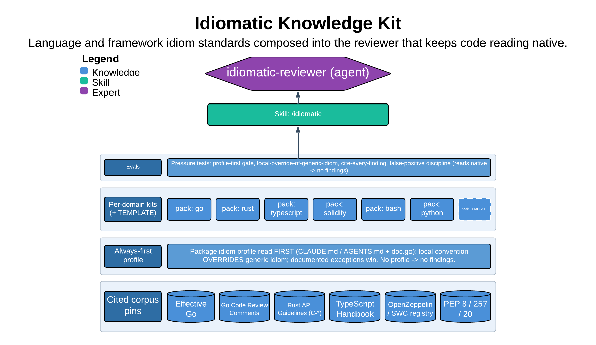

# Idiomatic Knowledge Kit

> Language and framework idiom standards composed into the reviewer that keeps code reading native.

The idiomatic skill reviews code so it reads native to its language, its framework, and above all the package it lives in. Its core guarantee is that local convention wins: it reads the repo's own profile (`CLAUDE.md`/`AGENTS.md`, the package `doc.go`) before emitting any finding, so it never confidently applies a generic idiom the package has deliberately overridden. Every finding carries a citation, and clean code gets a clean bill of health.

| | |
|---|---|
| **Diagram archetype** | layered-cake (kit) |
| **Visual grammar** | Design 14 · Grammar-version 14.1.0 |
| **Live diagram** | [Open in Lucid](https://lucid.app/lucidchart/ca8d8fe1-155e-4eec-821d-d2bedef582fb/edit) |
| **Skill** | [`SKILL.md`](./SKILL.md) |

## What it does

- Builds a package idiom profile first (repo governing docs + package `doc.go`), then overlays the matching language pack as a checklist and source of citations.
- Produces two-altitude feedback — Design (boundaries, ownership, idiom-divergence with runtime consequence) and Surgical (line-level fixes) — ranked correctness > divergence > style.
- Holds three non-negotiable disciplines: no profile means no findings, every finding is cited with no hedges, and one-way-door conventions are flagged for human approval rather than asserted.
- On idiomatic code the output is "reads native — no findings"; it refuses to manufacture nits to look thorough.

## Reading the diagram

This is a layered-cake (kit) archetype: the diagram stacks the skill's knowledge sources as horizontal layers that compose upward into the reviewer at the top. The base layers are the pluggable language packs (Go, Rust, TypeScript, Solidity, bash, Python) and the package-profile mechanism; the discipline spine sits as the governing layer that constrains every layer beneath it. Read bottom-to-top: idiom data and the local profile feed in, the spine gates what may be emitted, and the `idiomatic-reviewer` agent is the composed surface that consumes the full stack.
