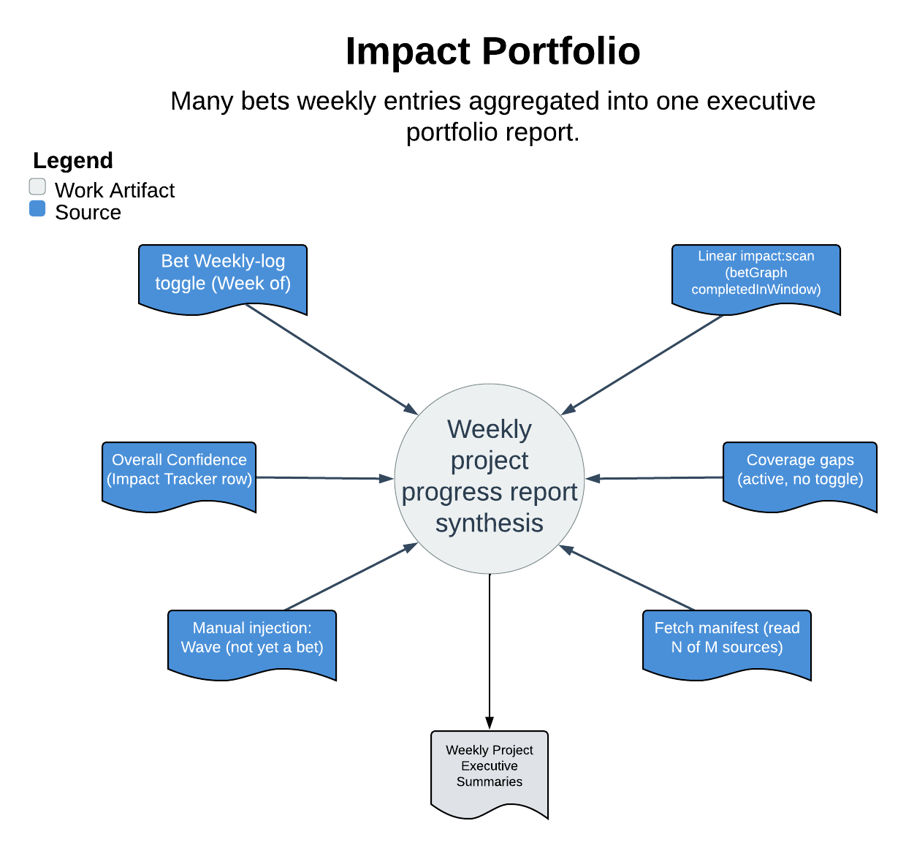

# Impact Portfolio

> Many bets' weekly entries aggregated into one executive portfolio report.

The leader-facing synthesis tail of the Impact Hub loop: once a week it lifts every bet's existing Weekly-log entry into a single executive report so a leader sees what got done across every project, each claim clickable, in one page. It does not generate truth — it indexes truth that already exists in the bets, and its safety model is that it is read-only on every bet and writes exactly one artifact: its own row in the Weekly Reports database.

| | |
|---|---|
| **Diagram archetype** | hub-and-spoke |
| **Visual grammar** | Design 14 · Grammar-version 14.1.0 |
| **Live diagram** | [Open in Lucid](https://lucid.app/lucidchart/9f8b3674-c37d-41f5-b8c9-dd012276a9c9/edit) |
| **Skill** | [`SKILL.md`](./SKILL.md) |

## What it does

- Union-detects active bets (a bet's Weekly-log toggle OR a Linear `impact:<slug>` scan), lifts each one's outcomes to <=3 substantiated bullets, and renders an exec summary plus per-project sections, coverage gaps, and a "read N of M sources" manifest.
- Also serves a `--read-only` manager view ("what did my team do this week") that renders inline, by person, and writes nothing.
- The guarantee that matters most: it never mutates a bet. It is read-only on every bet page, Tracker row, and Linear issue, and writes only its own Weekly Reports row — refusing to clobber a row whose `generated_by` is not `impact-portfolio`. Coverage gaps and partial fetches are shown on the report, never silently dropped or papered over from Linear.

## Reading the diagram

This is a hub-and-spoke layout: the many bets' Weekly-log entries are the spokes fanning inward, and the single weekly report row is the hub they aggregate into. The arrows run inward only — reads lift content from each bet into the report — so the one-way flow is the read-only safety model made visual: nothing the hub does ever writes back out along a spoke. The lone outbound edge is the single artifact the skill owns, its row in the Weekly Reports database.
