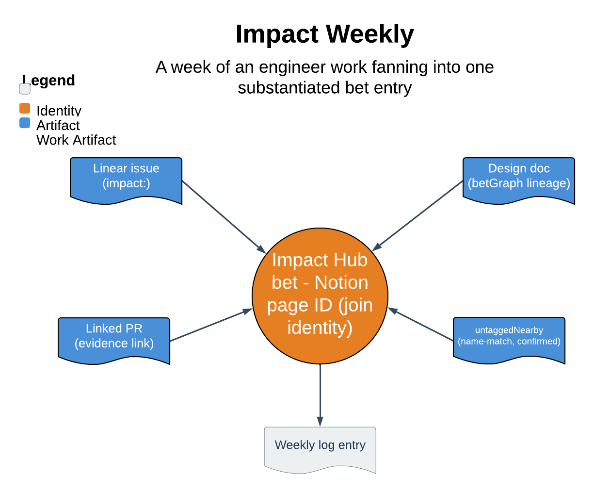

# Impact Weekly

> A week of an engineer's work fanning into one substantiated bet entry.

Impact Weekly rolls up an engineer's week of real work into a dated, executive-summary entry on the matching Impact Hub bet. It reads the work from Linear, maps each item to its bet, drafts a tight entry where every claim links to its evidence, and guarantees one thing above all: it writes only to the Weekly log of the bet you have explicitly confirmed, after you confirm it — never to a different bet, a definition field, or the confidence setting.

| | |
|---|---|
| **Diagram archetype** | hub-and-spoke |
| **Visual grammar** | Design 14 · Grammar-version 14.1.0 |
| **Live diagram** | [Open in Lucid](https://lucid.app/lucidchart/15ce4cc8-ce2d-47db-8b39-5a740c1f02c1/edit) |
| **Skill** | [`SKILL.md`](./SKILL.md) |

## What it does

- Queries the engineer's Linear week (plus any linked PRs) and maps each item to its bet by `impact:<slug>` label, falling back to a human-confirmed name match.
- Drafts a substantiated exec entry per bet: one outcome line plus one bullet per outcome, each carrying at least one evidence link and at most one context sentence.
- Runs draft to confirm to write, appending only to the confirmed bet's Weekly log, then verifies the written block renders clean.
- The refusal that matters most: a claim with no link is refused, not softened — the Impact doc is the index, Linear and the PRs are the record.

## Reading the diagram

This is a hub-and-spoke diagram: the spokes are the week's individual artifacts — Linear issues and their linked PRs — and the hub is the single bet identity they fan into. Arrows run inward from the artifacts through the label-first mapping and coverage check, converging on the one confirmed Weekly-log entry. The shape is the discipline: many pieces of evidence reduce to one substantiated entry, and nothing reaches the hub without a link.
