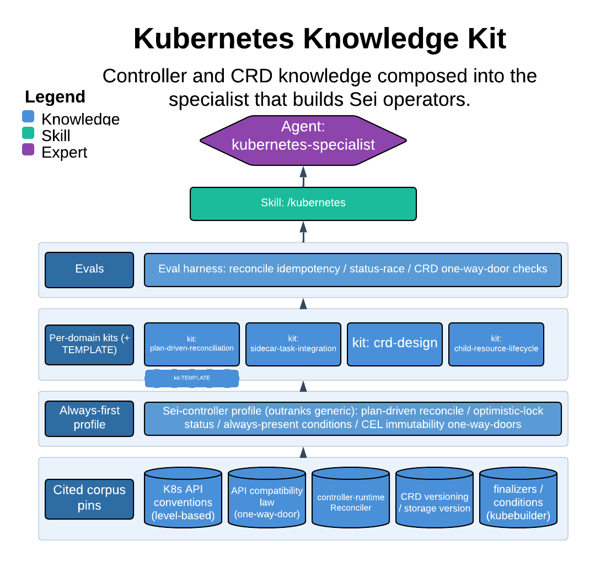

# Kubernetes Knowledge Kit

> Controller and CRD knowledge composed into the specialist that builds Sei operators.

This skill designs and reviews Kubernetes operator/controller code — CRDs, reconcilers, child-resource lifecycle, status and conditions — grounded in the upstream canon and, above it, in sei-k8s-controller's own established patterns. The one thing it guarantees: the always-first Sei-controller profile outranks generic best-practice, so a plausible-but-wrong generic reconciler (a non-optimistic-lock status write, a condition expressed by removal, an incompatible CRD field change) is caught against the repo's hard rules rather than shipped.

| | |
|---|---|
| **Diagram archetype** | layered-cake (kit) |
| **Visual grammar** | Design 14 · Grammar-version 14.1.0 |
| **Live diagram** | [Open in Lucid](https://lucid.app/lucidchart/f1111258-41a1-47ef-b5a4-7a110fb1d0b9/edit) |
| **Skill** | [`SKILL.md`](./SKILL.md) |

## What it does

- Designs or reviews controller/CRD code against the five controller dimensions: reconcile correctness and idempotency, CRD-contract durability, failure-mode handling, RBAC least-privilege, and observability (conditions / `observedGeneration`).
- Loads the Sei-controller profile and the relevant kit first, citing every finding to a primary source or a profile rule — never a naked "this isn't idiomatic."
- Treats the CRD contract as a one-way door: a served-version field, its validation, or its semantics cannot change incompatibly once a consumer depends on it. Such changes are flagged for human approval and routed through a new version, never asserted as the fix.

## Reading the diagram

This is a layered-cake (kit) archetype: the lower layers are the knowledge sources — the citable upstream corpus (K8s API conventions, controller-runtime, CRD versioning) at the floor and the always-first Sei-controller profile stacked above it — and they compose upward into the `kubernetes-specialist` agent at the top. The pluggable kits (plan-driven reconciliation, sidecar-task integration, CRD design, child-resource lifecycle) sit as selectable bands feeding the same agent. Read it bottom-to-top: each layer overrides the generic one beneath it, and the topmost band is the specialist that the stacked knowledge is composed into.
