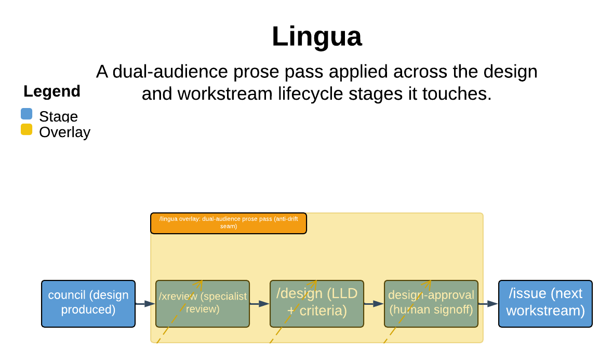

# Lingua

> A dual-audience prose pass applied across the design and workstream lifecycle stages it touches.

Lingua translates an existing org artifact (HLD, LLD, PRD, 1-pager) so it reads correctly for both the human who scans it and the AI agent that ingests it linearly and acts on it. It re-renders meaning without ever adding it: the one thing it guarantees is fidelity — a soft modal stays a typed Open question, a constraint stays where it applies, and no commitment the source never made is invented to make the prose look finished.

| | |
|---|---|
| **Diagram archetype** | cross-cutting overlay |
| **Visual grammar** | Design 14 · Grammar-version 14.1.0 |
| **Live diagram** | [Open in Lucid](https://lucid.app/lucidchart/f9e36af1-9151-4d06-b9ea-cb804f79f8cb/edit) |
| **Skill** | [`SKILL.md`](./SKILL.md) |

## What it does

- Re-renders a doc dual-aligned: explicit, scannable structure for the human; the same load-bearing detail layered for the agent that reads it top-to-bottom.
- Surfaces buried or soft-modal constraints as typed Open questions rather than prose, and restates each constraint where it applies.
- Applies the repo's documented writing conventions over generic "good writing" — the profile overrides the doctrine in both directions.
- The refusal that matters most: it never invents commitments. If the source is silent the translation is silent; an unsettled criterion is kept typed-undecided, never promoted to a normative statement.

## Reading the diagram

This is a cross-cutting overlay: rather than a self-contained pipeline, the skill is drawn as a band laid across the lifecycle stages it touches — the design and workstream stages where a doc is authored, reviewed, and signed off. The overlay's connections show the dual-audience pass dropping into each stage (notably before a `/workstream`'s design-approval gate, as the fidelity half of its anti-drift seam) without owning any stage's flow. Read the two reading models — human-scan and agent-ingest — as the parallel tracks the overlay keeps aligned wherever it lands.
