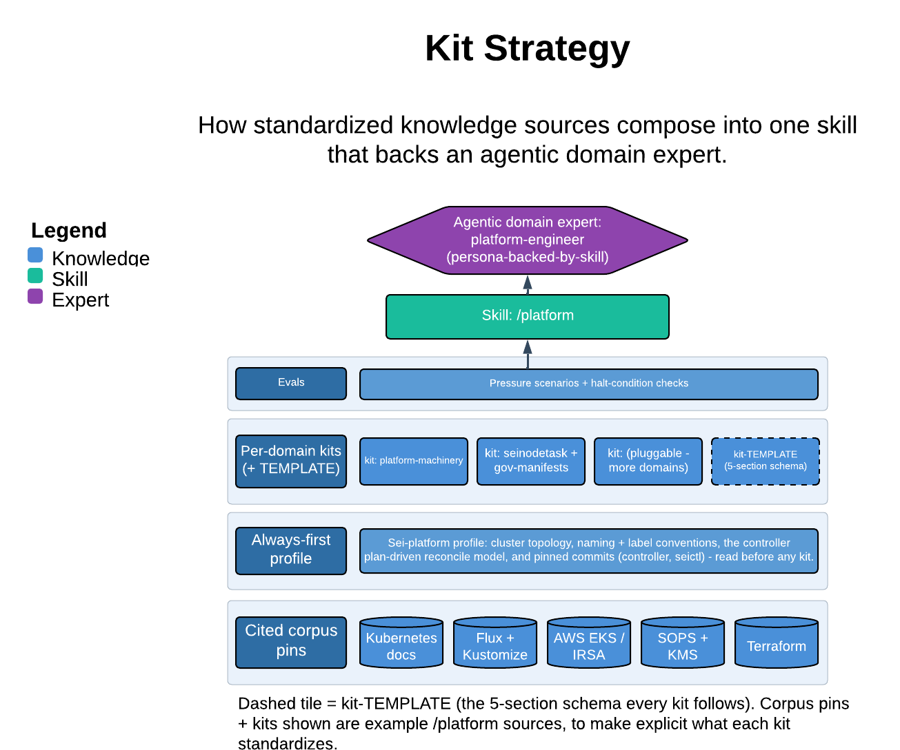

# Kit Strategy

> How standardized knowledge sources compose into one skill that backs an agentic domain expert.

The `platform` skill designs and reviews the Sei fleet's platform layer — the GitOps-reconciled Kustomize manifests, EKS cloud-auth, secrets, Pod Security posture, and terraform that stand up and run the fleet. Its one guarantee: an always-first Sei-platform profile that encodes the fleet's real, non-obvious conventions and overrides generic Kubernetes/AWS habit, so textbook defaults that are wrong here (IRSA, CSI secrets, `postBuild.substitute`) never slip through.

| | |
|---|---|
| **Diagram archetype** | layered-cake (kit) |
| **Visual grammar** | Design 14 · Grammar-version 14.1.0 |
| **Live diagram** | [Open in Lucid](https://lucid.app/lucidchart/55537d20-12d6-4c6d-ad7c-2d7893b4df85/edit) |
| **Skill** | [`SKILL.md`](./SKILL.md) |

## What it does

- Designs or reviews platform/infra artifacts against a citable corpus (OpenGitOps, Kustomize, Pod Security Standards, EKS, NSA/CISA) plus the always-first Sei-platform profile, scoring by six dimensions: security posture, secrets handling, GitOps-reconcilability, multi-cell structure, supply-chain integrity, and the cloud-identity boundary.
- Cites every finding to a primary source and/or profile rule — never a naked "this isn't secure" — and stays copyright-clean.
- The refusal that matters most: prod-cell, cloud-identity/IAM, KMS/SOPS, and Cilium CNI changes are one-way doors. The skill flags them for human approval and never asserts them as the fix.

## Reading the diagram

This is a layered-cake (kit) diagram: standardized knowledge sources stack and compose upward into a single agentic domain expert. The base layer is the citable corpus; the always-first Sei-platform profile sits above it as the overlay that overrides the generic floor; the per-concern kits (GitOps/Flux, Kustomize composition, cloud-auth, secrets, Pod Security) stack as the composable middle. They resolve upward into the `platform-engineer` agent at the top, whose first step is always to load the profile plus the relevant kit before it designs or reviews.
