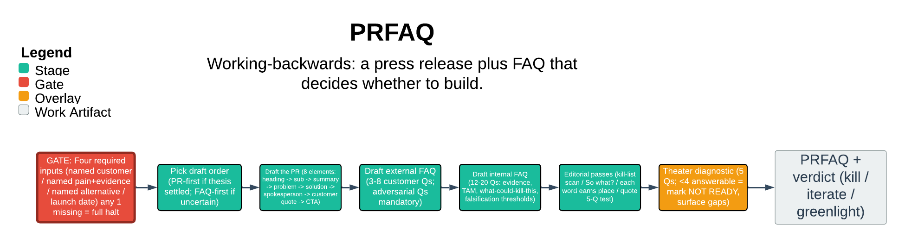

# PRFAQ

> Amazon working-backwards: a press release plus FAQ that decides whether to build.

The prfaq skill is the editorial discipline for Amazon's working-backwards artifact: a future-dated press release plus an FAQ used before building to decide whether to build at all. It forces a real customer thesis — named segment, named pain in the customer's voice, named existing alternative, practical launch date — before any prose, and emits a structured refusal rather than a best-effort draft when those inputs are missing. The guarantee that matters: it refuses theater, it does not comply-then-caveat.

| | |
|---|---|
| **Diagram archetype** | linear-pipeline |
| **Visual grammar** | Design 14 · Grammar-version 14.1.0 |
| **Live diagram** | [Open in Lucid](https://lucid.app/lucidchart/064c84db-d8c0-4e08-9e5f-b9d416d7feeb/edit) |
| **Skill** | [`SKILL.md`](./SKILL.md) |

## What it does

- Runs in one of three modes — Author, Review, Verdict — echoing the mode and the four required inputs before any prose.
- Gates every draft behind four required inputs; any one missing is a full halt that emits a structured refusal, not a draft with a placeholder.
- Holds the canonical shape: one document, three parts (press release, external FAQ, internal FAQ), under six pages, with unconditional kill-lists for marketing-speak and a mandatory falsification entry.
- The one guarantee: it refuses the request as framed when asked to bypass the editor ("just draft it now", "make it sound revolutionary", "make it look like it predates the build"). It refuses-and-surfaces; it never produces a bad draft with a self-aware footer.

## Reading the diagram

This is a linear-pipeline: ordered stages read left-to-right, each one gating the next. The early stages are the input gate (the four required inputs) and the mode fork; work only flows downstream once the gate passes, otherwise it diverts to the refusal output. The middle stages are the draft-order choice and the three drafts (PR, external FAQ, internal FAQ); the later stages are the three editorial passes and the theater-diagnostic block that marks the doc READY or NOT-READY. The arrows carry the discipline — nothing reaches the press release until the customer thesis has survived the upstream checks.
