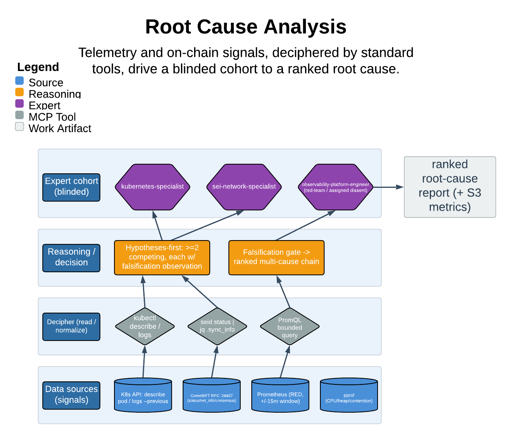

# Root Cause Analysis

> Telemetry and on-chain signals, deciphered by standard tools, drive a blinded cohort to a ranked root cause.

Root Cause is a disciplined, multi-expert investigation skill for complex problems in the Sei platform stack. It dispatches a blinded cohort of `.claude/agents/` specialists who commit competing hypotheses before seeing evidence, then gates every advance on signals the orchestrator retrieved itself. Its central guarantee: no cause is declared without a falsification attempt, and no factor is ranked unless its gating command ran as a real tool call in the session.

| | |
|---|---|
| **Diagram archetype** | layered-cake (signal) |
| **Visual grammar** | Design 14 · Grammar-version 14.1.0 |
| **Live diagram** | [Open in Lucid](https://lucid.app/lucidchart/f03287f1-e36e-4eba-adec-e09f3e6dc814/edit) |
| **Skill** | [`SKILL.md`](./SKILL.md) |

## What it does

- Runs a six-step loop — establish the effect, dispatch a blinded specialist slate, collect independent hypotheses, retrieve gating evidence, build the causal chain, commit to a ranked multi-cause conclusion — with each step gated on retrieved data.
- Forces hypotheses before evidence and assigns a red-team dissenter, so consensus only counts when each expert committed before seeing the others.
- The refusal that matters most: it will not advance from hypothesis to conclusion without a falsification attempt, and treats retrieved-not-extrapolated signals (literal command + verbatim output) as the only admissible evidence — anything else is tagged `unverified`.

## Reading the diagram

The layered-cake (signal) archetype stacks knowledge sources from the bottom up: raw telemetry and on-chain signals at the base, the standard retrieval tools (`kubectl`, `seid status`, bounded Prometheus queries) that decipher them in the middle, feeding the blinded specialist cohort above. Read upward — each layer composes into the one over it, and the arrows carry retrieved evidence, not paraphrase, toward the ranked root cause at the top. The stack is what enforces signals-before-hypotheses: nothing reaches the cohort layer until the layer beneath it has produced real, provenanced data.
