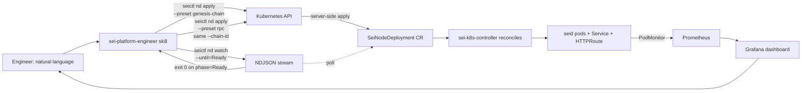

# Ephemeral chain flow (engineer-facing)

The skill's daily-driver flow for engineers spinning up an ephemeral Sei chain on harbor — typically for testing a build, reproducing a bug, validating a release candidate, or driving a load run. Engineer says one English sentence; the agent translates into a 2-step `seictl nd apply` + `seictl nd watch --until=Ready` against the engineer's namespace. Optional follow-up: a second apply+watch for an RPC fleet.

Last verified: 2026-05-05 against shipped seictl v0.0.43+ (`nd` verb tree, peer auto-wire from PR #146) and the multi-tenant `eng-<alias>` namespace shape from sei-protocol/platform#427.

## The architectural model in three lines

1. **`seictl nd apply` is the headline verb.** Server-side-applies a `SeiNodeDeployment` CR derived from a preset + flags to the engineer's namespace. The CR carries its own provenance (annotations + labels), so `kubectl get snd -n eng-<alias> -o yaml` is the audit trail.
2. **The engineer's namespace is the isolation boundary.** RBAC, NetworkPolicy, and `workload-service-account` all scope to `eng-<alias>` — set up by the one-time onboarding PR. No cross-engineer interference.
3. **`seictl nd watch --until=Ready` is the agentic value-add.** The 2-step apply+watch collapses the human "apply, then poll, then check status" loop into one transaction. Watch streams NDJSON; the last event before exit-0 is the post-Ready CR.



## Preset taxonomy (v1: 2 presets)

Both presets ship embedded in the seictl binary at `nodedeployment/presets/<name>.yaml` — the binary version IS the preset version. No remote distribution, no preset versioning lockfile.

### `genesis-chain`

Validators that run a fresh genesis ceremony on apply. Default 4 replicas.

```sh
seictl nd apply <name> \
  --preset genesis-chain \
  --chain-id <chain-id> \
  --image <seid-ref> \
  [--replicas N] \
  -n eng-<alias>
```

Auto-wired on the rendered CR:
- `metadata.annotations.seictl.sei.io/preset: genesis-chain`
- `metadata.labels.sei.io/chain: <chain-id>` (also on `spec.template.metadata.labels`)
- `metadata.labels.sei.io/role: validator` (also on `spec.template.metadata.labels`)

### `rpc`

Full-node fleet that **peers to an existing chain by label selector**. Default 2 replicas.

```sh
seictl nd apply <name> \
  --preset rpc \
  --chain-id <same-chain-id> \
  --image <seid-ref> \
  [--replicas N] \
  -n eng-<alias>
```

Auto-wired on the rendered CR:
- `metadata.labels.sei.io/role: node`
- `spec.template.metadata.labels.sei.io/chain: <chain-id>`
- **`spec.template.spec.peers[0].label.selector.sei.io/chain: <chain-id>`** — the controller selects all SNDs in the namespace tagged with the same chain-id. So pointing the rpc fleet at the genesis chain is "use the same `--chain-id`."

This is the load-bearing piece of `nd` v1: passing the same `--chain-id` to both presets is enough to wire the rpc fleet to the genesis validators. No `--set spec.template.spec.peers...` plumbing.

### Deferred presets

Tracked but not in v1 (un-defer triggers per sei-protocol/Tide#25):

- `archive` — defer until a script asks. Today's archive nodes are Flux-managed hand-rolled YAML in `prod/protocol/*/archive.yaml`.
- `validator` (single-SeiNode) — defer until `seictl node` exists.
- `pacific-rpc-fork` — defer pending real consumer.
- Composite presets (`genesis-chain-evm`) — rejected. Compose via `--set` instead.

## Override and composition

Atomic preset + `--set` overrides on the SND spec:

| Override path | Mechanism | Example |
|---|---|---|
| Replica count | `--replicas N` | `--replicas 21` |
| Image ref | `--image <ref>` | `--image ghcr.io/sei-protocol/seid:v6.4.0` |
| Chain ID | `--chain-id <id>` | `--chain-id sei-test-1` |
| Anything else | `--set <dotted.path>=<value>` (repeatable) | `--set spec.template.spec.resources.requests.memory=8Gi` |

Layering, lowest precedence first: preset YAML → discrete flags → `--set`. Maps merge per-key; lists replace wholesale. Server-side-apply dry-run validates the merged CR against the apiserver's schema (preset isn't enough — the cluster's CRD is the schema oracle).

## Output

### `seictl nd apply` — success

Native `SeiNodeDeployment` CR on stdout as JSON. Same shape as `kubectl get snd <name> -o json`. `.status` is whatever the controller has had time to write — usually empty or `phase=Pending` immediately post-apply. The `watch` step provides the eventual `phase=Ready` snapshot.

### `seictl nd apply` — failure

`metav1.Status` on stderr; non-zero exit. Common reasons:

- `Invalid` — the rendered CR fails apiserver schema validation. Check `--set` paths for typos.
- `Forbidden` — RBAC denies the apply. Likely the engineer's access entry is read-only; pre-flight gate 4 normally catches this earlier.
- `AlreadyExists` — name collision with an existing SND owned by something else (e.g., a hand-rolled YAML). Choose a new name or `seictl nd delete` the existing one first.

### `seictl nd watch` — success

NDJSON stream of `SeiNodeDeployment` events on stdout, one per line. Exits 0 when `.status.phase == --until` (exact match). The last NDJSON line before exit is the canonical post-Ready CR — extract endpoints from it without a follow-up `get`.

```sh
seictl nd watch foo --until=Ready -n eng-x | tail -1 | jq -r '.status.endpoints.evmJsonRpc[0]'
```

### `seictl nd watch` — failure

`metav1.Status` on stderr; non-zero exit. Reasons:

- `Timeout` — `--timeout` exceeded (default 15m). Inspect the last NDJSON line for partial status.
- Terminal `Failed` phase — stderr lifts `.status.plan.failedTaskDetail.error` and the failing task name. Don't auto-retry; surface to the engineer.
- Transient API failure — transport error from the watch connection; the `metav1.Status.message` carries the detail.

## The headline procedure

Engineer says: "spin up a chain of 4 validators with seid sha=abc, then add an RPC fleet."

1. **Pre-flight** — five gates (see `preflight.md`). Halt on first failure.
2. **Resolve naming** — derive a chain-id from the engineer's intent (one English sentence). Lowercase, k8s-namespace-safe (`^[a-z]([a-z0-9-]{0,28}[a-z0-9])?$`). For "chain X with RPC," the genesis SND is `<id>` and the rpc SND is `<id>-rpc`.
3. **Resolve image digest** — engineer provides a tag or digest. Surface the resolved digest in the plan echo.
4. **Plan echo & confirm** (first side-effecting call only) — show: cluster (harbor), namespace (`eng-<alias>`), preset (`genesis-chain`), SND name, chain-id, image digest, replica count. Wait for confirmation.
5. **Apply genesis chain** — `seictl nd apply <id> --preset genesis-chain --chain-id <id> --image <ref> [--replicas N] -n eng-<alias>`.
6. **Watch genesis to Ready** — `seictl nd watch <id> --until=Ready --timeout=15m -n eng-<alias>`. Halt on non-zero with the `metav1.Status.reason` surfaced.
7. **Apply rpc fleet** (if requested) — `seictl nd apply <id>-rpc --preset rpc --chain-id <id> --image <ref> [--replicas N] -n eng-<alias>`. Note: same `--chain-id` as step 5; the auto-wired peer selector points the fleet at the validators.
8. **Watch rpc to Ready** — `seictl nd watch <id>-rpc --until=Ready --timeout=15m -n eng-<alias>`.
9. **Report** — extract endpoints from the rpc fleet's last NDJSON line:
   - `.status.endpoints.evmJsonRpc[0]` — EVM HTTP JSON-RPC URL
   - `.status.endpoints.evmWs[0]` — EVM WebSocket URL
   - `.status.endpoints.tendermintRpc[0]` — Tendermint RPC URL
   - `.status.endpoints.tendermintRest[0]` — Tendermint REST URL
   - Plus per-pod URLs from `.status.perPodServices[]` if the engineer needs pod-targeted connectivity (seiload's WebSocket block collector, etc.).
10. **Report teardown** — `seictl nd delete <id>-rpc -n eng-<alias>` then `seictl nd delete <id> -n eng-<alias>`. Default cascade `foreground` waits for child pods to drain.

## Halt conditions specific to this flow

Stop and report (don't auto-remediate):

- **Apply rejected with `metav1.Status.reason=Invalid`.** The rendered CR fails schema validation. Surface the message; ask the engineer to inspect the `--set` paths or preset overrides.
- **Apply rejected with `Forbidden`.** RBAC denies the operation. Pre-flight gate 4 normally catches this; surface the path forward (escalate access entry).
- **Apply rejected with `AlreadyExists` and a different ownership/labels.** Don't silently overwrite. Surface the existing object's metadata; ask whether to choose a new name or delete the existing one first.
- **Watch exits with `metav1.Status.reason=Timeout`.** Don't loop. Surface the last NDJSON line's `.status.plan.tasks[]` for the engineer to inspect.
- **Watch exits on terminal `Failed` phase.** Surface `.status.plan.failedTaskDetail.error` and the failing task name. Do not auto-retry — Failed means the controller gave up; the cause is structural.
- **Image digest resolution fails** — image not in registry or auth missing. Stop and surface the recovery command.
- **Image not yet in registry** — sei-chain CI may be behind. Surface the explicit retry command per the autobake race-guard pattern; don't loop silently.

## Why direct apply, not GitOps

The skill's old daily-driver flow (pre-#133) pushed manifests to a per-engineer workspace branch and waited for Flux. The new flow applies directly. The reasoning reversed because:

- **The CR itself is the audit trail.** `kubectl get snd <name> -o yaml` shows preset, version, image, chain-id, owner — same provenance the workspace-branch git history was carrying. With native CR shape on stdout, there's nothing the agent layers on top.
- **`watch` is sharper than Flux poll.** The engineer doesn't want to wait 60s for a Flux reconcile interval — they want immediate streaming events with a clean exit code at Ready. `kubectl wait --for=jsonpath=...` and Flux's `lastAppliedRevision` poll were both indirect; `seictl nd watch` reads the controller's own status field.
- **Teardown is `seictl nd delete`.** One command, idempotent, mirrors apply. With the workspace-branch flow, teardown was `git rm + commit + push + wait for Flux prune` — four steps where one suffices.
- **The engineer's namespace is the isolation boundary.** The workspace branch added a layer (per-engineer Flux watcher + per-task path) that wasn't pulling weight beyond what RBAC + namespace already provided.

For long-lived workloads that *should* be in git (a benchmark fleet running for a week, a shared archive node), engineers push to `harbor-engineering-workspace` directly — that path exists for that reason. The agent doesn't drive it in v1.

## When the agent should NOT use direct apply

Out of scope for v1, surface to the engineer if it comes up:

- **Long-lived shared resources** that should live in git for review. Engineers PR to `harbor-engineering-workspace` themselves.
- **Cross-namespace work.** The agent operates only in `eng-<alias>`.
- **CRD changes, sei-k8s-controller config changes, cluster-wide Flux updates.** Those go through `sei-protocol/platform` PRs; not in this skill's scope.

## References

- sei-protocol/Tide#25 — architectural synopsis that produced the post-#133 design.
- sei-protocol/seictl#133 — the `cluster/` teardown.
- sei-protocol/seictl#137, #141, #142, #146 — the `nd` verb tree (apply, get/list/delete, watch, peer auto-wire).
- sei-protocol/platform#427 — fromtherain pilot tenant; canonical onboarding example.
- `nodedeployment/presets/genesis-chain.yaml`, `nodedeployment/presets/rpc.yaml` (sei-protocol/seictl) — the embedded preset YAML.
