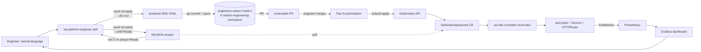

# Ephemeral chain flow (engineer-facing)

The skill's daily-driver flow for engineers spinning up an ephemeral Sei chain on harbor — typically for testing a build, reproducing a bug, validating a release candidate, or driving a load run. Engineer says one English sentence; the agent renders the SND CRs via `seictl nd apply --dry-run`, opens a PR against `sei-protocol/harbor-engineering-workspace`, and watches the chain to Ready after Flux applies on merge.

Last verified: 2026-05-08 against shipped seictl v0.0.43+ (`nd` verb tree, peer auto-wire) and the multi-tenant `eng-<alias>` namespace shape in `sei-protocol/platform`'s `clusters/harbor/engineers/base/`.

## The architectural model in three lines

1. **`seictl nd apply --dry-run` is the rendering verb.** Renders a `SeiNodeDeployment` CR from a preset + flags. JSON on stdout (same shape as `kubectl get snd -o json`) — agent pipes through `yq -P` to YAML, writes to `engineers/<alias>/<task>/snd-<id>.yaml` in the workspace repo, opens the PR. No cluster mutation at render time.
2. **The engineer reviews + merges; Flux applies.** Same audit-trail model the team uses across the platform. `harbor-engineering-workspace`'s per-engineer Flux Kustomization watches `engineers/<alias>/`; once the PR merges, the SND lands in `eng-<alias>` within ~60s. `kubectl get snd -n eng-<alias> -o yaml` is the live view; git is the change history.
3. **`seictl nd watch --until=Ready` is the post-merge agentic value-add.** After the PR merges, the agent runs watch against the SND name and reports when `.status.phase=Ready`. Watch streams NDJSON; the last event before exit-0 is the post-Ready CR. For an RPC fleet, the same shape applies — second SND in the same task dir, same PR (or a follow-up), same watch.



## Preset taxonomy (v1: 2 presets)

Both presets ship embedded in the seictl binary at `nodedeployment/presets/<name>.yaml` — the binary version IS the preset version. No remote distribution, no preset versioning lockfile.

The invocation shapes below show the bare `seictl nd apply` form. **For engineer-facing flows, the agent always passes `--dry-run`** to capture the rendered CR as JSON, pipes through `yq -P`, and writes the YAML to `engineers/<alias>/<task>/snd-<name>.yaml` for the workspace-repo PR. Direct (no `--dry-run`) apply is the escape-hatch path covered below.

### `genesis-chain`

Validators that run a fresh genesis ceremony on apply. Default 4 replicas.

```sh
seictl nd apply <name> \
  --preset genesis-chain \
  --chain-id <chain-id> \
  --image <seid-ref> \
  [--replicas N] \
  -n eng-<alias>
```

Auto-wired on the rendered CR:
- `metadata.annotations.seictl.sei.io/preset: genesis-chain`
- `metadata.labels.sei.io/chain: <chain-id>` (also on `spec.template.metadata.labels`)
- `metadata.labels.sei.io/role: validator` (also on `spec.template.metadata.labels`)

### `rpc`

Full-node fleet that **peers to an existing chain by label selector**. Default 2 replicas.

```sh
seictl nd apply <name> \
  --preset rpc \
  --chain-id <same-chain-id> \
  --image <seid-ref> \
  [--replicas N] \
  -n eng-<alias>
```

Auto-wired on the rendered CR:
- `metadata.labels.sei.io/role: node`
- `spec.template.metadata.labels.sei.io/chain: <chain-id>`
- **`spec.template.spec.peers[0].label.selector.sei.io/chain: <chain-id>`** — the controller selects all SNDs in the namespace tagged with the same chain-id. So pointing the rpc fleet at the genesis chain is "use the same `--chain-id`."

This is the load-bearing piece: passing the same `--chain-id` to both presets is enough to wire the rpc fleet to the genesis validators. No `--set spec.template.spec.peers...` plumbing.

If an engineer asks for anything other than `genesis-chain` or `rpc` (archive node, single validator, fork-test), `nd apply` can't serve it — surface that and offer the hand-rolled-SND alternative.

## Override and composition

Atomic preset + `--set` overrides on the SND spec:

| Override path | Mechanism | Example |
|---|---|---|
| Replica count | `--replicas N` | `--replicas 21` |
| Image ref | `--image <ref>` | `--image ghcr.io/sei-protocol/seid:v6.4.0` |
| Chain ID | `--chain-id <id>` | `--chain-id sei-test-1` |
| Anything else | `--set <dotted.path>=<value>` (repeatable) | `--set spec.template.spec.resources.requests.memory=8Gi` |

Layering, lowest precedence first: preset YAML → discrete flags → `--set`. Maps merge per-key; lists replace wholesale. Server-side-apply dry-run validates the merged CR against the apiserver's schema (preset isn't enough — the cluster's CRD is the schema oracle).

## Output

### `seictl nd apply` — success

Native `SeiNodeDeployment` CR on stdout as JSON. Same shape as `kubectl get snd <name> -o json`. `.status` is whatever the controller has had time to write — usually empty or `phase=Pending` immediately post-apply. The `watch` step provides the eventual `phase=Ready` snapshot.

### `seictl nd apply` — failure

`metav1.Status` on stderr; non-zero exit. Common reasons:

- `Invalid` — the rendered CR fails apiserver schema validation. Check `--set` paths for typos.
- `Forbidden` — RBAC denies the apply. Likely the engineer's access entry is read-only; pre-flight gate 4 normally catches this earlier.
- `AlreadyExists` — name collision with an existing SND. If the existing SND is Flux-owned (rendered from another workspace-repo manifest), `git rm` that manifest first; calling `seictl nd delete` on a Flux-owned SND races the next reconcile. If the existing SND is hand-rolled (no Flux owner), `seictl nd delete` it or pick a new chain-id.

### `seictl nd watch` — success

NDJSON stream of `SeiNodeDeployment` events on stdout, one per line. Exits 0 when `.status.phase == --until` (exact match). The last NDJSON line before exit is the canonical post-Ready CR — extract endpoints from it without a follow-up `get`.

```sh
seictl nd watch foo --until=Ready -n eng-x | tail -1 | jq -r '.status.endpoints.evmJsonRpc[0]'
```

### `seictl nd watch` — failure

`metav1.Status` on stderr; non-zero exit. Reasons:

- `Timeout` — `--timeout` exceeded (default 15m). Inspect the last NDJSON line for partial status.
- Terminal `Failed` phase — stderr lifts `.status.plan.failedTaskDetail.error` and the failing task name. Don't auto-retry; surface to the engineer.
- Transient API failure — transport error from the watch connection; the `metav1.Status.message` carries the detail.

## The headline procedure (PR-based)

Engineer says: "spin up a chain of 4 validators with seid sha=abc, then add an RPC fleet."

1. **Pre-flight** — five gates (see `preflight.md`). Halt on first failure.
2. **Resolve naming** — derive a chain-id from caller context (Linear ticket / PR slug / commit substring / `--tag` / ask). Lowercase, k8s-namespace-safe (`^[a-z]([a-z0-9-]{0,28}[a-z0-9])?$`). For "chain X with RPC," the genesis SND is `<id>` and the rpc SND is `<id>-rpc`.
3. **Resolve image** — sei-chain (`seid`) image. **Required input** (PR / commit / branch / explicit `--image`); never silently default. Resolve to a full SHA + verify in registry per `references/image-resolution.md`. Surface the resolved digest in the plan echo.
4. **Render genesis chain CR** — `seictl nd apply <id> --preset genesis-chain --chain-id <id> --image <ref> [--replicas N] -n eng-<alias> --dry-run` emits the would-be-applied CR as JSON on stdout. Pipe through `yq -P` to YAML.
5. **Render rpc CR (if requested)** — `seictl nd apply <id>-rpc --preset rpc --chain-id <id> --image <ref> [--replicas N] -n eng-<alias> --dry-run`. Same `--chain-id` as step 4; the auto-wired peer selector points the fleet at the validators after Flux applies.
6. **Plan echo & confirm** (first side-effecting call only) — show: cluster (harbor), namespace (`eng-<alias>`), preset(s), SND names, chain-id, image digest, replica counts, target path under workspace repo (`engineers/<alias>/<task>/`), what's about to be committed and pushed. Wait for confirmation.
7. **Write to workspace repo** — fresh clone of `sei-protocol/harbor-engineering-workspace` (or session-scoped clone). Write rendered YAML to `engineers/<alias>/<task>/snd-<id>.yaml` (and `snd-<id>-rpc.yaml` if applicable). Update `engineers/<alias>/<task>/kustomization.yaml` listing both as resources. Append `<task>` to `engineers/<alias>/kustomization.yaml`'s `resources:` list if not already present.
8. **Commit + push** — branch `feat/eng-<alias>-<task>`. Commit message: `feat(eng/<alias>): spin up <task> — chain-id=<id>, image=<digest-prefix>`. Push.
9. **Open the PR** — title: `feat(eng/<alias>): spin up <task>`; body lists chain-id, image digest, preset(s), expected post-Ready endpoints. `gh pr create --repo sei-protocol/harbor-engineering-workspace --base main`.
10. **Surface and halt** — surface PR URL with: "after merge, Flux reconciles in ~60s; ping me to watch the SND to Ready and report endpoints."
11. **After merge — watch genesis to Ready** — `seictl nd watch <id> --until=Ready --timeout=15m -n eng-<alias>`. NDJSON stream; exits 0 when `.status.phase=Ready`. Halt on non-zero with the `metav1.Status.reason` surfaced.
12. **Watch rpc to Ready** (if applicable) — `seictl nd watch <id>-rpc --until=Ready --timeout=15m -n eng-<alias>`.
13. **Report** — extract endpoints from the rpc fleet's last NDJSON line (or `seictl nd get <id>-rpc -o json` if the agent missed the watch's last event):
    - `.status.endpoints.evmJsonRpc[0]` — EVM HTTP JSON-RPC URL
    - `.status.endpoints.evmWs[0]` — EVM WebSocket URL
    - `.status.endpoints.tendermintRpc[0]` — Tendermint RPC URL
    - `.status.endpoints.tendermintRest[0]` — Tendermint REST URL
    - Plus per-pod URLs from `.status.perPodServices[]` if the engineer needs pod-targeted connectivity (seiload's WebSocket block collector, etc.).
14. **Report teardown** — `git rm -r engineers/<alias>/<task>/` **and** remove the `<task>` entry from `engineers/<alias>/kustomization.yaml`'s `resources:` list (Kustomize fails to render with an orphan reference). Commit → push → merge. Flux prunes the SNDs on next reconcile, cascading to child pods/PVCs per k8s deletion propagation.

## Halt conditions specific to this flow

Stop and report (don't auto-remediate):

- **Render rejected by `--dry-run` with `metav1.Status.reason=Invalid`.** The would-be-applied CR fails schema validation. Surface the message; ask the engineer to inspect the `--set` paths or preset overrides. Don't push a broken CR to the workspace repo.
- **`AlreadyExists` on cluster post-merge** — the engineer's PR proposed a chain-id that already has a live CR (escape-hatch direct-apply, or stale workspace state). Surface the existing object's metadata; ask whether to pick a different chain-id or `git rm` the old manifest first.
- **Workspace-repo task path collision** — `engineers/<alias>/<task>/` already exists in the workspace repo. Don't silently overwrite. Halt and ask whether to reuse the dir (add new files alongside) or pick a different `<task>` name.
- **Push rejected (non-fast-forward)** — engineer or another agent pushed to the same branch. Don't force-push. Halt; surface `git pull --rebase` and let the engineer resolve.
- **Watch (post-merge) exits with `metav1.Status.reason=Timeout`.** Don't loop. Surface the last NDJSON line's `.status.plan.tasks[]` for the engineer to inspect.
- **Watch exits on terminal `Failed` phase.** Surface `.status.plan.failedTaskDetail.error` and the failing task name. Do not auto-retry — Failed means the controller gave up; the cause is structural.
- **Image digest resolution fails** — image not in registry or auth missing. Stop and surface the recovery command per `references/image-resolution.md`.
- **PR merge stuck** — engineer hasn't merged; agent isn't waiting indefinitely. Surface the PR URL and end the turn; the engineer pings back when ready.

## Escape hatch: direct `seictl nd apply` (rare)

If the engineer specifically asks to bypass the PR loop for a one-shot debug session and confirms they understand the result won't be in git history, fall through to direct apply: `seictl nd apply <id> --preset genesis-chain --chain-id <id> --image <ref> -n eng-<alias>` (no `--dry-run`; server-side applies). Then `seictl nd watch <id> --until=Ready -n eng-<alias>`.

**Steer first.** The agent does not volunteer this path. Before running it, ask: "I can do this through the GitOps PR flow (audit trail, Flux reconciles, `git rm` to tear down) — do you want that, or do you specifically need a direct-apply run with no git history?" Only proceed on explicit confirmation.

## When the agent should NOT drive any of this

Surface to the engineer if the request maps to:

- **Long-lived shared resources** that other engineers should depend on. Those go through `harbor-engineering-workspace` PRs the engineer authors directly, not through agent-driven task dirs.
- **Cross-namespace work.** The agent operates only in `eng-<alias>`.
- **CRD changes, sei-k8s-controller config changes, cluster-wide Flux updates.** Those go through `sei-protocol/platform` PRs; not in this skill's scope.
