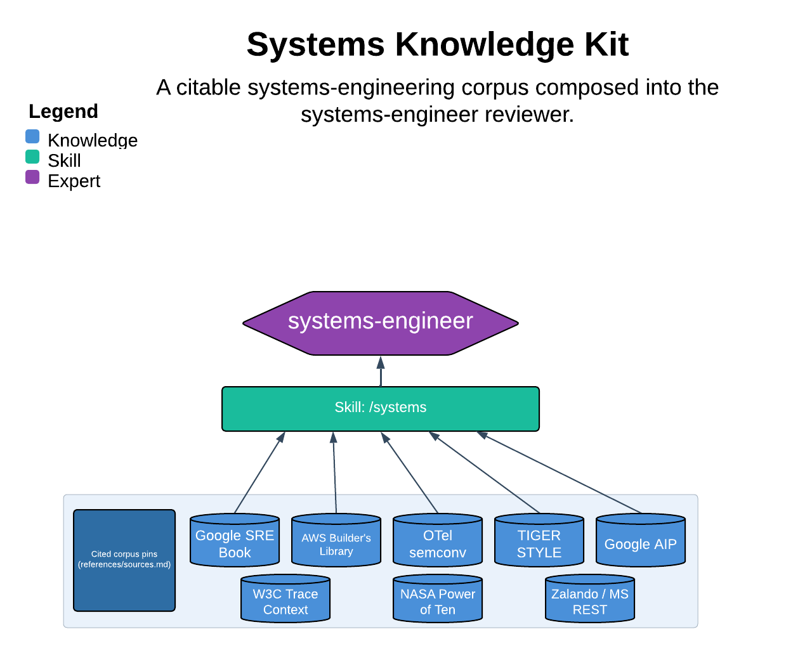

# Systems Knowledge Kit

> A citable systems-engineering corpus composed into the systems-engineer reviewer.

The systems skill reviews and designs code so it behaves well on the machine and over time — reliable under failure, performant under load, observable when it breaks, safe by construction, and durable at its interfaces. It is not a textbook; it is the citable standards corpus (Google SRE, AWS Builder's Library, OTel semconv, TIGER STYLE, Google AIP, …) plus the discipline to rank every finding by consequence under load. Its one guarantee: no consequence, no finding — on a sound system the answer is "behaves well — no findings."

| | |
|---|---|
| **Diagram archetype** | layered-cake (kit, thin) |
| **Visual grammar** | Design 14 · Grammar-version 14.1.0 |
| **Live diagram** | [Open in Lucid](https://lucid.app/lucidchart/1c7fa382-de4a-4445-a9f2-ac65e33a9600/edit) |
| **Skill** | [`SKILL.md`](./SKILL.md) |

## What it does

- Loads the reference(s) matching the work's systems surface — reliability, observability, performance, safety-quality, api-design — and applies the systems lens on top of the `/idiomatic` pass.
- Ranks every finding by consequence under load (correctness/safety > consequence-under-load > advisory) and cites a canonical authority and/or repo rule for each, staying copyright-clean.
- Suggest-only: it produces findings the human or calling agent applies, and never rewrites the author's files.
- The refusal that matters most: a one-way door (a change to a published API or wire format) is flagged for human approval, never asserted.

## Reading the diagram

This is a layered-cake archetype: stacked knowledge sources composing upward into one agent. The lower layers are the citable standards corpus and the per-theme references; they feed the discipline spine (rank-by-consequence, cite-and-stay-clean, don't-duplicate-the-idiom-or-ops-lens), which in turn composes into the systems-engineer reviewer at the top. Read bottom-to-top as "sources -> theme references -> discipline -> agent"; the thin variant means the kit is a closed, fixed theme set rather than an open, pluggable one.
