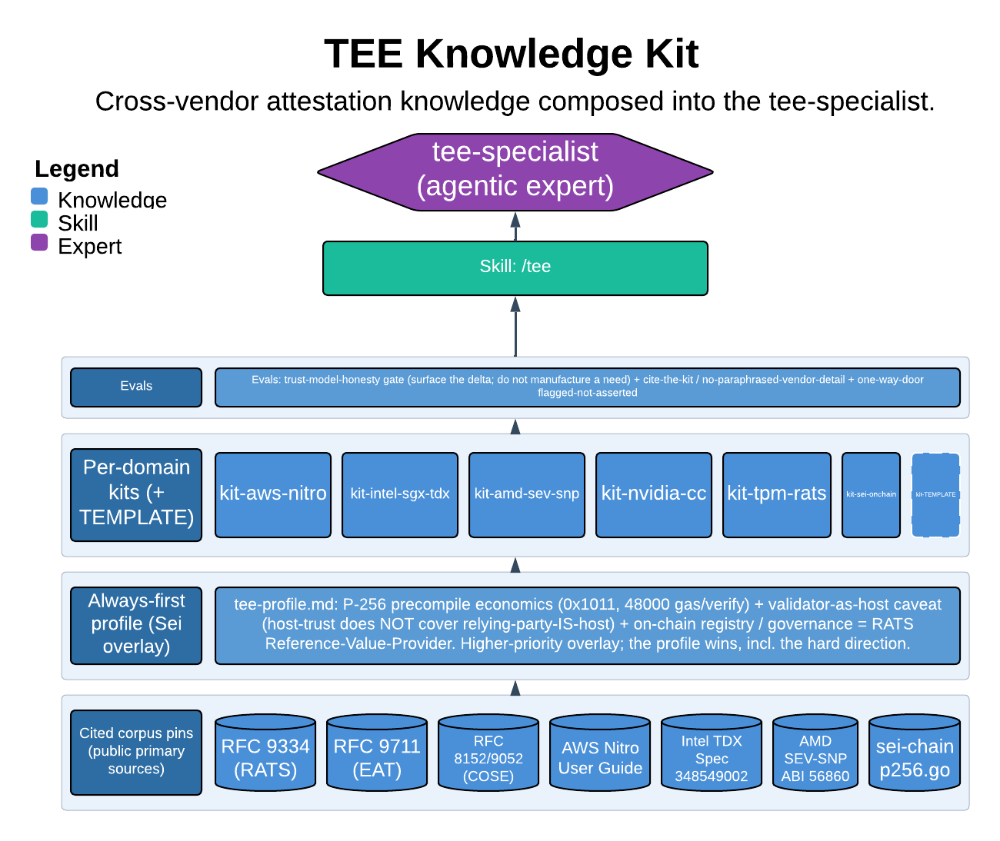

# TEE Knowledge Kit

> Cross-vendor attestation knowledge composed into the tee-specialist.

The `tee` skill is the operating manual for the `tee-specialist` agent: a five-step method for designing and reviewing Trusted Execution Environment attestation flows, backed by self-contained per-vendor kits and an always-first Sei deployment profile. Its core guarantee is that every load-bearing vendor detail is cited from a kit that traces to a primary source — never asserted from memory — and that a design always states what the TEE's trust model does *not* cover.

| | |
|---|---|
| **Diagram archetype** | layered-cake (kit) |
| **Visual grammar** | Design 14 · Grammar-version 14.1.0 |
| **Live diagram** | [Open in Lucid](https://lucid.app/lucidchart/cbfbdeef-392b-4e7d-a28c-49f1533a6002/edit) |
| **Skill** | [`SKILL.md`](./SKILL.md) |

## What it does

- Designs attestation flows (attest → verify → act) and reviews on-chain / off-chain verifiers for bypass, replay, and trust-model gaps, across AWS Nitro, Intel SGX/TDX, AMD SEV-SNP, NVIDIA CC, and TPM/RATS.
- Pulls per-vendor specifics — field offsets, measurement registers, policy bits, cert-chain order — from a platform kit that cites primary sources, refusing to fabricate the detail when no kit or citation exists.
- The refusal that matters most: it never presents a TEE as defending against a threat its trust model excludes. The validator-as-host delta is surfaced, not buried, and a TEE bolted onto a problem it doesn't solve is called out rather than padded.

## Reading the diagram

This is a layered-cake (kit) archetype: stacked knowledge sources composing upward into a single agent. The base layers are the always-first Sei `tee-profile` overlay and the platform-agnostic five-step `method`; above them sit the pluggable per-vendor kits (Nitro, SGX/TDX, SEV-SNP, NVIDIA CC, TPM/RATS, sei-onchain), each conforming to the kit template. The upward arrows show the profile and method composing the kits into the `tee-specialist` at the top — the profile and kit overriding generic vendor knowledge as they rise.
