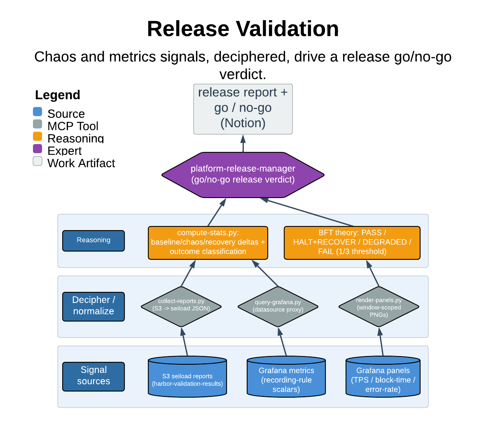

# Release Validation

> Chaos and metrics signals, deciphered, drive a release go/no-go verdict.

This skill turns a completed chaos suite run into a single executive-quality release validation report on Notion: it reads the S3 seiload reports and the Grafana metrics for each scenario's exact injection window, classifies outcomes against BFT theory, and leads with a clear go/no-go recommendation. It is strictly read-only — it queries S3 and Grafana and writes one Notion page, and it never touches a cluster.

| | |
|---|---|
| **Diagram archetype** | layered-cake (signal) |
| **Visual grammar** | Design 14 · Grammar-version 14.1.0 |
| **Live diagram** | [Open in Lucid](https://lucid.app/lucidchart/542f3aba-186d-44f3-b29d-bcb856db6351/edit) |
| **Skill** | [`SKILL.md`](./SKILL.md) |

## What it does

- Collects all 13 seiload JSON reports from S3 and queries Grafana's recording-rule scalars for each scenario's baseline/chaos/recovery windows.
- Classifies each scenario deterministically (outcome, deltas, recovery seconds, noise flag), then narrates the verdicts against BFT consensus in plain language for engineering leaders.
- Assembles one shareable Notion page per invocation — executive summary, per-scenario sections with window-scoped Grafana panel embeds, action items, and a raw-metric appendix.
- Guarantee that matters most: it stays read-only and fail-closed. It refuses to run on a missing/expired Grafana token, an unauthenticated Notion MCP, or a SUITE_ID with zero S3 reports, and it marks NO DATA rather than silently skipping a scenario.

## Reading the diagram

The layered-cake (signal) archetype stacks the upstream signal sources at the base and composes them upward into the verdict at the top. Here the bottom layers are the raw evidence — S3 seiload reports and Grafana metric windows — feeding into the deterministic classification layer, which in turn feeds the narrated per-scenario verdicts and the single Notion report at the crown. Arrows flow upward only: signals compose into judgment, and nothing in the diagram writes back down into a cluster, reflecting the skill's read-only discipline.
