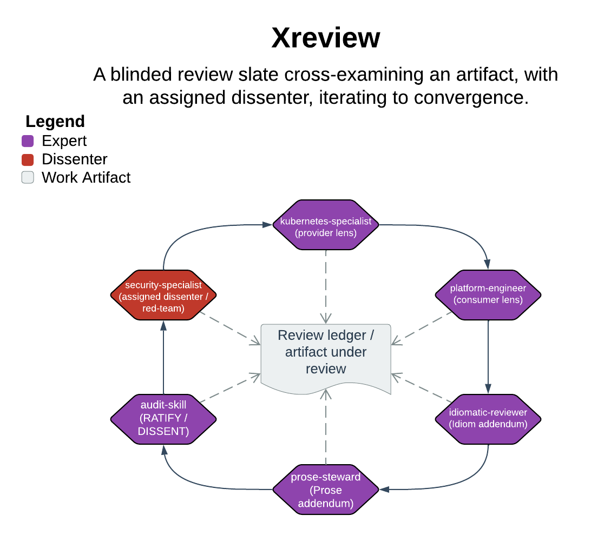

# Xreview

> A blinded review slate cross-examining an artifact, with an assigned dissenter, iterating to convergence.

Xreview takes a produced artifact — a design, plan, diff, or set of specialist outputs. The relevant specialists review it *independently* for consistency, gaps, and interface mismatches. Xreview then synthesizes their findings into a committed review ledger. The one thing it guarantees: no passing verdict while any correctness-grade finding is open. It also refuses a "consistent" call that independent, evidence-bearing review did not reach.

| | |
|---|---|
| **Diagram archetype** | circular-cohort |
| **Visual grammar** | Design 14 · Grammar-version 14.1.0 |
| **Live diagram** | [Open in Lucid](https://lucid.app/lucidchart/1bbb27dc-148b-40b3-9ff2-3b5d577dd1d8/edit) |
| **Skill** | [`SKILL.md`](./SKILL.md) |

## What it does

- Classifies the artifact (one of six classes → tier → slate) as a HALT gate before it dispatches any reviewer: no classification, no review.
- Dispatches independent, blinded specialist reviews — each commits findings before seeing peers' — with one reviewer assigned to dissent (never droppable, never empty).
- Requires every finding to cite a specific contract, field, signature, or line; rejects bare approval ("LGTM") as noise.
- The refusal that matters most: it will not declare COMPATIBLE or stamp a passing `State:` while any correctness-grade finding stays open. That covers MISMATCH/MISSING, correctness-grade idiom or prose, and a per-lens DISSENT. The user resolves each one, or explicitly marks it accepted-with-risk — never silently dropped.

## Reading the diagram

This is a circular-cohort archetype: a ring of specialist lenses arranged around the artifact under review, each reviewing it independently rather than in sequence. The ring captures the blinded slate — domain lenses plus auto-wired stewards plus the assigned dissenter. The loop back through the ring represents re-dispatch across rounds until findings converge. The artifact at the center is what they cross-examine. The diagram's attention concentrates on the seams between specialists' contributions, not on any single component.
