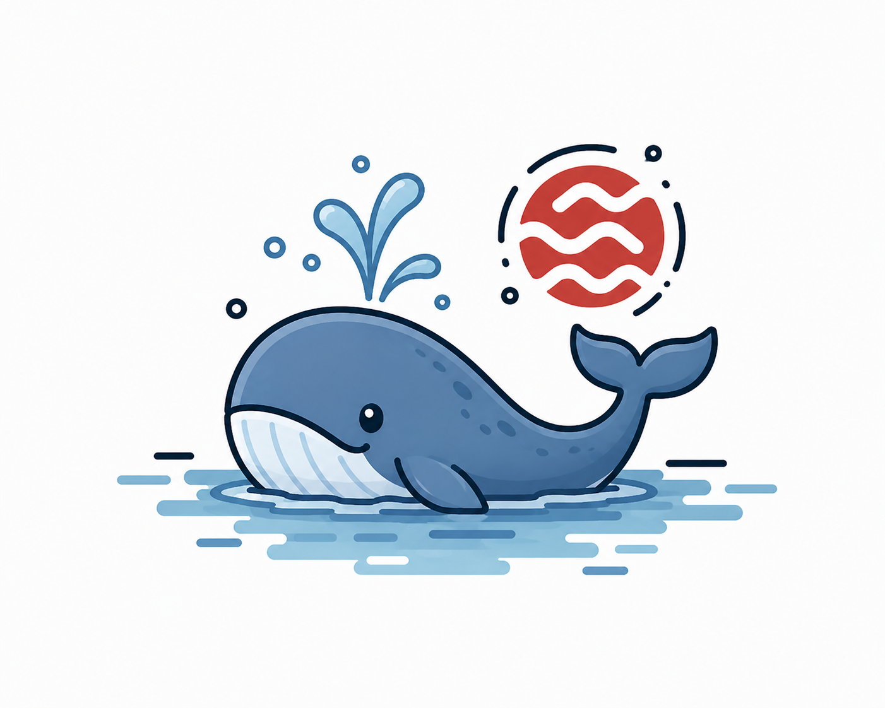

<p align="center">
  
</p>

# sei-internal-skills

sei-internal-skills is Sei's library of **portable Claude Code skills and specialist agents** for engineering work. It's the centralized, version-controlled home for the workflows and personas that help us research problems, groom work, document progress in git and tickets, author and iterate on designs and 1-pagers, automate operational processes like releases and root-cause analysis, and collaborate with specialist agents.

Skills and agents are authored once here and synced out to your user-scope (`~/.claude/`) and sibling repos, so the same `/xreview`, `/root-cause`, or `kubernetes-specialist` works the same way everywhere.

## Setup

One-liner

```sh
gh api repos/sei-protocol/sei-internal-skills/contents/scripts/install.sh -H 'Accept: application/vnd.github.raw' | bash
```

Or clone, then

```sh
make bootstrap
```

This runs:
- `make sync-agents` — installs sei-internal-skills's portable agents into `~/.claude/agents/` so they're reachable from any cwd
- `make sync-skills` — installs sei-internal-skills's portable skills into `~/.claude/skills/`
- `make update-agent-permissions` — installs the canonical read-only allow-list (`gh` reads, GitHub WebFetch) into `./.claude/settings.json`

The canonical permission set is **strictly read-only by design**. Mutating patterns (`gh issue create`, `gh pr merge`, `aws delete-*`, `kubectl apply`, etc.) are rejected by `make verify-agent-permissions`, which CI runs on every PR that touches the permission files. Local additions for your own workflow go in `.claude/settings.local.json` (gitignored).

Run `make` with no args to list all targets.

## Daily use

Most work starts with one of these:

- **`/xreview`** — have the relevant specialists independently review a design, plan, diff, or set of expert outputs, then synthesize a findings table. Blinded, with an assigned dissenter.
- **`/root-cause`** — disciplined, multi-expert investigation of a complex problem. Signals before hypotheses; falsification before conclusion.
- **`/idiomatic`** then **`/systems`** — review code for language and package idiom, then for systems-level quality on top.
- **`/harbor-dev`** — spin up an ephemeral chain, attach an RPC fleet, run a bench, tear it down.
- **`/pr-quality`** — the locked pre-PR gate. **`/brevity`** — tighten the PR body.

Heavier orchestration — `/coral`, `/council`, `/bugbash`, `/design`, `/issue`, `/research`, `/workstream` — is [experimental](./experimental/README.md) and installs only on opt-in.

## What's in here

- **Skills** (`.claude/skills/`) — 17 self-contained Claude Code skills, grouped by domain:
  - **Workflow** — `/xreview`
  - **Investigation** — `/root-cause`
  - **Code quality** — `/idiomatic`, `/systems`
  - **Writing quality** — `/language`
  - **Skill authoring** — `/author-skill`, `/audit-skill`
  - **Output quality** (sei-internal-skills-local) — `/brevity`, `/pr-quality`
  - **Platform infra** — `/platform`, `/kubernetes`
  - **Blockchain** — `/evm`
  - **Release operations** — `/chaos-suite`, `/validate-release`, `/gov-ops`, `/validator-platform`
  - **Engineer self-service** — `/harbor-dev`
- **Agents** (`.claude/agents/`) — 17 specialist personas dispatched by the skills (or directly via the Agent tool), grouped by domain:
  - **Platform infra** — `kubernetes-specialist`, `platform-engineer`, `network-specialist`, `k8s-capacity-management`, `sei-network-specialist`
  - **Observability** — `opentelemetry-expert`, `observability-platform-engineer`, `sre-engineer`
  - **Security** — `security-specialist`
  - **Blockchain** — `solidity-developer`
  - **Code quality** — `idiomatic-reviewer`, `systems-engineer`
  - **Writing quality** — `prose-steward`
  - **Product management** — `product-engineer`, `product-manager`, `go-to-market-specialist`
  - **Release operations** — `platform-release-manager`
- **[`experimental/`](./experimental/README.md)** — 12 skills and 2 agents that do **not** ship by default: workflow orchestration, exec reporting, `ebpf`/`bugbash`, and `interview`+`sei-interview-expert`. Opt in with `make sync-experimental`.
- **Sync machinery** (`scripts/`, `Makefile`):
  - `sync-skills.sh` / `sync-agents.sh` — copy skills/agents into user-scope (`~/.claude/`) or sibling repos, by domain or alias
  - `sync-output-styles.sh` — copy output styles into `~/.claude/output-styles/`; ships them, never activates them
  - `sync-experimental.sh` — opt-in installer for `experimental/`; never runs as part of update/sync-all/bootstrap
  - `Makefile` — `make bootstrap` (one-shot install), plus `make sync-skills` / `make sync-agents` / `make sync-output-styles` / `make sync-experimental`
  - `update-agent-permissions.sh` — installs the canonical read-only permission set

### Output styles

An **output style** governs how Claude writes its replies for a whole session. It is a
different layer from a skill (knowledge, invoked on demand) and an agent (a persona
dispatched for a task).

`make update` installs the styles into `~/.claude/output-styles/` but leaves every one of
them **off**. Activating a style rewrites assistant behavior in every session and every
repo, so that choice belongs to you, not to the installer — and writing it automatically
would overwrite anyone who already picked a different style.

Shipped: **ASD-STE100** — Simplified Technical English. Short sentences, active voice, one
meaning per word, outcome first. Turn it on with `/config` → Output Style → ASD-STE100, or
put `"outputStyle": "ASD-STE100"` in `~/.claude/settings.json`.

## Organization & selective sync

Skills and agents are grouped into **domains** for navigation and selective install — e.g. `code-quality` (`/idiomatic`, `/systems`), `release-operations` (`/gov-ops`, `/validate-release`), `platform-infra`, `investigation`, and so on. The domain is **metadata, not directory structure**: each skill/agent carries a `category:` in its frontmatter, the catalogs ([`.claude/skills/README.md`](.claude/skills/README.md), [`AGENTS.md`](AGENTS.md)) group by it, and the sync scripts let you install one domain at a time:

```sh
make sync-skills                                            # the `portable` set (default)
./scripts/sync-skills.sh --categories code-quality          # just one domain
./scripts/sync-skills.sh --categories all                   # everything syncable
```

Claude Code discovers skills/agents **flat** (`~/.claude/skills/<name>/`, `~/.claude/agents/<name>.md`) in both user and project scope — nested folders and custom roots like `~/.claude/sei-internal-skills/` are **not** discovered. So the install is always flat; domains never become on-disk folders. The aliases `portable`, `sei`, and `all` cross-cut the domains. (`output-quality` — `/brevity`, `/pr-quality` — is sei-internal-skills-local and intentionally not synced.)

## Repository structure

```
.claude/agents/             # Specialist personas dispatched by the skills
.claude/skills/             # Skill definitions (SKILL.md + references + evals)
.claude/skills/README.md    # Skill catalog — start here
.claude/skills/SKILL-TEMPLATE.md  # Authoring standard for new skills
.github/workflows/          # CI (read-only permission enforcement)
AGENTS.md                   # Agent roster + how the skills dispatch them
CLAUDE.md                   # Project context auto-loaded into every session
assets/                     # Banner image
.claude/output-styles/      # Response-format styles (shipped, opt-in — see Output styles)
scripts/                    # sync-agents.sh, sync-skills.sh, sync-output-styles.sh, permission tooling
```

## Where to start

| If you're... | Start here |
|---|---|
| **Using the skills day to day** | `.claude/skills/README.md` (the catalog) |
| **Authoring a new skill** | `.claude/skills/SKILL-TEMPLATE.md`, then `/author-skill` |
| **Auditing an existing skill** | `/audit-skill <name>` → report in the DRI's `<engineer>-designs` repo under `designs/<arc>/audits/` (Design 13) |
| **Adding or editing an agent persona** | `.claude/agents/` + update the roster in `AGENTS.md` |
| **Wiring a sibling repo to use these** | `scripts/sync-agents.sh --target <path>` and `scripts/sync-skills.sh --target <path>` |

## Contributing & conventions

- **Conventional commits.** `feat:`, `fix:`, `docs:`, `refactor:` — reference the skill or component in scope (e.g. `feat(xreview): ...`, `docs(readme): ...`).
- **Brevity discipline.** Apply `/brevity` before writing PR bodies or WHY-style in-code comments.
- **PR-quality discipline.** Before `gh pr create`, apply `/pr-quality` to the staged diff + planned body.
- **Edit skills here, not in `~/.claude/`.** User-scope copies are overwritten on the next sync. Change a skill in sei-internal-skills and PR it.

## Documentation map

| Doc | What it covers |
|-----|----------------|
| `README.md` (this file) | Orientation, install, daily use, structure |
| `CLAUDE.md` | Project context auto-loaded into every Claude Code session |
| `AGENTS.md` | Agent roster + how the skills dispatch them |
| `.claude/skills/README.md` | Skill catalog and cross-repo sync guidance |
| `.claude/skills/SKILL-TEMPLATE.md` | Authoring standard for new skills |
| `scripts/README.md` | What each script does and when CI vs. humans run them |
