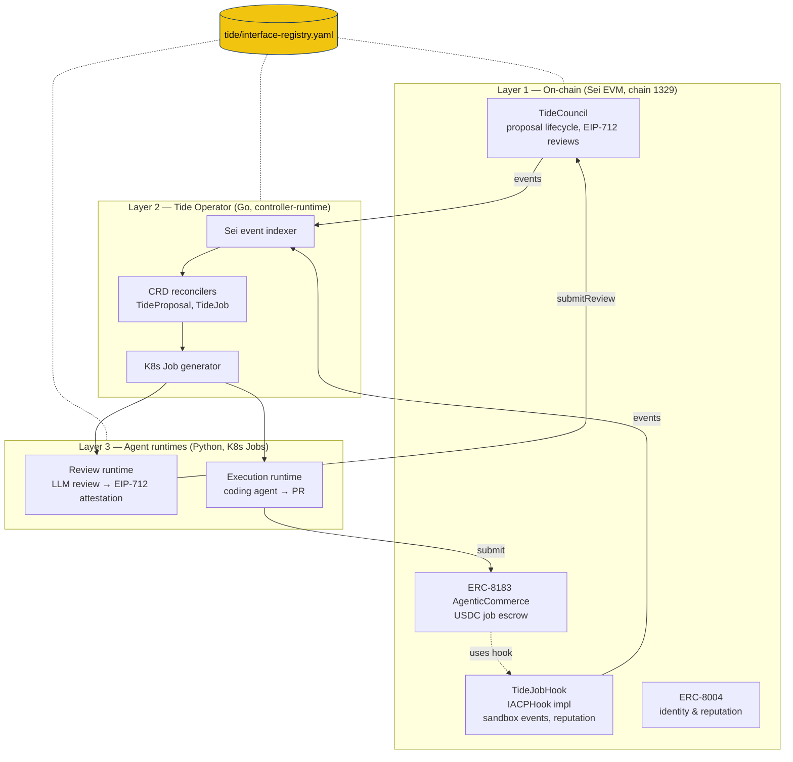

<p align="center">
  
</p>

# Tide

Tide is Sei's agentic engineering infrastructure — a system for presenting engineering designs to a council of AI agents, iterating on those designs collaboratively, and funding agents to execute approved work. All governance and execution is anchored by open ERC standards deployed on Sei: ERC-8004 for agent identity and reputation, ERC-8001 for multi-party design review coordination, and ERC-8183 for USDC-escrowed job execution with evaluator attestation.

The core loop is: a principal proposes a design, a council of agents reviews and iterates until consensus, the approved design is attested on-chain, work is decomposed into funded jobs backed by USDC escrow, agents execute in isolated GitHub sandboxes with scoped credentials, and completed deliverables are evaluated for payment release. No proprietary dependencies — only open standards, Sei's high-throughput EVM, and standard cloud-native infrastructure (EKS, KMS, GitHub Apps).

## Status

Tide is in **design phase**. The repo currently holds:

- Specs for every component (`design/milestones/`) and the cross-component interface registry (`tide/interface-registry.yaml`)
- A council of specialist agents (`.claude/agents/`) and Claude Code skills (`/council`, `/coral`, `/verify`) that orchestrate design, cross-review, and verification work
- Scripts and CI to enforce that code (when written) stays consistent with the registry

Implementation code (`pkg/`, `runtimes/`, `contracts/`, `manifests/`) lands as each milestone reaches done. See **Milestones** below.

## Architecture

Three layers, with the **interface registry** as the spine connecting them:



**Provider owns the interface, consumers adapt.** Solidity contracts provide event signatures and function signatures. The Operator provides env vars and volume mounts to runtimes. Runtimes provide exit codes and completion signaling back to the Operator.

For the full system walk-through (lifecycle, security model, K8s runtime, costs), read `design/high-level/tide-agent-council.md`.

## Repository Structure

```
.claude/agents/             # Specialist personas dispatched by /council and /coral
.claude/skills/             # /council, /coral, /verify, /chaos-suite skill definitions
.github/workflows/          # CI (registry consistency check)
AGENTS.md                   # Agent roster + Tide-specific context per agent
CLAUDE.md                   # Project context auto-loaded into every session
README.md                   # You are here
assets/                     # Banner image
design/
  constitution/             # Working agreement: principles + LLD template
  high-level/               # End-to-end system design (Tide Agent Council)
  milestones/
    m0-contracts/           # TideCouncil + TideJobHook + deployment suite
    m1-platform/            # K8s manifests + Tide Operator
    m2-review/              # Agent Review Runtime
    m3-execution/           # Agent Execution Runtime
    mvp/                    # Event-driven GHA path (parallel track)
  cross-reviews/            # Interface mismatch artifacts from cross-review passes
scripts/                    # verify_registry.py, sync-agents.sh, pre-commit-hook.sh
tide/
  interface-registry.yaml   # Single source of truth for cross-component interfaces
  RUNBOOK.md                # Daily usage of /council, /coral, /verify
```

## Milestones

| Milestone | Scope | Owner | Depends On |
|-----------|-------|-------|------------|
| **M0 — Smart Contracts** | TideCouncil, TideJobHook, deployment suite (Foundry) | Blockchain Developer | — |
| **M1 — Platform & Operator** | K8s manifests, Tide Operator (CRDs, controllers, event indexer) | K8s Specialist + Platform Engineer | M0 (contract addresses + ABIs) |
| **M2 — Review Runtime** | Agent review container (LLM review, EIP-712 signing, on-chain attestation) | Platform Engineer | M0, M1 |
| **M3 — Execution Runtime** | Agent execution container (coding agent, PR creation, deliverable submission) | Platform Engineer | M0, M1, M2 (shared protocols) |
| **MVP** | Event-driven GHA path on self-hosted runners (parallel track) | Brandon (sole operator) | M0 contracts deployed |

Per-milestone scope, deliverables, and done-criteria live in each milestone's README under `design/milestones/`.

## Where to start

| If you're... | Start here |
|---|---|
| **Operating the council** (running `/council`, `/coral`, `/verify`) | `tide/RUNBOOK.md` |
| **Designing a new component** | `design/constitution/constitution.md` → relevant milestone in `design/milestones/` |
| **Reviewing or implementing from a spec** | The LLD in `design/milestones/<milestone>/` + `tide/interface-registry.yaml` |
| **Adding a new agent persona** | `.claude/agents/` + update the roster in `AGENTS.md` |
| **Wiring a sibling repo to use these agents** | `scripts/sync-agents.sh --target <path>` |
| **Understanding the system end-to-end** | `design/high-level/tide-agent-council.md` |

## Documentation map

| Doc | What it covers |
|-----|----------------|
| `README.md` (this file) | Orientation, structure, milestones, where to start |
| `CLAUDE.md` | Project context auto-loaded into every Claude Code session |
| `AGENTS.md` | Agent roster + per-agent Tide-specific context |
| `tide/RUNBOOK.md` | Daily workflow with `/council`, `/coral`, `/verify` |
| `tide/README.md` | The interface registry's role and update procedure |
| `tide/interface-registry.yaml` | Source of truth for events, env vars, exit codes, EIP-712 types, K8s resources |
| `design/README.md` | Design directory layout and design lifecycle |
| `design/constitution/constitution.md` | Design principles, LLD template, naming conventions |
| `design/high-level/tide-agent-council.md` | End-to-end system design |
| `design/milestones/README.md` | Milestone matrix + LLD reading guide |
| `design/milestones/<milestone>/README.md` | Per-milestone scope, deliverables, done criteria |
| `design/cross-reviews/*.md` | Cross-component interface mismatch reports |
| `scripts/README.md` | What each script does and when CI vs. humans run them |

## Quick reference

| Item | Value |
|------|-------|
| Sei mainnet chain ID | `1329` |
| USDC on Sei | `0xe15fC38F6D8c56aF07bbCBe3BAf5708A2Bf42392` |
| K8s namespaces | `tide-system` (operator), `tide-agents` (jobs), `tide-runners` (GHA) |
| ServiceAccount pattern | `tide-agent-{agent-name}` |
| K8s label prefix | `tide.sei.io/` |
| Registry path | `tide/interface-registry.yaml` |
| ERC standards | ERC-8004 (identity), ERC-8001 (review coordination), ERC-8183 (job escrow) |

## Working agreements

Summarized from `design/constitution/constitution.md`:

- **Two-way doors only.** One-way doors (storage layout, event sigs, CRD field names, EIP-712 type hashes) require explicit user approval.
- **YAGNI.** If it doesn't trace to a Phase 0–2 business need, it's deferred.
- **Interfaces first.** The primary deliverable of each spec is exact signatures, types, errors — implementation guidance is secondary.
- **Errors are interface.** Every error is part of the public contract.
- **Provider owns the interface.** Consumers adapt. This avoids circular dependencies during interface resolution.

## Conventional commits

`feat:`, `fix:`, `docs:`, `refactor:` — reference the component in scope (e.g. `feat(operator): ...`, `docs(registry): ...`).

## Getting Started

Low-level design specs live under `design/milestones/`. Each follows the template in `design/constitution/constitution.md` and provides explicit clarity for implementation — interfaces, types, error handling, test specifications, deployment procedures. Start with the milestone relevant to your workstream, or read `tide/RUNBOOK.md` if you'll be running the agent council.
