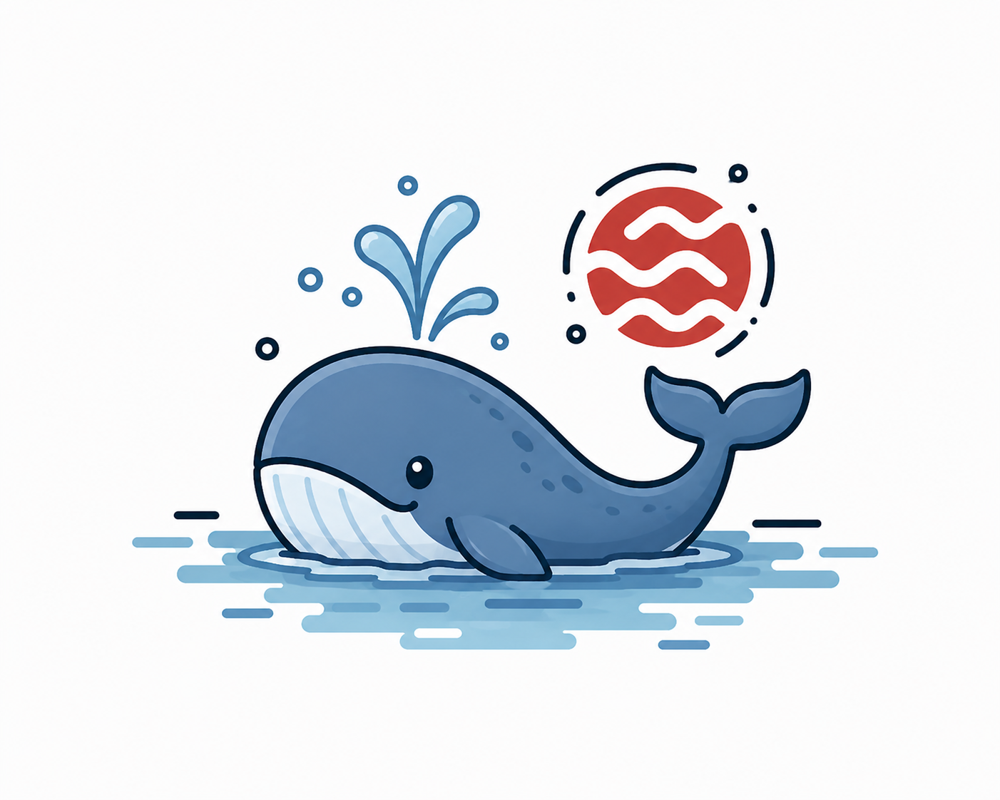

<p align="center">
  
</p>

# sei-internal-skills

Claude Code skills and specialist agents for Sei platform engineers. They install into `~/.claude/`. This public repository also holds the seidroid review runtime.

## Install

You need Claude Code, `git` and `make`. The install needs no GitHub auth.

```sh
curl -fsSL https://raw.githubusercontent.com/sei-protocol/sei-internal-skills/main/scripts/install.sh | bash
```

The script clones this repository into `~/.sei-internal-skills` and runs `make sync-all`. That copies every skill, agent and output style into `~/.claude/`. It then verifies the catalog, and it prints a prune hint if a retired resource is still installed.

With `gh`, or from a clone, see [`scripts/README.md`](scripts/README.md#install-forms). The one-liner runs `install.sh` from main against your `~/.claude`. To read the script first, clone the repository into `~/.sei-internal-skills` and read `scripts/install.sh`. Then run `make -C ~/.sei-internal-skills update`.

To check the install, list the two directories:

```sh
ls ~/.claude/skills ~/.claude/agents
```

The output names each skill and agent in the tables below. Start a new Claude Code session to load them.

## Use a skill or an agent

| | What it holds | Who gets it |
|---|---|---|
| **`.claude/`** — the catalog | 3 skills, 3 agents | Everyone, via `make update` |

| Skill | Use it for | It needs |
|---|---|---|
| `/harbor-dev` | Your own ephemeral Sei chain in `eng-<alias>` on the harbor dev cluster. Spin it up, add RPC nodes, bench it and tear it down. Start with `/harbor-dev onboard me`. | `seictl` v0.0.72 or newer, `yq`, the `flux` CLI, the AWS CLI v2 with an SSO profile, and `kubectl` with the `harbor` kube context. Also `gh`, with write access to two private repositories. The section below gives each item. |
| `/giga-dev` | The shared giga testnet, `giga-testnet-0`, on the prod cells: how it works, where its logs and metrics are, and why it is slow. It is read-only by default. | Read access to the `prod-use2`, `prod`, `prod-euw1` and `prod-apne1` kube contexts, and to Grafana |
| `/kubernetes` | Design and review of sei-k8s-controller code: CRDs, reconcilers, status and conditions. | The code or the diff to review |

### Your own chain: /harbor-dev

In Claude Code, run `/harbor-dev onboard me`. The skill checks these items in this order. For each miss, it tells you the fix. The gates in [`preflight.md`](.claude/skills/harbor-dev/references/preflight.md) follow the same order and hold the exact commands.

1. `seictl` v0.0.72 or newer. The usual install is `go install`, so you need Go. Gate 1 also gives a prebuilt binary that needs no Go.
2. `yq` and the `flux` CLI on your `PATH`.
3. The AWS CLI v2 and an active AWS SSO session. If you have no AWS profile, gate 3 gives the Sei SSO session to add to `~/.aws/config`.
4. `kubectl` and the `harbor` kube context.
5. Access to your namespace. If you have no access, ask in `#harbor-onboarding` and give your AWS principal ARN.
6. The namespace `eng-<alias>`. If it does not exist, the skill opens the onboarding pull requests for you.

You can do items 1 to 4 before you start.

The skill works through pull requests in two private repositories. Onboarding opens one in sei-protocol/platform. Each chain, bench or fault is a pull request in sei-protocol/harbor-engineering-workspace. Sign in to `gh` as a sei-protocol member with write access to both. Onboarding also runs `terraform` and `kustomize`. `kubectl kustomize` can replace `kustomize`.

### The shared giga testnet: /giga-dev

Ask a question, for example `/giga-dev why is giga slow`. The skill reads the `prod-use2`, `prod`, `prod-euw1` and `prod-apne1` kube contexts. It also reads Grafana at `https://grafana.prod.platform.sei.io`, with the datasources `prometheus-prod` and `Loki-fleet`. It writes to the shared cells only when you ask for one specific change and confirm it.

To get the four contexts and Grafana access, follow section 1 of [`observability.md`](.claude/skills/giga-dev/references/observability.md#1-access). If you have no EKS access to a cell, ask the platform team, which runs giga-testnet-0.

### Controller work: /kubernetes

In a sei-k8s-controller checkout, run `/kubernetes review <file, diff or PR>`. You can also ask it to design a CRD or a reconcile step.

### The agents

| Agent | Call it for |
|---|---|
| `kubernetes-specialist` | Kubernetes operator and controller code in Go: CRDs, reconcile logic, child resources and Job lifecycle. It pairs with `/kubernetes`. |
| `sei-network-specialist` | Sei node networking: seid ports, CometBFT P2P, EVM JSON-RPC and WebSocket, gRPC and state sync. |
| `sre-engineer` | SLOs, error budgets, alert tuning, the PromQL and LogQL behind alerts and dashboards, runbooks and post-mortems. |

To call an agent, name it in your request: "Ask the sre-engineer agent to draft the alert and runbook for X." You can also use the Agent tool with the agent name as `subagent_type`. [`AGENTS.md`](AGENTS.md) holds the full roster.

## Stay current

The commands on this page use the default checkout path, `~/.sei-internal-skills`. If your checkout is elsewhere, use its path.

```sh
make -C ~/.sei-internal-skills update
```

The command pulls the checkout and installs the catalog again. A sync never deletes, so a retired skill or agent stays installed until you prune it. To move an older install to the current catalog, or when `update` prints a retired-resource hint, do these steps:

1. `make -C ~/.sei-internal-skills update`. It pulls the checkout and installs the current catalog.
2. `make -C ~/.sei-internal-skills prune-retired`. It lists what step 4 deletes, and deletes nothing.
3. Read the RETIRED list. Prune matches by name only. If a listed name is your own skill, or a retired skill that you changed, copy it to a new name first: `cp -R ~/.claude/skills/<name> ~/.claude/skills/<name>-mine`. If you are not sure, copy it. If a listed skill says `has state/ files` (for example a gov-ops audit log), copy that `state/` out first: `cp -R ~/.claude/skills/<name>/state ~/<name>-state`.
4. `make -C ~/.sei-internal-skills prune-retired-apply`. It deletes the RETIRED list from `~/.claude`.
5. Do these commands for each repository that you synced skills into. Read the first list as in step 3.
   ```sh
   ~/.sei-internal-skills/scripts/prune-retired.sh --target <repo>
   ~/.sei-internal-skills/scripts/prune-retired.sh --target <repo> --apply
   ~/.sei-internal-skills/scripts/sync-skills.sh --target <repo> --force
   ~/.sei-internal-skills/scripts/sync-agents.sh --target <repo> --force
   ```
   The two sync commands replace the old copies of the current skills and agents. Skip `sync-agents.sh` if that repository holds no agents. If `<repo>/AGENTS.md` holds the `sei-internal-skills-managed` block, add `--inject-doctrine` to the `sync-skills.sh` command. That replaces the old block. Then commit the result in that repository.
6. Optional: `git -C ~/.sei-internal-skills clean -ndX -- .claude/skills experimental` lists ignored files that removed skills left in your checkout. They are harmless. To delete one, run `rm -rf ~/.sei-internal-skills/<path>` with a path from that list.
7. Restart any open Claude Code session.

Prune never removes a resource that the catalog holds, or a resource it does not recognize.

## One piece only

The installer can also install one resource and nothing else. Give the one-liner a target:

```sh
curl -fsSL https://raw.githubusercontent.com/sei-protocol/sei-internal-skills/main/scripts/install.sh | bash -s -- skill harbor-dev
```

| Want | Arguments after `bash -s --` |
|---|---|
| A list of everything | `list` |
| The output style | `output-style` |
| One skill | `skill <name>` |
| One agent | `agent <name>` |

A targeted install clones nothing, deletes nothing, and installs only what you name. A skill does not bring its agent, and an agent does not bring the skills it names. A targeted install reads an existing checkout without pulling it.

| Variable | Effect |
|---|---|
| `SEI_SKILLS_REF` | Download a branch, tag or commit instead of `main`. It applies only when no checkout exists at `SEI_INTERNAL_SKILLS_HOME`. |
| `SEI_SKILLS_TARGET` | Install the piece under another root, such as a sibling repository. The script appends `.claude/`. |
| `SEI_INTERNAL_SKILLS_HOME` | The checkout location. If a checkout exists there, a targeted install reads it and downloads nothing. |

For example, to copy one skill into another repository from your checkout:

```sh
SEI_SKILLS_TARGET=~/work/platform bash ~/.sei-internal-skills/scripts/install.sh skill harbor-dev
```

## Output style

The catalog ships one output style, ASD-STE100 (Simplified Technical English). It gives short sentences in the active voice, one meaning per word, and the conclusion first. `make update` installs it but does not turn it on. To install it and turn it on:

```sh
bash ~/.sei-internal-skills/scripts/install.sh output-style
```

The script does not replace a style you already chose, and it keeps every other key in `settings.json`. To turn the style on by hand, use `/config`, then Output Style, then ASD-STE100. The style applies from your next session.

## seidroid runtime

This repository also builds the seidroid review driver and the seidroid runner image. [`CLAUDE.md`](CLAUDE.md#seidroid-runtime) lists the files that seidroid depends on. A new driver release or runner image reaches seidroid only when its pin in sei-protocol/uci or sei-protocol/platform moves.

## Contributing

Read [`CLAUDE.md`](CLAUDE.md) first. It holds the steps to add, retire or rename a skill or an agent. It also gives the tools you need and the checks to run before a pull request. In short:

```sh
git clone https://github.com/sei-protocol/sei-internal-skills && cd sei-internal-skills
# edit under .claude/, then:
make sync-all    # try the change in Claude Code
make check
vale sync && ./writing/scripts/lint.sh <changed .md files>
```

This clone is separate from the install checkout at `~/.sei-internal-skills`. Then open a pull request. seidroid reviews pull requests from `sei-protocol/sei-core` members; other pull requests get human review. Edit a skill here, never in `~/.claude/`, because the next sync overwrites a local copy.

## Layout

```
.claude/            the catalog: skills/, agents/ and output-styles/
scripts/            install, sync and prune tooling, the contributor gates, the runner inputs
writing/            the writing contract and its Vale rules
.specify/           the Spec Kit constitution of this repository
agents/             Omnigent server bundles (seidroid scouts, root-cause, sei-spec), not Claude Code agents
sei-agent-driver/   the seidroid review driver, a Go module
.github/workflows/  CI: the catalog, install and prune gates, the runner image, the driver
assets/             the logo
AGENTS.md           the agent roster and the managed doctrine block
CLAUDE.md           contributor guidance; Claude Code loads it in this repository
Makefile            run make help to list every target
```
