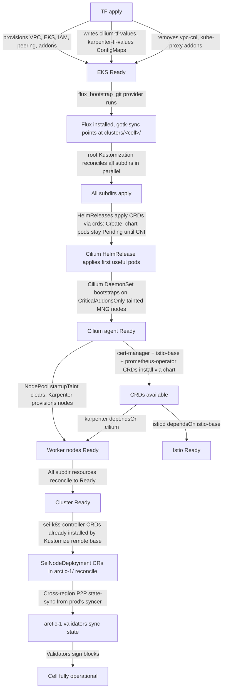

**Date:** 2026-06-07
**Status:** Draft
**Issue:** [sei-protocol/Tide#106](https://github.com/sei-protocol/Tide/issues/106) (meta-cluster umbrella) — implementation refinement for the v1.5 prod cells
**Sibling:** [sei-protocol/Tide#107](https://github.com/sei-protocol/Tide/pull/107) (revision 3 of meta-cluster architecture, superseded by revision 4)
**Parent design:** [`design/high-level/meta-cluster-architecture.md`](./meta-cluster-architecture.md) (PR #123, merged)
**Authors:** bdchatham

---

> **Read this first.** This design is the **concrete refactor and rollout plan** for what the parent design ([`meta-cluster-architecture.md`](./meta-cluster-architecture.md)) named at the architectural level. Two corrections from the parent supersede here:
>
> 1. **Cell archetype**: parent design framed `prod-use2` / `prod-euw1` as **RPC fleets for `pacific-1`** serving NA / EU users. **This was a misread.** The actual driver is **arctic-1 validator distribution** — each new cell will host ~10 arctic-1 validator nodes currently running on EC2 in its respective region (us-east-2 + eu-west-1). The chain team's existing topology already runs arctic-1 validators across 3 regions; this work migrates them from EC2 to Kubernetes without changing the topology.
>
> 2. **S3 CRR pull-forward for `harbor-sei-snapshots` → us-east-2** is no longer required at v1.5. arctic-1 uses CometBFT P2P `state-sync` from prod's syncer, NOT S3 snapshot restore. The parent's CRR call was based on pacific-1's model. (If pacific-1 ever lands in a non-EU cell, S3 CRR un-defers then.)
>
> Everything else from the parent design — per-cluster TF + `clusters/base/` + Flux per cluster + centralized Thanos via Sidecar+Querier-pull + Cilium on new cells + Pod Identity + `aws:PrincipalOrgID` — stands and is the substrate this design implements.

---

# Platform `base/` refactor: extracting shared cluster manifests and adding prod cells `prod-use2` / `prod-euw1`

## Background

The platform repo at `sei-protocol/platform` currently has three top-level clusters: `prod` (eu-central-1), `harbor` (eu-central-1 dev), and `dev` (us-east-2 dev). Each cluster's manifests live at `clusters/<cluster>/<namespace>/` with significant copy-paste between `prod` and `harbor` for shared infrastructure (cert-manager, external-dns, gateway/istio, kube-system, monitoring, sei-k8s-controller, default/Karpenter NodePools). The repo already has a `manifests/base/` directory with prior art for shared chain manifests (`seid`, `testnet`, `waterway`, `genesis`, `monitoring/alerts`, `chaos-scenarios`) — though most subdirs are dev-only legacy.

This design plans the **next two prod cells** — `prod-use2` (us-east-2) and `prod-euw1` (eu-west-1) — to host arctic-1 validator workloads being migrated from EC2 to K8s. It also captures the **base/ refactor** that extracts shared cluster manifests so the new cells inherit known-good infrastructure instead of duplicating it. The naming scheme `prod-<region-code>` is locked going forward; existing `clusters/prod/` and `clusters/harbor/` keep their legacy names for now (rename is a future workstream).

A six-stream Phase 1 deep dive (platform-engineer, kubernetes-specialist, sei-network-specialist, network-specialist, observability-platform-engineer) on a fresh clone of `sei-protocol/platform@0aa0faf` produced the duplication map, Cilium-coupled cascade pattern, federation seam details, and chain-tied-vs-cluster-tied axis that this design codifies.

## Goals

1. **`prod-use2` and `prod-euw1` clusters stood up** with ~10 arctic-1 validator pods each, replicating the validator nodes currently on EC2 in those regions. Same shape as harbor (Cilium, sei-k8s-controller, monitoring spoke, gateway/istio), minus eng / nightly / chaos-mesh / staging namespaces.
2. **`clusters/base/` extraction** that eliminates the cert-manager / external-dns / gateway / sei-k8s-controller / default-NodePool / monitoring-spoke duplication between harbor and the new cells, with prod participating where the shape matches (sans Cilium overrides).
3. **`manifests/base/<chain>/` extension** for chain-tied resources (chainId, image, peer label selectors, EC2 peer-cohort tags, snapshot policy), with cluster-tied bits (PV volumes, AZ, replicas, networking) staying in `clusters/<cluster>/<chain>/`.
4. **Kustomize validation** asserting that `base/ + patches` renders byte-identical to current `clusters/prod/` and `clusters/harbor/` outputs (or semantically-equivalent with documented diffs), and produces valid new outputs for `prod-use2` and `prod-euw1`.
5. **Smooth cluster startup with zero manual intervention**: TF apply → Flux bootstrap → all addons + workloads converge via the established retry-on-CRD-missing pattern.

## Non-goals

- **Renaming `clusters/prod/` → `clusters/prod-euc1/`.** Per Brandon's 2026-06-07 call, that's a future workstream. Existing prod and harbor keep their legacy paths.
- **Migrating `harbor` to consume `clusters/base/`.** Harbor's existing tree is the source the base is being extracted *from*; mutating both sides in flight risks losing working configuration. Defer to a follow-up when `base/` is stable.
- **Pacific-1 RPC fleets in the new cells.** Pacific-1 stays in `clusters/prod/` (eu-central-1) for now. The parent design (Tide#123) framed cells as pacific-1 RPC fleets — superseded here.
- **mTLS for Thanos federation.** Current pattern is SG-only; this design matches that reality. Parent design's mTLS commitment is superseded.
- **S3 Cross-Region Replication for `harbor-sei-snapshots` to us-east-2.** Not needed for arctic-1 (uses P2P state-sync). Parent design's CRR pull-forward is superseded for this workstream.
- **CAPI / CAAPH / tofu-controller / Pod Identity reconciler subpackage.** Parent design parked all of these as institutional memory; this design implements the chosen direction (per-cluster TF + Flux + base/).
- **Cilium ClusterMesh.** Cells federate observability via VPC peering + L3; cell-to-cell pod paths are not in scope. ClusterMesh un-defer trigger remains as the parent design states.
- **Migrating prod from VPC CNI to Cilium.** Tracked separately in [Tide#108](https://github.com/sei-protocol/Tide/issues/108).

## Architecture

### 4.1 Filesystem structure

The proposed layout in `sei-protocol/platform`:

```
sei-protocol/platform/
├── clusters/
│   ├── base/                          # NEW — shared cluster-level infrastructure
│   │   ├── cert-manager/              # HelmRelease + Issuer base
│   │   ├── external-dns/              # HelmRelease base (txtOwnerId/domainFilters via overlay)
│   │   ├── gateway/                   # Namespace + base Gateway + base Certificate + http-redirect
│   │   ├── sei-k8s-controller/        # Deployment + Service + ConfigMap base (env via overlay)
│   │   ├── default/                   # Karpenter NodePool + EC2NodeClass base (tags via overlay)
│   │   ├── monitoring-spoke/          # Prometheus + Thanos Sidecar + Loki + Alloy NLBs (harbor + new cells; not prod)
│   │   ├── istio-system/              # istio-base + istiod base (hostNetwork via Cilium overlay)
│   │   ├── kube-system/               # AWS LB Controller, metrics-server, coredns config base
│   │   └── cni-cilium/                # Kustomize Component — Cilium-coupled overrides (see §4.3)
│   ├── prod/                          # Existing — unchanged tree (legacy name)
│   ├── harbor/                        # Existing — unchanged tree (legacy name)
│   ├── dev/                           # Existing — unchanged tree
│   ├── prod-use2/                     # NEW — us-east-2 arctic-1 validator cell
│   │   ├── kustomization.yaml         # Root: lists subdirs + composes base + cni-cilium component
│   │   ├── cert-manager/              # Thin overlay: references clusters/base/cert-manager + DNS issuer patch
│   │   ├── default/                   # Thin overlay: NodePool tag patch
│   │   ├── external-dns/              # Thin overlay: txtOwnerId + domainFilters patch
│   │   ├── flux-system/               # gotk-components.yaml + gotk-sync.yaml (TF bootstraps)
│   │   ├── gateway/                   # Thin overlay: chain-listener YAML for arctic-1 + cell-specific cert refs
│   │   ├── istio-system/              # Thin overlay: composes cni-cilium component
│   │   ├── kube-system/               # Thin overlay: composes cni-cilium for cert-manager hostNetwork, etc.
│   │   ├── monitoring/                # Thin overlay: composes base/monitoring-spoke + per-cell externalLabels
│   │   ├── sei-k8s-controller/        # Thin overlay: per-cell env (SEI_SNAPSHOT_BUCKET, SEI_GATEWAY_PUBLIC_DOMAIN, etc.)
│   │   ├── heatseeker/                # Cell-exclusive: arctic-1 probe Deployments only
│   │   └── arctic-1/                  # Cell-exclusive: ~10 SeiNodeDeployment CRs for validators migrating from EC2
│   │       ├── kustomization.yaml     # References manifests/base/arctic-1/ for chain-tied bits
│   │       └── validators/            # Per-validator CR with cell-tied overrides (PV, AZ, peer config)
│   └── prod-euw1/                     # NEW — eu-west-1 arctic-1 validator cell, same shape as prod-use2
├── manifests/
│   └── base/                          # Existing + extended
│       ├── monitoring/alerts/         # Existing — shared alert rule library (prod + harbor + new cells)
│       ├── observability/             # NEW — extracted byte-identical observability manifests
│       │   ├── alloy-logs.yaml        # Was duplicated; now shared
│       │   ├── podmonitor-seid.yaml   # Was duplicated; now shared
│       │   ├── prometheusrule-karpenter.yaml
│       │   ├── thanos-objstore.yaml   # Bucket name parametrized via configMapGenerator
│       │   └── pagerduty/             # SOPS structure extracted; per-cluster ciphertext stays cluster-local
│       ├── arctic-1/                  # NEW — chain-tied resources for arctic-1
│       │   ├── chainId, image, peer label selectors, EC2 peer-cohort tags, snapshot policy
│       │   └── kustomization.yaml
│       ├── atlantic-2/                # NEW (parallel extraction; prod consumes after refactor)
│       ├── pacific-1/                 # NEW (parallel extraction; prod consumes after refactor)
│       ├── seid/                      # Existing — dev-only legacy; out of scope (left as-is)
│       ├── testnet/                   # Existing — dev-only legacy
│       ├── waterway/                  # Existing — dev-only legacy
│       ├── genesis/                   # Existing — dev-only legacy
│       └── chaos-scenarios/           # Existing — orphan; flagged for follow-up cleanup
└── terraform/aws/189176372795/
    ├── eu-central-1/
    │   ├── prod/                      # Existing — unchanged
    │   └── harbor/                    # Existing — unchanged
    ├── us-east-2/
    │   ├── common/                    # Existing
    │   ├── dev/                       # Existing
    │   └── prod-use2/                 # NEW — TF root: VPC, EKS, Cilium addons removed, peering to prod
    └── eu-west-1/                     # NEW region
        └── prod-euw1/                 # NEW — same shape as prod-use2 TF root
```

The pattern is **vanilla Kustomize with `resources: [../../base/<component>]` traversal**, mirroring the existing `manifests/base/` consumption pattern. No Flux per-component Kustomizations. No `valuesFrom`-based composition for cluster-level infrastructure. The single root Flux Kustomization per cluster (`flux-system/gotk-sync.yaml` pointing at `clusters/<cluster>/`) stays unchanged — the DAG remains flat at the Flux layer; ordering lives in HelmRelease `dependsOn` chains as today.

### 4.2 base/ extraction categories

Components classified by extraction shape (full mapping in companion artifact `/tmp/base-mapping-phase2.md`):

| Category | Components | Treatment |
|---|---|---|
| **A — Clean base + value patches** | cert-manager, external-dns, sei-k8s-controller, gateway (sans chain listeners), default/NodePools | Same shape between prod and harbor; only value divergence. Extract to `clusters/base/<X>/`, apply per-cell overlays via strategic merge patches. Cilium-coupled fields (cert-manager webhook hostNetwork, NodePool startupTaints) come from the `cni-cilium` component (§4.3), not the base. |
| **B — Byte-identical wins** | `alloy-logs.yaml`, `podmonitor-seid.yaml`, `prometheusrule-karpenter.yaml`, `thanos-objstore.yaml` (bucket name only differs), `pagerduty.yaml` (structure identical) | Extract to `manifests/base/observability/` and `manifests/base/monitoring/alerts/karpenter.yaml`. Bucket name parametrized via per-cluster `configMapGenerator: behavior: replace`. SOPS ciphertext stays cluster-local. |
| **C — Cilium cascade (Kustomize Component)** | cilium HelmRelease, karpenter `dependsOn: cilium`, cert-manager webhook hostNetwork, metrics-server hostNetwork, istiod hostNetwork, NodePool startupTaints | All Cilium-only. Bundled into `clusters/base/cni-cilium/` Kustomize Component. Cilium clusters compose: `resources: [../base/<X>] + components: [../base/cni-cilium]`. Prod (VPC CNI) doesn't include the component. See §4.3 for detail. |
| **D — Cluster-role divergence (per-role base)** | monitoring stack (prod = hub, harbor + cells = spoke), flux-system (image-automation in harbor only) | Don't force a single base. **`clusters/base/monitoring-spoke/`** for harbor + new cells; prod's full hub stack stays at `clusters/prod/monitoring/`. flux-system stays per-cluster. |
| **E — Cluster-exclusive** | `heatseeker` (prod + new cells, but arctic-1-only on cells); `engineers`, `nightly`, `chaos-mesh`, `staging` (harbor only) | Stay in cluster trees. heatseeker on new cells is a thin manifest set (arctic-1 Deployments only). |
| **F — Chain workload bases (NEW)** | arctic-1, atlantic-2, pacific-1 chain manifests | **New pattern**: `manifests/base/<chain>/` holds chain-tied resources (chainId, image, peer label selectors, EC2 peer-cohort tags for legacy interop, snapshot trustPeriod, snapshotGeneration policy). `clusters/<cluster>/<chain>/` overlays declare which CRs to instantiate plus cluster-tied values (PV `volumeHandle`, `nodeAffinity` AZ values, replicas, networking exposure, validator placement, KMS key ARN, cert SANs). |

### 4.3 The Cilium cascade — Kustomize Component pattern

Cilium adoption on a cluster cascades changes to four other manifests:
- `cert-manager` webhook gets `hostNetwork: true` + `securePort: 9443` (CGNAT workaround — EKS API server can't reach Cilium cluster-pool pod CIDR `100.64.0.0/14`)
- `metrics-server` gets `hostNetwork: true` (same cause)
- `istiod` gets `global.hostNetwork: true` (webhook reachability; documented in repo's `docs/designs/harbor-cilium.md` §D11)
- Karpenter NodePools get `startupTaints: node.cilium.io/agent-not-ready` (pods don't schedule until eBPF flips node Ready)
- Karpenter HelmRelease gets `spec.dependsOn: [{name: cilium}]` (chart must apply after Cilium DaemonSet exists, else early Karpenter-provisioned nodes have no CNI)

These cascade together. **A Kustomize Component captures them as a composable unit**:

```yaml
# clusters/base/cni-cilium/kustomization.yaml
apiVersion: kustomize.config.k8s.io/v1alpha1
kind: Component

patches:
  - target:
      kind: HelmRelease
      name: cert-manager
      namespace: cert-manager
    patch: |
      - op: add
        path: /spec/values/webhook
        value:
          hostNetwork: true
          securePort: 9443
  - target:
      kind: HelmRelease
      name: metrics-server
      namespace: kube-system
    patch: |
      - op: add
        path: /spec/values/hostNetwork
        value: { enabled: true }
  - target:
      kind: HelmRelease
      name: istiod
      namespace: istio-system
    patch: |
      - op: add
        path: /spec/values/global/hostNetwork
        value: true
  - target:
      kind: NodePool
      labelSelector: karpenter.sh/discovery-class
    patch: |
      - op: add
        path: /spec/template/spec/startupTaints
        value:
          - key: node.cilium.io/agent-not-ready
            effect: NoExecute
  - target:
      kind: HelmRelease
      name: karpenter
      namespace: kube-system
    patch: |
      - op: add
        path: /spec/dependsOn
        value:
          - name: cilium

resources:
  - ../../base/kube-system/cilium.yaml   # Cilium HelmRelease itself (only present when component composed)
```

**Cell usage**:
```yaml
# clusters/prod-use2/kustomization.yaml
resources:
  - cert-manager
  - external-dns
  - default
  - gateway
  - istio-system
  - kube-system
  - monitoring
  - sei-k8s-controller
  - heatseeker
  - arctic-1
components:
  - ../base/cni-cilium       # ← composes all Cilium-coupled overrides
```

**Prod usage**: no `components:` entry. Cilium-coupled overrides are absent. Prod stays VPC CNI until [Tide#108](https://github.com/sei-protocol/Tide/issues/108) un-defers, at which point prod adds the component.

This avoids per-cluster strip-removes (finicky with Helm chart values via Flux). Adding/removing Cilium becomes a one-line `components:` change.

### 4.4 Per-cell topology

Cell-specific values that diverge from `clusters/base/`:

| Dimension | `prod-use2` | `prod-euw1` |
|---|---|---|
| Region | us-east-2 | eu-west-1 |
| VPC CIDR | `10.70.0.0/16` | `10.80.0.0/16` |
| Service CIDR | `172.20.0.0/16` | `172.20.0.0/16` |
| Cilium pod CIDR pool | `100.68.0.0/14` | `100.72.0.0/14` |
| Cilium `cluster.id` (ClusterMesh-readiness) | `2` | `3` (harbor=1) |
| `cluster.name` | `prod-use2` | `prod-euw1` |
| `fullnameOverride` (kube-prometheus-stack) | `sei-prod-use2` | `sei-prod-euw1` |
| `externalLabels` (Prometheus) | `cluster: prod-use2, region: us-east-2, cell_archetype: prod` | `cluster: prod-euw1, region: eu-west-1, cell_archetype: prod` |
| external-dns `txtOwnerId` | `prod-use2` | `prod-euw1` |
| external-dns `domainFilters` | `[prod-use2.platform.sei.io, prod-use2.internal.platform.sei.io]` — **NEVER** apex `platform.sei.io` (prod owns it) | `[prod-euw1.platform.sei.io, prod-euw1.internal.platform.sei.io]` |
| Karpenter `karpenter.sh/discovery` tag | `prod-use2` | `prod-euw1` |
| sei-k8s-controller `SEI_GATEWAY_PUBLIC_DOMAIN` | `prod-use2.platform.sei.io` | `prod-euw1.platform.sei.io` |
| sei-k8s-controller `SEI_NLB_TARGET_TYPE` | `instance` (Cilium pattern) | `instance` |
| sei-k8s-controller `SEI_SNAPSHOT_BUCKET` | `prod-sei-snapshots/us-east-2` (no CRR; same source bucket, region-scoped path) | `prod-sei-snapshots/eu-west-1` |
| Private hosted zone | `prod-use2.internal.platform.sei.io` (cross-associated to prod VPC for federation DNS) | `prod-euw1.internal.platform.sei.io` |
| Thanos sidecar hostname | `thanos-sidecar.prod-use2.internal.platform.sei.io:10901` | `thanos-sidecar.prod-euw1.internal.platform.sei.io:10901` |
| Thanos storegateway hostname | `thanos-storegateway.prod-use2.internal.platform.sei.io:10901` | `thanos-storegateway.prod-euw1.internal.platform.sei.io:10901` |
| Loki gateway hostname | `loki-gateway.prod-use2.internal.platform.sei.io:80` | `loki-gateway.prod-euw1.internal.platform.sei.io:80` |
| Thanos blocks S3 bucket | `sei-prod-use2-thanos-blocks-us-east-2` | `sei-prod-euw1-thanos-blocks-eu-west-1` |
| Loki S3 bucket | `prod-use2-platform-loki` | `prod-euw1-platform-loki` |

All these get patched per-cell via strategic merge or configMapGenerator. `clusters/base/<component>/` carries the shape; the per-cell overlay carries the values.

### 4.5 arctic-1 cell layout

Cell-tied vs chain-tied split for arctic-1:

**`manifests/base/arctic-1/`** (chain-tied; shared by every cluster hosting arctic-1):
- `chainId: arctic-1`
- Default container image + tag (overridable per node for canary rollouts)
- Peer label selector (`sei.io/chain: arctic-1`)
- EC2 peer-cohort tags for legacy interop (the EC2 nodes that haven't migrated yet, plus any chain-team-owned EC2 sentries that stay outside K8s)
- Snapshot trustPeriod, snapshotGeneration policy
- Genesis ConfigMap

**`clusters/<cell>/arctic-1/`** (cluster-tied; ~10 validator SeiNodeDeployment CRs per cell):
- Per-validator SeiNodeDeployment CR. Each declares:
  - Validator identity (unique per K8s declaration; globally unique across the fleet)
  - Signing key reference (SOPS-encrypted Secret per validator, region-local KMS key)
  - PV `volumeHandle` (EBS volume ID; region-locked; pre-provisioned via TF)
  - `nodeAffinity` AZ values (cell-local)
  - Replicas: `1` (validator identities never have HA replicas)
  - Networking: NLB per sentry exposure if applicable; validator P2P not publicly routed
  - `peers[]`: includes legacy EC2 peer cohort + (eventually) the other cells' K8s peers via `topology.region` label discovery
- `kustomization.yaml`:
  ```yaml
  resources:
    - ../../../manifests/base/arctic-1
    - validators/validator-N
    - validators/validator-N+1
    - ...
  ```

**Validator placement constraint**: Per Brandon's 2026-06-07 call, a given validator identity exists in exactly one cluster's tree, ever. No splitting; no duplication. Existing arctic-1 validators in `clusters/prod/arctic-1/validators/` (validator-18, validator-19) stay there. New cells take over for the EC2 validators in their respective regions — those will be declared as fresh K8s CRs (the identities those EC2 nodes hold today migrate into K8s manifests in `clusters/prod-use2/arctic-1/validators/` and `clusters/prod-euw1/arctic-1/validators/`).

Inventory of which EC2 node identities migrate to which cell: discovery happens at Phase 3 implementation start. Roughly ~10 per cell per Brandon's call.

### 4.6 Deployment sequencing — smooth startup without intervention

Bootstrap order per cell, derived from harbor's working pattern:



**Critical edges**:
- `istiod → istio-base` (HelmRelease `spec.dependsOn`)
- `karpenter → cilium` (HelmRelease `spec.dependsOn`; only on Cilium clusters)
- Implicit barrier: node-group-join waits for CNI. Cilium DaemonSet runs on `CriticalAddonsOnly`-tainted MNG nodes that come up with the EKS control plane.

**No `dependsOn` between Flux Kustomizations** (the DAG is flat). Convergence comes from Flux's retry-on-CRD-missing: a HelmRelease that needs a CRD waits silently; once the CRD lands, the HelmRelease reconciles. This is the established pattern in both prod and harbor.

**TF prerequisites for the bootstrap to work without intervention**:
- `vpc-cni` and `kube-proxy` EKS managed addons NOT installed (Cilium replaces them)
- `cilium-tf-values` ConfigMap written into `kube-system` before Flux starts (Cilium HelmRelease `valuesFrom`)
- `karpenter-tf-values` ConfigMap written into `kube-system` before Flux starts
- IAM roles for IRSA (today's pattern; Pod Identity migration is separate per parent design)
- VPC peering attachment to prod's VPC, with `allow_remote_vpc_dns_resolution = true` on both sides (cross-region peering — needs dual-provider TF or accepter resource; see §4.7)

### 4.7 Cross-region VPC peering

Today's `terraform/aws/189176372795/eu-central-1/harbor/thanos-peering.tf` works because harbor↔prod is same-region. Cross-region (`prod-use2` ↔ prod, `prod-euw1` ↔ prod) requires:

1. **Cross-region peering request from cell side, accepter on prod side.** Single-provider TF + `aws_vpc_peering_connection` with manual accepter, OR dual-provider TF with `auto_accept = true` (preferred — explicit).
2. **Route table updates on both sides**: cell routes prod CIDR via peering; prod routes cell CIDR via peering. Symmetric.
3. **`allow_remote_vpc_dns_resolution = true` is one-sided per region**. To resolve `thanos-sidecar.prod-use2.internal.platform.sei.io` from prod (eu-central-1) over peering, prod's VPC needs an inbound Route 53 resolver endpoint into us-east-2, OR (simpler) the per-cell private hosted zone is associated with prod's VPC via `aws_route53_zone_association` (works cross-region — proven pattern in harbor's `thanos-peering.tf`).

**Plan**:
- Each cell's TF creates the peering connection (`aws_vpc_peering_connection` in cell's region) with `accepter.region = eu-central-1` and `auto_accept = true` via dual-provider.
- Each cell's TF creates its private hosted zone `<cell>.internal.platform.sei.io` and associates it with both the cell's VPC and prod's VPC (cross-region zone association — `ignore_changes = [vpc]` to tolerate the second association).
- Each cell's TF creates route table entries on cell side; prod's TF creates return routes on its side (pull cell's CIDR from cell's remote state).

### 4.8 Observability federation

Star topology per the locked decisions:
- Each cell exposes Thanos Sidecar + Thanos Storegateway + Loki Gateway via internal NLBs (matching harbor's pattern exactly — in-tree CCM NLBs, `aws-load-balancer-internal: true`, cross-zone enabled, pinned NodePorts 30901/30902/30310, instance-target)
- Prod's `clusters/prod/monitoring/thanos-query.yaml` `stores:` list extends with the four new endpoints (sidecar + storegateway per cell × 2 cells)
- Prod's `clusters/prod/monitoring/grafana-datasources.yaml` extends with two new Loki datasources (`loki-prod-use2`, `loki-prod-euw1`)
- AlertManager stays per-cluster (5 AMs total across the fleet, pinging the same PagerDuty service); label-based scoping. **No mTLS** — SG-only.
- `prometheusSpec.externalLabels` per cell injects `cluster`, `region`, `cell_archetype` (defaults: `cell_archetype: prod` for the new cells, `dev` for harbor)

`clusters/base/monitoring-spoke/` holds the spoke shape (Prometheus + Sidecar + Storegateway + Loki + Alloy + NLBs). New cells and harbor consume it; prod has its own hub-specific stack.

## Rationale for base reuse decisions

Each extraction earns its place. Below is the reasoning per Category A-F.

### Category A (cert-manager, external-dns, sei-k8s-controller, gateway, default/NodePools)

These are extracted because:
- **Shape is byte-stable** across prod and harbor (verified by platform-engineer's Phase 1 deep dive — same HelmRelease chart versions, same Kustomize structure, same resource types)
- **Divergence is value-only** — issuer DNS names, txtOwnerId, env vars, replica counts, Karpenter discovery tags
- **Patches are clean strategic merges** — no need for component composition or post-renderers

Risk profile: low. Extraction is recoverable (a bad patch causes a kustomize build failure, never an in-cluster broken state, because Flux reconciles validated manifests).

### Category B (byte-identical observability manifests)

Extracted because:
- Already truly identical between prod and harbor (verified via `diff` in Phase 1)
- Future drift is now a deliberate per-cluster decision (overlay) rather than an accident (copy-paste forgotten)
- The existing `manifests/base/monitoring/alerts/` pattern is the precedent — extending it costs nothing

Risk profile: zero. Pure copy-paste removal.

### Category C (Cilium cascade)

Extracted via **Kustomize Component** rather than per-cluster strip-removes, because:
- Helm chart values are nested YAML; removing a key (rather than overriding it) is finicky via strategic merge patches and requires the chart to treat unset == default (often not true)
- Composability — adding/removing Cilium becomes a one-line `components:` change in the cluster's root kustomization
- Documentation — the Component is a single artifact that captures "everything Cilium adoption implies"

Risk profile: medium. Kustomize Components are less commonly used than overlays in the team's repo today (no current consumers). Adoption introduces a new Kustomize primitive — the team needs to know it. Mitigation: clear inline comment in the Component file pointing at this design.

### Category D (per-role bases: monitoring-spoke, flux-system stays per-cluster)

monitoring stack is **NOT extracted to a single base** because prod runs an architecturally different shape (Thanos hub: Querier + Compactor + Ruler + Grafana + Loki centralized + Pyroscope). A unified base would force the spoke pattern on prod or the hub pattern on cells — both are wrong.

`clusters/base/monitoring-spoke/` is the right granularity: harbor + new cells share it; prod stays cluster-exclusive.

flux-system stays per-cluster because harbor includes image-automation + engineering workspace resources; prod and new cells use a leaner shape.

Risk profile: low. The split matches reality.

### Category E (cluster-exclusive manifests)

heatseeker on new cells is arctic-1-only (drop pacific-1 + atlantic-2 probe Deployments). Stays in cluster trees because it's per-cell-specific: each cell probes the chains it hosts.

harbor's engineers / nightly / chaos-mesh / staging stay in harbor. Not relevant to prod cells.

Risk profile: zero. No extraction proposed.

### Category F (chain workload bases — the biggest unlock)

This is the most architecturally consequential extraction. Today every cluster hand-writes its chain manifests. The new pattern:

- `manifests/base/arctic-1/` holds chain-tied state: chainId, image, peer selectors, snapshot policy, EC2 peer-cohort tags
- `clusters/<cluster>/arctic-1/` overlays declare which CRs to instantiate + cluster-tied values

**Without this extraction**, every cell's `arctic-1/` would re-declare the chainId, image, etc. The base extraction means upgrading arctic-1 to a new image version is a one-line change in `manifests/base/arctic-1/`, applied fleet-wide via Flux on next reconcile of each cluster (with intentional staggered rollout via `topology.region` label gating if needed).

Risk profile: medium during initial extraction. The existing prod/atlantic-2, prod/pacific-1, prod/arctic-1 trees need to be re-pointed at the new bases without breaking running workloads. Mitigation: extract incrementally, validate via kustomize-build diff against current rendered output (Phase 4) before merging.

## Rationale for Kustomization patch reasoning

Patch type by use case:

### Strategic merge (default — used in most overlays)

Per-cell value tweaks like `replicas: 3` → `replicas: 2`, env var additions, NodePool tag changes. Readable, low-risk, the Kustomize idiom.

Example (`clusters/prod-use2/sei-k8s-controller/manager-patch.yaml`):
```yaml
apiVersion: apps/v1
kind: Deployment
metadata:
  name: sei-k8s-controller-manager
  namespace: sei-k8s-controller-system
spec:
  template:
    spec:
      containers:
      - name: manager
        env:
        - name: SEI_GATEWAY_PUBLIC_DOMAIN
          value: prod-use2.platform.sei.io
        - name: SEI_SNAPSHOT_BUCKET
          value: prod-sei-snapshots/us-east-2
        - name: SEI_NLB_TARGET_TYPE
          value: instance
```

### JSON 6902 patches (used in `cni-cilium` Component)

Add operations on Helm chart values (`spec.values.X`). Necessary because strategic merge for HelmRelease values doesn't always do what's wanted (key-removal semantics).

Example shown in §4.3.

### configMapGenerator with `behavior: replace`

For ConfigMaps where the entire content needs cell-specific override (e.g., `thanos-objstore` bucket name, `cilium-tf-values` from TF).

Example (`clusters/prod-use2/monitoring/kustomization.yaml`):
```yaml
configMapGenerator:
  - name: thanos-objstore
    namespace: monitoring
    behavior: replace
    files:
      - objstore.yml=./thanos-objstore-config.yaml
```

### Kustomize Components (used for `cni-cilium`)

When a cohesive group of patches should be composable as a unit. New primitive in the repo (no current consumers), introduced here. The trade-off is a slightly higher learning curve vs. an overlay; the win is composability.

### What NOT to use

- **`$patch: delete` operations** — finicky, easy to break, hard to read. Use Component-or-absent composition instead.
- **`patchesJson6902:` (deprecated form)** — use `patches:` with `target:` and `patch:` instead (Kustomize 5.x form).
- **`kustomize.config.k8s.io/v1beta1` Kustomization (old API)** — use `v1` for new manifests.
- **`kubectl_manifest` resources in TF** — Cilium / Karpenter values come from TF-written ConfigMaps consumed by HelmReleases via `valuesFrom`, not from `kubectl_manifest`.

## Kustomize validation strategy

The /goal requires `kustomize` validation that base + patches produces the same outcomes for harbor and prod (which keep their existing trees pending future refactor — meaning **no rendered-output change** for them in this initial PR) plus valid new outputs for the cells.

**Validation steps** (Phase 4 work):
1. **Snapshot baseline**: `kustomize build clusters/prod/ > /tmp/prod-baseline.yaml` and `kustomize build clusters/harbor/ > /tmp/harbor-baseline.yaml` against current `main`
2. **Apply refactor on a branch**: extract `clusters/base/` per this design, re-point `clusters/prod/` and `clusters/harbor/` to consume the relevant bases. **But only for components in Category A and B** in this initial PR — extracting D and F (monitoring-spoke, chain bases) is staged later to avoid moving too many pieces at once.
3. **Re-render on the branch**: `kustomize build clusters/prod/` and `kustomize build clusters/harbor/`
4. **Diff**: outputs must be **byte-identical** (or semantically equivalent with documented intentional diffs, e.g., field-ordering normalization).
5. **Render new cells**: `kustomize build clusters/prod-use2/` and `kustomize build clusters/prod-euw1/` must produce valid manifests (passes `kubectl --dry-run=client apply`).

A `scripts/validate-base-refactor.sh` shell script in the PR captures these steps so CI can re-run them on every revision.

**Scope discipline**: keep the initial PR focused on extracting Categories A + B + the C cascade Component. Categories D (monitoring-spoke) and F (chain bases) ship as follow-up PRs once A/B/C land and validation is clean. Reduces risk per PR.

## Phased rollout

### v1 (this PR) — base/ extraction + cells stand up

- Extract Categories A and B to `clusters/base/` and `manifests/base/observability/`
- Add `clusters/base/cni-cilium/` Kustomize Component (Category C)
- Re-point `clusters/harbor/` consumers to new bases (this happens with the extraction; harbor is the "extract from" cluster)
- Add `clusters/prod-use2/` and `clusters/prod-euw1/` consuming the bases
- Add `terraform/aws/189176372795/us-east-2/prod-use2/` and `eu-west-1/prod-euw1/` TF roots
- Cross-region peering Terraform set up
- arctic-1 cell trees populated with the EC2-migrating validator CRs (Category F initial slice — arctic-1 only, single-cell-scope)
- prod's `thanos-query.yaml` `stores:` list extended; `grafana-datasources.yaml` extended
- Validation script asserts harbor + prod outputs unchanged

### v2 — chain bases (atlantic-2 + pacific-1)

- Extract `manifests/base/atlantic-2/` and `manifests/base/pacific-1/`
- Re-point prod's chain trees to consume new bases
- Validate prod output unchanged
- No cell impact

### v3 — monitoring-spoke base

- Extract `clusters/base/monitoring-spoke/`
- Re-point harbor + new cells to consume it
- Validate harbor output unchanged; cells render cleanly
- Prod unchanged

### v4 — harbor naming alignment + base/ migration

- Rename `clusters/harbor/` → `clusters/dev-euc1/` (the future-cluster-rename work Brandon flagged as deferred). Optional; can ship independently.
- Migrate any harbor-specific manifests still hand-written into the base where appropriate.

### Deferred per parent design (Tide#123)

- CAPI / CAAPH / tofu-controller / Pod Identity reconciler subpackage — parked
- Prod CNI migration to Cilium — tracked in [Tide#108](https://github.com/sei-protocol/Tide/issues/108)

## Honest blockers and risks

### Blocker 1: arctic-1 validator EC2-to-K8s migration inventory

To populate `clusters/prod-use2/arctic-1/validators/` and `clusters/prod-euw1/arctic-1/validators/`, we need the inventory of EC2 validator identities currently running in those regions. **~10 per cell** per Brandon, but the specific node identities, signing key Secret refs, peer IDs need to be enumerated. Owner: chain operations team. Resolution: before Phase 4 validation start.

### Blocker 2: cross-region peering TF pattern

Dual-provider TF vs single-provider with `aws_vpc_peering_connection_accepter` resource. Both work; convention pick needed. Owner: platform-engineer at v1 PR.

### Blocker 3: sei-k8s-controller `?ref=main` floating CRDs

The current Kustomize remote base `github.com/sei-protocol/sei-k8s-controller/config/default?ref=main` is a one-way door for CRD schema changes. As part of the base/ extraction, **pin to a specific commit or tag** in `clusters/base/sei-k8s-controller/kustomization.yaml`. Owner: kubernetes-specialist at v1 PR.

## Don't-do guardrails

From the Phase 1 cross-review:

- **Don't** point cells' external-dns at apex `platform.sei.io` — prod owns it, TXT conflict guaranteed
- **Don't** put validator-archetype workloads in a cell-overlay that doesn't carry the legacy EC2 peer-cohort tags — chain consensus depends on those tags being preserved during migration
- **Don't** share `cluster` external label across cells in Prometheus — Thanos Compactor halts on overlapping blocks
- **Don't** use a single shared `fullnameOverride` value — every ServiceMonitor's `release:` label depends on it; must be cell-unique and locked before first Prometheus run
- **Don't** include `chaos-mesh/`, `nightly/`, `engineers/`, `staging/` in any new cell — harbor-only
- **Don't** use `helm_release.cilium` in cell TF — Cilium lifecycle stays in Flux via `clusters/base/kube-system/cilium.yaml`
- **Don't** include the dev-only legacy `manifests/base/{seid,testnet,waterway,genesis}` in any prod cell — those are pre-controller raw manifests, not the SeiNodeDeployment CR pattern prod uses
- **Don't** declare `aws_eks_pod_identity_association` without `depends_on` on its IAM role — EKS API rejects associations referencing not-yet-propagated trust policies
- **Don't** enable Cilium `kubeProxyReplacement: strict` until prod migrates (Tide#108) — partial replacement is harbor's current setting; new cells match

## Open follow-ups

- `manifests/base/chaos-scenarios/` is unwired today (no consumer). Keep, remove, or finish wiring? Decision: defer; not blocking.
- AlertManager centralization vs per-cluster — current state is per-cluster (5 AMs after new cells, all paging same PD). Acceptable for v1 with the label contract; centralization is a separate workstream if dedup becomes a problem.
- Loki federation read pattern (datasource-per-cell doesn't scale past ~4 cells) — surfaces if/when cell #4 is named.
- Cardinality budget enforcement — `prometheus_tsdb_head_series` alert not wired today; observability-platform-engineer flagged as un-measured. File as follow-up.

## References

- [Parent design: `meta-cluster-architecture.md`](./meta-cluster-architecture.md) — architectural direction
- [Tide#106](https://github.com/sei-protocol/Tide/issues/106) — meta-cluster workstream umbrella
- [Tide#107](https://github.com/sei-protocol/Tide/pull/107) — meta-cluster architecture revision 3 (superseded by revision 4 = PR #123)
- [Tide#108](https://github.com/sei-protocol/Tide/issues/108) — prod CNI migration to Cilium (deferred)
- `docs/designs/harbor-cilium.md` §D11 in platform repo — istiod hostNetwork rationale
- `docs/designs/pacific-1-archive-multi-az.md` in platform repo — pacific-1 archive multi-AZ pattern
- Phase 1 specialist deep-dive outputs (5 specialists, 2026-06-07) — full inventories in conversation history
- `/tmp/base-mapping-phase2.md` — Phase 2 mapping companion artifact (not committed to repo)
- Fresh clone of `sei-protocol/platform@0aa0faf` at `/Users/brandon/workspace/platform-base-refactor/` — basis for all manifest inventories
