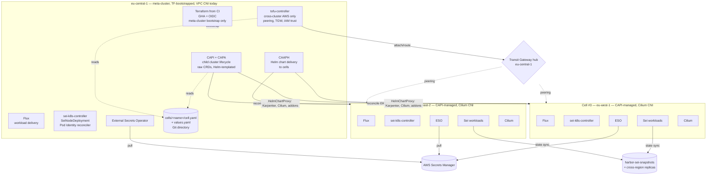
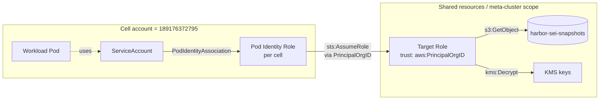
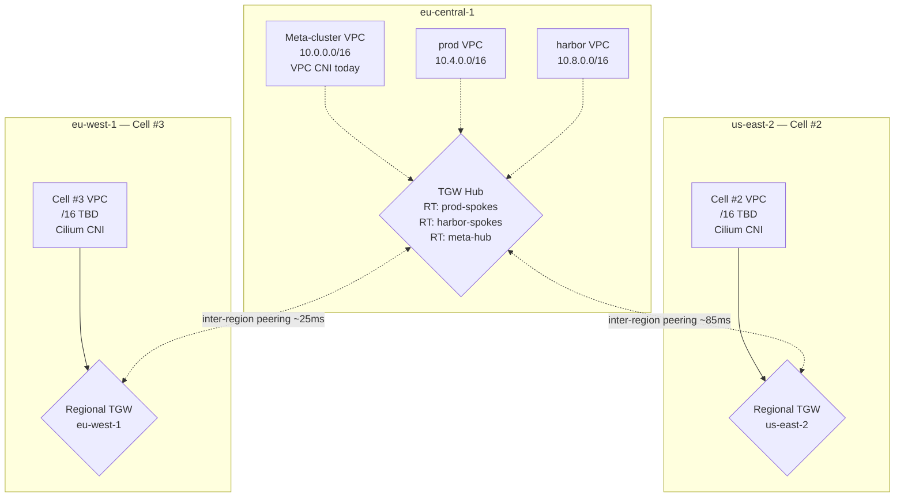

**Date:** 2026-06-03
**Status:** Draft (revision 2 — CAPI replaces Auto Mode after Brandon's course-correct; ClusterClass alpha risk assessed and Path A chosen)
**Issue:** [sei-protocol/Tide#106](https://github.com/sei-protocol/Tide/issues/106)
**Sibling:** [sei-protocol/Tide#108](https://github.com/sei-protocol/Tide/issues/108) (prod CNI migration to Cilium)
**Authors:** bdchatham

---

# Meta-cluster architecture: fleet management for multi-region Sei cells

## Background

Today every Sei cluster — `prod` in eu-central-1 and `harbor` — is a hand-crafted Terraform apply from a single operator's laptop. State lives in the `sei-platform-terraform-state` S3 bucket; lock-file dance plus SSO timeout plus recurring `.terraform/` artifact pollution rejected by `sei-protocol/platform`'s pre-receive hook is the recurring tax. The pattern does not scale past ~2-3 clusters, and the next time we need a cell in `ap-southeast-1` or `us-east-1` for latency reasons, it's a multi-day handcraft job per cluster — multiplied by the toil of wiring peering, IAM, and cross-cluster service discovery by hand.

This design was triggered by a session on 2026-06-03 that originally evaluated `flux-iac/tofu-controller` adoption for the existing `prod` root module. That evaluation [parked tofu-controller for the root](#alternative-1-tofu-controller-on-the-prod-root-module) (circular dependency: TF that creates the EKS cluster can't run inside it). The bigger workstream surfaced naturally — **eu-central-1 as a meta/management cluster that provisions and manages child cells in other regions via GitOps**.

**Concrete v1.5 scope** (named by Brandon on 2026-06-03): the fleet at v1.5 is **3 cells total**:
- The **meta-cluster** in eu-central-1 (already exists, TF-bootstrapped, will host the fleet reconcilers)
- **Cell #2 and Cell #3** — created by the meta-cluster via CAPI

A six-stream parallel research pass and a five-specialist Coral debate (kubernetes, platform, network, product, sei-network) ran ahead of revision 1 of this document. Revision 2 incorporates Brandon's course-correct on the cluster-lifecycle reconciler (CAPI replacing the originally-proposed EKS Auto Mode) and a follow-up deep-research pass on ClusterClass alpha risk that resolved Path A vs Path B for cluster template homogeneity.

## Goals

1. **Programmatic cluster creation** — a new cell stands up via PR-merge of cell registry + cluster manifests, not multi-day handcraft.
2. **Audit and multi-operator** — every TF apply traceable to a PR + GHA run; second platform operator can apply without sharing Brandon's workspace clone.
3. **Cross-region capability for 2 named cells** — cell #2 and cell #3 stood up via CAPI from the meta-cluster.
4. **GitOps symmetry** — workload delivery (Flux) and cluster lifecycle (CAPI) both flow through Git, eliminating today's asymmetry.
5. **Fleet-shaped identity** — shared resources (`harbor-sei-snapshots`, KMS keys, future shared state) accessible from any cell with zero touches to shared IAM when adding cell #N.
6. **Sei-chain-aware cell topology** — validator cells and RPC cells are recognized as distinct archetypes; the design does not paper over their different latency and failure semantics.
7. **Cilium as the target CNI for the fleet** — cell #2/#3 ship on Cilium from day 1; meta-cluster CNI migration tracked separately in [#108](https://github.com/sei-protocol/Tide/issues/108).

## Non-goals

- **EKS Auto Mode adoption.** Considered as the cluster-lifecycle baseline in revision 1; rejected after Brandon's course-correct. Reasons: 21-day forced node rotation incompatible with stateful Sei validator pods, plus AWS-managed CNI conflicts with the Cilium target end-state. See [§9 Alternative 2](#alternative-2-eks-auto-mode--terraform-from-ci-was-the-original-recommendation).
- **Crossplane as cluster provisioner.** Right tool for app-team-facing Compositions (XRDs); wrong tool for "spin up EKS clusters." See [§9 Alternative 5](#alternative-5-crossplane).
- **`ClusterClass` (Path B) at v1.5.** Alpha status still + missing `AWSManagedMachinePoolTemplate` defeats homogeneity goal. Path A (raw CRDs + Helm templating) chosen; migration A→B preserved as clean two-way door. See [§4.5](#45-cluster-template-homogeneity-path-a-raw-crds--helm).
- **EKS Hybrid Nodes** for any current Sei workload.
- **Multi-account expansion.** Today all clusters live in AWS account `189176372795`. Multi-account is a future workstream.
- **Migration of existing `harbor` cluster** into the meta-cluster model. It works today; touch it only if a future phase explicitly requires it.
- **Bare-metal / non-EKS clusters.** EKS-only.
- **Active-active mainnet validators across regions.** Sei consensus (CometBFT-based) is BFT — cross-region validator P2P at 100-250ms RTT is consensus-degrading even with timeout tuning. Multi-region fault tolerance is achieved via tmkms/Horcrux signer failover + sentry geography, not active multi-region validators. See [§4.4](#44-validator-cell-vs-rpc-cell-archetypes).

## Architecture (eventual state)

### 4.1 Component overview

The meta-cluster (eu-central-1) is **TF-bootstrapped, never reconciled by itself**. It hosts five reconcilers, each in its lane:



| Reconciler | Owns | Why this one |
|---|---|---|
| **Terraform from CI** (GHA + OIDC) | Meta-cluster bootstrap ONLY: root VPC, root EKS, meta-state, TGW hub, KMS, S3, IAM. Never reconciles other clusters. | The substrate everything else runs on. Cannot be reconciled from inside itself (circular dep). |
| **CAPI + CAPA** | Child cluster lifecycle: `Cluster` + `AWSManagedControlPlane` + `AWSManagedCluster` + `AWSManagedMachinePool` per cell. Templated via a single **Helm chart** with per-cell values — **NOT** `ClusterClass`. See [§4.5](#45-cluster-template-homogeneity-path-a-raw-crds--helm). | K8s-native declarative cluster lifecycle. The K8s-native CRD pattern aligns with Flux + sei-k8s-controller + tofu-controller — one stack, one mental model. |
| **CAAPH** (Cluster API Addon Provider for Helm) | Per-cell Helm releases: Karpenter, Cilium, kube-proxy-replacement config, ESO bootstrap, sei-k8s-controller install | Canonical CAPI→Helm bootstrap pattern. Watches `Cluster` labels, applies `HelmChartProxy` on each cell as it comes up. |
| **tofu-controller** in meta-cluster | Cross-cluster AWS only: TGW attachments + routes, Pod Identity Associations, IAM trust policy fan-out, shared S3 bucket policies, cross-region KMS replication | The circular-dep that killed tofu-controller for the root module is absent — meta-cluster reconciles **peripheral** AWS, not the cluster it runs in. |
| **Flux** (everywhere) | Workload + manifest delivery. Pull-per-cluster (each cell runs its own Flux against a regional OCI mirror) | Pull model — no privileged hub holds kubeconfigs for the entire fleet. Avoids Adobe Flex's 360-cluster Argo push-model blast-radius. |
| **sei-k8s-controller** (per cell) | `SeiNodeDeployment` reconciliation. Cell-local. **Also hosts** the Pod Identity Association reconciler (~200 LOC Go subpackage) for shared-role bindings | Matches Flux's pull model. Cross-cell peer wiring is explicit opt-in via `SeiExternalPeer` (deferred until needed). |
| **External Secrets Operator** (per cell) | Pulls from AWS Secrets Manager into in-cluster Secrets | Replaces today's TF-side `kubernetes_secret_v1` writes. Removes the kubeconfig-in-CI trap. |

### 4.2 Identity federation



**EKS Pod Identity** (re:Invent 2023) replaces IRSA for shared-resource access. Trust on the target role is keyed on `aws:PrincipalOrgID`, not per-cluster OIDC issuers — adding cell #N requires **zero edits to shared roles**.

Pod Identity is **not** first-class in CAPA today ([PR #5808](https://github.com/kubernetes-sigs/cluster-api-provider-aws/pull/5808) still unmerged). We drive `eks:CreatePodIdentityAssociation` calls via the reconciler subpackage in sei-k8s-controller (~200 LOC Go), watching the cell registry. CAPA only handles cluster lifecycle; identity bindings live one layer up.

Cross-account Pod Identity chaining (June 2025) is the path for any future multi-account expansion; not in scope for v1.5 but the trust model already accommodates it.

### 4.3 Network topology



| Decision | v1.5 commitment | Rationale |
|---|---|---|
| Topology | Hub-and-spoke TGW with eu-central-1 as hub | N-1 peerings (vs. N²/2 for full peering mesh). AWS-blessed default for fleets >2 cells. |
| CIDR budget | `/12` (`10.0.0.0/12` = 16 `/16`s available) sliced into `/16` per cell | Comfortable headroom past today's 4 VPCs (meta + harbor + cell #2 + cell #3) for ~12 future cells without bloating to `/11`. **Non-overlapping CIDR is the one-way door.** Actual `/16` allocations to cell #2 and #3 deferred pending audit of existing meta-cluster + harbor CIDRs (Open Question 8). |
| Pod CIDR | `100.64.0.0/10` per cell via Cilium IPAM on new cells; VPC CNI custom networking on the meta-cluster until [#108](https://github.com/sei-protocol/Tide/issues/108) migration | Cilium `eni` mode for cell #2/#3 (Cilium manages ENIs directly, no VPC CNI). |
| IPv6 | Deferred. Un-defer when a single cell exceeds ~30k IPs in use, or compliance/regulator names it. | EKS IPv6 is dual-stack with VPC CNI prefix delegation tuning and ALB rule complexity. Not earned yet. |
| TGW route tables | Per-class (prod-spokes / harbor-spokes / meta-hub) from cell #3 onward | A misconfigured peering can't accidentally bridge prod ↔ harbor. v1.5 starts with single RT, splits when needed. |
| Service discovery | Route 53 private hosted zone `cells.sei.internal` associated to every spoke VPC | Cheap, AWS-native, no controller. Cilium ClusterMesh deferred — see [#108](https://github.com/sei-protocol/Tide/issues/108) for prod CNI migration which unlocks full-fleet ClusterMesh. |

**CNI heterogeneity window:**

| Cluster | CNI at v1.5 | Eventual state |
|---|---|---|
| Meta-cluster (eu-central-1) | VPC CNI (existing) | Cilium — migration tracked in [#108](https://github.com/sei-protocol/Tide/issues/108) |
| Cell #2 | Cilium from day 1 | Cilium (unchanged) |
| Cell #3 | Cilium from day 1 | Cilium (unchanged) |

The window is bounded by the un-defer trigger in #108: cell #2 successfully runs on Cilium for ≥2 weeks without CNI-related incidents → schedule prod migration.

### 4.4 Validator cell vs RPC cell archetypes

| Aspect | Validator cell | RPC cell |
|---|---|---|
| Replica topology | 1 validator + ≥2 sentries co-located, ≥2 AZs in one region | Regional, full-node pool behind regional Waterway, ≥2 AZs |
| Cross-region tolerance | None for consensus P2P. Cross-region kills block production. | Acceptable. Cross-region pulls are latency-bounded by user SLO, not consensus. |
| Validator key custody | tmkms / Horcrux signer (out of scope here) | N/A |
| External P2P exposure | NLB per sentry, `external-address` set, public; `addr_book_strict=false` | N/A |
| `harbor-sei-snapshots` access | One-time on cold start. Acceptable to pull cross-region. | Per-replica on join. If cell #2 takes >30min to cold-start cross-region, replicate the *pruned* prefix per-region. |
| Multi-region HA strategy | tmkms/Horcrux failover (active-passive across regions) | Active-active across regions (DNS latency-based routing) |

This distinction is load-bearing — it justifies why "the cell" is not a uniform unit. Cell #2 and Cell #3's archetypes are an open question (see [§10 Open question 7](#open-questions)) but the design accommodates both shapes.

### 4.5 Cluster template homogeneity (Path A: raw CRDs + Helm)

**Decision**: each cell renders **raw CAPI CRDs** via a Helm chart with shared base values — **NOT** `ClusterClass`. Grounded in deep research (PR review history captures the kubernetes-specialist's research summary; references in §11):

- `ClusterClass` + managed topology is still **alpha-gated** behind the `ClusterTopology` feature flag in CAPI v1.13 (May 2026) — five years post-introduction. [Issue #12547](https://github.com/kubernetes-sigs/cluster-api/issues/12547) ("When will ClusterClass be GA?") was closed Sept 2025 with no committed timeline.
- CAPA's `AWSManagedControlPlaneTemplate` only landed in [PR #5375](https://github.com/kubernetes-sigs/cluster-api-provider-aws/pull/5375) (Aug 2025). `AWSManagedMachinePoolTemplate` for EKS managed node groups **does not exist yet** ([CAPA #3166](https://github.com/kubernetes-sigs/cluster-api-provider-aws/issues/3166)). Adopting ClusterClass today means worker nodes outside the class — mixed-mode that defeats the homogeneity goal.
- CAPI ships breaking changes to ClusterClass-adjacent v1beta2 fields **every minor release** (v1.11: 88 breaking changes, several ClusterClass-shaped; v1.12: ClusterClass-specific behavior fixes; v1.13: ~1/3 of 10 breaking changes are ClusterClass-related).
- The most public production CAPI-on-AWS reference, [Giant Swarm's `cluster-aws` Helm chart](https://github.com/giantswarm/cluster-aws), uses raw CRDs templated by Helm — explicitly NOT ClusterClass.

**Path A implementation shape:**

```
meta-cluster/charts/sei-cell/
  Chart.yaml
  values.yaml                  # defaults: addon versions, instance types, etc.
  templates/
    cluster.yaml               # Cluster
    awsmanagedcluster.yaml     # AWSManagedCluster (networking)
    awsmanagedcontrolplane.yaml # AWSManagedControlPlane (EKS, addons: kube-proxy/CoreDNS; NO VPC CNI)
    awsmanagedmachinepool.yaml # AWSManagedMachinePool (bootstrap pool; Karpenter handles the rest)
    helmchartproxy-karpenter.yaml  # CAAPH-driven addons:
    helmchartproxy-cilium.yaml
    helmchartproxy-eso.yaml
    helmchartproxy-sei-k8s-controller.yaml

cells/cell-2/values.yaml       # per-cell overrides (region, CIDR, instance types, etc.)
cells/cell-3/values.yaml
```

Homogeneity comes from the shared chart + identical addon set delivered via CAAPH. Discipline (one chart, no per-cell template forks) enforces it; the CRD shape doesn't.

**Path A → Path B migration is a clean two-way door** (per kubernetes-specialist research): create a `ClusterClass`, point `Cluster.spec.topology.classRef` at it; the topology controller reconciles existing child objects into managed ones. No EKS control plane recreation. **Un-defer trigger** to migrate:
- CAPI marks `ClusterTopology` as default-on in `clusterctl init`, **AND**
- CAPA ships `AWSManagedMachinePoolTemplate` (issue #3166 closed with a working template)

Watch CAPI v1.14/v1.15 release notes and CAPA #3166's follow-up. Until both land, stay on Path A.

### 4.6 New-cell flow

1. PR adds `cells/<name>/cell.yaml` (registry entry: region, CIDR, archetype, status) and `cells/<name>/values.yaml` (sei-cell Helm chart overrides).
2. Flux on the meta-cluster reconciles the rendered manifests:
    - **CAPI's reconciler** creates the EKS control plane (`AWSManagedControlPlane`) and bootstrap node group (`AWSManagedMachinePool`).
    - **CAAPH** applies `HelmChartProxy` resources targeting the new cell's labels → installs Karpenter, Cilium, ESO, sei-k8s-controller on the cell as it becomes Ready.
3. **tofu-controller in meta-cluster** reconciles `cross-cluster/`:
    - TGW attachment + routes
    - Pod Identity associations on the meta-cluster account
    - IAM trust updates on shared roles (if a new role is needed)
    - S3 / KMS policy edits
4. **GHA `cell-bootstrap` job** picks up the CAPI-emitted kubeconfig (a Secret in the meta-cluster), runs `flux bootstrap` against the new cell, points it at the cell-specific Flux directory in Git.
5. Flux on the new cell hydrates: addons not handled by CAAPH, workloads.
6. Smoke test job validates: Cilium pods Ready, Pod Identity works (target-role assumption against `harbor-sei-snapshots`), TGW reachability to meta-cluster, snapshot bucket access.

The bootstrap "controller" is **a CI step + CAAPH**, not a custom Go controller, at v1.5. Defer any "auto-onboarding controller" until N≥3 cells AND a real ergonomic ask.

## Phased rollout

### v1 — ship today (`.gitignore` + GHA+OIDC + ESO migration + cheap one-way doors)

**Implementation work** (~1-2 weeks):

1. **Root `.gitignore`** in `sei-protocol/platform` for `**/.terraform/`, `**/tfplan`, `**/*.tfplan`, `**/crash.log`. Sibling PR, ship today.
2. **`kubernetes_*` provider audit** on current prod TF state. Identify every `kubernetes_secret_v1`, `kubernetes_*`, `kubectl_*` resource. Block #4 until this audit is done.
3. **External Secrets Operator** installed in `prod` (already a Flux HelmRelease). Migrate every TF-written K8s Secret to an `ExternalSecret` resource pulling from AWS Secrets Manager.
4. **GitHub Actions + OIDC** workflow for `terraform plan` on PR, `terraform apply` on merge to `main`, targeting the existing `terraform/aws/189176372795/eu-central-1/prod/` root unchanged. Manual environment approval gate.
5. **Break-glass laptop apply** preserved as a documented manual-dispatch GHA workflow that warns if state is locked.

**Cheap one-way doors picked now** (foundation, no implementation cost):

6. **`topology.region` label** added to `SeiNodeDeployment` schema. Get the field in before there are consumers. (sei-network-specialist's call.)
7. **Default-to-Pod-Identity for net-new IAM bindings.** Don't migrate existing IRSA bindings; future new ones are Pod Identity. Pattern starts here.
8. **CIDR scheme committed in design** (`/12` budget at `10.0.0.0/12`, `/16` per cell, `100.64.0.0/10` pod CIDRs via Cilium IPAM). No `/16` allocations to cells #2 / #3 until the existing meta-cluster + harbor CIDRs are audited (Open Question 8); the scheme is documented so the first allocation doesn't lock in something different.

### v1.5 — meta-cluster + cells #2 and #3 (real workstream, already triggered)

Brandon named 3 cells (meta + 2 created by automation) on 2026-06-03. The "no second cell" smell test (product-engineer's strongest argument in revision 1) is **resolved**. v1.5 implementation:

- **TF state split**: `global/`, `meta/eu-central-1/`, `cells/<region>/<name>/`, `cross-cluster/`. Per-state DynamoDB lock + KMS object key.
- **Meta-cluster's own TF state stays in CI** — never reconciled from inside itself.
- **CAPI + CAPA installed in meta-cluster** via `clusterctl init`, then a Flux HelmRelease for ongoing upgrade discipline. **Pin to a specific CAPI version**, never `*.x`. Treat CAPI upgrades as platform changes with their own PR + review (see [Blocker 1](#blocker-1-capi-operational-tax-for-a-2-person-platform-team)).
- **CAAPH installed** for addon delivery.
- **`sei-cell` Helm chart** (`meta-cluster/charts/sei-cell/`) with `values.yaml` for cell #2 and cell #3.
- **tofu-controller** installed in meta-cluster. Manages `cross-cluster/` state only. `approvePlan: ""` (manual) for tier-0 (IAM trust, peering); `auto` only for idempotent fan-out (Pod Identity associations driven by cell registry).
- **Pod Identity Association reconciler** as a subpackage of `sei-k8s-controller` (~200 LOC).
- **TGW hub** stood up in eu-central-1.
- **Route 53 PHZ `cells.sei.internal`** created and associated to meta-cluster VPC.
- **Cell #2 (us-east-2) and Cell #3 (eu-west-1)** stood up via CAPI from the sei-cell Helm chart. **Cilium from day 1** on both. Archetype + chain assignment TBD (see [Open Question 4](#open-questions)).

### v2 — fleet operations as cells stabilize

- **Per-class TGW route tables** (prod-spokes / harbor-spokes / meta-hub) — promoted from v3 given 3 cells from the start.
- **S3 Cross-Region Replication** on `harbor-sei-snapshots` (pruned prefix only; archive on-demand cross-region with retry).
- **`SeiExternalPeer` CR** in sei-k8s-controller for explicit cross-cell peer wiring (if needed).
- **Prod CNI migration** to Cilium per [#108](https://github.com/sei-protocol/Tide/issues/108). Un-defer trigger: cell #2 runs on Cilium ≥2 weeks without CNI-related incidents.
- **Cilium ClusterMesh** enrollment after prod migrates (full-fleet) or between cell #2/#3 only (partial) — depends on whether ClusterMesh is needed before prod migrates.

### v3 — auto-onboarding (defer indefinitely)

- `Cell` CRD with a reconciler that watches `Cell` rows and drives the new-cell flow end-to-end.
- Un-defer trigger: ≥3 cells AND human onboarding flow becomes a measurable cost.

### Future un-defer signals

- **ClusterClass un-defer** (Path A → Path B): CAPI `ClusterTopology` default-on in `clusterctl init` AND CAPA ships `AWSManagedMachinePoolTemplate`. See [§4.5](#45-cluster-template-homogeneity-path-a-raw-crds--helm).
- **CAPI minor-upgrade blockage** — if a CAPI minor blocks v1.5 fleet for >1 day, invest in a CAPI-upgrade runbook + canary class rollout pattern. See [Blocker 1](#blocker-1-capi-operational-tax-for-a-2-person-platform-team).
- **Pod Identity Associations exceed ~30** → migrate from custom reconciler to tofu-controller TF graph.
- **First cross-cell NetworkPolicy ask** → Cilium ClusterMesh enrollment (cell #2 + #3 first if prod hasn't migrated yet; full-fleet once #108 closes).
- **Mainnet incident** where eu-central-1 region failure takes a validator offline → revisit sentry geography + tmkms/Horcrux (NOT active multi-region validators).
- **p99 RPC latency from APAC clients exceeds SLO** → stand up RPC cell in APAC (RPC cell archetype only, no validators).

## One-way doors picked early

Decisions that are cheap to commit at v1 / v1.5 but expensive to retroactively change:

1. **Non-overlapping CIDR scheme** (`/14` budget per fleet, `/16` per cell, `100.64.0.0/10` pod CIDRs).
2. **`topology.region` label on `SeiNodeDeployment`.** Schema one-way door; cheap to add, costly later.
3. **`pods.eks.amazonaws.com` (Pod Identity) as default for new IAM bindings.** No migration of existing IRSA; new ones are Pod Identity.
4. **AWS account `189176372795` stays single-account through v2.** Multi-account is its own design pass.
5. **CAPI + CAPA as cluster-lifecycle reconciler.** Documented so future "let's use Crossplane" or "let's use Auto Mode" proposals re-litigate against this design's evidence.
6. **Cilium as the target CNI for the entire fleet.** Cell #2/#3 from day 1; meta-cluster migration via [#108](https://github.com/sei-protocol/Tide/issues/108).
7. **Path A (raw CAPI CRDs + Helm templating).** Two-way door to Path B preserved; un-defer trigger named.

## Honest blockers

### Blocker 1: CAPI operational tax for a 2-person platform team

**Source: deep research on CAPI release cadence + Giant Swarm's public framing.** CAPI ships breaking changes to v1beta2 fields every minor release (~4 month cadence). Conversion webhooks bridge versions but have documented edge cases ([CAPI #12605](https://github.com/kubernetes-sigs/cluster-api/issues/12605)). At our scale (3 cells, 2-person team), expect **~1 day/month of CAPI maintenance** (CRD upgrades, machine-controller edge cases, conversion bumps). Giant Swarm at MSP scale described it as "a thousand small features" of sustained work; for us at 3 cells the tax is real but bounded.

**Resolution path:**
- Pin CAPI version via Flux HelmRelease, never `*.x`
- Treat CAPI minor upgrades as platform changes with their own PR + review
- Build a canary class pattern (rebase one Cluster at a time onto a new chart version) to limit upgrade blast radius
- If monthly tax exceeds 2 days, surface as a signal to revisit (switch to TF-per-cell with manual cluster-lifecycle ops, or wait for ClusterClass + AWSManagedMachinePoolTemplate to graduate)

### Blocker 2: `kubernetes_secret_v1` migration prerequisite

**Source: platform-engineer.** Today's prod TF writes K8s Secrets directly (e.g., `kubernetes_secret_v1.grafana_rds_credentials`). The GHA+OIDC apply path would require kubeconfig-in-CI — the exact failure mode the migration is supposed to escape.

**Resolution path**: audit all `kubernetes_*` and `kubectl_*` resources in prod TF before the GHA workflow lands. For each, define the ESO + `ExternalSecret` replacement. Block v1 step 4 (GHA+OIDC) on completion of this audit and migration. The audit lives in the same PR series as v1.

### Blocker 3: ClusterClass alpha + missing EKS managed-machinepool template (resolved as Path A)

**Source: kubernetes-specialist deep research.** ClusterClass remains alpha 5 years post-introduction; CAPA's `AWSManagedMachinePoolTemplate` doesn't exist; adopting now means mixed-mode (worker nodes outside the class) which defeats homogeneity.

**Resolution**: Path A chosen (raw CAPI CRDs + Helm templating). Migration A→B is a clean two-way door at the architectural level. Un-defer trigger named in [§4.5](#45-cluster-template-homogeneity-path-a-raw-crds--helm).

## Trade-offs

| Trade-off | What we accept | What we give up |
|---|---|---|
| **CAPI operational tax** | ~1 day/month CRD upgrades, edge cases, conversion bumps | TF-per-cluster simplicity. The K8s-native declarative payoff at fleet scale earns the tax once N≥3. |
| **Raw CRDs + Helm (Path A) over ClusterClass (Path B)** | One Helm chart of CAPI CRDs per cell; homogeneity-by-discipline rather than primitive-enforced | ClusterClass's tighter single-source-of-truth. Acceptable until alpha graduates + EKS managed-machinepool template lands. |
| **CNI heterogeneity window** until prod migrates | Bounded debugging asymmetry (VPC CNI in prod, Cilium in cells). Tracked in [#108](https://github.com/sei-protocol/Tide/issues/108). | Single-CNI fleet from day 1. Worth the bounded cost given prod is a destructive cutover that earns experience-on-greenfield-first. |
| **We run Karpenter, Cilium, addons ourselves** (post-Auto-Mode-rejection) | Operational ownership of node lifecycle, CNI, kube-proxy-replacement | AWS managing this for a 12% surcharge. Karpenter we already operate today; Cilium adoption is the same shape; net-neutral on ops once Cilium experience exists. |
| **CIDR commitment ahead of need** | `/12` budget reserved (16 `/16`s) | IP budget is cheap; cost of NOT committing is a Private-NAT migration per future cell. |
| **`topology.region` schema label committed at v1** | One-way door on `SeiNodeDeployment` CRD field name | Future option to call it something else. Mitigated by being a label (additive). |
| **Pod Identity ecosystem maturity** | Pod Identity is 2023+, cross-account chaining 2025+. SDK support uneven. | Some libraries still IRSA-only. Fall through to IRSA where SDK support is missing; document exceptions. |
| **No active multi-region mainnet validators** | tmkms/Horcrux failover only for multi-region HA | Active-active across regions. Not a real option for CometBFT-style BFT consensus regardless of K8s shape. |

## Alternatives considered

### Alternative 1: tofu-controller on the prod root module

**Originally proposed** in the 2026-06-03 session. **Rejected for the root module specifically** because the TF that creates the EKS cluster cannot run inside it — circular dependency on first failure.

**Survives in v1.5+ for `cross-cluster/` state only** — that's where tofu-controller's GitOps reconcile loop earns its keep without the circular-dep risk.

### Alternative 2: EKS Auto Mode + Terraform-from-CI (was revision 1's recommendation)

**Rejected** after Brandon's course-correct on 2026-06-03.

The original research-driven recommendation favored EKS Auto Mode + Terraform-from-CI on the basis that for ≤10 EKS clusters with a 2-5 person team, CAPI's operational tax is heavier than Auto Mode's 12% surcharge. That argument is still defensible on cost grounds alone. The reasons it was rejected:

1. **21-day forced node rotation** of Bottlerocket nodes is incompatible with Sei validator pods that hold long-lived PVC + statesync state. Mixed-mode cells (managed node groups for validators, Auto Mode for RPC) collapse the homogeneity benefit.
2. **AWS-managed CNI is fundamentally incompatible with Cilium target end-state.** Adopting Auto Mode locks us out of Cilium ClusterMesh without a destructive migration. Once Brandon named Cilium as the fleet CNI, Auto Mode CNI's managed-by-AWS lifecycle stopped composing.
3. **Operator preference for declarative cluster lifecycle as a CRD pattern.** Brandon's framing: CAPI is the right abstraction layer for "K8s manages K8s." The K8s-native pattern matches operator intuition and earns the CAPI tax at fleet scale.

The architectural shape stays close to what Auto Mode would have given us — TF bootstraps the root cluster, declarative reconciliation handles the rest. The reconciler swaps: CAPI takes the cluster-lifecycle slot; Karpenter (self-managed, as today) takes the node-lifecycle slot Auto Mode would have owned.

### Alternative 3: Cluster API / CAPA — adopted

This was the **rejected** alternative in revision 1. Promoted to chosen path after Brandon's course-correct.

The research arguments against CAPI (still valid, just outweighed):
- ClusterClass still alpha at CAPI v1.13. **Mitigated by Path A (§4.5).**
- CAPA Pod Identity is unmerged PR #5808. **Mitigated by the Pod Identity reconciler in sei-k8s-controller (§4.2).**
- EKS Auto Mode not first-class in CAPA. **Moot — we're not using Auto Mode.**
- Real upgrade-blocking bugs (#12605 v1beta1→v1beta2 conversion). **Mitigated by pinning CAPI version + canary chart rollout discipline.**
- Giant Swarm: "a thousand small features." **At our scale, the budget is ~1 day/month, not multi-team-years.**
- SuperOrbital: management cluster is tier-0. **Accepted; the meta-cluster IS tier-0 by definition.**

The strongest argument FOR CAPI at our scale (3 cells, two created by automation): the alternative (TF-per-cluster) means **3 TF roots, 3 state files, 3 PR-and-CI loops per cluster change**. CAPI collapses that into one set of CRDs in the meta-cluster, reconciled continuously. The K8s-native pattern also aligns with the rest of the stack (Flux, sei-k8s-controller, tofu-controller).

### Alternative 4: Defer the entire meta-cluster (product-engineer's position in revision 1)

The strongest scope-cut in revision 1: "the design solves a problem Brandon doesn't have yet."

**This argument is now resolved** by Brandon's 2026-06-03 confirmation of 3 cells (meta + 2 created by automation). The product-engineer's smell test ("nobody has named a second cell") fails — cells #2 and #3 ARE named workstream. v1.5 is real, not hypothetical.

What survives from the position: **v1 implementation is still tight** (`.gitignore` + GHA+OIDC + ESO migration + cheap one-way doors). v1.5 only starts when v1 lands and prerequisites resolve. The discipline of YAGNI shapes phase boundaries, not feature absence.

### Alternative 5: Crossplane

**Considered and deferred.** [Crossplane graduated from CNCF on 2025-10-28](https://www.cncf.io/announcements/2025/11/06/cloud-native-computing-foundation-announces-graduation-of-crossplane/), so the maturity question is settled. The right use case is **app-team-facing Compositions** (XRDs bundling EKS + RDS + S3 + IAM as one `Environment` CR) — not cluster provisioning. Notable: [`awslabs/crossplane-on-eks` archived 2026-02-25](https://github.com/awslabs/crossplane-on-eks); AWS is pivoting reference patterns to kro + ACK + Argo CD for fleet shapes.

Reconsider Crossplane when (a) we have app teams self-serving infrastructure, or (b) the IDP-style platform XRD product becomes a stated goal. Neither is true today.

### Alternative 6: EKS Auto Mode + just Terraform, no meta-cluster

The honest fallback. If CAPI's operational tax exceeds budget at v1.5, the de-risk is: drop CAPI, drop CAAPH, run N independent TF roots each provisioning one cluster, deliver workloads via per-cluster Flux. We'd lose the K8s-native reconciliation pattern but keep the TF state split and GHA+OIDC audit. Documented as the un-defer fallback if [Blocker 1](#blocker-1-capi-operational-tax-for-a-2-person-platform-team) fires.

## Open questions

1. **Auto Mode 21-day rotation graceful handling for validators** — was a blocker in revision 1; **resolved by not using Auto Mode**. No further action.
2. **Which `kubernetes_*` resources are in current prod TF** — platform-engineer. Resolution: audit during v1 step 2.
3. **CAPI version pin policy** — follow CAPI minor releases on a 1-month-behind cadence, or pin to a stable line and upgrade every 3-6 months? Owner: platform-engineer. Resolution: before first CAPI minor bump after v1.5.
4. **Cell #2 and #3 archetypes and chains hosted**. Regions resolved: **cell #2 in us-east-2, cell #3 in eu-west-1**. Archetype (validator / RPC / mixed) and chain assignment (mainnet `pacific-1`, testnets, eng/ephemeral) still TBD. Latency context for the choice: eu-west-1 ↔ eu-central-1 is ~25-30ms RTT (intra-Europe, viable for either archetype with caveats); us-east-2 ↔ eu-central-1 is ~85-95ms RTT (transatlantic, structurally better for RPC archetypes — running validator P2P at ~85ms RTT would degrade block production per the sei-network-specialist finding in §4.4). Owner: product/operations decision. Resolution: before v1.5 implementation starts.
5. **TF state per-cell vs per-region naming** under `cells/` — `cells/<region>/<name>/` or `cells/<name>/`. Platform-engineer prefers the former for blast-radius scoping. Resolution: at v1.5 start.
6. **Snapshot replication policy** — pruned vs. archive prefix split, replication lifecycle, retention. sei-network-specialist owns. Resolution at v2 when cell #2 lands.
7. **CAPI upgrade canary mechanism** — do we render the sei-cell Helm chart with a `clusterVersion: vN` parameter and roll cells one at a time onto vN+1, or do we maintain two chart versions in Git? Resolution: at first CAPI minor upgrade post-v1.5.
8. **Current meta-cluster and harbor VPC CIDR audit**. The `/12` budget at `10.0.0.0/12` is a documented scheme, but actual `/16` allocations to cells #2 (us-east-2) and #3 (eu-west-1) must deconflict with the existing eu-central-1 meta-cluster VPC and harbor VPC CIDRs. If existing CIDRs fall outside `10.0.0.0/12`, document the exception and continue (the scheme governs new allocations; existing VPCs are grandfathered). Owner: platform-engineer. Resolution: before v1.5 cell creation begins.

## References

### Research sources (six parallel streams, 2026-06-03 session)

**Cluster API / CAPA:**
- [CAPI releases](https://github.com/kubernetes-sigs/cluster-api/releases) — v1.13.2 (May 2026)
- [CAPA releases](https://github.com/kubernetes-sigs/cluster-api-provider-aws/releases) — v2.11.1 (Apr 2025)
- [CAPA EKS docs](https://cluster-api-aws.sigs.k8s.io/topics/eks/creating-a-cluster)
- [CAPI experimental-features doc (ClusterClass still alpha)](https://cluster-api.sigs.k8s.io/tasks/experimental-features/experimental-features)
- [CAPI ClusterClass doc](https://cluster-api.sigs.k8s.io/tasks/experimental-features/cluster-class/)
- [CAPI #12547 — When will ClusterClass be GA?](https://github.com/kubernetes-sigs/cluster-api/issues/12547) (closed Sept 2025, no timeline)
- [CAPI v1.11 release notes (88 breaking changes)](https://github.com/kubernetes-sigs/cluster-api/releases/tag/v1.11.0)
- [CAPI v1.12 release notes](https://github.com/kubernetes-sigs/cluster-api/releases/tag/v1.12.0)
- [CAPI v1.13 release notes](https://github.com/kubernetes-sigs/cluster-api/releases/tag/v1.13.0)
- [CAPA PR #5375 — AWSManagedControlPlaneTemplate landed Aug 2025](https://github.com/kubernetes-sigs/cluster-api-provider-aws/pull/5375)
- [CAPA #3166 — managed machinepool template gap](https://github.com/kubernetes-sigs/cluster-api-provider-aws/issues/3166)
- [Giant Swarm cluster-aws Helm chart — Path A production reference](https://github.com/giantswarm/cluster-aws)
- [Changing a ClusterClass docs (migration semantics)](https://cluster-api.sigs.k8s.io/tasks/experimental-features/cluster-class/change-clusterclass)
- [Giant Swarm: live-migrating hundreds of clusters](https://www.giantswarm.io/blog/live-migrating-hundreds-of-kubernetes-clusters-to-cluster-api)
- [SuperOrbital CAPA case study](https://superorbital.io/blog/cluster-api-part-2-capa-bootstrap/)
- [CAPI Pod Identity PR #5808](https://github.com/kubernetes-sigs/cluster-api-provider-aws/pull/5808)
- [CAAPH (cluster-api-addon-provider-helm)](https://github.com/kubernetes-sigs/cluster-api-addon-provider-helm)

**EKS Auto Mode (rejected alternative, references retained for traceability):**
- [EKS Auto Mode docs](https://docs.aws.amazon.com/eks/latest/userguide/automode.html)
- [EKS pricing](https://aws.amazon.com/eks/pricing/)
- [Disable Auto Mode](https://docs.aws.amazon.com/eks/latest/userguide/auto-disable.html)
- [Auto Mode migration from Karpenter](https://docs.aws.amazon.com/eks/latest/userguide/auto-migrate-karpenter.html)

**Crossplane (deferred alternative):**
- [CNCF graduation announcement](https://www.cncf.io/announcements/2025/11/06/cloud-native-computing-foundation-announces-graduation-of-crossplane/)
- [awslabs/crossplane-on-eks (archived Feb 2026)](https://github.com/awslabs/crossplane-on-eks)

**Cross-cluster networking:**
- [AWS VPC peering vs TGW (CloudZero)](https://www.cloudzero.com/blog/aws-vpc-peering-vs-transit-gateway/)
- [TGW design best practices](https://docs.aws.amazon.com/vpc/latest/tgw/tgw-best-design-practices.html)
- [TGW pricing](https://aws.amazon.com/transit-gateway/pricing/)
- [TGW quotas](https://docs.aws.amazon.com/vpc/latest/tgw/transit-gateway-quotas.html)
- [Building a global network using AWS TGW inter-region peering](https://aws.amazon.com/blogs/networking-and-content-delivery/building-a-global-network-using-aws-transit-gateway-inter-region-peering/)
- [Cilium ClusterMesh docs](https://docs.cilium.io/en/stable/network/clustermesh/clustermesh/)
- [EKS subnet best practices](https://docs.aws.amazon.com/eks/latest/best-practices/subnets.html)
- [EKS custom networking](https://docs.aws.amazon.com/eks/latest/best-practices/custom-networking.html)
- [Datadog: Cilium operations at scale](https://www.datadoghq.com/blog/cilium-operations-at-scale/)
- [CometBFT consensus tuning](https://www.chainscorelabs.com/en/guides/guides-test-2026/consensus-mechanism-tuning/how-to-tune-consensus-for-network-latency-tolerance)

**Multi-cluster GitOps:**
- [Flux v2.8 announcement](https://fluxcd.io/blog/2026/02/flux-v2.8.0/)
- [FluxCD multi-cluster architecture (Stefan Prodan)](https://medium.com/@stefanprodan/fluxcd-multi-cluster-architecture-e426fb2bca0f)
- [Argo CD cluster generator](https://argo-cd.readthedocs.io/en/stable/operator-manual/applicationset/Generators-Cluster/)
- [Adobe Flex cell-based architecture (CNCF)](https://architecture.cncf.io/architectures/adobe/)
- [Cluster API Addon Provider Helm](https://github.com/kubernetes-sigs/cluster-api-addon-provider-helm)

**Cross-cluster identity federation:**
- [AWS IRSA documentation](https://docs.aws.amazon.com/eks/latest/userguide/iam-roles-for-service-accounts.html)
- [EKS Pod Identity documentation](https://docs.aws.amazon.com/eks/latest/userguide/pod-identities.html)
- [Pod Identity launch blog (re:Invent 2023)](https://aws.amazon.com/blogs/containers/amazon-eks-pod-identity-a-new-way-for-applications-on-eks-to-obtain-iam-credentials/)
- [Pod Identity cross-account chaining (June 2025)](https://aws.amazon.com/blogs/containers/amazon-eks-pod-identity-streamlines-cross-account-access/)
- [EKS multi-account best practices](https://docs.aws.amazon.com/eks/latest/best-practices/multi-account-strategy.html)

### Session context

- [Issue sei-protocol/Tide#106](https://github.com/sei-protocol/Tide/issues/106) — originating issue
- [Issue sei-protocol/Tide#108](https://github.com/sei-protocol/Tide/issues/108) — prod CNI migration to Cilium (un-defer trigger: cell #2 stable on Cilium ≥2 weeks)
- 2026-06-03 session — six-stream research pass + five-specialist Coral debate (revision 1) + ClusterClass deep-research follow-up + Brandon's course-correct to CAPI

### Sei-platform context

- `sei-protocol/platform`, `terraform/aws/189176372795/eu-central-1/prod/` — current root TF state
- `clusters/harbor/` in `sei-protocol/platform` — existing precedent for "another cluster"
- `sei-platform-terraform-state` S3 bucket — current TF state backend
- `harbor-sei-snapshots` S3 bucket (eu-central-1) — shared snapshot store, every cell needs read access
