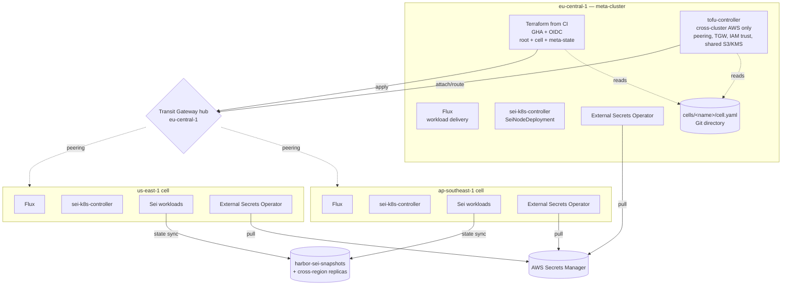
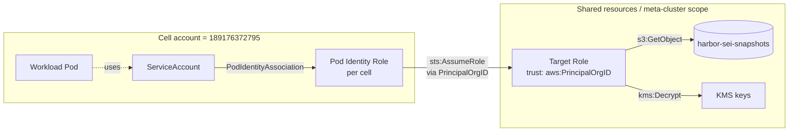
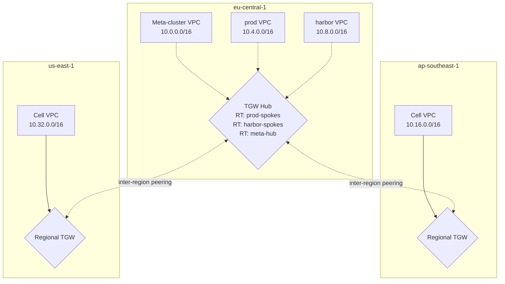

**Date:** 2026-06-03
**Status:** Draft
**Issue:** [sei-protocol/Tide#106](https://github.com/sei-protocol/Tide/issues/106)
**Authors:** bdchatham

---

# Meta-cluster architecture: fleet management for multi-region Sei cells

## Background

Today every Sei cluster — `prod` in eu-central-1 and `harbor` — is a hand-crafted Terraform apply from a single operator's laptop. State lives in the `sei-platform-terraform-state` S3 bucket; lock-file dance plus SSO timeout plus recurring `.terraform/` artifact pollution rejected by `sei-protocol/platform`'s pre-receive hook is the recurring tax. The pattern does not scale past ~2-3 clusters, and the next time we need a cell in `ap-southeast-1` or `us-east-1` for latency reasons, it's a multi-day handcraft job per cluster — multiplied by the toil of wiring peering, IAM, and cross-cluster service discovery by hand.

This design was triggered by a session on 2026-06-03 that originally evaluated `flux-iac/tofu-controller` adoption for the existing `prod` root module. That evaluation [parked tofu-controller for the root](#alternative-1-tofu-controller-on-the-prod-root-module) (circular dependency: TF that creates the EKS cluster can't run inside it). The bigger workstream surfaced naturally — **eu-central-1 as a meta/management cluster that provisions and manages child cells in other regions via GitOps**. That's the design captured here.

A six-stream parallel research pass and a five-specialist debate (kubernetes, platform, network, product, sei-network) ran ahead of this document. The architecture below incorporates both. The specialist debate disagreed sharply on **v1 scope** — surfaced in [§9 Alternatives](#alternative-3-defer-the-entire-meta-cluster-product-engineers-position) and reconciled in [§5 Phased rollout](#5-phased-rollout).

## Goals

1. **Programmatic cluster creation** — a new cell stands up via PR-merge, not multi-day handcraft.
2. **Audit and multi-operator** — every TF apply traceable to a PR + GHA run; second platform operator can apply without sharing Brandon's workspace clone.
3. **Cross-region capability when un-defer triggers fire** — first non-EU cell, second platform engineer, or harbor TF maintenance burden.
4. **GitOps symmetry** — workload delivery (Flux today) and cluster lifecycle both flow through Git, eliminating today's asymmetry.
5. **Fleet-shaped identity** — shared resources (`harbor-sei-snapshots`, KMS keys, future shared state) accessible from any cell with zero touches to shared IAM when adding cell #N.
6. **Sei-chain-aware cell topology** — validator cells and RPC cells are recognized as distinct archetypes; the design does not paper over their different latency and failure semantics.

## Non-goals

- **CAPI for cluster lifecycle.** Research consensus across three independent streams (Auto Mode, CAPI, Crossplane) lands at "CAPI is the wrong tool for ≤10 EKS clusters with a 2-5 person team." Captured in [§9](#alternative-2-cluster-api--capa).
- **Crossplane as cluster provisioner.** Right tool for app-team-facing Compositions (XRDs); wrong tool for "spin up 10 EKS clusters." See [§9](#alternative-4-crossplane).
- **EKS Hybrid Nodes** for any current Sei workload.
- **Multi-account expansion.** Today all clusters live in AWS account `189176372795`. Multi-account is a future workstream.
- **Migration of existing `harbor` cluster** into the meta-cluster model. It works today; touch it only if a future phase explicitly requires it.
- **Bare-metal / non-EKS clusters.** EKS-only.
- **Active-active mainnet validators across regions.** Sei consensus (CometBFT-based) is BFT — cross-region validator P2P at 100-250ms RTT is consensus-degrading even with timeout tuning. Multi-region fault tolerance is achieved via tmkms/Horcrux signer failover + sentry geography, not active multi-region validators. See [§4.4](#44-validator-cell-vs-rpc-cell-archetypes).

## Architecture (eventual state)

### 4.1 Component overview

The fleet has one **meta-cluster** in eu-central-1 and N **child cells** in other regions. The meta-cluster runs four reconcilers in their lane:

| Reconciler | Owns | Why this one and not another |
|---|---|---|
| **Terraform from CI** (GHA + OIDC) | All cluster lifecycle: meta-cluster bootstrap, every cell's VPC + EKS + Auto Mode + node-local IAM + OIDC provider | Terraform AWS provider v5.79+ is the only mature declarative path for EKS Auto Mode. CAPA does not expose `computeConfig`. Crossplane support is thin. Auto Mode subsumes the bulk of CAPI's value (Karpenter + addons + CNI + kube-proxy + CoreDNS + EBS CSI + ALB) at our scale. |
| **tofu-controller** in meta-cluster | Cross-cluster AWS only: TGW attachments + routes, Pod Identity Associations, IAM trust policy fan-out, shared S3 bucket policies, cross-region KMS replication | The circular-dep that killed tofu-controller for the root module is gone here — meta-cluster reconciles **peripheral** AWS, not the cluster it runs in. State graph: `cross-cluster/`. |
| **Flux** (everywhere) | Workload + manifest delivery. Pull-per-cluster (each cell runs its own Flux against a regional OCI mirror) | Pull model — no privileged hub holds kubeconfigs for the entire fleet. Adobe Flex's 360-cluster Argo deployment hit "degraded latency on the K8s API server, high etcd churn" and moved to cell-of-Argos. We avoid that failure mode by default. |
| **sei-k8s-controller** (per cell) | `SeiNodeDeployment` reconciliation. Cell-local; no fleet awareness | Matches Flux's pull model. Cross-cell peer wiring is an explicit opt-in via `SeiExternalPeer` (deferred until needed). |
| **External Secrets Operator** (per cell) | Pulls from AWS Secrets Manager into in-cluster Secrets | Replaces today's TF-side `kubernetes_secret_v1` writes. Removes the kubeconfig-in-CI trap. |

### 4.2 Identity federation

**EKS Pod Identity** (re:Invent 2023) replaces IRSA for shared-resource access. Trust on the target role is keyed on `aws:PrincipalOrgID`, not per-cluster OIDC issuers — adding cell #N requires **zero edits to shared roles** (compare: IRSA grows N trust statements linearly with the fleet).

Cross-account Pod Identity chaining (June 2025) is the path for any future multi-account expansion; not in scope for v1 but the trust model already accommodates it.

### 4.3 Network topology

| Decision | v1 commitment | Rationale |
|---|---|---|
| Topology | Hub-and-spoke TGW with eu-central-1 as hub | N-1 peerings (vs. N²/2 for full peering mesh). AWS-blessed default for fleets >2 cells. Avoids peering-to-TGW migration later. |
| CIDR budget | `/14` (`10.0.0.0/14`) sliced into `/16`-per-cell | 4× headroom for 10-cell fleet without bloating to `/12`. **Non-overlapping CIDR is the one-way door.** |
| Pod CIDR | `100.64.0.0/10` per-cell via VPC CNI custom networking | Carrier-Grade NAT range, RFC 6598. Keeps pod IPs out of routed VPC CIDRs. |
| IPv6 | Deferred. Un-defer when a single cell exceeds ~30k IPs in use, or compliance/regulator names it | AWS recommends IPv6 for new architectures, but EKS IPv6 is dual-stack with VPC CNI prefix delegation tuning and ALB rule complexity. Real density ceiling is Auto Mode's 110-pod/node cap, not IP exhaustion. |
| TGW route tables | Per-class (prod-spokes / harbor-spokes / meta-hub) from cell #3 onward | A misconfigured peering can't accidentally bridge prod ↔ harbor. v1 single RT is fine for N=1. |
| Service mesh / cross-cluster discovery | Route 53 private hosted zone `cells.sei.internal` associated to every spoke VPC | Cheap, AWS-native, no controller. Cilium ClusterMesh deferred — see [§7 Honest blockers](#blocker-3-auto-mode-cni-vs-cilium-clustermesh-is-a-real-fork). |

### 4.4 Validator cell vs RPC cell archetypes

**Validator cells** and **RPC cells** are different shapes. The design recognizes both.

| Aspect | Validator cell | RPC cell |
|---|---|---|
| Replica topology | 1 validator + ≥2 sentries co-located, ≥2 AZs in one region | Regional, full-node pool behind regional Waterway, ≥2 AZs |
| Cross-region tolerance | None for consensus P2P. Cross-region kills block production. | Acceptable. Cross-region pulls are latency-bounded by user SLO, not consensus. |
| Validator key custody | tmkms / Horcrux signer (out of scope here) | N/A |
| External P2P exposure | NLB per sentry, `external-address` set, public; `addr_book_strict=false` | N/A |
| `harbor-sei-snapshots` access | One-time on cold start. Acceptable to pull cross-region for initial sync. | Per-replica on join. If cell #2 takes >30min to cold-start from cross-region S3, replicate the *pruned* prefix per-region. |
| Multi-region HA strategy | tmkms/Horcrux failover (active-passive across regions) | Active-active across regions (DNS latency-based routing) |

This distinction is load-bearing — it justifies why "the cell" is not a uniform unit. A future `Cell` CR or registry entry MUST carry an archetype field so tooling can shape its expectations correctly.

### 4.5 New-cell flow

1. PR adds `cells/<name>/cell.yaml` to the meta repo (registry entry: region, CIDR, archetype, status).
2. CI runs `terraform apply` for the new cell's TF state under `cells/<region>/<name>/` → creates VPC, EKS (Auto Mode), node-local IAM, OIDC provider.
3. CI outputs kubeconfig (to ephemeral Secrets Manager entry) + OIDC URL.
4. tofu-controller in meta-cluster reconciles `cross-cluster/`:
    - TGW attachment + routes
    - Pod Identity associations on the meta-cluster account (or cross-account chains if a separate account is ever added)
    - IAM trust updates on shared roles (if a new role is needed)
    - S3 / KMS policy edits
5. GHA `cell-bootstrap` job picks up the kubeconfig from Secrets Manager, runs `flux bootstrap github` against the new cell, points it at its cell-specific Flux directory in Git.
6. Flux on the new cell hydrates: addons, ESO, sei-k8s-controller, workloads.
7. Smoke test job validates: Pod Identity works (target-role assumption), TGW reachability to meta-cluster, snapshot bucket access.

The bootstrap controller is **a CI step, not a custom Go controller**, at v1. Defer "auto-onboarding controller" until N≥3 cells AND a real ergonomic ask.

## Phased rollout

This is where the specialist debate landed. The full architecture above is the **eventual state**. Implementation lands in phases.

### v1 — ship today (`.gitignore` + GHA+OIDC + ESO migration + cheap one-way doors)

**Implementation work** (small, ~1-2 weeks):

1. **Root `.gitignore`** in `sei-protocol/platform` for `**/.terraform/`, `**/tfplan`, `**/*.tfplan`, `**/crash.log`. Sibling PR, ship today. Standing memory flags this has burned us twice.
2. **`kubernetes_*` provider audit** on current prod TF state. Identify every `kubernetes_secret_v1`, `kubernetes_*`, `kubectl_*` resource. Block #4 until this audit is done.
3. **External Secrets Operator** installed in `prod` (already a Flux HelmRelease). Migrate every TF-written K8s Secret to an `ExternalSecret` resource pulling from AWS Secrets Manager.
4. **GitHub Actions + OIDC** workflow for `terraform plan` on PR, `terraform apply` on merge to `main`, targeting the existing `terraform/aws/189176372795/eu-central-1/prod/` root unchanged. Manual environment approval gate.
5. **Break-glass laptop apply** preserved as a documented manual-dispatch GHA workflow that warns if state is locked.

**Cheap one-way doors picked now** (foundation, no implementation cost):

6. **`topology.region` label** added to `SeiNodeDeployment` schema. Get the field in before there are consumers. (sei-network-specialist's call.)
7. **Default-to-Pod-Identity for net-new IAM bindings.** Don't migrate existing IRSA bindings; future new ones are Pod Identity. Pattern starts here.
8. **CIDR scheme committed in design** (`/14` budget, `/16` per cell, `100.64.0.0/10` pod CIDRs). No CIDRs allocated until cell #2; the scheme is documented so the first allocation doesn't lock in something different.

**Un-defer trigger from v1 → v1.5**: ANY of —
- Second platform operator joins
- First named non-EU cell request lands
- Third TF root appears (someone copy-pastes the prod root)
- `harbor` cluster's hand-crafted TF becomes a real maintenance burden

### v1.5 — first cell stand-up (`modules/cell/`, tofu-controller, Pod Identity reconciler)

Triggered when v1 un-defer trigger fires. Adds:

- **TF state split**: `global/`, `meta/eu-central-1/`, `cells/<region>/<name>/`, `cross-cluster/`. Per-state DynamoDB lock + KMS object key.
- **`modules/cell/`** Terraform module: VPC + EKS (Auto Mode) + Pod Identity Agent + Flux helm bootstrap.
- **tofu-controller** installed in meta-cluster. Manages `cross-cluster/` state only. `approvePlan: ""` (manual) for tier-0; `auto` only for idempotent fan-out (Pod Identity associations driven by cell registry).
- **Pod Identity Association reconciler** as a subpackage of `sei-k8s-controller`. Watches the cell registry (Git directory or ConfigMap), reconciles `eks:CreatePodIdentityAssociation` calls. Estimated ~200 LOC Go.
- **TGW hub** stood up in eu-central-1 alongside meta-cluster, even if no spokes yet.
- **Route 53 PHZ `cells.sei.internal`** created and associated to meta-cluster VPC.
- **First cell** stood up end-to-end (region TBD by product decision).

### v2 — fleet operations at N≥3 cells

- **Per-class TGW route tables** (prod-spokes / harbor-spokes / meta-hub).
- **S3 Cross-Region Replication** on `harbor-sei-snapshots` (pruned prefix only; archive on-demand cross-region with retry).
- **`SeiExternalPeer` CR** in sei-k8s-controller for explicit cross-cell peer wiring.
- **Cell registry formalized** (still Git directory; the un-defer to CRD is at N≥3 AND a real ergonomic ask).

### v3 — auto-onboarding flow (defer indefinitely)

- `Cell` CRD with a reconciler that watches `Cell` rows and drives the new-cell flow end-to-end.
- Un-defer trigger: ≥3 cells AND human onboarding flow becomes a measurable cost.

### Future un-defer signals (track on the design)

- **Auto Mode 21-day rotation breaks a stateful workload** → mixed-mode cells (Auto Mode for RPC, managed node groups for validators). See [§7.1](#blocker-1-auto-modes-21-day-forced-rotation-on-stateful-validator-pods).
- **Pod Identity Associations exceed ~30 per shared role** → migrate the association management into tofu-controller's TF graph (instead of the custom ~200 LOC reconciler).
- **First cross-cell NetworkPolicy or workload-identity ask** → reopen Cilium ClusterMesh conversation. See [§7.3](#blocker-3-auto-mode-cni-vs-cilium-clustermesh-is-a-real-fork).
- **Auto Mode 12% surcharge** becomes operationally significant relative to FTE buyback → revisit (today's break-even calc is roughly 1.5 days of senior platform time per month per cluster, which Auto Mode buys back; below that, the surcharge is a loss).
- **Mainnet incident** where eu-central-1 region failure takes a validator offline → revisit sentry geography, tmkms/Horcrux failover (**NOT** active multi-region validators).
- **p99 RPC latency from APAC clients exceeds SLO** → stand up RPC cell in ap-southeast-1 (RPC cell archetype only, no validators).

## One-way doors picked early

Decisions that are cheap to commit at v1 but expensive to retroactively change:

1. **Non-overlapping CIDR scheme** (`/14` budget per fleet, `/16` per cell, `100.64.0.0/10` pod CIDRs). Documented in v1 even if no CIDR is allocated until cell #2. Picking now prevents Private-NAT-Gateway-plus-custom-networking remediation later.
2. **`topology.region` label on `SeiNodeDeployment`.** One-way door on schema; cheap to add, costly to add later because consumers form against the absence.
3. **`pods.eks.amazonaws.com` (Pod Identity) as default for new IAM bindings.** No migration of existing IRSA; just point new ones at Pod Identity. Establishes the pattern so the eventual fleet-scale benefit lands without a forced-migration moment.
4. **AWS account `189176372795` stays single-account through v2.** Multi-account is its own design pass. The IAM patterns above (Pod Identity + `aws:PrincipalOrgID`) accommodate a future multi-account world without re-architecture.
5. **CAPI explicitly NOT adopted.** Documented so future "let's add CAPI" proposals re-litigate against this design's evidence, not against a vacuum.

## Honest blockers

These are real and could change the architecture. The design assumes each is resolvable; if any cannot be, the corresponding part of v1.5/v2 changes shape.

### Blocker 1: Auto Mode's 21-day forced rotation on stateful validator pods

**Source: kubernetes-specialist.** EKS Auto Mode rotates Bottlerocket nodes on a 21-day max lifecycle. Sei validator pods with PVCs and statesync state may not survive a forced node replacement within PDB budget. If true, validator cells need **managed node groups (non-Auto)** while RPC cells stay on Auto Mode — a mixed-mode cell.

**Resolution path**: test on `harbor` before v1.5 commits. Specifically: deploy a SeiNode validator behind `PodDisruptionBudget: maxUnavailable: 0`, simulate node termination, observe whether the validator survives within PDB budget. If failing → mixed-mode cells are documented as the cell shape and `modules/cell/` parameterizes on `archetype: validator|rpc`.

### Blocker 2: `kubernetes_secret_v1` migration prerequisite

**Source: platform-engineer.** Today's prod TF writes K8s Secrets directly (e.g., `kubernetes_secret_v1.grafana_rds_credentials`). The GHA+OIDC apply path would require kubeconfig-in-CI — the exact failure mode the migration is supposed to escape.

**Resolution path**: audit all `kubernetes_*` and `kubectl_*` resources in prod TF before the GHA workflow lands. For each, define the ESO + `ExternalSecret` replacement. Block v1 step 4 (GHA+OIDC) on completion of this audit and migration. The audit lives in the same PR series as v1.

### Blocker 3: Auto Mode CNI vs Cilium ClusterMesh is a real fork

**Source: network-specialist.** EKS Auto Mode ships AWS network policy as the managed CNI. Adopting Auto Mode means **giving up Cilium ClusterMesh** as a future option without a destructive migration (Auto Mode disable terminates instances, leaks SGs/EBS).

**Resolution path**: explicitly accept "Auto Mode CNI is sufficient through Phase 2" in this design. Document the un-defer trigger: first cross-cell NetworkPolicy or pod-identity-aware L7 ask → reopen the fork and weigh destructive migration vs. living without ClusterMesh. The default through v2 is Auto Mode CNI.

## Trade-offs

| Trade-off | What we accept | What we give up |
|---|---|---|
| **Auto Mode 12% surcharge** | ~$168/mo per 10-node m6i.xlarge cluster, **not** discounted by Spot/RI/Savings Plans | FTE-time on Karpenter/CNI/CoreDNS/EBS-CSI/ALB toil. Break-even at ~1.5 days senior platform time per cluster per month. |
| **Bottlerocket-only nodes** | No custom AMI, no SSH/SSM, no kernel headers for eBPF tooling | Some debug workflows (`kubectl debug node`, SSM-into-host). Move to ephemeral debug containers. |
| **110-pod/node cap** | Inflated node count for high-density workloads | Doesn't bite Sei — validator/RPC pods are large; memory/CPU limits first. |
| **TF as cluster substrate, not CAPI** | Imperative-style apply, slower than reconcile loop for declarative drift | Cluster-shaped CRDs, declarative upgrade semantics — neither valuable at our scale. Auto Mode subsumes 80% of CAPI's pitch. |
| **CIDR commitment ahead of need** | `/14` budget reserved before any non-EU cell is named | IP budget is cheap (0.4% of 10/8 for 10 cells). Cost of *not* committing: every future cell triggers a Private-NAT migration. |
| **`topology.region` schema label committed at v1** | One-way door on `SeiNodeDeployment` CRD field name | Future option to call it something else. Mitigated by being a label (additive), not a typed field. |
| **Pod Identity ecosystem maturity** | Pod Identity is 2023+, Pod Identity cross-account is 2025+. Tooling is newer than IRSA's | Some libraries still IRSA-only. Fall-through to IRSA where Pod Identity SDK support is missing; document the exceptions. |
| **No active multi-region mainnet validators** | Multi-region validator HA via tmkms/Horcrux only | Active-active across regions. Not a real option for CometBFT-style BFT consensus regardless of K8s shape. |

## Alternatives considered

### Alternative 1: tofu-controller on the prod root module

**Originally proposed** in the 2026-06-03 session. **Rejected** for the root module specifically because the TF that creates the EKS cluster cannot run inside it — circular dependency on first failure. If a bad apply hurts the cluster, the controller goes down with the cluster being repaired. The 2/3 specialist Coral pass that session split 2-to-1 against root-module adoption; the load-bearing objection was the circular dep.

**Survives in v1.5+ for `cross-cluster/` state only** — that's where tofu-controller's GitOps reconcile loop earns its keep without the circular-dep risk.

### Alternative 2: Cluster API / CAPA

**Rejected for cluster lifecycle.** Research grounding ([CAPI v1.13.2 May 2026 releases](https://github.com/kubernetes-sigs/cluster-api/releases), [CAPA v2.11.1](https://github.com/kubernetes-sigs/cluster-api-provider-aws/releases)):

- **ClusterClass + managed topologies still alpha-gated** behind the `ClusterTopology` feature flag in v1.13, five years post-introduction. The templating primitive that makes CAPI's fleet pitch tractable is not GA.
- **EKS Pod Identity support is unmerged PR #5808**, open since Jan 2024, blocked on PR #5992 plus a flaky test. If you need Pod Identity through CAPA today, you're running an out-of-tree fork.
- **EKS Auto Mode is not first-class in CAPA** — `AWSManagedControlPlane` does not expose `computeConfig`, `storageConfig`, or `kubernetesNetworkConfig`. You'd be enabling Auto Mode out-of-band, defeating the declarative pitch.
- Real upgrade-blocking bugs: [#12605](https://github.com/kubernetes-sigs/cluster-api/issues/12605) (v1beta1→v1beta2 conversion failures), [#13649](https://github.com/kubernetes-sigs/cluster-api/issues/13649) (MachineDeployment dupes), [#9843](https://github.com/kubernetes-sigs/cluster-api/issues/9843) (CRS controller memory leak, 2.5 years open).
- **Giant Swarm**, the canonical Kubernetes-as-a-service MSP running CAPI in production: [*"a thousand small features… maintenance tended to win the priority battle"*](https://www.giantswarm.io/blog/live-migrating-hundreds-of-kubernetes-clusters-to-cluster-api). They split into two dedicated teams to absorb the work.
- SuperOrbital: *"any downtime [of the management cluster] means that no cluster or node can be created, modified, or deleted"* — tier-0 dependency with no public adopter in fintech/crypto/blockchain at our scale.

Adopt CAPI only if the fleet grows past ~20 clusters AND a genuine cross-cloud parity need lands.

### Alternative 3: Defer the entire meta-cluster (product-engineer's position)

**The strongest scope-cut.** Product-engineer argued: "The emerging architecture is technically sound and the research is excellent. It also solves a problem Brandon does not have yet. N=2 clusters, solo operator, no concrete second-cell ask."

The argument:
- 4 of the 5 pains in Issue #106 are solved by `.gitignore` + GHA+OIDC alone.
- The fifth pain (no path to non-EU) is hypothetical until someone names a region.
- The 12% Auto Mode surcharge is buying back FTE-time on toil Brandon isn't currently doing (the cluster is stable).
- Picking CIDR plans, building Pod Identity controllers, installing tofu-controller — all for cells that may never exist — is premature optimization against an undefined customer.

**What this design takes from that position**: v1 implementation IS product-engineer's `.gitignore` + GHA+OIDC. The fuller architecture lives in the design as the eventual state with un-defer triggers, not as in-flight implementation. The design itself is the durable artifact that pays off when the un-defer triggers fire — preventing the next operator from re-deriving the picture from scratch.

**What this design rejects from that position**: the "cheap one-way doors" (CIDR scheme documented even if unallocated, `topology.region` label added, default-to-Pod-Identity for new bindings). The cost of NOT picking these at v1 is real and asymmetric — picking later forces migrations.

### Alternative 4: Crossplane

**Considered and deferred.** [Crossplane graduated from CNCF on 2025-10-28](https://www.cncf.io/announcements/2025/11/06/cloud-native-computing-foundation-announces-graduation-of-crossplane/), so the maturity question is settled. The right use case for Crossplane in our context is **app-team-facing Compositions** (XRDs that bundle EKS + RDS + S3 + IAM as one `Environment` CR) — not cluster provisioning. Notable: [`awslabs/crossplane-on-eks` archived 2026-02-25](https://github.com/awslabs/crossplane-on-eks); AWS is pivoting reference patterns to kro + ACK + Argo CD for fleet shapes.

Reconsider Crossplane only when (a) we have app teams self-serving infrastructure (we don't), or (b) the IDP-style platform XRD product becomes a stated goal.

### Alternative 5: EKS Auto Mode + just Terraform, no meta-cluster at all

**The honest sibling alternative.** If we never need cell-to-cell connectivity, Pod Identity fan-out, or shared-resource access patterns — just N independent EKS clusters each provisioned by its own TF state — then the meta-cluster collapses to "a directory of TF roots." No tofu-controller, no cross-cluster IAM, no Pod Identity reconciler.

Survives a future scope cut if v1.5 un-defer triggers fire but the cross-cluster integration needs don't. Documented as the fallback shape if v2 looks heavier than warranted when its un-defer trigger fires.

## Open questions

These are unresolved as of v1 design close. Each has a tagged owner and trigger for resolution.

1. **Auto Mode 21-day rotation graceful handling for validators** — kubernetes-specialist. Resolution: harbor test before v1.5.
2. **Which `kubernetes_*` resources are in current prod TF** — platform-engineer. Resolution: audit during v1 step 2.
3. **First non-EU cell region** — product / operations decision, not architectural. Resolution: when a customer or chain names it.
4. **TF state per-cell vs per-region naming** under `cells/` — `cells/<region>/<name>/` or `cells/<name>/`. Platform-engineer prefers the former for blast-radius scoping; deferred until v1.5.
5. **Cross-cluster service discovery beyond Route 53 PHZ** — if any non-Sei workload appears that needs Cloud Map MCS or service-mesh semantics, the design extends. Today's Sei workloads are intra-cell.
6. **Snapshot replication policy** — pruned vs. archive prefix split, replication lifecycle, retention. sei-network-specialist owns. Resolution at v2 when cell #2 lands.

## References

### Research sources (six parallel streams, 2026-06-03 session)

**Cluster API / CAPA:**
- [CAPI releases](https://github.com/kubernetes-sigs/cluster-api/releases) — v1.13.2 (May 2026)
- [CAPA releases](https://github.com/kubernetes-sigs/cluster-api-provider-aws/releases) — v2.11.1 (Apr 2025)
- [CAPA EKS docs](https://cluster-api-aws.sigs.k8s.io/topics/eks/creating-a-cluster)
- [CAPI experimental features (ClusterClass still alpha)](https://cluster-api.sigs.k8s.io/tasks/experimental-features/experimental-features)
- [CAPA Pod Identity PR #5808](https://github.com/kubernetes-sigs/cluster-api-provider-aws/pull/5808)
- [Giant Swarm: live-migrating hundreds of clusters](https://www.giantswarm.io/blog/live-migrating-hundreds-of-kubernetes-clusters-to-cluster-api)
- [SuperOrbital CAPA case study](https://superorbital.io/blog/cluster-api-part-2-capa-bootstrap/)

**EKS Auto Mode:**
- [EKS Auto Mode docs](https://docs.aws.amazon.com/eks/latest/userguide/automode.html)
- [EKS pricing](https://aws.amazon.com/eks/pricing/)
- [Disable Auto Mode](https://docs.aws.amazon.com/eks/latest/userguide/auto-disable.html)
- [Hybrid Nodes deep dive](https://aws.amazon.com/blogs/containers/a-deep-dive-into-amazon-eks-hybrid-nodes/)
- [Auto Mode migration from Karpenter](https://docs.aws.amazon.com/eks/latest/userguide/auto-migrate-karpenter.html)
- [Virgin Australia case study](https://aws.amazon.com/solutions/case-studies/virgin-australia-case-study/)
- [KOHO case study](https://aws.amazon.com/solutions/case-studies/koho-case-study/)

**Crossplane:**
- [CNCF graduation announcement](https://www.cncf.io/announcements/2025/11/06/cloud-native-computing-foundation-announces-graduation-of-crossplane/)
- [Crossplane releases](https://github.com/crossplane/crossplane/releases)
- [provider-upjet-aws](https://github.com/crossplane-contrib/provider-upjet-aws/releases)
- [awslabs/crossplane-on-eks (archived Feb 2026)](https://github.com/awslabs/crossplane-on-eks)
- [Crossplane ADOPTERS.md](https://github.com/crossplane/crossplane/blob/main/ADOPTERS.md)

**Cross-cluster networking:**
- [AWS VPC peering vs TGW (CloudZero)](https://www.cloudzero.com/blog/aws-vpc-peering-vs-transit-gateway/)
- [TGW design best practices](https://docs.aws.amazon.com/vpc/latest/tgw/tgw-best-design-practices.html)
- [TGW pricing](https://aws.amazon.com/transit-gateway/pricing/)
- [TGW quotas](https://docs.aws.amazon.com/vpc/latest/tgw/transit-gateway-quotas.html)
- [Building a global network using AWS TGW inter-region peering](https://aws.amazon.com/blogs/networking-and-content-delivery/building-a-global-network-using-aws-transit-gateway-inter-region-peering/)
- [Cilium ClusterMesh docs](https://docs.cilium.io/en/stable/network/clustermesh/clustermesh/)
- [EKS subnet best practices](https://docs.aws.amazon.com/eks/latest/best-practices/subnets.html)
- [EKS custom networking](https://docs.aws.amazon.com/eks/latest/best-practices/custom-networking.html)
- [Datadog: Cilium operations at scale](https://www.datadoghq.com/blog/cilium-operations-at-scale/)
- [CometBFT consensus tuning (Chainscore Labs)](https://www.chainscorelabs.com/en/guides/guides-test-2026/consensus-mechanism-tuning/how-to-tune-consensus-for-network-latency-tolerance)

**Multi-cluster GitOps:**
- [Flux v2.8 announcement](https://fluxcd.io/blog/2026/02/flux-v2.8.0/)
- [FluxCD multi-cluster architecture (Stefan Prodan)](https://medium.com/@stefanprodan/fluxcd-multi-cluster-architecture-e426fb2bca0f)
- [flux2-multi-tenancy](https://github.com/fluxcd/flux2-multi-tenancy)
- [ControlPlane Flux Operator](https://github.com/controlplaneio-fluxcd/flux-operator)
- [Argo CD cluster generator](https://argo-cd.readthedocs.io/en/stable/operator-manual/applicationset/Generators-Cluster/)
- [Adobe Flex cell-based architecture (CNCF)](https://architecture.cncf.io/architectures/adobe/)
- [Cluster API Addon Provider Helm (CAAPH)](https://github.com/kubernetes-sigs/cluster-api-addon-provider-helm)

**Cross-cluster identity federation:**
- [AWS IRSA documentation](https://docs.aws.amazon.com/eks/latest/userguide/iam-roles-for-service-accounts.html)
- [EKS Pod Identity documentation](https://docs.aws.amazon.com/eks/latest/userguide/pod-identities.html)
- [Pod Identity launch blog (re:Invent 2023)](https://aws.amazon.com/blogs/containers/amazon-eks-pod-identity-a-new-way-for-applications-on-eks-to-obtain-iam-credentials/)
- [Pod Identity cross-account chaining (June 2025)](https://aws.amazon.com/blogs/containers/amazon-eks-pod-identity-streamlines-cross-account-access/)
- [EKS multi-account best practices](https://docs.aws.amazon.com/eks/latest/best-practices/multi-account-strategy.html)
- [eks-pod-identity-webhook #23 — single OIDC for multiple clusters](https://github.com/aws/amazon-eks-pod-identity-webhook/issues/23)

### Session context

- [Issue sei-protocol/Tide#106](https://github.com/sei-protocol/Tide/issues/106) — originating issue
- 2026-06-03 session — six-stream research pass + five-specialist Coral debate; full briefing at `/tmp/tide-meta-cluster-briefing.md` (ephemeral, not committed)
- Specialist verdicts: kubernetes-specialist, platform-engineer, network-specialist, product-engineer (scope-cutter), sei-network-specialist

### Sei-platform context

- `sei-protocol/platform`, `terraform/aws/189176372795/eu-central-1/prod/` — current root TF state
- `clusters/harbor/` in `sei-protocol/platform` — existing precedent for "another cluster"
- `sei-platform-terraform-state` S3 bucket — current TF state backend
- `harbor-sei-snapshots` S3 bucket (eu-central-1) — shared snapshot store, every cell needs read access
