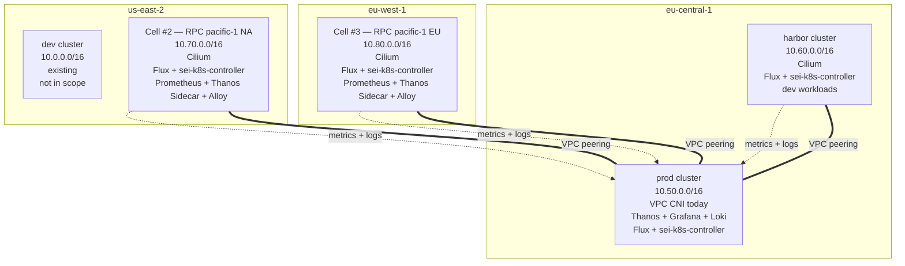
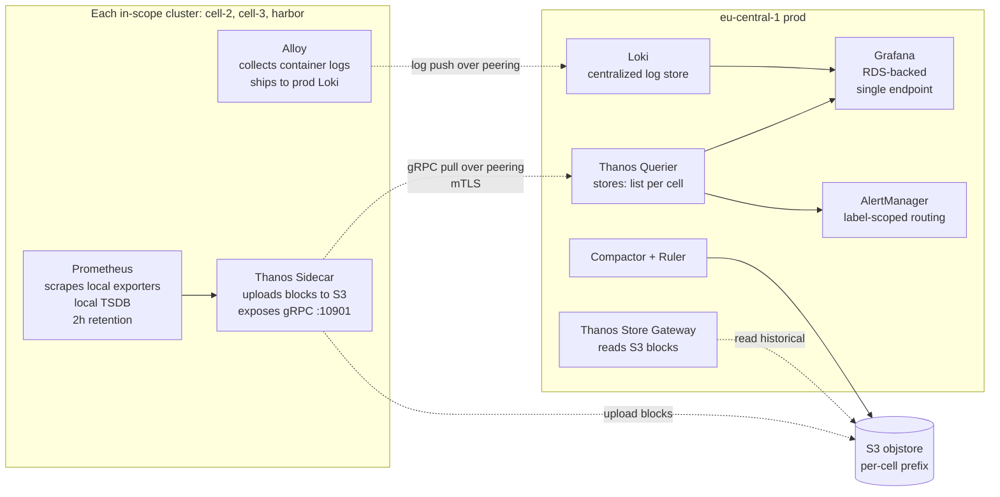
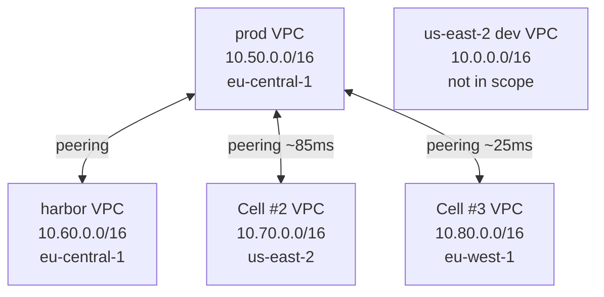
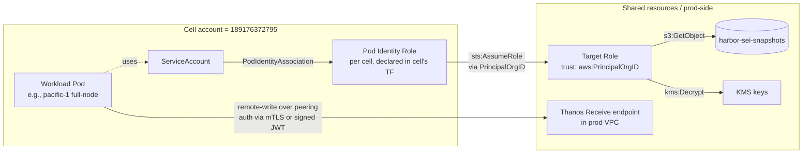

**Date:** 2026-06-07
**Status:** Draft (revision 4 — chosen direction: per-cluster TF + `base/` folder + Flux per cluster + centralized Thanos. Meta-cluster + CAPI work explicitly parked.)
**Issue:** [sei-protocol/Tide#106](https://github.com/sei-protocol/Tide/issues/106)
**Sibling:** [sei-protocol/Tide#108](https://github.com/sei-protocol/Tide/issues/108) (prod CNI migration to Cilium)
**Authors:** bdchatham

---

> **Read this first.** This document codifies the team's chosen direction for multi-region Sei cells. Brandon's 2026-06-07 call: **per-cluster Terraform bootstrap + a shared `clusters/base/` manifest set + Flux running inside each cluster + centralized observability via Thanos peering from prod into cells.** The pattern matches harbor's, scaled across regions.
>
> The CAPI / meta-cluster reconciler design that earlier revisions worked up (six-stream research pass, five-specialist Coral debate, ClusterClass deep-research) is preserved in [§ Parked: meta-cluster automation](#parked-meta-cluster-automation) as institutional memory. **It is not the chosen path.** If we ever revisit fleet automation, the research grounding is on the record so the next operator does not re-derive it.
>
> The doc keeps the title "meta-cluster architecture" as the metaphor for "fleet of cells with prod as the observability + identity-trust hub," not as a literal CAPI meta-cluster install.

---

# Meta-cluster architecture: fleet management for multi-region Sei cells

## Background

Today every Sei cluster — `prod` in eu-central-1, `harbor` in eu-central-1, and `us-east-2/dev` — is a Terraform apply per cluster, with Flux running inside each one for workload delivery. The pattern works at N=3 and the team has shipped harbor on it. The cost is that cluster changes (EKS version bump, addon update, IAM trust additions) replicate across N TF roots — manageable at small fleet sizes, painful at large ones.

This design was triggered by a session on 2026-06-03 that originally evaluated `flux-iac/tofu-controller` adoption for the existing `prod` root module. That evaluation [parked tofu-controller for the root](#alternative-1-tofu-controller-on-the-prod-root-module) (circular dependency: TF that creates the EKS cluster can't run inside it). The bigger workstream surfaced naturally — *eu-central-1 as a meta/management cluster that provisions and manages child cells in other regions via GitOps*.

Revisions 1-3 of this document worked up a meta-cluster + CAPI + CAAPH + tofu-controller architecture for that vision. **Brandon's 2026-06-07 call parks that work entirely**: the chosen direction is per-cluster TF + shared `clusters/base/` + Flux per cluster, leveraging existing patterns rather than introducing CAPI's operational tax. This is revision 4.

The parked meta-cluster design is preserved verbatim in [§ Parked: meta-cluster automation](#parked-meta-cluster-automation). The research grounding is durable — it tells the next operator what was evaluated, what the trade-offs were, and what un-defer signals to watch — without committing the team to the implementation.

## Goals

1. **Cell #2 (us-east-2) and Cell #3 (eu-west-1) shipped** as RPC fleets for `pacific-1` mainnet — serving North American and European end users respectively. Pattern matches harbor's TF + Flux shape.
2. **Shared `clusters/base/` manifest set** for cross-cell consistency (Cilium, Karpenter, ESO, sei-k8s-controller, observability shippers, Pod Identity Agent). Cell-specific overlays under `clusters/<cell-name>/`.
3. **Centralized observability** — cells ship metrics and logs to prod's Thanos / Loki via VPC peering. No per-cell Grafana, no per-cell Thanos. All dashboards live behind prod's existing Grafana endpoint.
4. **Cilium CNI on new cells** matching harbor's pattern. Prod stays on VPC CNI until [#108](https://github.com/sei-protocol/Tide/issues/108) un-defers.
5. **Fleet-shaped identity** — Pod Identity + `aws:PrincipalOrgID` for shared-resource access (`harbor-sei-snapshots`, KMS, prod Thanos write-path). Zero edits to shared roles when adding cell #N.
6. **Audit and multi-operator** for TF — `.gitignore` + GHA+OIDC apply, traceable to PR + GHA run, second operator can apply without sharing Brandon's workspace clone.
7. **Sei-chain-aware cell topology** — cells are RPC archetypes; design does not paper over validator vs RPC distinctions for future cells.

## Non-goals

**Permanently parked** (preserved as captured research in [§ Parked: meta-cluster automation](#parked-meta-cluster-automation), but not on the active roadmap):

- **CAPI / CAPA install** in eu-central-1 or anywhere else.
- **CAAPH** for Helm chart delivery from a management cluster.
- **`tofu-controller`** install. (Sibling Alternative 1 — adoption for the prod root — also rejected for the circular-dep reason; this design has no tofu-controller anywhere.)
- **`sei-cell` Helm chart** rendering CAPI CRDs per cell. The base-folder pattern replaces this entirely.
- **Pod Identity Association reconciler subpackage** in sei-k8s-controller. Pod Identity bindings declared in each cell's TF.

**Always-out-of-scope:**

- **EKS Auto Mode adoption.** 21-day forced node rotation incompatible with stateful Sei workloads; AWS-managed CNI conflicts with the Cilium target. See [§9 Alternative 2](#alternative-2-eks-auto-mode--terraform-from-ci-was-revision-1s-recommendation).
- **Crossplane as cluster provisioner.** Right tool for app-team-facing Compositions; wrong tool for cluster provisioning at our scale.
- **EKS Hybrid Nodes** for any current Sei workload.
- **Multi-account expansion.** Single-account fleet today; multi-account is its own design pass.
- **Migration of existing `harbor` cluster** under any new fleet model. It works.
- **Bare-metal / non-EKS clusters.** EKS-only.
- **Active-active mainnet validators across regions.** CometBFT consensus is BFT — cross-region P2P at 100-250ms RTT is consensus-degrading. Multi-region fault tolerance is tmkms/Horcrux signer failover + sentry geography, not active multi-region validators.

## Architecture (chosen direction)

### 4.1 Component overview



Five clusters, four-spoke peering with prod as the hub:

| Cluster | Region | VPC CIDR | CNI | Role |
|---|---|---|---|---|
| **prod** | eu-central-1 | `10.50.0.0/16` | VPC CNI (Cilium per [#108](https://github.com/sei-protocol/Tide/issues/108)) | Workloads + observability hub (Thanos, Grafana, Loki, AlertManager) |
| **harbor** | eu-central-1 | `10.60.0.0/16` | Cilium | Dev cluster, ephemeral chains, engineering workspaces |
| **us-east-2/dev** | us-east-2 | `10.0.0.0/16` | (existing) | Existing dev cluster |
| **Cell #2** | us-east-2 | `10.70.0.0/16` | Cilium | RPC fleet for `pacific-1` mainnet, NA users |
| **Cell #3** | eu-west-1 | `10.80.0.0/16` | Cilium | RPC fleet for `pacific-1` mainnet, EU users |

Service CIDR (in-cluster ClusterIP range): `172.20.0.0/16` per harbor's pattern, applied to every cluster.

### 4.2 Per-cluster TF bootstrap (mirrors harbor's pattern)

Each cell has its own TF root under `terraform/aws/189176372795/<region>/<cell-name>/`, structured like the existing harbor and prod roots:

```
terraform/aws/189176372795/
  eu-central-1/
    prod/                # existing
    harbor/              # existing
  us-east-2/
    common/              # existing
    dev/                 # existing
    cell-2/              # NEW (this design)
  eu-west-1/             # NEW (this design)
    cell-3/              # NEW
```

What each cell's TF root creates:
- VPC (CIDR per [§4.1](#41-component-overview))
- EKS control plane (managed)
- Managed node groups + Karpenter NodePools
- Cluster IAM (cluster role, node role, OIDC provider)
- Pod Identity Agent (managed addon)
- **Pod Identity Associations** for workloads that need shared-resource access (declared directly in TF using the `aws:PrincipalOrgID` trust pattern; no per-cell reconciler)
- KMS keys for cluster encryption
- VPC peering to prod's VPC + route updates on both sides (for the observability shipping path)
- Flux installed via TF (Helm provider) so the cluster bootstraps its own GitOps reconciliation

The pattern is the harbor pattern. Copy, parameterize, apply.

### 4.3 `clusters/base/` shared manifest set

A new top-level directory in the platform repo:

```
clusters/
  base/                          # NEW — shared HelmReleases + Kustomizations
    cilium/
    karpenter/
    sei-k8s-controller/
    external-secrets/
    pod-identity-agent/
    observability/
      prometheus-agent/         # remote-write to prod Thanos
      alloy/                    # log ship to prod Loki
    flux-system/                # Flux's own config
  prod/                          # existing
  harbor/                        # existing
  arctic-1/                      # existing
  atlantic-2/                    # existing
  pacific-1/                     # existing
  cell-2/                        # NEW — overlay on base/
    kustomization.yaml           # includes ../base + cell-specific manifests
    pacific-1-rpc-fleet/
    waterway-config/
  cell-3/                        # NEW — overlay on base/
    kustomization.yaml
    pacific-1-rpc-fleet/
    waterway-config/
```

**Discipline rule**: cell overlays may *add* manifests or *patch* base values, never *delete* base manifests. Homogeneity of the base set is what makes operator troubleshooting consistent across cells. Any divergence is captured in the base — gated by a discipline of "change base only when a base change is what we want."

`harbor` may or may not migrate to consume `clusters/base/` retroactively — flagged as Open Question 4. Its existing manifest tree works; the migration is cosmetic unless `base/` evolves to encode policy harbor wants.

### 4.4 Flux per cluster (no central reconciler)

Each cluster runs its own Flux. Flux on each cluster reconciles its own path under `clusters/<cell-name>/` in the platform repo. No central Flux pushing to cells; no privileged hub holding kubeconfigs for the fleet.

This is the canonical Flux multi-cluster pull pattern (Stefan Prodan's standalone mode, not hub-and-spoke). Per the research in revisions 1-3, this avoids the Adobe Flex 360-cluster Argo blast-radius failure mode at any fleet size.

**Bootstrap pattern — copy harbor's solution explicitly** (verified in `terraform/aws/189176372795/eu-central-1/harbor/flux.tf` + `cilium.tf`):

1. TF apply provisions VPC, EKS, IAM, peering, and removes the `vpc-cni` + `kube-proxy` EKS managed addons entirely.
2. TF writes a pre-seeded `kubernetes_config_map_v1.cilium-tf-values` in `kube-system` containing all TF-rendered Cilium values (cluster pool CIDR, cluster ID/name for ClusterMesh-readiness, etc.).
3. TF uses the **`flux_bootstrap_git` provider** (NOT raw `helm_release`) to bootstrap Flux against the platform repo's `clusters/<cell-name>/` path. The provider creates a deploy key in GitHub and a corresponding `git-credentials` Secret in the cluster — no `kubernetes_secret_v1` is authored by Tide-side TF, the provider manages it inline (closing the kubeconfig-in-CI trap from Blocker 1).
4. Flux on the new cell reconciles `clusters/base/` (included via Kustomize) — the `clusters/base/cilium/HelmRelease` consumes the pre-seeded `cilium-tf-values` ConfigMap via `valuesFrom`.
5. **Cilium CNI install race is absorbed, not avoided**: the EKS control plane tolerates pending-CNI for several minutes; managed-node-group nodes stay in `NotReady` until Cilium's DaemonSet bootstraps. CoreDNS (scheduled on `CriticalAddonsOnly`-tainted MNG nodes with explicit toleration) becomes Ready after Cilium. Flux's own pods schedule on the same tainted MNG with tolerations. The node-group-join sequence is the implicit barrier; no race because nothing requests CNI before Cilium's DaemonSet runs.
6. Flux reconciles cell-specific overlay under `clusters/<cell-name>/` — installs Sei workloads (`pacific-1` full-nodes, Waterway, regional NLB).
7. Smoke tests validate Cilium ready, Pod Identity working, peering reachable, Thanos sidecar gRPC endpoint resolvable from prod's Querier, Alloy shipping to prod Loki.

**Do NOT use `helm_release.cilium`** in cell TF — `terraform destroy` would become a CNI-removal incident. Cilium's lifecycle stays in Flux via `clusters/base/cilium/HelmRelease`.

### 4.5 Centralized observability federation

The largest architectural shift in revision 4. **Cells do not run their own observability stacks.** Prod's existing Thanos + Grafana + Loki + AlertManager is the fleet's hub.

**Federation mechanism**: prod's existing Thanos topology is **Sidecar + Querier-pull** (verified in `clusters/prod/monitoring/thanos-query.yaml`: `receive: { enabled: false }`; `stores:` list adds each federated cluster's sidecar gRPC endpoint). Harbor is already federated this way. Cells #2 and #3 join the same pattern — no new Receive deployment needed.



**What each cell runs** (`clusters/base/observability/`):
- **Prometheus** (full, NOT agent mode) — scrapes local exporters (kube-state-metrics, node-exporter, cAdvisor, sei-k8s-controller, application metrics). Local TSDB with 2-hour retention (just enough for sidecar block upload).
- **Thanos Sidecar** — uploads 2-hour blocks to a per-cell S3 prefix; exposes Thanos gRPC StoreAPI on `:10901` over the cell's internal NLB for prod's Querier to consume. mTLS terminated at the sidecar.
- **Alloy** — log collection daemon. Ships container logs and journal logs to prod's Loki ingester over VPC peering with a per-cell bearer token in ESO.
- **External DNS** — registers `thanos-sidecar.<cell-name>.internal.platform.sei.io` in the cell's Route 53 private zone (associated to prod's VPC for resolution).
- **No local Grafana, no local Querier, no local Compactor, no local AlertManager.**

**What prod runs** (existing; reused for the fleet):
- **Thanos Querier** with `stores:` list updated to include `thanos-sidecar.cell-2.internal.platform.sei.io:10901` and `thanos-sidecar.cell-3.internal.platform.sei.io:10901` (and harbor's, already there).
- **Thanos Store Gateway** — reads historical blocks from cell-specific S3 prefixes.
- **Thanos Compactor + Ruler** — compacts cell blocks; evaluates alert rules globally.
- **Grafana** — RDS-backed (migrated in the recent CNPG→RDS workstream), single endpoint, all-fleet dashboards.
- **Loki** — log store accepting writes from all cells.
- **AlertManager** — centralized routing to PagerDuty + Slack.

**Cardinality budget** (load-bearing — without this prod's Thanos eats 2-5× its current series count):
- Fleet-wide cap: **2M active series** at v1.5; revisit at v2 if approached.
- `cluster` external label injected by each cell's Prometheus (`external_labels: { cluster: cell-2 }` etc.) — defense in depth against label collisions. Inject at the agent, NOT at Querier.
- Drop high-cardinality identifiers (`pod_name` suffixes that include replica hashes, `instance` full IP) via `metric_relabel_configs`.
- Each cell gets a unique `replica` value (`cell-2-prom`, `cell-3-prom`, etc.) — never share across cells (Thanos dedup will silently drop series).

**AlertManager label contract** (load-bearing — required for cell-scoped routing):
- Every alert rule MUST carry: `cluster` (cell name), `region`, `severity` (page|ticket|silent), `cell_archetype` (rpc|hub).
- Runbook URLs template `{{ $labels.cluster }}` so per-cell runbooks resolve.
- Alerts route to PagerDuty ONLY when `severity=page`; default is ticket.

**Loki strategy**: single-tenant at v1.5 (simpler); per-cell tenant decision deferred. Cell label injected at log push time via Alloy external labels. Never put `pod`, `pod_ip`, or `instance` (full IP) into Loki *stream* labels — use structured metadata. This is the single biggest cardinality landmine at fleet scale.

**Trade-offs** (covered also in [§ Trade-offs](#trade-offs)):
- Operational surface in cells is small (only Prometheus + Sidecar + Alloy, no Grafana/Loki/AM).
- Single point of failure for fleet observability — if prod's Querier is unreachable, cell metrics still locally queryable via direct Prometheus query (degraded experience; mitigation: short-lived 2h local TSDB)
- VPC peering becomes load-bearing — federation breaks if peering breaks
- Cross-region data transfer cost — bounded by cardinality + log volume; estimated $100-400/month combined for cells #2 + #3 at v1.5 scale (per observability-platform-engineer's estimate)
- Querier pull pattern means **prod holds N gRPC connections** to cell sidecars; cell churn affects Querier `stores:` list (Kubernetes lifecycle drives sidecar headless Service stability)

### 4.6 Network topology — VPC peering hub-and-spoke



| Decision | Commitment | Rationale |
|---|---|---|
| Topology | **VPC peering hub-and-spoke**, prod as hub | At N=3-4 cells the peering matrix is small (3-4 peerings, all touching prod). No TGW required; TGW becomes a candidate past ~5-6 cells when the matrix grows or transitive routing matters. Saves $0.05/hr/attachment plus the operational overhead of a TGW per region. |
| CIDR allocation | Inventoried scheme: `10.X.0.0/16` per cluster, X allocated in 10-step increments. Prod=50, harbor=60, us-east-2/dev=0, Cell #2=70, Cell #3=80. | Matches the team's existing practice. Non-overlapping VPC CIDRs are the one-way door — locked from the existing inventory plus the named cells. |
| Service CIDR | `172.20.0.0/16` in every cluster | Matches harbor; in-cluster ClusterIP range; non-overlapping not required since service IPs are intra-cluster. |
| Cilium IPAM mode | **`cluster-pool` + VXLAN encapsulation** (UDP/8472) — pods receive IPs from a Cilium-managed pool, **not** from the VPC primary CIDR. Matches harbor's actual config (verified in `terraform/aws/189176372795/eu-central-1/harbor/cilium.tf`). VPC CNI and kube-proxy addons are **removed entirely** from the EKS managed-addons list. | Same pattern as harbor — operator troubleshooting is consistent across cells. Pod IPs are inside Cilium's pool (default `10.0.0.0/8`, scoped per-cluster); VXLAN encapsulation handles inter-node pod traffic without consuming VPC ENI secondary IPs. Pod density per node is bounded by Cilium's pool size, not EC2 ENI capacity — fine for Sei workloads. Cross-cluster pod-to-pod traffic (if ever needed) goes via ClusterMesh (deferred); cross-cell traffic today is L3 over VPC peering (cell sidecar → prod Querier; cell Alloy → prod Loki). |
| Subnet plan inside each cell's `/16` | Match harbor's pattern: `cidrsubnet(local.vpc_cidr, 4, k)` for private subnets per AZ (`/20` each, 3 AZs); `cidrsubnet(local.vpc_cidr, 8, k+48)` for public subnets per AZ (`/24` each); `cidrsubnet(local.vpc_cidr, 8, k+52)` for intra subnets per AZ (`/24` each). Pods do NOT consume node-subnet IPs because Cilium runs `cluster-pool` IPAM. | Harbor's allocation is well-trodden; copy it. Node IPs come from the private subnet (`/20` per AZ = 4k IPs per AZ); pod IPs come from Cilium's pool entirely (~256k available); LB/NLB hits the public subnet. No `eni`-mode subnet-exhaustion concern. |
| IPv6 | Deferred. Un-defer when a single cell exceeds ~30k IPs in use or compliance/regulator names it. | EKS IPv6 is dual-stack with VPC CNI prefix delegation; not earned at our density. |
| Peering route propagation | Each peering's route table updates on both sides; cells route to prod's `10.50.0.0/16` and back. Service-CIDR (`172.20.0.0/16`) traffic stays intra-cluster — no cross-cluster service-IP routing. | Standard VPC peering route discipline. Cross-cluster traffic uses pod IPs (cell's VPC CIDR), not service IPs. |
| Cross-cluster service discovery | Per-cell Route 53 private hosted zone `<cell-name>.internal.platform.sei.io` (matches harbor's `harbor.internal.platform.sei.io` pattern). Each zone associated to both the cell's VPC and prod's VPC. **Set `allow_remote_vpc_dns_resolution = true` on both sides of each peering** — load-bearing for prod's Querier to resolve `thanos-sidecar.cell-2.internal.platform.sei.io` over peering. Use `ignore_changes = [vpc]` on the zone resource to tolerate the dual association. | Cheap, AWS-native, no controller. Matches harbor's existing `thanos-peering.tf` pattern. external-dns's `domainFilters` adds one entry per cell, not a rewrite. |
| Service mesh / Cilium ClusterMesh | Deferred. Un-defer trigger: first cross-cell NetworkPolicy ask or identity-aware L7 need. | At v1.5 the only cross-cluster path is prod ↔ cell for observability; that's L3 over peering. ClusterMesh becomes interesting if cells need to talk to each other directly. |

### 4.7 Identity federation



Pattern identical to revision 3's design:

- **EKS Pod Identity** (re:Invent 2023) for in-cluster → AWS role binding. `pods.eks.amazonaws.com` service principal; trust on the shared target role keyed on `aws:PrincipalOrgID`. Adding cell #N requires **zero edits to shared roles**.
- Pod Identity Associations **declared directly in each cell's TF root** (`aws_eks_pod_identity_association` resource) — no controller, no reconciler. At 5-10 bindings per cell this is sufficient.
- IRSA preserved as fallback where SDK support is missing.
- Cross-account chaining (June 2025) is the path for future multi-account expansion; not in scope here.

### 4.8 Sei-chain context — cells #2 and #3 are RPC archetypes

Per the cell-archetype distinction documented in earlier revisions:

| Aspect | Cell #2 + #3 (RPC for `pacific-1`) |
|---|---|
| Topology | Regional full-node pool behind regional Waterway, ≥2 AZs |
| Cross-region tolerance | Acceptable — RPC traffic is latency-bounded by user SLO, not BFT consensus |
| Validator role | **None** — these are RPC cells only. No validators. No tmkms/Horcrux. |
| `harbor-sei-snapshots` access | Per-replica on cold start. Cross-region pull from eu-central-1 acceptable for cold start; un-defer trigger for per-region snapshot CRR is "cold start > 30 minutes."  |
| External traffic exposure | Per-cell NLB fronting Waterway (which fronts the EVM JSON-RPC + REST + gRPC) |
| Routing of user traffic to cells | Route 53 latency-based routing on the user-facing endpoint → cell #2 for NA users, cell #3 for EU users, prod for everything else |

Cell-to-validator P2P is **not relevant** — cells host full-nodes (not validators), and the chain's validator P2P happens wherever the validators run (out of scope for this design).

## Phased rollout

### v1 — hygiene PRs (sequential to revision 4 landing; some may already be in flight)

1. **Root `.gitignore`** in `sei-protocol/platform` for `**/.terraform/`, `**/tfplan`, `**/*.tfplan`, `**/crash.log`. Sibling PR. Already overdue.
2. **`kubernetes_*` provider audit** on current prod TF state. Identify every `kubernetes_secret_v1`, `kubernetes_*`, `kubectl_*` resource. Block #4 until done.
3. **External Secrets Operator** installed in prod (existing Flux HelmRelease). Migrate every TF-written K8s Secret to an `ExternalSecret` resource pulling from AWS Secrets Manager. (See [Blocker 1](#blocker-1-kubernetes_secret_v1-migration-prerequisite).)
4. **GitHub Actions + OIDC** workflow for `terraform plan` on PR, `terraform apply` on merge to `main`, targeting the existing `terraform/aws/189176372795/eu-central-1/prod/` root unchanged. Manual environment approval gate.
5. **Break-glass laptop apply** preserved as a documented manual-dispatch GHA workflow.

### v1.5 — cells #2 (us-east-2) and #3 (eu-west-1)

Implementation per [§4](#architecture-chosen-direction):

1. **Extract `clusters/base/`** from common cell manifests. Initial content: Cilium HelmRelease (consuming TF-rendered `cilium-tf-values` ConfigMap), Karpenter controller (NodePool + EC2NodeClass CRs live in cell overlays — they vary by region), ESO, sei-k8s-controller, Pod Identity Agent, Prometheus + Thanos Sidecar, Alloy, External DNS, Flux's own config.
2. **TF roots** under `terraform/aws/189176372795/us-east-2/cell-2/` and `eu-west-1/cell-3/`. Copy-and-parameterize from harbor's flat layout (22 files; no `modules/cell/` extraction at v1.5 — premature abstraction at N=2). Remove `vpc-cni` and `kube-proxy` EKS managed addons.
3. **VPC peering** declared in TF — cell ↔ prod, both sides routed, `allow_remote_vpc_dns_resolution = true` on both sides.
4. **S3 CRR for `harbor-sei-snapshots` to a `us-east-2` prefix** — pulled forward from v2 per sei-network specialist guidance. pacific-1 pruned snapshot is ~400-600GB; cross-region cold start from eu-central-1 to us-east-2 at ~85ms RTT projects to **45-90 minutes per node**, exceeding the 30-minute trigger. Replicate to us-east-2 *before* cell #2 first cold start. eu-west-1 (cell #3) at ~25ms RTT projects 20-40min — can defer.
5. **Pod Identity Associations** declared in TF using `aws_eks_pod_identity_association` resources with `aws:PrincipalOrgID` trust on shared roles (`harbor-sei-snapshots` reader, KMS, Thanos sidecar S3 prefix). Each association has an explicit `depends_on` on its IAM role — EKS API rejects associations referencing roles whose trust policy isn't yet propagated.
6. **Flux bootstrap via `flux_bootstrap_git` provider** (NOT raw `helm_release`) — points at `clusters/cell-2/` and `clusters/cell-3/` in the platform repo.
7. **Cell-specific overlays** under `clusters/cell-2/` and `clusters/cell-3/` — `pacific-1` full-node Helm releases (6 full-nodes per cell, 3 AZs × 2, Karpenter-scaled to 12-15 under load per sei-network specialist guidance), Waterway, regional NLB.
8. **Per-cell Route 53 private zone** `<cell-name>.internal.platform.sei.io` associated to both cell VPC and prod VPC; external-dns publishes `thanos-sidecar.<cell-name>.internal.platform.sei.io`.
9. **Thanos Querier `stores:` list updated** in prod to include the two new sidecar endpoints; mTLS certs provisioned per cell via ESO.
10. **Route 53 latency-based routing** on the user-facing endpoint → cell #2 + #3 per user region, **with NLB health checks for failover** to alternate cell or prod on cell unhealthy.
11. **Validation**: smoke test prod Querier resolving + connecting to cell sidecars; Alloy reaching prod Loki; user-facing RPC traffic served from new cells in their respective regions; alert rules carry `cluster` label and route per the AlertManager contract.

### v2 — operational maturation

Work that becomes valuable once cells are stable:

- **Tuning + dashboards** — per-cell + fleet-wide Grafana dashboards behind prod's single endpoint; alert rules cell-scoped via labels.
- **S3 Cross-Region Replication** on `harbor-sei-snapshots` to us-east-2 + eu-west-1 prefixes — un-defer trigger: cold-start > 30 minutes on cell #2 from cross-region.
- **Prod CNI migration** to Cilium per [#108](https://github.com/sei-protocol/Tide/issues/108). Un-defer trigger: cell #2 runs on Cilium ≥2 weeks without CNI-related incidents.
- **Cilium ClusterMesh** enrollment if cross-cell NetworkPolicy or identity-aware L7 becomes a real ask.

### Parked — meta-cluster automation

The CAPI + CAAPH + tofu-controller + Pod Identity reconciler architecture is parked. See [§ Parked: meta-cluster automation](#parked-meta-cluster-automation) for the preserved research.

Un-defer triggers (very high bar — explicit institutional memory, not on the active roadmap):

- N ≥ 8 cells with active TF changes AND per-cluster PR cost becomes a measurable bottleneck
- ClusterClass + `AWSManagedMachinePoolTemplate` both ship in CAPI/CAPA — the alpha-status concerns resolve
- A second platform team forms with explicit fleet-automation ownership

## One-way doors picked at v1 / v1.5

Cheap decisions to lock; expensive to retroactively change. These are the durable architectural commitments.

1. **CIDR allocations** for cells #2 (10.70.0.0/16) and #3 (10.80.0.0/16). Sequential after existing prod (10.50) + harbor (10.60); follows the team's established `10.X.0.0/16, X in 10-step increments` pattern.
2. **`topology.region` label on `SeiNodeDeployment`** — schema one-way door; cheap to add, costly later.
3. **`pods.eks.amazonaws.com` (Pod Identity) as default for new IAM bindings** with `aws:PrincipalOrgID` trust pattern. No migration of existing IRSA; new ones are Pod Identity.
4. **AWS account `189176372795` stays single-account** through this design's horizon. Multi-account is its own design pass.
5. **Cilium as the target CNI for the entire fleet.** Cell #2/#3 from day 1; prod migration via [#108](https://github.com/sei-protocol/Tide/issues/108).
6. **`clusters/base/` folder pattern.** Cells overlay shared base; never delete base manifests. Discipline enforces homogeneity.
7. **VPC peering hub-and-spoke** with prod as hub. TGW deferred indefinitely; un-defer trigger: peering matrix > 6 attachments or transitive routing genuinely needed.
8. **Centralized observability** — Thanos + Grafana + Loki + AlertManager only in prod. Cells run shippers only (Prometheus + Thanos Sidecar + Alloy). No per-cell observability stack.
9. **Per-cluster TF + per-cluster Flux** as the chosen direction. Meta-cluster automation (CAPI, CAAPH, tofu-controller) explicitly parked, not deferred.

## Don't-do guardrails

Load-bearing prohibitions surfaced by the revision-4 cross-review. These belong in this design because misreading them costs real incidents.

**Networking + identity:**
- **Don't expose Thanos Sidecar publicly.** Internal NLB only; SG-restricted to prod's VPC CIDR. Public + IP-allowlist is a worse failure mode than internal + SG.
- **Don't route the service CIDR (`172.20.0.0/16`) across peering.** Cross-cluster paths use pod IPs (Cilium-managed) and DNS names, never service IPs.
- **Don't add cell ↔ cell peerings opportunistically.** If a second cross-cell path appears, it's the TGW un-defer signal — not "add one more peering."
- **Don't share bearer tokens or mTLS certs across cells.** Per-cell, per-shipper credentials. Rotation surface matters at fleet scale.
- **Don't expose CometBFT P2P (`:26656`) across VPC peering.** RPC cells don't need it; cells host full-nodes that peer to public seeds, not each other.

**Observability:**
- **Don't share `external_labels.replica` across cells.** Thanos dedup will silently drop series. Each cell's Prometheus gets a distinct `replica` value.
- **Don't let cells write under prod's `cluster` label.** Inject `cluster=cell-2` (etc.) at the cell's Prometheus, never at Querier. Defense in depth against misconfigured workloads.
- **Don't put `pod`, `pod_ip`, or `instance` (full IP) into Loki *stream* labels.** Use structured metadata. Single biggest cardinality landmine at fleet scale.
- **Don't route alerts to PagerDuty without an explicit `severity=page` label gate.** Every rule defaults to ticket; promote with explicit sign-off.
- **Don't enable Cilium kube-proxy replacement on prod until [#108](https://github.com/sei-protocol/Tide/issues/108) lands.** Mixed-mode debugging during the migration is hard enough.

**TF + bootstrap:**
- **Don't use `helm_release.cilium` in cell TF.** Cilium's lifecycle stays in Flux via `clusters/base/cilium/HelmRelease`; `terraform destroy` should never be a CNI-removal incident.
- **Don't use `kubectl_manifest` resources** for CRDs that aren't yet registered (Karpenter NodePool, ESO ClusterSecretStore). Pre-seed via Flux + Kustomize, not raw kubectl-provider.
- **Don't declare a Pod Identity Association without explicit `depends_on`** on its IAM role. EKS API rejects associations referencing roles whose trust policy isn't yet propagated. Race observed in harbor.
- **Don't set CPU limits** on `clusters/base/` workloads (Cilium, Karpenter, Prometheus, Alloy, ESO). Requests only. Standing project rule.
- **Don't rely on Kustomize discipline alone** for "base may not be deleted." Install Kyverno with a `ClusterPolicy` blocking deletion patches targeting `clusters/base/` resource names. Discipline is necessary but not sufficient at 1-2 operators.
- **Don't migrate harbor into `clusters/base/`** at v1.5. Harbor's existing manifest tree is the source the base is being extracted *from* — mutating both sides in flight risks losing the working configuration. Defer harbor migration to v2 (or never, if cosmetic).

**Sei-specific:**
- **Don't put a global Waterway** in front of all cells. Defeats the regional latency win and concentrates the EVM JSON-RPC failure domain.
- **Don't share Waterway memcached across cells.** Per-cell cache only — cross-cluster memcached defeats the regional latency benefit.
- **Don't try to front `pacific-1` RPC with Istio L7** for WebSocket without Waterway in front. The mirroring limitation bites.
- **Don't enroll cells in Cilium ClusterMesh "preemptively"** — only when cross-cell NetworkPolicy or identity-aware L7 becomes a real ask.
- **Don't assume validators cell-ify on this pattern.** Validator cell shape remains: same-region pair (primary + standby with tmkms/Horcrux), sentries in front, no K8s-network-policy crossing the signer boundary.

## Honest blockers

### Blocker 1: GHA OIDC role trust for `aws eks get-token` against cell API endpoints

**Source: platform-engineer.** Audit of current prod TF (`/Users/brandon/workspace/platform/terraform/aws/189176372795/eu-central-1/{prod,harbor}/`) confirms the `kubernetes_*` provider footprint is **4 ConfigMaps + 1 ServiceAccount, ZERO secrets**:
- Prod: `kubernetes_config_map.karpenter_values`, `kubernetes_service_account_v1.seid_node`
- Harbor: `kubernetes_config_map_v1.cilium_values`, `kubernetes_config_map_v1.karpenter_values`

The Grafana RDS credential `kubernetes_secret_v1` resource that triggered earlier concern was migrated to ESO during the prior CNPG → RDS workstream. **No ESO migration is required** by this design.

The actual v1 step 4 dependency: GHA-runner needs to call `aws eks get-token` against each cluster's API endpoint via OIDC role trust. Each cluster's `endpoint_public_access` and OIDC role trust policy must permit the GHA OIDC subject.

**Resolution path**:
1. Confirm `endpoint_public_access = true` on prod + harbor + new cells, OR provision a private endpoint with reachability from the GHA runner (e.g., GitHub-hosted runners need public access; self-hosted in-VPC runners can use private).
2. Create a per-environment IAM role for GHA OIDC with trust on `repo:sei-protocol/platform:ref:refs/heads/main` and `kubernetes_*`-relevant permissions.
3. Audit the 4 ConfigMaps + 1 SA for managed-by-TF behavior under the GHA runner identity — should work as-is (TF provider talks to API via `aws eks get-token`, not via baked kubeconfig).

Owner: platform-engineer at v1 step 4.

### Blocker 2: Thanos Sidecar gRPC endpoint exposure across VPC peering

**Source: design analysis + platform-engineer's prod manifest reference.**

Prod's Thanos topology is **Sidecar + Querier-pull** (`clusters/prod/monitoring/thanos-query.yaml` shows `receive: { enabled: false }`). Each cell exposes a Thanos Sidecar gRPC endpoint that prod's Querier connects to.

Concrete requirements:
- **Internal NLB in each cell** fronting the sidecar gRPC port (`:10901`); TLS terminated at the NLB or passthrough to the sidecar.
- **DNS name** `thanos-sidecar.<cell-name>.internal.platform.sei.io` via external-dns in the cell's Route 53 private zone, associated to prod's VPC.
- **Authentication via mTLS** — Thanos gRPC's canonical pattern. Per-cell client cert issued from a fleet CA; prod's Querier uses one cert per cell store entry. Secrets managed via ESO from AWS Secrets Manager. **Per-cell, per-direction credentials** — never share certs across cells.
- **Security group** on the cell NLB allows ingress from prod's VPC CIDR (`10.50.0.0/16`) on `:10901` only.
- **Querier `stores:` list update**: prod's Flux HelmRelease for thanos-query gains `thanos-sidecar.cell-2.internal.platform.sei.io:10901` and `thanos-sidecar.cell-3.internal.platform.sei.io:10901` entries at v1.5.
- **No public exposure**. Internal NLB only, never an Internet-facing LB with allowlists.

Owner: observability-platform-engineer + network-specialist at v1.5 step 1.

### Blocker 3 (resolved in §4.4): Cilium installation order

Harbor's pattern handles this — see [§4.4](#44-flux-per-cluster-no-central-reconciler) step 5. No design action required; v1.5 implementer follows harbor's `flux_bootstrap_git` + pre-seeded `cilium-tf-values` ConfigMap pattern verbatim.

## Trade-offs

| Trade-off | What we accept | What we give up |
|---|---|---|
| **Per-cluster TF over meta-cluster automation** | Each cluster owns its own TF root; cluster changes (EKS version bumps, addon updates, IAM trust additions) replicate across N roots. Manual cell stand-up at hours-to-days scale. Today: `prod`, `harbor`, `us-east-2/dev` cluster roots plus `bootstrap/` and `us-east-2/common/` shared roots. After v1.5: add `cell-2/` and `cell-3/` cluster roots. | Declarative cluster reconciliation, single-source-of-truth templating, K8s-native pattern at fleet scale. The meta-cluster architecture is parked as captured research. |
| **`clusters/base/` discipline-enforced homogeneity** | Operators must update `base/` when changing fleet-wide manifests; per-cell overlays drift if not policed | Primitive-enforced homogeneity (e.g., ClusterClass). Trade is acceptable because Brandon owns the discipline today and the fleet is small. |
| **Centralized observability** (Sidecar + Querier-pull) | Prod's Querier holds N gRPC connections to cell sidecars; cell churn affects `stores:` list; cross-region data transfer cost ($100-400/mo estimated for cells #2 + #3); prod becomes tier-0 observability dependency for cells; cardinality budget cap (2M fleet-wide) | Operational simplicity in cells (Prometheus + Sidecar + Alloy only, no Grafana/Loki/AM). Matches harbor's existing federation pattern — no new deployment in prod. |
| **VPC peering over TGW** | Peering matrix grows quadratically past the hub-and-spoke shape; transitive routing not available; per-route discipline on both sides of each peering | $0.05/hr/attachment TGW cost; one less AWS service to operate. At N=3-4 cells the peering matrix is small. |
| **CNI heterogeneity window** until prod migrates | Bounded debugging asymmetry (VPC CNI in prod, Cilium in cells + harbor). Tracked in [#108](https://github.com/sei-protocol/Tide/issues/108). | Single-CNI fleet from day 1. Worth the bounded cost given prod's CNI migration is its own destructive cutover. |
| **CIDR commitment ahead of need** | `10.X.0.0/16` per cluster, X in 10-step increments — locks future cells into this scheme | Acceptable: matches the team's existing practice; future flexibility is purely IP-budget conservatism. |
| **Cilium `eni` mode** (pods from VPC primary CIDR) | Pod density bounded by EC2 ENI capacity per node | Higher density (cluster-pool mode). Acceptable: Sei workloads are large, low-density. |
| **Pod Identity ecosystem maturity** | Pod Identity is 2023+, cross-account chaining 2025+; SDK support uneven | Some libraries still IRSA-only. Fall through to IRSA where SDK support is missing. |
| **No active multi-region mainnet validators** | tmkms/Horcrux failover only for multi-region validator HA | Active-active across regions. Not a real option for CometBFT BFT consensus regardless of K8s shape. |

## Alternatives considered

### Alternative 1: tofu-controller on the prod root module

**Originally proposed** in the 2026-06-03 session; **rejected for the root module** due to circular dependency (TF that creates the EKS cluster cannot run inside it). Revision 4 also parks tofu-controller for `cross-cluster/` state — the team is choosing per-cluster TF over any controller-driven TF.

### Alternative 2: EKS Auto Mode + Terraform-from-CI (was revision 1's recommendation)

Rejected after Brandon's 2026-06-03 course-correct. Reasons preserved on record:

1. **21-day forced node rotation** of Bottlerocket nodes incompatible with stateful Sei workloads.
2. **AWS-managed CNI** fundamentally incompatible with Cilium target end-state.
3. **Operator preference** for explicit configurability over managed-mode automation.

### Alternative 3: Cluster API / CAPA (parked, see [§ Parked: meta-cluster automation](#parked-meta-cluster-automation))

Revision 1 rejected CAPI; revision 2 promoted it; revision 3 deferred it to v3 un-defer; **revision 4 parks it entirely as institutional memory.** The research grounding (six-stream pass, five-specialist debate, ClusterClass deep-research) is preserved in the parked section.

Brandon's 2026-06-07 framing: per-cluster TF + Flux is sufficient at our fleet size; CAPI's value proposition (declarative cluster lifecycle, single-source-of-truth templating, fleet-wide reconciliation) does not earn its operational tax (~1 day/month at our scale) when the alternative pattern (harbor-style TF + Flux) is already shipped and works.

### Alternative 4: Defer the entire workstream

Product-engineer's revision-1 position: "design solves a problem Brandon doesn't have." Resolved by Brandon naming cells #2 and #3 as concrete deliverables and assigning them to `pacific-1` RPC capacity for NA + EU users.

### Alternative 5: Crossplane

Right tool for app-team-facing platform Compositions (XRDs bundling EKS + RDS + S3 + IAM); wrong tool for cluster provisioning at our scale. Reconsider when (a) we have app teams self-serving infrastructure, or (b) an IDP-style platform XRD product becomes a stated goal.

### Alternative 6: Per-cluster TF + Flux + `clusters/base/` (CHOSEN as revision 4's direction)

Revision 3 captured this as the near-term path with the meta-cluster as eventual destination. **Revision 4 elevates this to THE chosen direction** — no eventual meta-cluster build planned.

Why this wins:
- **Known operational pattern** — harbor already ships on this model
- **Zero new infrastructure to learn** (no CAPI CRDs, no CAAPH, no tofu-controller)
- **Faster cell delivery** than stacking CAPI's learning curve
- **`clusters/base/` provides the homogeneity** that revision 3 imagined the sei-cell Helm chart providing
- **Centralized observability** removes the largest per-cell operational burden (~50% of what each cluster would otherwise own)

Honest costs (mirrored in [Trade-offs](#trade-offs)):
- N TF roots to maintain
- Cluster changes replicated N times
- No declarative drift detection — only `terraform plan` catches it
- Manual cell stand-up

## Parked: meta-cluster automation

This section preserves the meta-cluster + CAPI + CAAPH + tofu-controller + Pod Identity reconciler architecture from revisions 1-3 as institutional memory. **It is not the chosen direction.** Brandon's 2026-06-07 call selected per-cluster TF + `clusters/base/` + Flux per cluster. The content below is captured so a future operator does not re-derive the research grounding if/when fleet automation becomes worth revisiting.

### Parked architecture summary

The eventual-state architecture envisioned a meta-cluster in eu-central-1 hosting:

- **CAPI + CAPA** — declarative child cluster lifecycle via `AWSManagedControlPlane` + `AWSManagedCluster` + `AWSManagedMachinePool` CRDs per cell. Templated via a **`sei-cell` Helm chart** rendering raw CRDs (Path A) — NOT `ClusterClass` (still alpha, missing `AWSManagedMachinePoolTemplate`, see deep-research below).
- **CAAPH** — Cluster API Addon Provider for Helm. Watches `Cluster` labels and applies `HelmChartProxy` resources to install Karpenter, Cilium, ESO, sei-k8s-controller on each cell as it becomes Ready.
- **tofu-controller** — reconciles a `cross-cluster/` TF state for AWS resources that span cells (TGW attachments, Pod Identity Associations, IAM trust fan-out, shared S3 / KMS policies). Note: this design uses VPC peering, not TGW.
- **Pod Identity Association reconciler subpackage** in `sei-k8s-controller` (~200 LOC Go) — driven from a cell registry, calls `eks:CreatePodIdentityAssociation` per cell. Replaces the TF-declared pattern in revision 4.

### Parked design's deep research

Six-stream parallel research pass (2026-06-03):

- **Cluster API / CAPA**: v1.13.2 (May 2026); ClusterClass still alpha 5 years post-introduction; Pod Identity is unmerged PR #5808; Giant Swarm framed it as "a thousand small features" of work; no public production adopter at our profile.
- **EKS Auto Mode**: rejected for 21-day rotation + CNI lock-in; captured for completeness.
- **Crossplane**: CNCF-graduated 2025-10-28; right tool for app-team XRDs, not cluster lifecycle.
- **Cross-cluster networking**: hub-and-spoke TGW recommended past 5-6 cells; CIDR plan one-way door; CometBFT P2P cross-region constraints.
- **Multi-cluster GitOps**: Flux pull-per-cluster recommended; Adobe Flex 360-cluster Argo blast-radius case study.
- **Cross-cluster identity**: Pod Identity + `aws:PrincipalOrgID` materially better than IRSA at fleet scale.

ClusterClass deep-research follow-up:

- CAPA `AWSManagedControlPlaneTemplate` only landed in PR #5375 (Aug 2025)
- `AWSManagedMachinePoolTemplate` does not exist yet ([CAPA #3166](https://github.com/kubernetes-sigs/cluster-api-provider-aws/issues/3166))
- CAPI ships breaking ClusterClass-adjacent v1beta2 changes every minor release
- Giant Swarm's `cluster-aws` Helm chart (most public production reference) chose raw CRDs + Helm, not ClusterClass
- Migration Path A → Path B is a clean two-way door at the architectural level

### Why parked

- **CAPI tax does not earn at our scale.** ~1 day/month operational overhead for a 2-person team running 5-cell fleet, when the alternative (per-cluster TF + Flux) ships in days off existing harbor patterns.
- **Centralized observability removes the largest per-cell burden.** The fleet-shaped declarative benefit of the meta-cluster is biggest when each cluster duplicates significant observability + secret + identity machinery. With prod as the observability hub, each cell's machinery is small.
- **Two-way door preserved.** Adopting CAPI later is not blocked by the chosen direction. Foundation one-way doors (CIDR, Pod Identity, Cilium, `topology.region` label) compose with both paths. If the un-defer triggers fire, the team walks into the architecture above with a fully-scoped research base.

### Parked un-defer triggers (high bar)

- N ≥ 8 cells with active TF changes
- ClusterClass + `AWSManagedMachinePoolTemplate` both ship in CAPI/CAPA
- A second platform team forms with explicit fleet-automation ownership
- The per-cluster TF replication pattern produces a recurring incident (drift, missed update, misconfiguration across cells)

## Open questions

**Closed in this revision:**

- ~~Cell #2 and #3 archetype + chain~~ — closed: RPC fleets serving `pacific-1` mainnet, NA users (cell #2) and EU users (cell #3).
- ~~CIDR allocations~~ — closed: cell #2 at 10.70.0.0/16, cell #3 at 10.80.0.0/16; existing inventory verified.
- ~~Thanos federation mechanism~~ — closed in §4.5: Sidecar + Querier-pull, matching prod's existing topology. Verified in `clusters/prod/monitoring/thanos-query.yaml`.
- ~~`kubernetes_*` resources audit~~ — closed: 4 ConfigMaps + 1 SA, NO secrets; no ESO migration needed.
- ~~Cilium bootstrap order~~ — closed in §4.4 (Blocker 3): harbor's `flux_bootstrap_git` + pre-seeded `cilium-tf-values` ConfigMap pattern; node-group-join is the implicit barrier.
- ~~Cilium IPAM mode~~ — closed: cluster-pool + VXLAN, matching harbor.
- ~~Harbor migration to `clusters/base/`~~ — closed as **deferred to v2**. Don't mutate both sides of the extraction in flight.

**Block v1.5 progress:**

1. **`clusters/base/` initial content** — exact list of HelmReleases + Kustomizations to extract from harbor + cell-2 + cell-3 manifests at v1.5 step 1. Initial set listed in [§ Phased rollout v1.5 step 1](#v15--cells-2-us-east-2-and-3-eu-west-1). Owner: platform-engineer.
2. **Karpenter `EC2NodeClass` AMI family per cell** — Bottlerocket vs Amazon Linux 2023? AMI family varies by region availability and team preference. Owner: platform-engineer at v1.5 step 1.

**Tracked as follow-up issues (file via `/issue` against `sei-protocol/platform` at v1.5 kickoff):**

3. **Pod Identity Association sprawl mitigation** — when bindings exceed ~30 across cells, extract `terraform/modules/sei-pod-identity-bindings/` so namespace/SA renames touch one place. (sei-network specialist's F1.)
4. **Route 53 latency-routing failover policy** — NLB health checks with fallback ordering: nearest-cell → other-cell → prod. SLO impact documented for product. (sei-network F3 + network F-NET-3 + k8s-specialist F2.)
5. **WebSocket connection draining** on Karpenter scale-down — `preStop` hook with Waterway WS-aware quiesce. (sei-network F5.)
6. **pacific-1 hard-fork upgrade gate** — SeiNodeDeployment upgrades for `pacific-1` must roll all cells within a 48h window before upgrade height. (sei-network F7.)
7. **`topology.region` enum validation** — CRD OpenAPI schema validates against curated AWS region list. (sei-network F6.)
8. **Loki tenant strategy** — single-tenant v1.5; per-cell-tenant decision deferred. (observability F4.)
9. **Cross-region egress cost monitoring** — establish baseline at v1.5 from harbor's actual shipping volume; revisit at v2. (observability F5 + network F-NET-2.)
10. **Prometheus WAL sizing per cell** — pin at 12h buffer (~5-10Gi PVC) for prod-outage survival. (observability F6.)
11. **Grafana folder convention** — per-cell folder with `$cluster` variable on every panel. (observability F7.)
12. **TGW lazy-insurance assessment** — provision now or wait? Documented un-defer triggers: >6 attachments OR transitive routing required. (network F-NET-1.)
13. **eu-west-1 (cell #3) snapshot replication** — defer until cold-start latency measured; v2 if 30-minute trigger fires. (sei-network F2 part 2.)

## References

### Research sources (six parallel streams, 2026-06-03 session, plus 2026-06-05 ClusterClass deep-research)

**Cluster API / CAPA (parked):**
- [CAPI releases](https://github.com/kubernetes-sigs/cluster-api/releases) — v1.13.2 (May 2026)
- [CAPA releases](https://github.com/kubernetes-sigs/cluster-api-provider-aws/releases) — v2.11.1 (Apr 2025)
- [CAPA EKS docs](https://cluster-api-aws.sigs.k8s.io/topics/eks/creating-a-cluster)
- [CAPI experimental-features doc](https://cluster-api.sigs.k8s.io/tasks/experimental-features/experimental-features)
- [CAPI ClusterClass doc](https://cluster-api.sigs.k8s.io/tasks/experimental-features/cluster-class/)
- [CAPI #12547 — When will ClusterClass be GA?](https://github.com/kubernetes-sigs/cluster-api/issues/12547)
- [CAPA PR #5375 — AWSManagedControlPlaneTemplate](https://github.com/kubernetes-sigs/cluster-api-provider-aws/pull/5375)
- [CAPA #3166 — managed machinepool template gap](https://github.com/kubernetes-sigs/cluster-api-provider-aws/issues/3166)
- [Giant Swarm cluster-aws Helm chart](https://github.com/giantswarm/cluster-aws)
- [Giant Swarm: live-migrating hundreds of clusters](https://www.giantswarm.io/blog/live-migrating-hundreds-of-kubernetes-clusters-to-cluster-api)
- [SuperOrbital CAPA case study](https://superorbital.io/blog/cluster-api-part-2-capa-bootstrap/)
- [CAAPH (cluster-api-addon-provider-helm)](https://github.com/kubernetes-sigs/cluster-api-addon-provider-helm)

**EKS Auto Mode (rejected alternative):**
- [EKS Auto Mode docs](https://docs.aws.amazon.com/eks/latest/userguide/automode.html)
- [EKS pricing](https://aws.amazon.com/eks/pricing/)
- [Auto Mode migration from Karpenter](https://docs.aws.amazon.com/eks/latest/userguide/auto-migrate-karpenter.html)

**Crossplane (deferred alternative):**
- [CNCF graduation announcement](https://www.cncf.io/announcements/2025/11/06/cloud-native-computing-foundation-announces-graduation-of-crossplane/)
- [awslabs/crossplane-on-eks (archived Feb 2026)](https://github.com/awslabs/crossplane-on-eks)

**Cross-cluster networking:**
- [AWS VPC peering vs TGW (CloudZero)](https://www.cloudzero.com/blog/aws-vpc-peering-vs-transit-gateway/)
- [TGW design best practices](https://docs.aws.amazon.com/vpc/latest/tgw/tgw-best-design-practices.html)
- [TGW pricing](https://aws.amazon.com/transit-gateway/pricing/)
- [Cilium ClusterMesh docs](https://docs.cilium.io/en/stable/network/clustermesh/clustermesh/)
- [EKS subnet best practices](https://docs.aws.amazon.com/eks/latest/best-practices/subnets.html)
- [Datadog: Cilium operations at scale](https://www.datadoghq.com/blog/cilium-operations-at-scale/)

**Multi-cluster GitOps (chosen pattern):**
- [Flux v2.8 announcement](https://fluxcd.io/blog/2026/02/flux-v2.8.0/)
- [FluxCD multi-cluster architecture (Stefan Prodan)](https://medium.com/@stefanprodan/fluxcd-multi-cluster-architecture-e426fb2bca0f) — pull-per-cluster pattern
- [Argo CD cluster generator](https://argo-cd.readthedocs.io/en/stable/operator-manual/applicationset/Generators-Cluster/)
- [Adobe Flex cell-based architecture (CNCF)](https://architecture.cncf.io/architectures/adobe/) — case study against push hub

**Centralized observability:**
- [Thanos Receive docs](https://thanos.io/tip/components/receive.md/) — remote-write ingest pattern
- [Thanos Querier + Sidecar docs](https://thanos.io/tip/components/query.md/) — alternative federation pattern
- [Grafana Alloy docs](https://grafana.com/docs/alloy/latest/)
- [Prometheus Agent mode](https://prometheus.io/blog/2021/11/16/agent/) — agent-mode remote-write

**Cross-cluster identity federation:**
- [AWS IRSA documentation](https://docs.aws.amazon.com/eks/latest/userguide/iam-roles-for-service-accounts.html)
- [EKS Pod Identity documentation](https://docs.aws.amazon.com/eks/latest/userguide/pod-identities.html)
- [Pod Identity launch blog](https://aws.amazon.com/blogs/containers/amazon-eks-pod-identity-a-new-way-for-applications-on-eks-to-obtain-iam-credentials/)
- [Pod Identity cross-account chaining](https://aws.amazon.com/blogs/containers/amazon-eks-pod-identity-streamlines-cross-account-access/)
- [EKS multi-account best practices](https://docs.aws.amazon.com/eks/latest/best-practices/multi-account-strategy.html)

### Session context

- [Issue sei-protocol/Tide#106](https://github.com/sei-protocol/Tide/issues/106) — originating workstream
- [Issue sei-protocol/Tide#108](https://github.com/sei-protocol/Tide/issues/108) — prod CNI migration to Cilium
- [PR sei-protocol/Tide#107](https://github.com/sei-protocol/Tide/pull/107) — revision 3 of this design (CAPI as eventual state)
- 2026-06-03 session — six-stream research pass + five-specialist Coral debate
- 2026-06-05 — ClusterClass deep-research follow-up
- 2026-06-07 — Brandon's pivot to per-cluster TF + `base/` + Flux + centralized Thanos; cells named as RPC fleets for `pacific-1`

### Sei-platform context

- `sei-protocol/platform` — TF + Flux manifest source-of-truth
- `terraform/aws/189176372795/eu-central-1/prod/` — prod TF root, currently the model for new cell roots
- `terraform/aws/189176372795/eu-central-1/harbor/` — harbor TF root, the pattern this design replicates
- `terraform/aws/189176372795/us-east-2/dev/` — existing us-east-2 dev cluster
- `sei-platform-terraform-state` S3 bucket — TF state backend
- `harbor-sei-snapshots` S3 bucket (eu-central-1) — shared snapshot store; cells access via Pod Identity + `aws:PrincipalOrgID`
