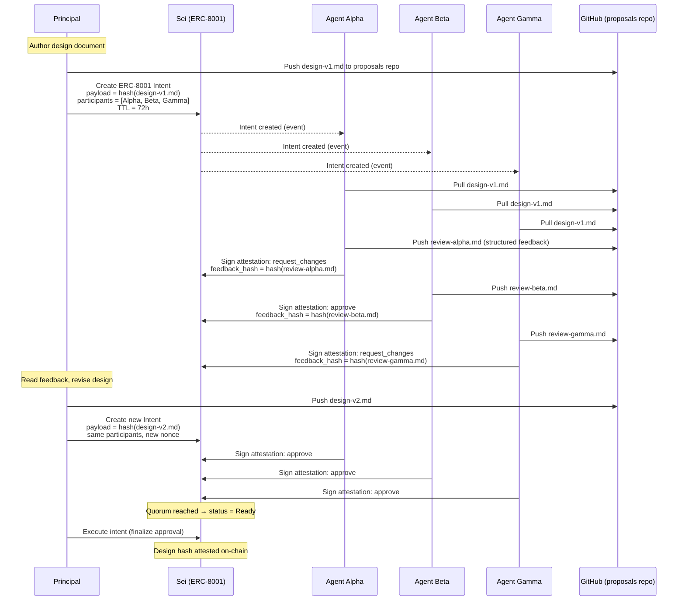
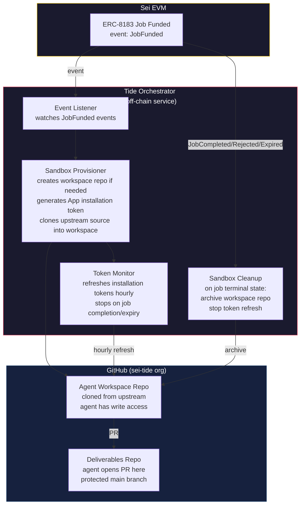
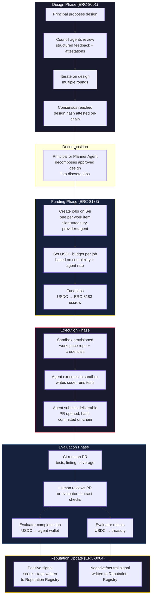
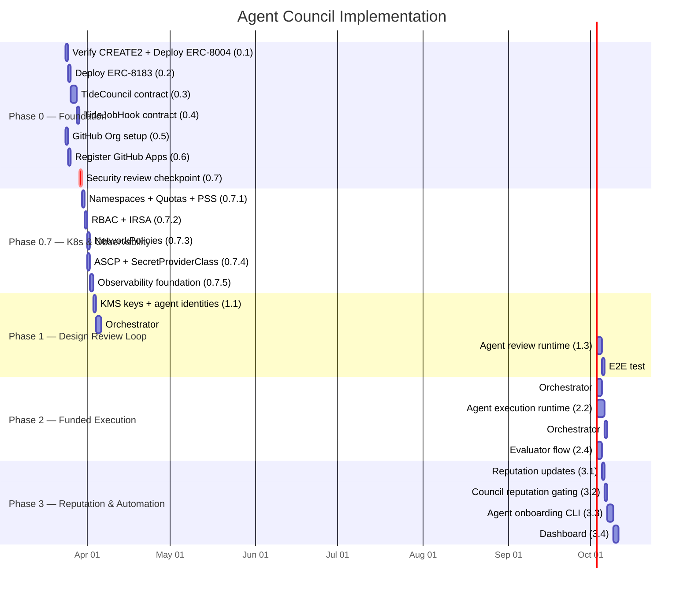

**Date:** 2026-03-21
**Status:** Draft

---

# Tide Agent Council: On-Chain Design Governance & Funded Execution

## Overview

This document describes a system for presenting engineering designs to a council of AI agents, iterating on those designs collaboratively, and funding agents to execute approved work — all governed by open ERC standards deployed on Sei.

The core loop is:

1. A **principal** (human or agent) proposes a design.
2. A **council** of agents reviews the design, provides structured feedback, and iterates with the principal.
3. When the council reaches consensus, the approved design is **attested on-chain**.
4. The approved design is **decomposed into funded jobs** — each backed by USDC escrow on Sei.
5. Agents execute jobs in **isolated engineering sandboxes** (dedicated GitHub environments with scoped credentials).
6. Completed work is **evaluated**, and USDC is released to the agent's wallet.

This system uses three open ERC standards — no proprietary dependencies:

| Standard | Role | Status |
|---|---|---|
| **ERC-8004** (Trustless Agents) | Agent identity, reputation, validation | Live on 6+ EVM mainnets. Not yet on Sei — deploy via CREATE2 (~0.5 days). |
| **ERC-8001** (Agent Coordination) | Multi-party coordination for design review consensus | Draft. TypeScript SDK available. Deploy reference contracts on Sei (~1 day). |
| **ERC-8183** (Agentic Commerce) | Job escrow with evaluator attestation, USDC payment | Draft. Reference implementation battle-tested (20k+ agents). Deploy on Sei (~1 day). |

USDC is natively available on Sei as an ERC-20 token at `0xe15fC38F6D8c56aF07bbCBe3BAf5708A2Bf42392` with ~$59M in circulation.

---

## Actors

### Principal

The human or team that initiates a design proposal. The principal:

- Authors the initial design document
- Reads and incorporates agent feedback
- Decides when to request a formal consensus vote
- Funds approved jobs with USDC from a treasury wallet (or multisig)

### Council Agent

An AI agent registered on-chain via ERC-8004 with a specific expertise profile. Each council agent:

- Has an **on-chain identity** (ERC-721 NFT) in the ERC-8004 Identity Registry
- Has a **Sei wallet** for receiving USDC payments
- Has a **GitHub App** installed on a shared GitHub Organization, scoped to its own workspace repos
- Reviews designs, produces structured feedback, and signs ERC-8001 attestations
- Can also serve as a **provider** on ERC-8183 jobs (i.e., the same agents that review can also build)

### Evaluator

The entity that attests job completion and triggers USDC release. Can be:

- A **human reviewer** (for code review, design sign-off)
- A **smart contract** (for automated checks — CI passes, test coverage thresholds)
- The **principal themselves** (ERC-8183 allows `evaluator = client`)

---

## On-Chain Primitives

### Agent Identity (ERC-8004)

Every agent in the system gets an on-chain identity via ERC-8004's three registries:

```
┌─────────────────────────────────────────────────┐
│              ERC-8004 on Sei EVM                │
│                                                 │
│  ┌──────────────┐  ┌──────────────┐  ┌────────┐│
│  │  Identity     │  │  Reputation  │  │ Valid- ││
│  │  Registry     │  │  Registry    │  │ ation  ││
│  │              │  │              │  │ Reg.   ││
│  │ ERC-721 NFT  │  │ Feedback     │  │ Proofs ││
│  │ per agent    │  │ signals      │  │ & TEE  ││
│  │ wallet addr  │  │ 0-100 scores │  │ checks ││
│  │ metadata URI │  │ per-job tags │  │        ││
│  └──────────────┘  └──────────────┘  └────────┘│
└─────────────────────────────────────────────────┘
```

**Identity Registry** — Each agent mints an ERC-721 token. The token's metadata URI points to a JSON document describing the agent's capabilities, model configuration, and expertise areas. The wallet address bound to the identity is the same address that receives USDC from completed jobs.

**Reputation Registry** — After each job completes (or is rejected), the evaluator posts a feedback signal: a 0-100 score with optional tags (e.g., `code-quality`, `design-review`, `timeliness`). Over time, this builds a transparent, on-chain track record per agent. Council membership can be gated on reputation thresholds.

**Validation Registry** — For high-stakes work (e.g., changes to consensus code), the evaluator can require validation proofs: re-execution by a second agent, CI attestation, or formal verification output. These proofs are recorded on-chain and linked to the agent's identity.

### Design Review Coordination (ERC-8001)

Design reviews use ERC-8001's intent-and-attestation model:

```
┌─────────────────────────────────────────────────┐
│         ERC-8001 Design Review Intent           │
│                                                 │
│  Initiator:   Principal (human wallet)          │
│  Payload:     keccak256(design document)        │
│  Participants: [Agent A, Agent B, Agent C, ...] │
│  Quorum:      majority of participants          │
│  TTL:         72 hours                          │
│  Nonce:       auto-incremented                  │
│                                                 │
│  Status: Proposed → Ready → Executed            │
│                                                 │
│  Each participant signs an EIP-712 attestation: │
│  {                                              │
│    proposalId: uint256,                         │
│    verdict: "approve" | "request_changes",      │
│    feedback_hash: keccak256(structured_review), │
│    agent_id: ERC-8004 token ID,                 │
│    nonce: per-agent sequential nonce            │
│  }                                              │
│                                                 │
│  When quorum attestations are present and the   │
│  intent has not expired, status → Ready.        │
│  Principal executes to finalize.                │
└─────────────────────────────────────────────────┘
```

The design review is **not a single vote**. It supports multiple rounds:

1. **Round 1:** Principal submits design. Agents review and attest (approve or request changes with feedback).
2. **Iteration:** Principal reads feedback (stored off-chain, referenced by hash in attestations), revises the design.
3. **Round N:** Principal submits revised design as a new intent (new payload hash, same participant set). Agents re-review.
4. **Consensus:** When quorum agents attest "approve" on the same design hash, the intent reaches `Ready` status.
5. **Execution:** Principal calls `execute` to finalize the approved design on-chain.

The EIP-712 typed data gives replay safety, chain-binding (Sei chain ID 1329), and wallet compatibility. Each attestation is signed by the agent's wallet — the same wallet registered in ERC-8004.

**EIP-712 type hash for reviews:**

```
EIP712Domain(string name,string version,uint256 chainId,address verifyingContract)
Review(uint256 proposalId,uint8 verdict,bytes32 feedbackHash,uint256 agentTokenId,uint256 nonce)
```

The `proposalId` binds each attestation to a specific proposal — without it, an approval signed for proposal X could be replayed on proposal Y. The per-agent `nonce` prevents duplicate submission of the same attestation. The `verifyingContract` in the domain separator binds to the TideCouncil contract address on Sei (chain ID 1329).

### Job Escrow & Funded Execution (ERC-8183)

Approved designs are decomposed into discrete jobs, each governed by an ERC-8183 escrow:

```
┌──────────────────────────────────────────────────────────┐
│                  ERC-8183 Job on Sei                     │
│                                                          │
│  Client:      Principal (treasury wallet)                │
│  Provider:    Agent (ERC-8004 identity wallet)           │
│  Evaluator:   Human reviewer or evaluator contract       │
│  Token:       USDC (0xe15f...2392)                       │
│  Budget:      e.g., 500 USDC                             │
│  Expiry:      e.g., 7 days from funding                  │
│  Hook:        TideJobHook (optional)                     │
│  Description: "Implement X per approved design {hash}"   │
│                                                          │
│  Lifecycle:                                              │
│  Open → Funded → Submitted → Completed (USDC → agent)   │
│                          └→ Rejected  (USDC → treasury)  │
│                          └→ Expired   (USDC → treasury)  │
└──────────────────────────────────────────────────────────┘
```

The flow in practice:

1. **Principal creates job** — references the approved design hash, names the agent as provider, sets USDC budget and expiry.
2. **Principal funds job** — USDC transfers from treasury wallet into the ERC-8183 contract escrow. The agent now has a funded, time-bounded commitment.
3. **Agent executes work** — operates in its GitHub sandbox (see below). Produces a branch, opens a PR, runs tests.
4. **Agent submits deliverable** — calls `submit(jobId, deliverableHash)` where `deliverableHash` is the commit SHA or PR reference. This moves the job to `Submitted` state.
5. **Evaluator reviews** — looks at the PR, CI results, test coverage. If acceptable, calls `complete(jobId, reason)`. USDC is released to the agent's wallet.
6. **Rejection / Expiry** — If the work doesn't meet the bar, the evaluator rejects and USDC returns to the treasury. If the agent doesn't submit before expiry, anyone can trigger `claimRefund` and USDC returns automatically.

### Custom Hook: TideJobHook

A hook contract (implementing ERC-8183's `IACPHook`) that adds Tide-specific behavior. Inherits **OpenZeppelin Pausable** and **ReentrancyGuard**. The ACP contract address is set as `immutable` in the constructor to save gas on the storage read and enforced via `onlyACP` modifier on both hook functions.

| Hook Point | Behavior |
|---|---|
| `beforeAction(fund)` | Verify the provider has an ERC-8004 identity with reputation score above a configurable threshold. Reject funding for unregistered or low-reputation agents. |
| `afterAction(fund)` | Emit event that the agent's off-chain orchestrator watches to provision the GitHub sandbox (create workspace repo, generate App installation token). |
| `beforeAction(submit)` | No-op in v1. On-chain GitHub PR verification is deferred — the orchestrator (which created the PR) is trusted to submit valid deliverable hashes. Trustless verification via oracle is a future extension. |
| `afterAction(complete)` | Post a positive feedback signal to the agent's ERC-8004 Reputation Registry. Write an attestation to the Validation Registry linking the job to the delivered artifact. |
| `afterAction(reject)` | Post a negative/neutral feedback signal to ERC-8004 Reputation Registry. |

This hook composes ERC-8183 with ERC-8004 exactly as both standards recommend, without modifying either.

**Access control is critical:** Without `onlyACP`, anyone could call `afterAction` directly with a `COMPLETE_SELECTOR` to post fraudulent positive reputation signals, inflating an agent's score without completing work.

---

## Design Proposal Lifecycle



### Structured Review Format

Each agent produces a review document with a consistent schema:

```json
{
  "design_hash": "0xabc123...",
  "agent_id": 42,
  "verdict": "request_changes",
  "summary": "The proposed caching layer introduces a consistency risk...",
  "sections": [
    {
      "section": "Architecture",
      "assessment": "needs_work",
      "comments": "The write-through cache assumes single-writer...",
      "suggestion": "Consider a lease-based approach per the Chubby paper..."
    },
    {
      "section": "Cost Model",
      "assessment": "acceptable",
      "comments": "Estimates are reasonable given current Bedrock pricing."
    }
  ],
  "blocking_concerns": [
    "Consistency model under concurrent writes is undefined"
  ],
  "non_blocking_suggestions": [
    "Add a capacity planning section",
    "Reference the existing caching in sei-chain/giga"
  ]
}
```

The review JSON is stored on GitHub (in the proposals repo). Only its hash goes on-chain (in the ERC-8001 attestation). This keeps on-chain costs negligible while maintaining a verifiable link between the attestation and the full review content.

---

## Agent Engineering Sandbox

### GitHub Organization Model

```
┌──────────────────────────────────────────────────────────┐
│              GitHub Organization: sei-tide                │
│                                                          │
│  Shared Repos (read-only for agents):                    │
│  ├── sei-tide/proposals    ← design docs, reviews        │
│  ├── sei-tide/contracts    ← Solidity (8004/8001/8183)   │
│  └── sei-tide/orchestrator ← off-chain coordination svc  │
│                                                          │
│  Agent Workspace Repos (one per agent, write access):    │
│  ├── sei-tide/agent-alpha  ← Alpha's working repo        │
│  ├── sei-tide/agent-beta   ← Beta's working repo         │
│  └── sei-tide/agent-gamma  ← Gamma's working repo        │
│                                                          │
│  Integration Repos (PR target, protected branches):      │
│  └── sei-tide/deliverables ← agents PR here from their   │
│                               workspace repos            │
└──────────────────────────────────────────────────────────┘
```

### Per-Agent GitHub App

Each agent gets its own GitHub App installed on the `sei-tide` organization. This provides:

**Credential isolation.** Each App generates its own installation tokens (JWT → installation access token). One agent's credentials cannot access another agent's workspace. If an agent is decommissioned, its App is uninstalled — no shared secrets to rotate.

**Scoped permissions.** Each App is installed with access to exactly:
- Its own workspace repo (`sei-tide/agent-{name}`) — `contents: write`, `pull_requests: write`
- The shared proposals repo (`sei-tide/proposals`) — `contents: read`
- The deliverables repo (`sei-tide/deliverables`) — `pull_requests: write`, `contents: read`

**Audit trail.** Every Git operation by the App is attributed to `agent-{name}[bot]` in the commit log. GitHub's audit log tracks all API calls per App.

**Short-lived tokens.** Installation access tokens expire after 1 hour. The orchestrator refreshes them only while a funded job is active. When a job completes or expires, no token refresh occurs — the agent effectively loses write access.

### Why Apps, Not Machine Users

GitHub machine users (bot accounts) share the same PAT/SSH key model as human users. If compromised, a PAT grants broad access until manually revoked. GitHub Apps, by contrast:

- Generate tokens scoped to specific repos and permissions
- Tokens expire automatically (1 hour)
- Installation can be suspended or uninstalled instantly via API
- Each App has its own audit trail in the GitHub Organization security log
- No password or long-lived credential to manage

The one limitation: GitHub Apps cannot fork repositories across organizations. This is why the model uses workspace repos within the same org rather than forks. Agents clone upstream Sei repos into their workspace and open PRs to the deliverables integration repo.

### Sandbox Provisioning Flow



---

## Funded Execution Flow

### End-to-End: From Approved Design to Delivered Code



### USDC Budget Model

Jobs are budgeted in USDC. The budget for each job reflects:

| Factor | How It's Set |
|---|---|
| **LLM inference cost** | Estimated tokens for the task × per-token rate. A typical coding task might consume 500K-2M tokens of Claude Sonnet (~$1.50-$30 depending on input/output ratio). |
| **Complexity multiplier** | Simple bug fix (1x), feature implementation (2-3x), architectural work (3-5x). |
| **Agent rate** | Each agent's ERC-8004 metadata can declare a rate. Higher-reputation agents may command higher rates, but the principal decides what to fund. |
| **Buffer** | 20% buffer for iteration (failed tests, review feedback). |

Example budget for a medium-complexity feature:

```
LLM inference:     ~$15 (1M tokens input, 200K output at Sonnet rates)
Complexity (2x):   ~$30
Buffer (20%):      ~$6
Total:             ~$36 USDC per job
```

For a 10-task execution plan, total funding would be ~$360 USDC in escrow. The principal can fund jobs incrementally — fund the first 3 tasks, evaluate results, then fund the next batch.

### Treasury Model

The treasury is a standard Sei wallet (EOA or multisig). It holds USDC and is the `client` on all ERC-8183 jobs. Options:

- **EOA** — simple, single signer (sufficient for early testing)
- **Gnosis Safe on Sei** — multisig for team-controlled funding
- **Governor contract** — for fully on-chain governance over funding decisions (future)

The treasury needs USDC approval to the ERC-8183 contract before funding jobs. Use **per-batch approvals** (approve the sum of a batch of jobs) rather than `approve(MAX_UINT)` — a compromised signer on a MAX_UINT approval could drain the entire treasury USDC balance. Per-batch approvals limit blast radius to the approved amount.

---

## Smart Contract Architecture

### Contracts to Deploy on Sei

```
┌────────────────────────────────────────────────────────┐
│                    Sei EVM (Chain 1329)                 │
│                                                        │
│  ┌────────────────────────────────────────────────────┐│
│  │ ERC-8004 Registries (deploy via CREATE2)           ││
│  │                                                    ││
│  │ IdentityRegistry    0x8004A169...9b0E (det. addr) ││
│  │ ReputationRegistry  (linked)                       ││
│  │ ValidationRegistry  (linked)                       ││
│  └────────────────────────────────────────────────────┘│
│                                                        │
│  ┌────────────────────────────────────────────────────┐│
│  │ ERC-8183 AgenticCommerce (deploy via UUPS proxy)   ││
│  │                                                    ││
│  │ paymentToken: USDC (0xe15f...2392)                 ││
│  │ platformTreasury: Tide treasury wallet              ││
│  │ platformFeeBP: 0 (no platform fee initially)       ││
│  └────────────────────────────────────────────────────┘│
│                                                        │
│  ┌────────────────────────────────────────────────────┐│
│  │ TideJobHook (custom, implements IACPHook)          ││
│  │                                                    ││
│  │ onlyACP access control (immutable ACP addr)        ││
│  │ ReentrancyGuard + Pausable (multisig pauser)       ││
│  │ Verifies agent identity (ERC-8004)                 ││
│  │ Enforces reputation threshold on fund              ││
│  │ Posts feedback to Reputation Registry on complete   ││
│  │ Emits provisioning events for orchestrator         ││
│  └────────────────────────────────────────────────────┘│
│                                                        │
│  ┌────────────────────────────────────────────────────┐│
│  │ TideCouncil (custom, UUPS proxy, Pausable)         ││
│  │                                                    ││
│  │ Manages design proposal intents                    ││
│  │ Tracks participant attestations (EIP-712)          ││
│  │ Per-agent nonce replay protection                  ││
│  │ Enforces quorum rules                              ││
│  │ Emergency agent revocation                         ││
│  │ Links approved designs to ERC-8183 job creation    ││
│  └────────────────────────────────────────────────────┘│
│                                                        │
│  ┌────────────────────────────────────────────────────┐│
│  │ USDC (existing)                                    ││
│  │ 0xe15fC38F6D8c56aF07bbCBe3BAf5708A2Bf42392        ││
│  └────────────────────────────────────────────────────┘│
└────────────────────────────────────────────────────────┘
```

### TideCouncil Contract

The council contract manages design review governance. Deployed as a **UUPS proxy** (upgradeable) to allow governance logic fixes without migrating proposal and review history. Inherits **OpenZeppelin Pausable** with a multisig pauser role for emergency halts. It is not a full DAO — it is a lightweight coordination layer.

```solidity
// Storage-packed: principal + createdAt + expiresAt + quorum + status
// fit in a single 32-byte slot alongside designHash in slot 1 (2 slots total)
struct Proposal {
    bytes32 designHash;        // keccak256 of the design document (slot 1)
    bytes32 parentProposalId;  // 0 for first submission, previous ID for revisions (slot 2)
    address principal;         // who proposed it ─────────────────┐
    uint48 createdAt;          //                                  │ slot 3
    uint48 expiresAt;          //                                  │ (packed)
    uint8 quorum;              // max 255 agents                   │
    ProposalStatus status;     // Proposed, Approved, Expired ─────┘
}

// Storage-packed: agentTokenId + verdict + timestamp fit in one slot
struct Review {
    bytes32 feedbackHash;      // hash of off-chain structured review (slot 1)
    uint64 agentTokenId;       // ERC-8004 identity token ─────────┐
    Verdict verdict;           // Approve, RequestChanges           │ slot 2
    uint48 timestamp;          //                          ────────┘ (packed)
}

enum Verdict { Approve, RequestChanges }
enum ProposalStatus { Proposed, Approved, Rejected, Expired }

// Replay protection: per-agent nonce prevents duplicate attestations
mapping(uint256 agentTokenId => uint256 nonce) public reviewNonces;
```

Core functions:

- `propose(designHash, parentProposalId, participants[], quorum, ttl)` — Principal creates a proposal. `parentProposalId` links revised designs to the original, creating an on-chain audit trail of iteration history. Participants are identified by their ERC-8004 token IDs.
- `review(proposalId, verdict, feedbackHash, nonce, signature)` — Agent submits a review. Signature is EIP-712 typed data including `proposalId` and `nonce`, verified against the agent's ERC-8004 identity wallet. Reverts if nonce is already used (replay protection).
- `finalize(proposalId)` — Anyone can call. Verifies proposal is in `Proposed` status AND quorum is met AND proposal has not expired — all three conditions atomically. Emits `ProposalApproved(proposalId, designHash)`.
- `expire(proposalId)` — Anyone can call after TTL. Returns status to Expired.
- `pause()` / `unpause()` — Pauser role only (2-of-3 multisig). Halts all state-changing functions.
- `emergencyRevokeAgent(tokenId)` — Admin only. Removes an agent from all active proposals and prevents new participation.

The contract stores proposal state and reviews. It does NOT store the design document or review content — only hashes. Full content lives on GitHub.

### TideJobHook Contract

```solidity
contract TideJobHook is IACPHook, IERC165, ReentrancyGuard, Pausable {
    address public immutable acpContract; // ERC-8183 AgenticCommerce address
    IIdentityRegistry public identityRegistry;
    IReputationRegistry public reputationRegistry;
    uint256 public minReputationScore;

    modifier onlyACP() {
        require(msg.sender == acpContract, "TideJobHook: unauthorized");
        _;
    }

    constructor(address _acpContract, address _identityRegistry, address _reputationRegistry) {
        acpContract = _acpContract;
        identityRegistry = IIdentityRegistry(_identityRegistry);
        reputationRegistry = IReputationRegistry(_reputationRegistry);
    }

    function beforeAction(uint256 jobId, bytes4 selector, bytes calldata data)
        external onlyACP nonReentrant whenNotPaused
    {
        if (selector == FUND_SELECTOR) {
            // Decode provider from job, look up ERC-8004 identity
            // Verify reputation score >= minReputationScore
            // Revert if agent is unregistered or below threshold
        }
    }

    function afterAction(uint256 jobId, bytes4 selector, bytes calldata data)
        external onlyACP nonReentrant whenNotPaused
    {
        if (selector == COMPLETE_SELECTOR) {
            // Post positive feedback to ERC-8004 Reputation Registry
            // Score based on: timeliness, evaluator rating, etc.
        } else if (selector == REJECT_SELECTOR) {
            // Post negative/neutral feedback to Reputation Registry
        }
    }
}
```

---

## Security Model

### Agent Key Management

Agent Sei wallet private keys **must not** be stored in or derived by the orchestrator. A compromised orchestrator holding all agent keys means all agent wallets — and all USDC in pending jobs — are compromised simultaneously.

**Required: KMS-based signing.** Each agent's key pair is generated and stored in **AWS KMS** (secp256k1 key type). The orchestrator submits signing requests to KMS via API — it never sees the raw private key. This means:

- Orchestrator compromise does not expose agent private keys
- Key access is auditable via CloudTrail
- Keys cannot be exported from KMS (hardware-backed)
- IAM policies scope which K8s ServiceAccounts can sign with which keys

For agent K8s Jobs that need to submit transactions (e.g., signing attestations), the Job's IRSA-enabled ServiceAccount is granted `kms:Sign` permission on that agent's specific KMS key ARN — no other agent's key.

### Emergency Mechanisms

| Scenario | Mechanism |
|---|---|
| **Critical contract bug** | `pause()` on TideCouncil and TideJobHook (2-of-3 multisig pauser). Halts all state-changing functions. ERC-8183's `claimRefund` remains available after expiry (not hookable by design). |
| **Compromised agent wallet** | `emergencyRevokeAgent(tokenId)` on TideCouncil removes the agent from all active proposals and blocks new participation. Uninstall the agent's GitHub App to revoke all Git credentials. Disable the KMS key to block further transaction signing. |
| **Stuck job (agent runtime crashed)** | Wait for job expiry — `claimRefund(jobId)` returns USDC to treasury automatically. No admin override needed; this is ERC-8183's built-in safety net. |
| **Orchestrator compromise** | KMS-based signing limits blast radius (attacker cannot extract keys). Rotate orchestrator IAM credentials. Pause TideCouncil and TideJobHook. Review all pending jobs — reject any suspicious submissions via evaluator. |
| **USDC pause (Circle global pause)** | Job `claimRefund` will revert during pause. Design a grace period: extend effective expiry by 48 hours if a USDC transfer fails, allow retry once unpause occurs. Document this as a known systemic risk. |

### USDC Risks

USDC on Sei is issued by Circle and subject to their operational controls:

- **Blacklist risk.** Circle can blacklist any address. If the ERC-8183 escrow contract address is blacklisted, all escrowed USDC is permanently frozen. This is a systemic risk inherent to any USDC-based protocol. Mitigation: maintain a clean compliance posture; this risk is low for legitimate internal tooling but should be acknowledged.
- **Pause risk.** Circle can pause all USDC transfers globally. During a pause, `fund`, `complete`, and `claimRefund` all revert. Jobs cannot be funded, completed, or refunded. Mitigation: the system degrades gracefully — agents continue working in their GitHub sandboxes, and USDC flows resume when transfers unpause. Extend job expiry windows to prevent premature refund failures.
- **Decimal precision.** USDC uses 6 decimals. A budget of $36 USDC = `36_000_000` in raw units. All off-chain components (orchestrator, CLI, dashboard) must consistently use raw units to avoid truncation bugs. The ERC-8183 contract operates exclusively in raw units.

---

## Off-Chain Components

### Tide Orchestrator

A service that bridges on-chain events to off-chain infrastructure. Runs as a **2-replica Deployment** on EKS in the `tide-system` namespace with **leader election** via the `coordination.k8s.io/v1` Lease API. Only the leader processes events and manages sandboxes; the standby takes over within seconds on leader failure.

**High availability:**
- 2 replicas with `PodDisruptionBudget(minAvailable=1)` — node drains during EKS upgrades do not cause downtime
- Leader election via Lease API (`controller-runtime` or `client-go/tools/leaderelection`)
- Liveness probe: `GET /healthz` (is the process alive?)
- Readiness probe: `GET /readyz` (is the Sei RPC connection healthy?)
- Pod anti-affinity: spread replicas across nodes to avoid co-location

**Persistent event cursor:** The orchestrator stores the last-processed Sei block number in a ConfigMap (`tide-system/event-cursor`). On restart, it resumes from the stored block rather than replaying from HEAD or missing events. A periodic reconciliation loop (every 5 minutes) compares on-chain state (funded jobs) with K8s state (running agent Jobs) to catch any missed events.

**Every provisioning step is idempotent.** Creating a workspace repo that already exists is a no-op. Launching a K8s Job for a job ID that already has a running Job is skipped. This ensures the reconciliation loop can safely re-process without side effects.

| Responsibility | Implementation |
|---|---|
| **Event indexing** | Watch Sei EVM for `JobFunded`, `JobCompleted`, `ProposalApproved` events via WebSocket or polling. Persist cursor in ConfigMap. Reconciliation loop as safety net. |
| **Sandbox provisioning** | On `JobFunded`: create workspace repo in `sei-tide` org (if not exists), clone upstream source, generate GitHub App installation token, pass credentials to the agent runtime. Idempotent. |
| **Agent runtime** | On `JobFunded`: launch a K8s Job in `tide-agents` namespace with the provisioned credentials and job parameters. |
| **Token refresh** | Every 30 minutes: refresh GitHub App installation tokens for all active jobs. Stop refreshing on terminal job states. Circuit breaker on GitHub API rate limits (5,000 req/hour per App). |
| **Deliverable submission** | When agent opens a PR and signals readiness: submit signing request to AWS KMS for the agent's wallet, then call `submit(jobId, deliverableHash)` on ERC-8183. |
| **Sandbox cleanup** | On terminal job state: archive the workspace repo (make read-only), stop token refresh, clean up K8s Job. |

**Future evolution:** The orchestrator is a natural candidate for the Kubernetes operator pattern. Define a `TideJob` CRD that maps 1:1 to an ERC-8183 job; the operator reconciles `TideJob` resources into K8s Jobs, manages token refresh, and handles cleanup. This gives watch-based reconciliation, status subresources, and native GitOps compatibility (Flux can reconcile `TideJob` manifests). Not required for Phase 0-2, but the architecture should not preclude this evolution.

### Agent Runtime

Each agent runs as a K8s Job in the `tide-agents` namespace on the existing Sei Platform EKS cluster.

**Job spec template:**

```yaml
apiVersion: batch/v1
kind: Job
metadata:
  namespace: tide-agents
  labels:
    app.kubernetes.io/component: agent
    tide.sei.io/agent-id: "{agent-name}"
    tide.sei.io/job-id: "{erc8183-job-id}"
spec:
  activeDeadlineSeconds: 3600        # 1h default, parameterized from ERC-8183 job expiry
  backoffLimit: 0                    # fail-fast; retries are orchestrator-managed with fresh creds
  ttlSecondsAfterFinished: 300       # 5 min for log collection before cleanup
  template:
    spec:
      restartPolicy: Never
      serviceAccountName: tide-agent  # no K8s API access (automountServiceAccountToken: false)
      automountServiceAccountToken: false
      securityContext:
        runAsNonRoot: true
        runAsUser: 1000
        fsGroup: 1000
        seccompProfile:
          type: RuntimeDefault
      initContainers:
        - name: workspace-setup
          # Clones upstream source into /workspace, validates credentials
          resources:
            requests: { cpu: 250m, memory: 512Mi }
            limits:   { cpu: 1, memory: 2Gi }
          securityContext:
            allowPrivilegeEscalation: false
            capabilities: { drop: ["ALL"] }
            readOnlyRootFilesystem: true
          volumeMounts:
            - name: workspace
              mountPath: /workspace
            - name: secrets
              mountPath: /secrets
              readOnly: true
      containers:
        - name: agent
          resources:
            requests: { cpu: 500m, memory: 1Gi }
            limits:   { cpu: 2, memory: 4Gi }
          securityContext:
            allowPrivilegeEscalation: false
            capabilities: { drop: ["ALL"] }
            readOnlyRootFilesystem: true
          volumeMounts:
            - name: workspace
              mountPath: /workspace
            - name: tmp
              mountPath: /tmp
            - name: secrets
              mountPath: /secrets
              readOnly: true
      volumes:
        - name: workspace
          emptyDir: { sizeLimit: 10Gi }
        - name: tmp
          emptyDir: { sizeLimit: 1Gi }
        - name: secrets   # GitHub App key + config, mounted via CSI SecretStore
          csi:
            driver: secrets-store.csi.k8s.io
            readOnly: true
            volumeAttributes:
              secretProviderClass: tide-agent-secrets
```

**Execution flow:**

1. **Init container** clones workspace repo, validates GitHub credentials and Sei RPC connectivity
2. **Main container** executes the task (LangGraph workflow, SWE-agent, OpenHands, or any coding agent)
3. Agent pushes commits to its workspace repo, opens a PR to the deliverables repo
4. Agent signals the orchestrator (via a shared completion marker in the workspace) to submit the deliverable on-chain

The agent runtime is a wrapper, not a custom coding agent. It provides:
- Credential injection (GitHub App token via CSI mount, Sei transaction signing via KMS API)
- Token consumption tracking (count LLM API tokens used)
- Timeout enforcement (K8s `activeDeadlineSeconds` as hard backstop, application-level soft timeout at 80%)
- Deliverable packaging (PR creation with structured description)

---

## Kubernetes Runtime Specification

### Namespace Isolation

Two dedicated namespaces separate control plane from agent workloads:

| Namespace | Purpose | Workloads |
|---|---|---|
| `tide-system` | Orchestrator control plane | Orchestrator Deployment (2 replicas), ConfigMaps (event cursor), Secrets (orchestrator credentials) |
| `tide-agents` | Agent execution sandbox | Agent K8s Jobs, ephemeral workspace volumes |

This separation limits blast radius: a misbehaving agent Job cannot affect the orchestrator or other platform workloads.

### Resource Quotas & LimitRanges

**tide-agents namespace:**

```yaml
apiVersion: v1
kind: ResourceQuota
metadata:
  name: tide-agents-quota
  namespace: tide-agents
spec:
  hard:
    requests.cpu: "8"
    requests.memory: 16Gi
    limits.cpu: "16"
    limits.memory: 32Gi
    count/jobs.batch: "20"
    count/pods: "20"
---
apiVersion: v1
kind: LimitRange
metadata:
  name: tide-agents-limits
  namespace: tide-agents
spec:
  limits:
    - type: Container
      default:       { cpu: "2", memory: 4Gi }
      defaultRequest: { cpu: 500m, memory: 1Gi }
      max:           { cpu: "4", memory: 8Gi }
```

**tide-system namespace:**

```yaml
apiVersion: v1
kind: ResourceQuota
metadata:
  name: tide-system-quota
  namespace: tide-system
spec:
  hard:
    requests.cpu: "2"
    requests.memory: 4Gi
    limits.cpu: "4"
    limits.memory: 8Gi
```

### RBAC

Three ServiceAccounts with least-privilege access:

| ServiceAccount | Namespace | Permissions |
|---|---|---|
| `tide-orchestrator` | `tide-system` | `jobs.batch [create, get, list, watch, delete]` in `tide-agents`. `configmaps [get, update]` in `tide-system` (event cursor). `secrets [get]` in `tide-system` (orchestrator credentials). |
| `tide-agent` | `tide-agents` | **None.** `automountServiceAccountToken: false`. Agent Jobs have no K8s API access — they interact only with GitHub and Sei, never with the cluster control plane. |
| `tide-secrets` | `tide-system` | `secretproviderclasses [get]` for ASCP CSI driver. IRSA-enabled for AWS Secrets Manager access. |

All bindings use **RoleBindings** (not ClusterRoleBindings) to enforce namespace scoping.

### Network Policies

**Default deny** in both namespaces, with explicit allowlists:

```yaml
# tide-agents: default deny all ingress and egress
apiVersion: networking.k8s.io/v1
kind: NetworkPolicy
metadata:
  name: default-deny-all
  namespace: tide-agents
spec:
  podSelector: {}
  policyTypes: [Ingress, Egress]
---
# tide-agents: allow required egress only
apiVersion: networking.k8s.io/v1
kind: NetworkPolicy
metadata:
  name: agent-egress-allow
  namespace: tide-agents
spec:
  podSelector:
    matchLabels:
      app.kubernetes.io/component: agent
  policyTypes: [Egress]
  egress:
    - to: [{ namespaceSelector: { matchLabels: { kubernetes.io/metadata.name: kube-system } } }]
      ports: [{ protocol: UDP, port: 53 }]    # DNS
    - to: [{ ipBlock: { cidr: 0.0.0.0/0, except: [169.254.169.254/32, 10.0.0.0/8] } }]
      ports: [{ protocol: TCP, port: 443 }]   # GitHub API, LLM APIs, Sei RPC (HTTPS)
```

Key restrictions:
- **IMDS blocked** (169.254.169.254/32) — prevents agents from accessing EC2 instance metadata or IAM credentials
- **Cluster CIDR blocked** (10.0.0.0/8, adjust to actual VPC CIDR) — prevents agents from probing internal services
- **Only HTTPS egress** — agents can reach GitHub, LLM providers, and Sei RPC on port 443

### Pod Security Standards

The `tide-agents` namespace enforces the **restricted** Pod Security Standard:

```yaml
apiVersion: v1
kind: Namespace
metadata:
  name: tide-agents
  labels:
    pod-security.kubernetes.io/enforce: restricted
    pod-security.kubernetes.io/enforce-version: latest
```

Every agent Job PodSpec must satisfy: `runAsNonRoot`, no privilege escalation, all capabilities dropped, seccomp RuntimeDefault, read-only root filesystem. See the Job spec template in the Agent Runtime section.

### Secret Management

**AWS Secrets Store CSI Driver (ASCP)** mounts secrets as tmpfs volumes — secrets are never written to etcd as K8s Secret objects.

```yaml
apiVersion: secrets-store.csi.x-k8s.io/v1
kind: SecretProviderClass
metadata:
  name: tide-agent-secrets
  namespace: tide-agents
spec:
  provider: aws
  parameters:
    objects: |
      - objectName: "tide/agents/{agent-name}/github-app-key"
        objectType: "secretsmanager"
      - objectName: "tide/agents/{agent-name}/config"
        objectType: "secretsmanager"
```

Sei wallet private keys are **not** stored in Secrets Manager — they live exclusively in AWS KMS as non-exportable key pairs. Agent Jobs sign transactions by calling the KMS `Sign` API via their IRSA-enabled ServiceAccount, scoped to their specific key ARN.

GitHub App private keys are rotated quarterly: generate new key, update Secrets Manager, wait for propagation, delete old key. GitHub Apps support multiple active private keys simultaneously, enabling zero-downtime rotation.

---

## Observability

### Prometheus Metrics (Orchestrator)

The orchestrator exposes a `/metrics` endpoint:

| Metric | Type | Description |
|---|---|---|
| `tide_events_processed_total` | Counter | On-chain events processed, labeled by event type |
| `tide_event_processing_lag_seconds` | Gauge | Seconds behind chain HEAD |
| `tide_jobs_created_total` | Counter | K8s Jobs created, labeled by agent |
| `tide_jobs_completed_total` | Counter | Jobs that reached terminal state, labeled by outcome (completed/rejected/expired) |
| `tide_jobs_failed_total` | Counter | K8s Jobs that failed (OOM, timeout, crash) |
| `tide_active_jobs` | Gauge | Currently running agent Jobs |
| `tide_token_refresh_errors_total` | Counter | GitHub App token refresh failures |
| `tide_github_api_remaining` | Gauge | GitHub API rate limit remaining, per agent App |
| `tide_sandbox_provisioning_seconds` | Histogram | Time to provision a sandbox (repo creation + clone + token) |
| `tide_kms_sign_errors_total` | Counter | KMS signing request failures |

### Pod-Level Observability

- **kube-state-metrics** tracks Job status (active/succeeded/failed), pod restarts, resource utilization
- **Container logs** — structured JSON to stdout, collected by Fluent Bit or CloudWatch agent
- **OpenTelemetry spans** (future) — connect on-chain event → orchestrator processing → Job creation → completion for end-to-end trace visibility

### Alerting Rules

| Alert | Condition | Severity |
|---|---|---|
| `TideOrchestratorDown` | Orchestrator pod restarts > 2 in 5 minutes | Critical |
| `TideEventLagHigh` | `tide_event_processing_lag_seconds > 60` | Warning |
| `TideJobTimeout` | Job duration > 80% of `activeDeadlineSeconds` | Warning |
| `TideTokenRefreshFailing` | `tide_token_refresh_errors_total` increase > 3 in 15 minutes | Critical |
| `TideJobFailureRate` | `tide_jobs_failed_total / tide_jobs_created_total > 0.3` over 1 hour | Warning |
| `TideGitHubRateLimit` | `tide_github_api_remaining < 500` | Warning |

Alerts route to PagerDuty (critical) or Slack (warning).

---

## Agent Council Composition

### Initial Council (Recommended Starting Point)

Start with 3 agents, each with a distinct perspective:

| Agent | Expertise | Review Focus | Model |
|---|---|---|---|
| **Alpha** | Systems architecture | Scalability, concurrency, failure modes, operational complexity | Claude Sonnet |
| **Beta** | Security & correctness | Attack surfaces, invariant violations, edge cases, formal reasoning | Claude Sonnet |
| **Gamma** | Developer experience | API ergonomics, documentation, maintainability, migration burden | Claude Sonnet |

Each agent has:
- A system prompt encoding its expertise and review style
- Access to the proposals repo (read) and its own workspace repo (write)
- An ERC-8004 identity on Sei with metadata describing its role
- A Sei wallet backed by an **AWS KMS key pair** (non-exportable, signing via API)
- Agent configuration (system prompt, model, rate) stored in a **Git-managed directory** reconciled by Flux

### Scaling the Council

**Self-service onboarding** — an onboarding CLI (or controller) automates the full provisioning flow in a single invocation. Target: new agent onboarded in under 5 minutes with zero platform team involvement.

The CLI executes these steps idempotently:

1. Create an AWS KMS key pair (secp256k1) for the agent's Sei wallet
2. Register a new ERC-8004 identity on Sei (mint ERC-721, set metadata URI)
3. Fund the agent wallet with ~1 SEI for gas (from treasury)
4. Create a GitHub App via the GitHub API (using org admin token stored in Secrets Manager)
5. Install the App on the `sei-tide` org with a pre-defined permission template
6. Create a workspace repo from a repo template
7. Store the GitHub App private key in AWS Secrets Manager
8. Create the `SecretProviderClass` manifest for the agent in the Flux-managed config repo

**Note:** GitHub allows up to 100 Apps per organization on free/Team plans. If scaling beyond ~50 agents, upgrade to GitHub Enterprise or adopt a different isolation model.

Removing an agent:
1. Uninstall the GitHub App (immediately revokes all credentials)
2. Call `emergencyRevokeAgent(tokenId)` on TideCouncil to remove from active proposals
3. Disable the KMS key (blocks further transaction signing)
4. ERC-8004 identity and reputation history remain on-chain (immutable record)

---

## Implementation Plan

### Phase 0: Foundation (~5 days)

Deploy contracts and GitHub infrastructure. No agents yet. All contract deployment targets **Sei testnet (arctic-1) first** for E2E validation before mainnet.

| # | Task | Size | Notes |
|---|---|---|---|
| 0.1 | Verify CREATE2 factory on Sei; deploy ERC-8004 registries | S (0.5d) | Verify standard deployer (`0x4e59b...`) exists on Sei. Clone `erc-8004/erc-8004-contracts`, deploy, verify on SeiScan. |
| 0.2 | Deploy ERC-8183 AgenticCommerce on Sei | M (1d) | Clone `erc-8183/base-contracts`. Atomic deploy: proxy + `initialize(USDC, treasury)` in single transaction. Deploy via UUPS proxy. |
| 0.3 | Write and deploy TideCouncil contract | M (2d) | UUPS proxy. Proposal/review/finalize lifecycle. EIP-712 with proposalId + per-agent nonce. Pausable with multisig. Struct packing. emergencyRevokeAgent. Tests via Foundry (100% branch coverage). |
| 0.4 | Write and deploy TideJobHook | M (1d) | Implement `IACPHook`. `onlyACP` access control. ReentrancyGuard + Pausable. Immutable ACP address. Tests. Whitelist on AgenticCommerce. |
| 0.5 | Create `sei-tide` GitHub Organization | S (0.5d) | Create org, create `proposals` and `deliverables` repos, configure branch protection on deliverables. |
| 0.6 | Register 3 GitHub Apps (Alpha, Beta, Gamma) | S (0.5d) | One App per agent. Install on org with scoped repo permissions. Store App private keys in Secrets Manager. |
| 0.7 | **Security review checkpoint** | S (0.5d) | Review deployed bytecode on SeiScan. Verify EIP-712 domain separator, access controls, pause functionality. Second pair of eyes before minting real agent identities. |

### Phase 0.7: Kubernetes & Observability Foundation (~3 days)

Set up the K8s runtime before any application code. Front-loads security posture.

| # | Task | Size | Notes |
|---|---|---|---|
| 0.7.1 | Create `tide-system` and `tide-agents` namespaces | S (0.5d) | Apply ResourceQuotas, LimitRanges, PSS labels (`restricted` on tide-agents). |
| 0.7.2 | RBAC: ServiceAccounts, Roles, RoleBindings | S (0.5d) | `tide-orchestrator` (Job create/watch/delete), `tide-agent` (automountServiceAccountToken=false), IRSA for KMS and Secrets Manager. |
| 0.7.3 | NetworkPolicies | M (0.5d) | Default-deny in both namespaces. Egress allow: DNS, GitHub API, LLM APIs, Sei RPC. Deny IMDS and cluster CIDR. |
| 0.7.4 | Secret management: ASCP SecretProviderClass | M (0.5d) | Install AWS Secrets Store CSI Driver if not present. Create SecretProviderClass for agent secrets. Test mounting. |
| 0.7.5 | Observability foundation | M (1d) | Orchestrator /metrics endpoint (Prometheus). Structured JSON logging to stdout. Alerting rules for PagerDuty/Slack. kube-state-metrics for Job monitoring. |

### Phase 1: Design Review Loop (~5 days)

Get the design review cycle working end-to-end.

| # | Task | Size | Notes |
|---|---|---|---|
| 1.1 | Create KMS key pairs; register 3 agent identities on ERC-8004 | S (0.5d) | Create AWS KMS keys (secp256k1). Mint ERC-721 tokens. Set metadata URIs. Fund wallets with ~1 SEI for gas. |
| 1.2 | Build orchestrator: event indexing + proposal notification | M (1.5d) | 2-replica Deployment with leader election. Persistent event cursor in ConfigMap. Watch `ProposalCreated` events. Health probes. |
| 1.3 | Build agent review runtime | L (2d) | K8s Job in tide-agents with full security context. Init container for workspace setup. LLM review with structured output. Push review to proposals repo. Sign attestation via KMS. |
| 1.4 | End-to-end test: submit design, get 3 reviews, iterate, reach consensus | M (1d) | Test on Sei testnet first. Verify on-chain attestations, EIP-712 signatures, replay protection. |

### Phase 2: Funded Execution (~7 days)

Get the fund-execute-evaluate cycle working.

| # | Task | Size | Notes |
|---|---|---|---|
| 2.1 | Build orchestrator: job funding → sandbox provisioning | M (1.5d) | Watch `JobFunded` events. Idempotent workspace repo creation. Token refresh with circuit breaker on GitHub rate limits. |
| 2.2 | Build agent execution runtime | L (3d) | K8s Job with init container, CSI secret mount, KMS signing. Wraps coding agent (SWE-agent/OpenHands). Token consumption tracking. |
| 2.3 | Build orchestrator: deliverable submission + cleanup | M (1d) | Submit deliverable hash on-chain via KMS signing. Archive workspace on terminal state. Reconciliation loop validates all funded jobs have running K8s Jobs. |
| 2.4 | Build evaluator flow | M (1.5d) | Manual evaluation: human reviews PR, calls `complete` or `reject` via CLI or simple web UI. USDC flows to agent or back to treasury. |

### Phase 3: Automation & Reputation (~5 days)

Close the loop with reputation and automated evaluation.

| # | Task | Size | Notes |
|---|---|---|---|
| 3.1 | TideJobHook: post-completion reputation updates | M (1d) | Write feedback signals to ERC-8004 Reputation Registry after job completion/rejection. |
| 3.2 | Council gating on reputation | M (1d) | TideCouncil checks that proposed participants have reputation above threshold. |
| 3.3 | Agent onboarding CLI | M (1.5d) | Automates: KMS key creation, ERC-8004 registration, GitHub App creation/installation, workspace repo, SecretProviderClass manifest. Single command, idempotent. |
| 3.4 | Dashboard: on-chain state viewer | M (1.5d) | Simple read-only UI that shows active proposals, funded jobs, agent reputations, USDC flows. Query Sei EVM directly. |

---

## Timeline

**Total: ~26 days** (single engineer, ~5.5 weeks with buffer). Phase 0 + 0.7 + 1 delivers a working design review loop (~14 days). Phase 2 adds funded execution (~7 days). Phase 3 adds reputation, onboarding automation, and dashboard (~5 days).



---

## Cost Estimates

### On-Chain Costs (Sei)

| Operation | Frequency | Cost per Tx | Monthly Estimate |
|---|---|---|---|
| ERC-8004 identity registration | One-time per agent | < $0.01 | — |
| ERC-8004 reputation feedback | Per job completion | < $0.01 | ~$0.10 |
| ERC-8001 proposal creation | Per design review | < $0.01 | ~$0.05 |
| ERC-8001 attestation submission | Per review per agent | < $0.01 | ~$0.15 |
| ERC-8183 job creation | Per work item | < $0.01 | ~$0.10 |
| ERC-8183 fund/submit/complete | Per work item lifecycle | < $0.01 | ~$0.30 |
| SEI gas funding (agent wallets) | One-time + periodic top-up | ~1 SEI (~$0.30) per agent | ~$1 initial, negligible ongoing |
| **Total on-chain gas** | | | **< $2/mo** |

### Infrastructure Costs

| Component | Monthly Cost |
|---|---|
| Orchestrator (2 replicas, EKS, CPU-only) | ~$15 |
| Agent runtimes (K8s Jobs, ephemeral) | ~$3-5 |
| AWS Secrets Manager (~6+ secrets × $0.40) | ~$3 |
| AWS KMS (3 agent keys × $1.00 + API calls) | ~$4 |
| CloudWatch Logs (structured logging) | ~$2 |
| ECR (agent runtime images) | ~$1 |
| GitHub Organization (free tier) | $0 |
| **Total infrastructure** | **~$30-50/mo** |

### LLM Inference Costs

| Activity | Tokens per Event | Cost per Event | Monthly Estimate (10 designs, 30 jobs) |
|---|---|---|---|
| Design review (per agent) | ~50K input, ~10K output | ~$0.30 | ~$9 (3 agents × 10 designs) |
| Coding task (per job) | ~500K input, ~100K output | ~$3.00 | ~$90 (30 jobs) |
| **Total LLM** | | | **~$100/mo** |

### Cost Allocation

All K8s resources carry labels for per-agent and per-principal cost attribution:

- `tide.sei.io/agent-id` — which agent ran the workload
- `tide.sei.io/job-id` — which ERC-8183 job funded it
- `tide.sei.io/principal` — which treasury wallet funded it

These labels integrate with Kubecost or AWS Cost Explorer resource-level tagging. If multiple principals fund jobs, compute costs are attributable to each.

### USDC Escrow (Variable, Principal-Controlled)

This is not a "cost" — it's working capital that flows to agents on completion or returns to treasury on rejection/expiry. The principal decides how much to escrow. Example:

- 10 small tasks × $20 USDC = $200 in escrow per design cycle
- 5 medium tasks × $50 USDC = $250 in escrow per design cycle

Maximum exposure at any time = sum of all funded, non-terminal jobs. The principal controls this by funding incrementally rather than all at once.

---

## What This Is Not

- **Not a DAO.** There is no token-weighted governance. The principal retains authority over what gets proposed, funded, and evaluated. On-chain primitives provide coordination, escrow, and auditability — not decentralized control.
- **Not autonomous.** Agents review and build, but the principal initiates proposals, funds jobs, and (initially) evaluates deliverables. The system can evolve toward more autonomy as trust is earned.
- **Not a marketplace.** There is no open bidding or agent discovery (though ERC-8183's BiddingHook and ERC-8004's Identity Registry make this a natural extension). The principal selects which agents participate.
- **Not dependent on proprietary infrastructure.** All on-chain components use open ERC standards with reference implementations. The off-chain orchestrator is custom but simple (event indexing + GitHub API + K8s Job management). No vendor lock-in.

---

## Relationship to Tide

This system is the **governance and execution layer** of the broader Tide initiative. It can be built in parallel with the knowledge substrate (Tide Phase 1):

| Tide Phase | Dependency on This System |
|---|---|
| Phase 1 (Knowledge Substrate) | None — can proceed independently. |
| Phase 2 (Scout Agent) | Could register as a council agent. Its findings could be submitted as proposals for council review. |
| Phase 3 (Judge & Architect) | The Judge/Architect/Mediator pattern maps directly to the council review model. The council IS the judge ensemble. |
| Phase 4 (Workflows & On-Chain) | This system IS Phase 4, built first rather than last. |
| Phase 5 (Coding Agent) | This system provides the funded execution framework. Phase 5 agents are providers on ERC-8183 jobs with sandboxed GitHub access. |

Building the governance layer first inverts the original Tide sequencing. The insight: you don't need a knowledge substrate to have agents review designs and execute funded work. The knowledge substrate makes them better at it, but the coordination infrastructure is independently valuable and can be validated sooner.
