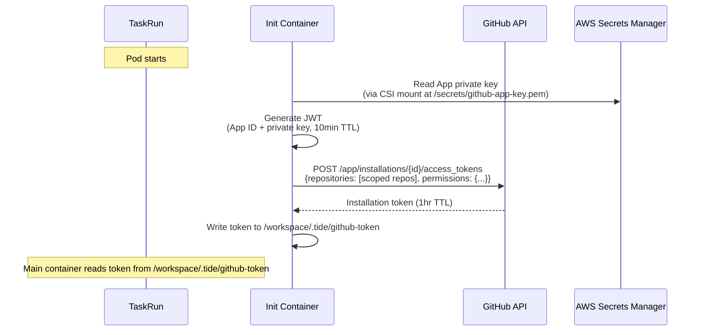
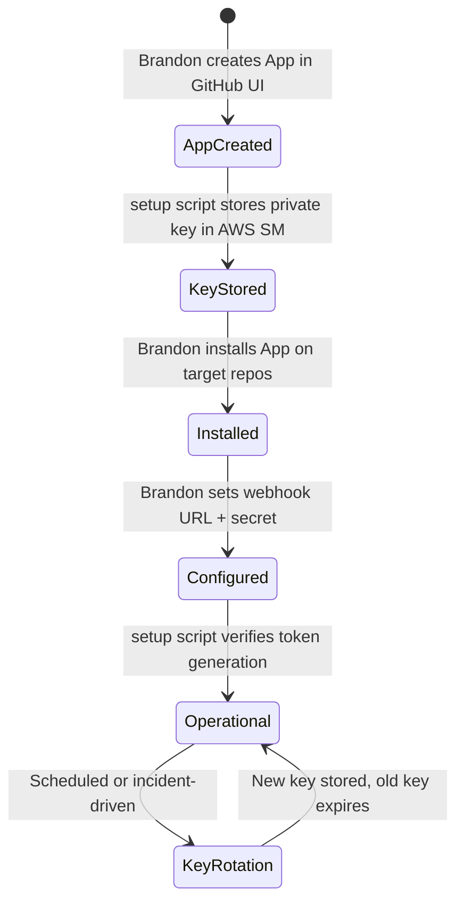

# Component: GitHub App + Agent Identity Model

**Date:** 2026-04-02
**Status:** Draft

---

## Owner

Platform Engineer

## Phase

MVP (pre-Phase 1) -- prerequisite for Tekton-driven agent loop

## Purpose

Defines the GitHub App configuration, per-agent identity model, setup automation, and security boundaries that give Tide agents their own GitHub identity. Currently Brandon's personal account is used for all agent-generated PRs, comments, and feedback reads. This design replaces that with a GitHub App whose installation tokens authenticate agent operations, giving each agent a distinct commit author, enabling webhook-driven automation, and scoping access to only the repos each agent needs.

**Business needs served:**
- #1 -- Agents must read PR threads and post structured reviews under their own identity
- #3, #4 -- Agents must push code to workspace repos and open PRs to deliverables repos
- Prerequisite for all automated agent work; without this, every agent action requires Brandon to copy-paste

---

## Dependencies

### External Systems Consumed

| System | Interface | Notes |
|--------|-----------|-------|
| GitHub REST API v3 | HTTPS on `api.github.com` | App management, installation token generation, repo operations |
| GitHub Apps | OAuth-like JWT flow | App authenticates with JWT, exchanges for scoped installation tokens |
| AWS Secrets Manager | HTTPS via `aws secretsmanager` CLI | Store App private key, webhook secret, installation ID |
| `gh` CLI | Local tool, v2.40+ | Used by setup script for API calls |

### Internal Tide Components Consumed

| Component | Interface | Notes |
|-----------|-----------|-------|
| Interface Registry | `env_vars.required.TIDE_GITHUB_APP_INSTALLATION_ID` | The installation ID produced by this setup is what the Operator (or Tekton pipeline) injects into agent TaskRuns |
| K8s Platform Manifests | SecretProviderClass `tide/agents/{name}/github-app-key` | The App private key must be stored at this path for CSI to mount it |

### Interface Registry Gap

> **Finding:** `TIDE_GITHUB_APP_ID` is used by both runtime LLDs (`lld-agent-review-runtime.md`, `lld-agent-execution-runtime.md`) and the Operator LLD, but is **missing from the interface registry** (`tide/interface-registry.yaml`). The registry only has `TIDE_GITHUB_APP_INSTALLATION_ID`. Both env vars are needed for the JWT-to-installation-token flow: `TIDE_GITHUB_APP_ID` for JWT generation (the `iss` claim), `TIDE_GITHUB_APP_INSTALLATION_ID` for the token exchange endpoint. The registry should be updated to add `TIDE_GITHUB_APP_ID` to the `env_vars.required` section.

### GitHub Organization Model

The App is registered under the `sei-protocol` org (not a separate org). Tide repos live as `sei-protocol/tide-*` repos:

| Repo | Purpose | App Access |
|------|---------|------------|
| `sei-protocol/tide-proposals` | Design specs, reviews | Read + Write |
| `sei-protocol/tide-deliverables` | Merged agent output | Read + Write (PR only, branch protection on main) |
| `sei-protocol/tide-workspace-{name}` | Per-agent workspace repos | Read + Write |
| `sei-protocol/tide-repo` | This repo (infrastructure, specs) | None (agents cannot access) |

A `sei-protocol/tide-maintainers` GitHub Team governs human admin access to Tide repos. The App controls agent access — teams are for humans, not bots.

The App is installed only on Tide repos (Settings > Installations > "Only select repositories"). It has zero access to `sei-chain`, `sei-cosmos`, or any other `sei-protocol` repo.

### Explicit Exclusions

- Does NOT create GitHub user accounts for agents (agents act through the App identity)
- Does NOT configure Tekton EventListeners (that is Deliverable 2)
- Does NOT set up AWS KMS keys or Sei wallets (separate provisioning)

---

## Interface Specification

### GitHub App Configuration

#### App Registration

| Field | Value |
|-------|-------|
| **App name** | `tide-council-bot` |
| **Description** | Tide AI agent council -- automated design reviews, code execution, and on-chain attestation for the Sei ecosystem |
| **Homepage URL** | `https://github.com/sei-protocol` (registered under the existing org; no dedicated site needed for MVP) |
| **Webhook URL** | `https://tide-events.{cluster}/github` (placeholder, replaced during setup with actual Tekton EventListener ingress) |
| **Webhook secret** | Generated during setup, stored in AWS Secrets Manager at `tide/github/webhook-secret` |

#### Permissions (Minimal Set)

Repository permissions:

| Permission | Access | Justification |
|------------|--------|---------------|
| **Contents** | Read & Write | Clone repos, push commits to workspace branches, read design docs |
| **Pull requests** | Read & Write | Open PRs, post review comments, read PR thread for context |
| **Issues** | Read & Write | Read issue comments (used as feedback channel), post status updates |
| **Metadata** | Read-only | Required by GitHub for all Apps (implicit) |
| **Checks** | Read & Write | Post check runs for agent task status (optional but useful for visibility) |

Organization permissions:

| Permission | Access | Justification |
|------------|--------|---------------|
| **Members** | Read-only | Verify that comment authors are org members before treating as instructions (anti-spam) |

**Permissions NOT requested** (YAGNI):
- Administration -- agents must never modify repo settings
- Webhooks -- managed by the App itself, not per-repo
- Actions -- agents do not trigger GitHub Actions
- Packages -- no container registry access needed
- Secrets -- agents must never read repo secrets

#### Webhook Event Subscriptions

| Event | Trigger | Agent Action |
|-------|---------|-------------|
| `pull_request` | PR opened, closed, labeled, synchronize | `opened` + label `tide/design` triggers review council; `closed` (merged) can trigger post-merge hooks |
| `issue_comment` | Comment created on issue or PR | Brandon's comments on Tide PRs trigger agent iteration; agent reads the comment as new instructions |
| `pull_request_review` | Review submitted | Brandon's `approve` triggers on-chain attestation flow |
| `pull_request_review_comment` | Inline review comment | Agents read inline comments as targeted feedback for specific code sections |

Events NOT subscribed (reduce noise):
- `push` -- agents do not react to raw pushes; they react to PR events
- `create`/`delete` -- branch lifecycle is managed by agents themselves
- `deployment`/`status` -- not relevant to agent workflow
- `star`/`fork`/`watch` -- noise

### Per-Agent Identity Model

#### Recommendation: Single App, Per-Agent Namespacing

**Decision:** One GitHub App (`tide-council-bot`) shared by all agent personas, with per-agent identity expressed through commit metadata and PR comment signatures.

**Why not multiple Apps?**
- GitHub Apps are heavyweight to create and manage (each needs its own private key, webhook config, installation)
- GitHub rate limits are per-installation, not per-App -- a single installation with 5 agents shares the same 5000 requests/hour pool, which is more than sufficient for MVP
- Adding a new agent persona requires no GitHub configuration changes

**Why not multiple bot user accounts?**
- GitHub ToS discourages automated accounts that aren't Apps; each bot user consumes a paid org seat
- User accounts need passwords, 2FA, email addresses, and SAML SSO enrollment if the org enforces it -- operational overhead
- No programmatic way to create them

**How agents are distinguished within the single App:**

| Dimension | Implementation |
|-----------|---------------|
| **Git commit author** | `Tide {AgentName} <tide-{agent-name}@sei.io>` (e.g., `Tide Platform Engineer <tide-platform-engineer@sei.io>`) |
| **PR comments** | Each comment starts with a header: `**[tide/{agent-name}]**` followed by the content |
| **Branch naming** | `tide/{agent-name}/{task-slug}` (e.g., `tide/reviewer/proposal-42-review`) |
| **Labels on PRs** | `tide/agent:{agent-name}` label added to PRs the agent creates |
| **Commit trailers** | `Tide-Agent: {agent-name}` trailer in every commit message |

**Agent persona table:**

| Persona | `agent-name` | Git Author | Scope |
|---------|-------------|------------|-------|
| Blockchain Developer | `blockchain-dev` | `Tide Blockchain Dev <tide-blockchain-dev@sei.io>` | Contract reviews, Solidity execution |
| Kubernetes Specialist | `k8s-specialist` | `Tide K8s Specialist <tide-k8s-specialist@sei.io>` | Operator reviews, K8s execution |
| Platform Engineer | `platform-eng` | `Tide Platform Eng <tide-platform-eng@sei.io>` | Runtime reviews, Python execution |
| Coordinator | `coordinator` | `Tide Coordinator <tide-coordinator@sei.io>` | Orchestrates review rounds, synthesizes |
| Reviewer | `reviewer` | `Tide Reviewer <tide-reviewer@sei.io>` | Cross-component review verification |

#### Token Generation Flow



The init container pattern is consistent with the interface registry: `git_token_path: "/workspace/.tide/github-token"`.

Installation tokens are scoped at generation time to specific repositories and permissions, narrower than the App's full permissions.

---

## Setup Script Design

### Script: `scripts/setup-github-app.sh`

#### What the script does vs what Brandon does manually

| Step | Who | How |
|------|-----|-----|
| 1. Create the GitHub App | **Brandon (manual)** | GitHub UI at `https://github.com/organizations/sei-protocol/settings/apps/new` -- must be done in browser for the OAuth flow. The App is org-owned, not tied to any personal account. |
| 2. Download the private key | **Brandon (manual)** | GitHub UI, immediately after App creation |
| 3. Store the private key in AWS SM | **Script** | `aws secretsmanager create-secret --name tide/github/app-private-key --secret-string file://key.pem` |
| 4. Install the App on the org | **Brandon (manual)** | GitHub UI, select which repos |
| 5. Record App ID and Installation ID | **Script** | `gh api /app` (authenticated with the private key) |
| 6. Generate and store webhook secret | **Script** | `openssl rand -hex 32`, store in AWS SM |
| 7. Configure webhook URL | **Brandon (manual)** | GitHub UI, paste the Tekton EventListener URL |
| 8. Store all IDs in AWS SM | **Script** | Structured paths per interface registry |
| 9. Create per-agent secrets | **Script** | Copy shared App key to per-agent paths (CSI expects per-agent paths) |
| 10. Verify installation | **Script** | `gh api /app/installations` and test token generation |

#### Script Interface

```bash
#!/usr/bin/env bash
# scripts/setup-github-app.sh
#
# Usage:
#   ./scripts/setup-github-app.sh \
#     --org sei-protocol \
#     --app-id 123456 \
#     --private-key-file ./tide-council-bot.pem \
#     --installation-id 78901234 \
#     --webhook-secret "$(openssl rand -hex 32)" \
#     --aws-region us-west-2 \
#     --agents "blockchain-dev,k8s-specialist,platform-eng,coordinator,reviewer" \
#     --repos "tide-proposals,tide-deliverables,tide-workspace-blockchain-dev,tide-workspace-k8s-specialist,tide-workspace-platform-eng"
#
# Prerequisites:
#   - gh CLI authenticated with org admin access
#   - aws CLI configured with permissions to write to Secrets Manager
#   - GitHub App already created in the org (manual step)
#   - App private key downloaded (manual step)
#   - App installed on target repos (manual step)
```

#### Inputs

| Flag | Required | Description |
|------|----------|-------------|
| `--org` | Yes | GitHub organization name (e.g., `sei-protocol`) |
| `--app-id` | Yes | GitHub App ID (from App settings page after creation) |
| `--private-key-file` | Yes | Path to the downloaded PEM private key file |
| `--installation-id` | Yes | Installation ID (visible in App settings > Installations) |
| `--webhook-secret` | Yes | Pre-generated webhook secret (script stores it; Brandon pastes it into GitHub UI) |
| `--aws-region` | Yes | AWS region for Secrets Manager |
| `--agents` | Yes | Comma-separated list of agent short names |
| `--repos` | Yes | Comma-separated list of repos to include in the installation |

#### Outputs (AWS Secrets Manager Paths)

| Secret Path | Content | Consumed By |
|-------------|---------|-------------|
| `tide/github/app-id` | App ID (plaintext integer) | Init container JWT generation |
| `tide/github/app-private-key` | PEM-encoded RSA private key | Init container JWT generation |
| `tide/github/installation-id` | Installation ID (plaintext integer) | Init container token exchange |
| `tide/github/webhook-secret` | Webhook HMAC secret (hex string) | Tekton EventListener interceptor |
| `tide/agents/{name}/github-app-key` | Copy of App private key (per-agent) | CSI mount per SecretProviderClass |

The per-agent key copies exist because each agent's SecretProviderClass references `tide/agents/{name}/github-app-key` (see interface registry `volume_mounts.secrets.files`). All copies reference the same underlying App, but per-agent paths allow future rotation to per-agent keys if needed (two-way door).

#### Script Actions (Pseudocode)

```bash
main() {
    validate_prerequisites  # Check gh, aws, jq are installed
    validate_inputs         # All required flags present

    # Store secrets
    store_secret "tide/github/app-id" "$APP_ID"
    store_secret "tide/github/app-private-key" "$(cat $PRIVATE_KEY_FILE)"
    store_secret "tide/github/installation-id" "$INSTALLATION_ID"
    store_secret "tide/github/webhook-secret" "$WEBHOOK_SECRET"

    # Per-agent key copies
    for agent in $(echo "$AGENTS" | tr ',' '\n'); do
        store_secret "tide/agents/${agent}/github-app-key" "$(cat $PRIVATE_KEY_FILE)"
    done

    # Verify: generate a JWT and exchange for an installation token
    JWT=$(generate_jwt "$APP_ID" "$PRIVATE_KEY_FILE")
    TOKEN=$(curl -s -X POST \
        -H "Authorization: Bearer $JWT" \
        -H "Accept: application/vnd.github+json" \
        "https://api.github.com/app/installations/${INSTALLATION_ID}/access_tokens" \
        | jq -r '.token')

    if [ "$TOKEN" = "null" ] || [ -z "$TOKEN" ]; then
        echo "ERROR: Failed to generate installation token. Check App ID and installation."
        exit 1
    fi

    echo "SUCCESS: Installation token generated. App is correctly configured."
    echo ""
    echo "Manual steps remaining:"
    echo "  1. Set webhook URL in GitHub App settings to your Tekton EventListener URL"
    echo "  2. Set webhook secret in GitHub App settings to the value stored in tide/github/webhook-secret"
    echo "  3. Ensure the App is installed on repos: $REPOS"
}

generate_jwt() {
    local app_id="$1"
    local key_file="$2"
    local now=$(date +%s)
    local iat=$((now - 60))
    local exp=$((now + 600))

    local header=$(echo -n '{"alg":"RS256","typ":"JWT"}' | base64url)
    local payload=$(echo -n "{\"iat\":${iat},\"exp\":${exp},\"iss\":\"${app_id}\"}" | base64url)
    local signature=$(echo -n "${header}.${payload}" | openssl dgst -sha256 -sign "$key_file" | base64url)

    echo "${header}.${payload}.${signature}"
}

store_secret() {
    local name="$1"
    local value="$2"

    # Create or update
    aws secretsmanager create-secret \
        --name "$name" \
        --secret-string "$value" \
        --region "$AWS_REGION" 2>/dev/null \
    || aws secretsmanager update-secret \
        --secret-id "$name" \
        --secret-string "$value" \
        --region "$AWS_REGION"
}
```

---

## Security Boundaries

### Repository Access Scoping

Installation tokens are generated with repository-scoped permissions. The init container requests tokens scoped to only the repos the agent needs for its current task.

| Repo Type | Example | Agent Access | Justification |
|-----------|---------|-------------|---------------|
| **Proposals** | `sei-protocol/tide-proposals` | Read | Agents read design docs for review; push reviews back as PR comments or committed files |
| **Agent workspace** | `sei-protocol/tide-workspace-{name}` | Read + Write | Each agent has its own workspace repo for execution tasks. Code is pushed here during implementation. |
| **Deliverables** | `sei-protocol/tide-deliverables` | Read + Write (PR only) | Agents open PRs from workspace branches. Cannot push directly to `main` (branch protection). |
| **Main repo** | `sei-protocol/tide-repo` | None | Agents cannot push to the main infrastructure repo. Brandon merges manually. |

Token scoping at generation time:

```json
{
  "repositories": ["proposals", "agent-platform-eng"],
  "permissions": {
    "contents": "write",
    "pull_requests": "write",
    "issues": "read"
  }
}
```

The init container selects repositories based on the `TIDE_RUNTIME_MODE` env var:
- `review` mode: `[TIDE_PROPOSALS_REPO]`
- `execution` mode: `[TIDE_UPSTREAM_REPO, TIDE_WORKSPACE_REPO, TIDE_DELIVERABLES_REPO]`

### Token Lifetime and Rotation

| Token Type | Lifetime | Rotation |
|------------|----------|----------|
| GitHub App JWT | 10 minutes (max allowed) | Generated fresh per TaskRun by init container |
| Installation token | 1 hour (GitHub-enforced) | Generated fresh per TaskRun; most tasks complete within 50 minutes |
| App private key | Indefinite | Rotate via GitHub UI + re-run setup script; zero-downtime because old key stays valid for 24h after new key is created |
| Webhook secret | Indefinite | Rotate via GitHub UI + update AWS SM + restart EventListener |

**If a TaskRun exceeds 1 hour:** The agent runtime should detect 401 responses from GitHub and attempt a token refresh using the mounted private key. This is a soft failure (exit code 20, retryable) if the refresh also fails.

### Blast Radius Analysis

#### Scenario: Installation token leaked from a running pod

| Risk | Mitigation |
|------|-----------|
| Token can access repos in the installation scope | Token is scoped to specific repos at generation time, not all repos in the installation |
| Token can push code | Branch protection on `main` in all repos; agent can only push to feature branches |
| Token can open PRs | PRs require human approval before merge (human checkpoint gate) |
| Token can read private repo contents | Agents only have access to Tide-specific repos, not the broader org |
| **Expires in 1 hour** | Even if leaked, the window of exploitation is limited |

#### Scenario: App private key leaked from Secrets Manager

| Risk | Mitigation |
|------|-----------|
| Attacker can generate installation tokens for any scoped repo | CRITICAL: Rotate key immediately via GitHub UI. Old key invalidated within 24h. |
| Attacker can impersonate the App | Webhook secret (separate secret) prevents forged webhook deliveries |
| **Blast radius: all repos in the App installation** | This is why the App should NOT be installed on repos outside the Tide org |

**Incident response for key compromise:**
1. Rotate the App private key in GitHub UI (generates new key, old key valid for 24h)
2. Update AWS Secrets Manager with new key: `aws secretsmanager update-secret`
3. Re-run setup script `--private-key-file` with the new key
4. Audit GitHub audit log for unexpected token generations during the compromise window
5. Revoke any active installation tokens (GitHub does this automatically when the key is rotated)

#### Scenario: Webhook secret leaked

| Risk | Mitigation |
|------|-----------|
| Attacker can send forged webhook events to Tekton EventListener | Rotate the secret in both GitHub UI and AWS SM |
| Forged events could trigger unauthorized agent TaskRuns | EventListener also validates that the event references a real PR/comment (secondary check) |
| **Blast radius: can trigger agent runs, but agents are sandboxed** | Network policies, RBAC, and repo scoping limit what a triggered agent can do |

---

## State Model



---

## Internal Design

### Init Container for Token Generation

Every agent TaskRun includes an init container that generates a GitHub installation token and writes it to the shared workspace volume. This follows the pattern established in the interface registry (`git_token_path: "/workspace/.tide/github-token"`).

```python
#!/usr/bin/env python3
"""init-github-token.py -- Generate GitHub App installation token."""

import json
import os
import time
import jwt  # PyJWT
import requests

def main():
    app_id = os.environ["TIDE_GITHUB_APP_ID"]
    installation_id = os.environ["TIDE_GITHUB_APP_INSTALLATION_ID"]
    key_path = "/secrets/github-app-key.pem"
    token_path = "/workspace/.tide/github-token"

    # Read private key
    with open(key_path) as f:
        private_key = f.read()

    # Generate JWT (10 min TTL)
    now = int(time.time())
    payload = {
        "iat": now - 60,   # Clock skew allowance
        "exp": now + 600,  # 10 minutes
        "iss": int(app_id),
    }
    encoded_jwt = jwt.encode(payload, private_key, algorithm="RS256")

    # Exchange JWT for installation token
    # Scope to specific repos based on runtime mode
    runtime_mode = os.environ.get("TIDE_RUNTIME_MODE", "review")
    repos = _get_repo_list(runtime_mode)

    body = {}
    if repos:
        body["repositories"] = repos

    resp = requests.post(
        f"https://api.github.com/app/installations/{installation_id}/access_tokens",
        headers={
            "Authorization": f"Bearer {encoded_jwt}",
            "Accept": "application/vnd.github+json",
            "X-GitHub-Api-Version": "2022-11-28",
        },
        json=body,
    )
    resp.raise_for_status()
    token = resp.json()["token"]

    # Write token to workspace
    os.makedirs(os.path.dirname(token_path), exist_ok=True)
    with open(token_path, "w") as f:
        f.write(token)
    os.chmod(token_path, 0o600)

    print(f"Token generated, expires at {resp.json()['expires_at']}")


def _get_repo_list(mode: str) -> list[str]:
    """Extract repo short names from env vars."""
    repos = []
    if mode == "review":
        repo = os.environ.get("TIDE_PROPOSALS_REPO", "")
        if "/" in repo:
            repos.append(repo.split("/")[1])
    elif mode == "execution":
        for var in ["TIDE_UPSTREAM_REPO", "TIDE_WORKSPACE_REPO", "TIDE_DELIVERABLES_REPO"]:
            repo = os.environ.get(var, "")
            if "/" in repo:
                repos.append(repo.split("/")[1])
    return repos


if __name__ == "__main__":
    main()
```

### Git Configuration in Main Container

After the init container writes the token, the main container configures git to use it:

```bash
# Set in container entrypoint
git config --global credential.helper '!f() { echo "password=$(cat /workspace/.tide/github-token)"; }; f'
git config --global user.name "Tide ${TIDE_AGENT_NAME}"
git config --global user.email "tide-${TIDE_AGENT_NAME}@sei.io"
```

---

## Error Handling

| Error | Detection | Exit Code | Recovery |
|-------|-----------|-----------|----------|
| Private key not mounted at `/secrets/github-app-key.pem` | Init container file read fails | 11 | Check SecretProviderClass and AWS SM |
| `TIDE_GITHUB_APP_ID` or `TIDE_GITHUB_APP_INSTALLATION_ID` not set | Init container env check | 10 | Fix TaskRun template env vars |
| JWT generation fails (invalid key format) | PyJWT raises `ValueError` | 11 | Re-download key from GitHub App settings |
| Installation token exchange returns 401 | HTTP status check | 20 (retryable) | Check App ID, installation ID, key validity |
| Installation token exchange returns 403 (suspended App) | HTTP status check | 1 (permanent) | Re-enable App in GitHub org settings |
| Token file write fails (filesystem) | OS error | 1 | Check volume mount configuration |

---

## Test Specification

### T1: Setup Script -- Happy Path

**Setup:** GitHub App created, private key downloaded, App installed on repos.
**Action:** Run `setup-github-app.sh` with valid inputs.
**Expected:** All secrets stored in AWS SM. Verification step generates a valid installation token. Exit 0.

### T2: Setup Script -- Invalid Private Key

**Setup:** Provide a malformed PEM file.
**Action:** Run `setup-github-app.sh`.
**Expected:** Verification step fails with clear error message about JWT generation. Exit 1.

### T3: Init Container -- Token Generation

**Setup:** Pod with CSI-mounted private key, correct env vars.
**Action:** Init container runs.
**Expected:** `/workspace/.tide/github-token` contains a valid token. File permissions are 0600.

### T4: Init Container -- Missing Private Key

**Setup:** Pod without CSI mount (simulating mount failure).
**Action:** Init container runs.
**Expected:** Exit code 11. Termination message indicates missing secret file.

### T5: Token Scoping -- Review Mode

**Setup:** `TIDE_RUNTIME_MODE=review`, `TIDE_PROPOSALS_REPO=sei-protocol/tide-proposals`.
**Action:** Init container generates token.
**Expected:** Token is scoped to `proposals` repo only. Attempting to access `deliverables` repo with this token returns 403.

### T6: Token Scoping -- Execution Mode

**Setup:** `TIDE_RUNTIME_MODE=execution`, workspace and deliverables repos set.
**Action:** Init container generates token.
**Expected:** Token is scoped to workspace and deliverables repos.

### T7: Agent Identity in Commits

**Setup:** Agent `platform-eng` pushes a commit.
**Action:** Inspect the commit on GitHub.
**Expected:** Author is `Tide Platform Eng <tide-platform-eng@sei.io>`. Commit message contains `Tide-Agent: platform-eng` trailer.

---

## Deployment

### Pre-requisites (Manual, One-Time)

1. Brandon creates the GitHub App in the `sei-protocol` org via browser
2. Brandon downloads the private key PEM file
3. Brandon installs the App on target repos
4. Brandon notes the App ID and Installation ID from the settings page

### Automated Setup

```bash
./scripts/setup-github-app.sh \
  --org sei-protocol \
  --app-id $APP_ID \
  --private-key-file ./tide-council-bot.pem \
  --installation-id $INSTALLATION_ID \
  --webhook-secret "$(openssl rand -hex 32)" \
  --aws-region us-west-2 \
  --agents "blockchain-dev,k8s-specialist,platform-eng,coordinator,reviewer" \
  --repos "tide-proposals,tide-deliverables,tide-workspace-blockchain-dev,tide-workspace-k8s-specialist,tide-workspace-platform-eng"
```

### Post-Setup

1. Set webhook URL in GitHub App settings to the Tekton EventListener URL
2. Set webhook secret in GitHub App settings to the value generated above
3. Verify by opening a test PR with the `tide/design` label -- should trigger a webhook delivery visible in the App's advanced settings

---

## Deferred (Do Not Build)

| Feature | Rationale |
|---------|-----------|
| Per-agent GitHub Apps | Single App is sufficient for 5 agents. Per-agent Apps add operational overhead without security benefit (tokens are already repo-scoped at generation time). Revisit if agent count exceeds ~20. |
| GitHub App Manifest flow (`POST /app-manifests/{code}/conversions`) | Automates App creation but requires a web server for the OAuth callback. Manual creation is a one-time task. |
| Fine-grained PATs as alternative | GitHub Apps are the recommended path for server-to-server auth. PATs are tied to user accounts and have broader default scope. |
| Automatic key rotation | Manual rotation is acceptable for MVP. Automate when operating at scale. |
| Per-agent installation IDs | Single installation covers all repos. Per-agent installations would require the App to be installed separately per repo set, which GitHub does not support for org-level installs. |
| Webhook IP allowlisting | GitHub publishes webhook IP ranges, but filtering at the ingress level adds complexity. HMAC signature verification is sufficient for MVP. |
