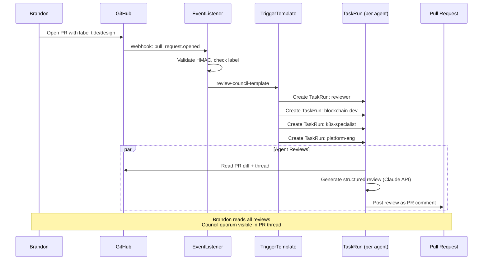
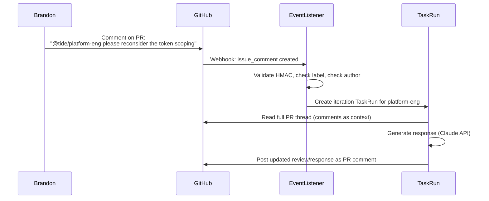
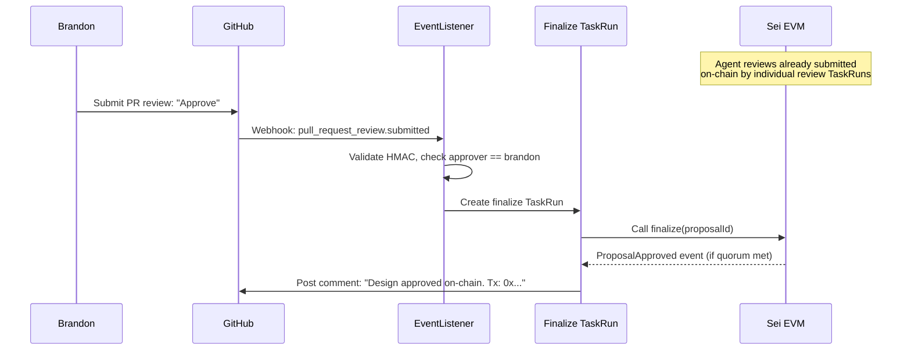
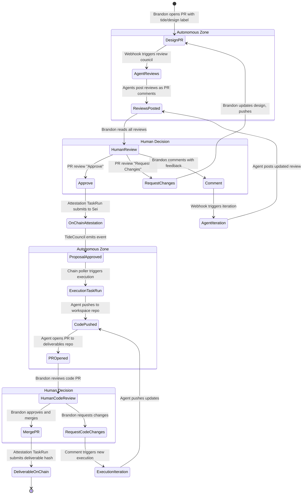
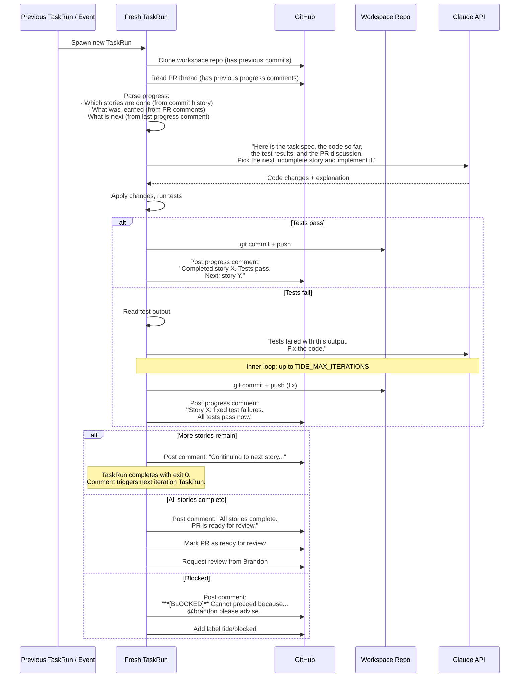

# Component: Tekton Pipeline + Sandboxing + Human Checkpoints

**Date:** 2026-04-02
**Status:** Draft

---

## Owner

Platform Engineer

## Phase

MVP -- replaces the planned Go operator with a Tekton-driven event loop. The full Tide Operator (`lld-tide-operator.md`) is deferred until after MVP validates the workflow.

## Purpose

A Tekton-based event-driven pipeline that receives GitHub webhooks and on-chain event POSTs, maps them to agent TaskRuns, sandboxes agent execution, and enforces human checkpoint gates before irreversible actions (on-chain attestation, deliverable merge). Inspired by the Ralph pattern (stateless agent iteration via filesystem artifacts) but adapted for multiplayer PR-based collaboration with on-chain attestation on Sei EVM.

**Business needs served:**
- #1 -- Present designs to agent council and collect structured feedback (triggered by PR events)
- #2 -- Reach quorum and attest on-chain (triggered by human approval)
- #3 -- Decompose approved designs into funded jobs (triggered by on-chain ProposalApproved)
- #4 -- Execute jobs in isolated sandboxes (triggered by on-chain SandboxProvisionRequested)

---

## Dependencies

### External Systems Consumed

| System | Interface | Notes |
|--------|-----------|-------|
| Tekton Pipelines | `tekton.dev/v1` API (v0.56+) | TaskRun, PipelineRun, EventListener, TriggerBinding, TriggerTemplate, Interceptor CRDs |
| Tekton Triggers | `triggers.tekton.dev/v1beta1` | EventListener, TriggerBinding, TriggerTemplate, Interceptors |
| GitHub Webhooks | HTTPS POST with HMAC-SHA256 signature | Delivered to Tekton EventListener ingress |
| Sei EVM RPC | JSON-RPC 2.0 over HTTPS | On-chain event polling (no WebSocket needed for MVP; a lightweight cron polls for events) |
| AWS Secrets Store CSI Driver | `secrets-store.csi.x-k8s.io/v1` | Mounts secrets into agent pods |
| AWS KMS | HTTPS | EIP-712 signing for on-chain attestation |

### Internal Tide Components Consumed

| Component | Interface | Reference |
|-----------|-----------|-----------|
| GitHub App (`github-app-setup.md`) | Installation tokens, webhook secret | Webhook HMAC validation, agent GitHub operations |
| Interface Registry | Env vars, exit codes, volume mounts, secret paths | All agent TaskRun specs match the registry |
| K8s Platform Manifests | Namespace `tide-agents`, NetworkPolicies, SecretProviderClasses | Agent pods run in the sandbox namespace |

### Interface Registry Findings

> **Finding 1:** `TIDE_GITHUB_APP_ID` is not in the interface registry but is used by all runtime LLDs and the Operator LLD. The TaskRun specs in this document use it for the init container JWT flow. The registry should be updated. See `github-app-setup.md` for details.
>
> **Finding 2:** The interface registry names the KMS env var `TIDE_KMS_KEY_ID`, while the review and execution runtime LLDs use `TIDE_KMS_KEY_ARN`. This document follows the registry name (`TIDE_KMS_KEY_ID`). The runtime LLDs should be updated to match the registry, per the working agreement that the registry is authoritative.

### Explicit Exclusions

- Does NOT include the full Tide Operator (Go binary, CRDs, event indexer). This Tekton pipeline is the MVP replacement.
- Does NOT include the TideCouncil or TideJobHook contracts (those exist independently).
- Does NOT include a web UI or dashboard.
- Does NOT include automated evaluator contracts (human evaluation for MVP).

---

## Interface Specification

### Tekton Resource Inventory

```
manifests/tekton/
  base/
    kustomization.yaml
    namespace.yaml                    # tekton-tide namespace for pipeline resources
    rbac/
      eventlistener-sa.yaml           # SA for EventListener + Triggers
      eventlistener-roles.yaml        # Create TaskRuns in tide-agents
    eventlistener/
      eventlistener.yaml              # Main webhook receiver
      github-trigger-binding.yaml     # Extract fields from GitHub events
      chain-trigger-binding.yaml      # Extract fields from on-chain event POSTs
    triggers/
      review-trigger-template.yaml    # Stamps out review TaskRuns
      iteration-trigger-template.yaml # Stamps out iteration TaskRuns
      execution-trigger-template.yaml # Stamps out execution TaskRuns
      approval-trigger-template.yaml  # Stamps out on-chain attestation TaskRun
    tasks/
      agent-review-task.yaml          # Review runtime Task definition
      agent-iteration-task.yaml       # Iteration (continue from comment) Task
      agent-execution-task.yaml       # Execution runtime Task definition
      chain-attestation-task.yaml     # On-chain submission Task
      chain-event-poller-task.yaml    # Polls Sei RPC for events
    pipelines/
      review-council-pipeline.yaml    # Fan-out to multiple review agents
    interceptors/
      github-webhook-interceptor.yaml # HMAC validation + event filtering
    cronruns/
      chain-poller-cronrun.yaml       # Periodic on-chain event poll
  overlays/
    testnet/
      kustomization.yaml
      configmap-patch.yaml            # Testnet chain ID, RPC URL, contract addresses
    mainnet/
      kustomization.yaml
      configmap-patch.yaml
```

### Namespace

```yaml
apiVersion: v1
kind: Namespace
metadata:
  name: tekton-tide
  labels:
    app.kubernetes.io/part-of: tide
    tide.sei.io/component: pipeline
    pod-security.kubernetes.io/enforce: baseline
    pod-security.kubernetes.io/enforce-version: latest
```

Tekton pipeline resources (EventListeners, TriggerTemplates) live in `tekton-tide`. Agent TaskRuns are created in `tide-agents` (existing namespace from K8s platform manifests).

---

## EventListener Configuration

### EventListener

```yaml
apiVersion: triggers.tekton.dev/v1beta1
kind: EventListener
metadata:
  name: tide-github
  namespace: tekton-tide
  labels:
    app.kubernetes.io/part-of: tide
    app.kubernetes.io/component: event-listener
spec:
  serviceAccountName: tide-eventlistener
  triggers:
    # --- GitHub webhook triggers ---
    - name: design-review
      interceptors:
        - ref:
            name: github-hmac
          params:
            - name: secretRef
              value:
                secretName: tide-webhook-secret
                secretKey: webhook-secret
            - name: eventTypes
              value: ["pull_request"]
        - ref:
            name: cel
          params:
            - name: filter
              value: >-
                body.action in ['opened', 'labeled'] &&
                body.pull_request.labels.exists(l, l.name == 'tide/design')
            - name: overlays
              value:
                - key: pr_number
                  expression: "string(body.pull_request.number)"
                - key: repo_full_name
                  expression: "body.repository.full_name"
                - key: design_branch
                  expression: "body.pull_request.head.ref"
      bindings:
        - ref: github-pr-binding
      template:
        ref: review-council-template

    - name: agent-feedback
      interceptors:
        - ref:
            name: github-hmac
          params:
            - name: secretRef
              value:
                secretName: tide-webhook-secret
                secretKey: webhook-secret
            - name: eventTypes
              value: ["issue_comment"]
        - ref:
            name: cel
          params:
            - name: filter
              value: >-
                body.action == 'created' &&
                has(body.issue.pull_request) &&
                body.issue.labels.exists(l, l.name == 'tide/design' || l.name == 'tide/execution') &&
                !(body.comment.performed_via_github_app != null &&
                  body.comment.performed_via_github_app.slug == 'tide-council-bot') &&
                body.comment.author_association in ['OWNER', 'MEMBER']
            - name: overlays
              value:
                - key: pr_number
                  expression: "string(body.issue.number)"
                - key: repo_full_name
                  expression: "body.repository.full_name"
                - key: comment_body
                  expression: "body.comment.body"
                - key: comment_author
                  expression: "body.comment.user.login"
      bindings:
        - ref: github-comment-binding
      template:
        ref: iteration-trigger-template

    - name: pr-approval
      interceptors:
        - ref:
            name: github-hmac
          params:
            - name: secretRef
              value:
                secretName: tide-webhook-secret
                secretKey: webhook-secret
            - name: eventTypes
              value: ["pull_request_review"]
        - ref:
            name: cel
          params:
            - name: filter
              value: >-
                body.action == 'submitted' &&
                body.review.state == 'approved' &&
                body.pull_request.labels.exists(l, l.name == 'tide/design') &&
                body.review.user.login == 'brandon'
            - name: overlays
              value:
                - key: pr_number
                  expression: "string(body.pull_request.number)"
                - key: repo_full_name
                  expression: "body.repository.full_name"
                - key: approver
                  expression: "body.review.user.login"
      bindings:
        - ref: github-review-binding
      template:
        ref: approval-trigger-template

    # --- On-chain event triggers (from poller) ---
    - name: proposal-approved
      interceptors:
        - ref:
            name: cel
          params:
            - name: filter
              value: >-
                header.match('X-Tide-Event', 'ProposalApproved')
            - name: overlays
              value:
                - key: proposal_id
                  expression: "body.proposalId"
                - key: design_hash
                  expression: "body.designHash"
      bindings:
        - ref: chain-event-binding
      template:
        ref: execution-trigger-template

    - name: sandbox-requested
      interceptors:
        - ref:
            name: cel
          params:
            - name: filter
              value: >-
                header.match('X-Tide-Event', 'SandboxProvisionRequested')
            - name: overlays
              value:
                - key: job_id
                  expression: "body.jobId"
                - key: agent_token_id
                  expression: "body.agentTokenId"
                - key: budget
                  expression: "body.budget"
      bindings:
        - ref: chain-event-binding
      template:
        ref: execution-trigger-template
  resources:
    kubernetesResource:
      spec:
        template:
          spec:
            serviceAccountName: tide-eventlistener
            containers:
              - resources:
                  requests:
                    cpu: 100m
                    memory: 128Mi
                  limits:
                    cpu: 250m
                    memory: 256Mi
```

### TriggerBindings

#### GitHub PR Binding

```yaml
apiVersion: triggers.tekton.dev/v1beta1
kind: TriggerBinding
metadata:
  name: github-pr-binding
  namespace: tekton-tide
spec:
  params:
    - name: pr-number
      value: $(extensions.pr_number)
    - name: repo-full-name
      value: $(extensions.repo_full_name)
    - name: design-branch
      value: $(extensions.design_branch)
    - name: pr-title
      value: $(body.pull_request.title)
    - name: pr-url
      value: $(body.pull_request.html_url)
    - name: sender
      value: $(body.sender.login)
```

#### GitHub Comment Binding

```yaml
apiVersion: triggers.tekton.dev/v1beta1
kind: TriggerBinding
metadata:
  name: github-comment-binding
  namespace: tekton-tide
spec:
  params:
    - name: pr-number
      value: $(extensions.pr_number)
    - name: repo-full-name
      value: $(extensions.repo_full_name)
    - name: comment-body
      value: $(extensions.comment_body)
    - name: comment-author
      value: $(extensions.comment_author)
```

#### GitHub Review Binding

```yaml
apiVersion: triggers.tekton.dev/v1beta1
kind: TriggerBinding
metadata:
  name: github-review-binding
  namespace: tekton-tide
spec:
  params:
    - name: pr-number
      value: $(extensions.pr_number)
    - name: repo-full-name
      value: $(extensions.repo_full_name)
    - name: approver
      value: $(extensions.approver)
```

#### On-Chain Event Binding

```yaml
apiVersion: triggers.tekton.dev/v1beta1
kind: TriggerBinding
metadata:
  name: chain-event-binding
  namespace: tekton-tide
spec:
  params:
    - name: proposal-id
      value: $(extensions.proposal_id)
    - name: design-hash
      value: $(extensions.design_hash)
    - name: job-id
      value: $(extensions.job_id)
    - name: agent-token-id
      value: $(extensions.agent_token_id)
```

### Interceptors

#### GitHub HMAC Validation

Tekton Triggers ships a built-in `github` interceptor that validates `X-Hub-Signature-256`. The webhook secret is stored as a K8s Secret (synced from AWS Secrets Manager via External Secrets Operator or a one-time `kubectl create secret`).

```yaml
apiVersion: v1
kind: Secret
metadata:
  name: tide-webhook-secret
  namespace: tekton-tide
  labels:
    app.kubernetes.io/part-of: tide
type: Opaque
stringData:
  webhook-secret: "${WEBHOOK_SECRET}"  # Injected during setup
```

The CEL interceptors handle event filtering:

**Anti-spam filtering for `issue_comment`:** The CEL filter checks `body.comment.author_association in ['OWNER', 'MEMBER']` to ensure only org members' comments trigger agent work. It also excludes comments from the bot itself (`performed_via_github_app.slug == 'tide-council-bot'`) to prevent feedback loops.

**Label-based routing:** Only PRs with `tide/design` or `tide/execution` labels trigger agent work. This prevents the system from reacting to unrelated PRs in the same repo.

---

## Event-to-Action Mapping

### Complete Event Table

| # | Event Source | Event Type | Filter Condition | Action | Human Gate? |
|---|-------------|-----------|-----------------|--------|-------------|
| 1 | GitHub | `pull_request.opened` or `pull_request.labeled` | Label `tide/design` present | Fan-out: spawn one review TaskRun per council agent | No -- reviews are autonomous |
| 2 | GitHub | `issue_comment.created` | On a `tide/*` PR, from an org member, not from bot | Spawn iteration TaskRun for addressed agent(s) | No -- iteration is autonomous |
| 3 | GitHub | `pull_request_review.submitted` | `approved` by Brandon on a `tide/design` PR | Spawn finalize TaskRun (calls `finalize()` on TideCouncil — agent reviews are already submitted individually by each review TaskRun) | **Yes -- Brandon's approval IS the gate** |
| 4 | On-chain | `ProposalApproved` | Emitted by TideCouncil after quorum + principal confirmation | Spawn execution TaskRuns for funded jobs | No -- on-chain approval is the gate |
| 5 | On-chain | `SandboxProvisionRequested` | Emitted by TideJobHook after `fund()` | Spawn sandbox provisioning + execution TaskRun | No -- funding IS the gate |
| 6 | Internal | Previous TaskRun completed | Agent's iteration comment says "continuing" | Spawn next iteration TaskRun (Ralph loop) | No -- but halts if max iterations exceeded |

### Event Flow Diagrams

#### Flow 1: Design Review Council



#### Flow 2: Iteration on Feedback



#### Flow 3: Approval to On-Chain Finalization

**Attestation model clarification:** Each agent's review TaskRun calls `submitReview()` directly during its review phase (using its own KMS key via `TIDE_KMS_KEY_ID`). This means reviews are attested on-chain as they happen, not batched. Brandon's approval triggers only `finalize()`, which checks quorum and emits `ProposalApproved`. This preserves per-agent key scoping — no single TaskRun needs access to multiple agents' KMS keys.



The finalize TaskRun only needs `TIDE_COUNCIL_ADDRESS`, `TIDE_SEI_RPC_URL`, `TIDE_PROPOSAL_ID`, and a funded wallet (can use any agent's KMS key or a dedicated coordinator key) to call `finalize()`. It does NOT need per-agent signing keys.

---

## Agent TaskRun Specifications

### Review TaskRun

```yaml
apiVersion: triggers.tekton.dev/v1beta1
kind: TriggerTemplate
metadata:
  name: review-council-template
  namespace: tekton-tide
spec:
  params:
    - name: pr-number
    - name: repo-full-name
    - name: design-branch
    - name: pr-title
    - name: pr-url
  resourcetemplates:
    # One TaskRun per agent persona
    - apiVersion: tekton.dev/v1
      kind: TaskRun
      metadata:
        generateName: tide-review-reviewer-
        namespace: tide-agents
        labels:
          app.kubernetes.io/part-of: tide
          app.kubernetes.io/component: agent
          tide.sei.io/agent-id: reviewer
          tide.sei.io/trigger: design-review
          tide.sei.io/pr-number: "$(tt.params.pr-number)"
      spec:
        serviceAccountName: tide-agent-reviewer
        timeout: "45m"
        taskSpec:
          params:
            - name: pr-number
              type: string
            - name: repo-full-name
              type: string
            - name: design-branch
              type: string
            - name: pr-url
              type: string
          steps:
            # Init: generate GitHub token
            - name: init-github-token
              image: ghcr.io/sei-protocol/tide-init:latest
              env:
                - name: TIDE_GITHUB_APP_ID
                  valueFrom:
                    configMapKeyRef:
                      name: tide-platform-config
                      key: github-app-id
                - name: TIDE_GITHUB_APP_INSTALLATION_ID
                  valueFrom:
                    configMapKeyRef:
                      name: tide-platform-config
                      key: github-installation-id
                - name: TIDE_RUNTIME_MODE
                  value: "review"
                - name: TIDE_PROPOSALS_REPO
                  value: "$(params.repo-full-name)"
              volumeMounts:
                - name: workspace
                  mountPath: /workspace
                - name: secrets
                  mountPath: /secrets
                  readOnly: true
              script: |
                #!/usr/bin/env python3
                exec(open("/app/init-github-token.py").read())

            # Main: run review
            - name: review
              image: ghcr.io/sei-protocol/tide-review:latest
              env:
                # --- Required env vars (from interface registry) ---
                - name: TIDE_AGENT_NAME
                  value: "reviewer"
                - name: TIDE_AGENT_TOKEN_ID
                  valueFrom:
                    configMapKeyRef:
                      name: tide-agent-reviewer-config
                      key: agent-token-id
                - name: TIDE_PROPOSALS_REPO
                  value: "$(params.repo-full-name)"
                - name: TIDE_PROPOSALS_REPO_BRANCH
                  value: "$(params.design-branch)"
                - name: TIDE_RESULT_PATH
                  value: "/dev/termination-log"
                - name: TIDE_RUNTIME_MODE
                  value: "review"
                # --- PR context (MVP-specific, not in registry) ---
                - name: TIDE_PR_NUMBER
                  value: "$(params.pr-number)"
                - name: TIDE_PR_URL
                  value: "$(params.pr-url)"
                # --- LLM config ---
                - name: TIDE_LLM_MODEL
                  valueFrom:
                    configMapKeyRef:
                      name: tide-platform-config
                      key: llm-model
                - name: TIDE_LLM_MAX_OUTPUT_TOKENS
                  value: "16384"
                - name: TIDE_LLM_TEMPERATURE
                  value: "0.3"
                - name: TIDE_REVIEW_TIMEOUT_SECONDS
                  value: "1800"
                - name: TIDE_LOG_LEVEL
                  value: "info"
              volumeMounts:
                - name: workspace
                  mountPath: /workspace
                - name: secrets
                  mountPath: /secrets
                  readOnly: true
                - name: tmp
                  mountPath: /tmp
              resources:
                requests:
                  cpu: "500m"
                  memory: 1Gi
                limits:
                  cpu: "2"
                  memory: 4Gi
              securityContext:
                runAsNonRoot: true
                runAsUser: 1000
                allowPrivilegeEscalation: false
                capabilities:
                  drop: ["ALL"]
                seccompProfile:
                  type: RuntimeDefault
                readOnlyRootFilesystem: true
          volumes:
            - name: workspace
              emptyDir:
                sizeLimit: 10Gi
            - name: secrets
              csi:
                driver: secrets-store.csi.k8s.io
                readOnly: true
                volumeAttributes:
                  secretProviderClass: tide-agent-reviewer-secrets
            - name: tmp
              emptyDir:
                sizeLimit: 1Gi
        params:
          - name: pr-number
            value: "$(tt.params.pr-number)"
          - name: repo-full-name
            value: "$(tt.params.repo-full-name)"
          - name: design-branch
            value: "$(tt.params.design-branch)"
          - name: pr-url
            value: "$(tt.params.pr-url)"
    # Repeat for blockchain-dev, k8s-specialist, platform-eng with:
    #   - Different generateName prefix
    #   - Different tide.sei.io/agent-id label
    #   - Different serviceAccountName
    #   - Different TIDE_AGENT_NAME value
    #   - Different secretProviderClass reference
    #   - Different agent-specific ConfigMap for TIDE_AGENT_TOKEN_ID
```

**Note on fan-out:** The TriggerTemplate creates one TaskRun per agent. For MVP with 4 review agents (reviewer, blockchain-dev, k8s-specialist, platform-eng), the template contains 4 `resourcetemplates` entries. The coordinator agent does not review directly -- it synthesizes after all reviews are in (triggered separately).

### How the Agent Reads the PR Thread

The review runtime reads the PR thread as its context ("progress.txt" in Ralph terms). The flow is:

1. **Init container** writes GitHub token to `/workspace/.tide/github-token`
2. **Main container** uses the token to call `GET /repos/{owner}/{repo}/pulls/{pr_number}` for PR metadata
3. Calls `GET /repos/{owner}/{repo}/pulls/{pr_number}/comments` for review comments
4. Calls `GET /repos/{owner}/{repo}/issues/{pr_number}/comments` for issue comments (general discussion)
5. Calls `GET /repos/{owner}/{repo}/pulls/{pr_number}/files` for the diff
6. All of this is assembled into the LLM context as structured sections:

```
## PR: {title} (#{number})
### Description
{PR body}

### Files Changed
{file diffs, truncated to token budget}

### Discussion Thread
{chronological comments with author, timestamp, body}

### Your Previous Reviews (if any)
{filtered to this agent's previous comments}
```

This is the Ralph pattern: the agent has no memory between runs, so the PR thread IS the memory.

### How the Agent Pushes Results Back

For **review** mode:
1. Agent generates a structured review (verdict, summary, detailed findings, suggestions)
2. Posts the review as a PR comment via `POST /repos/{owner}/{repo}/issues/{pr_number}/comments`
3. Comment is prefixed with `**[tide/{agent-name}]**` for identity
4. Comment includes structured sections: Summary, Findings (with severity), Verdict (Approve/RequestChanges)

For **execution** mode:
1. Agent implements code changes in the workspace
2. Commits to the workspace branch with proper author metadata
3. Pushes to the workspace repo
4. Opens a PR from workspace repo to deliverables repo (or updates existing PR)
5. Posts a progress comment on the tracking issue/PR

### Iteration TaskRun (Comment-Triggered)

```yaml
apiVersion: triggers.tekton.dev/v1beta1
kind: TriggerTemplate
metadata:
  name: iteration-trigger-template
  namespace: tekton-tide
spec:
  params:
    - name: pr-number
    - name: repo-full-name
    - name: comment-body
    - name: comment-author
  resourcetemplates:
    - apiVersion: tekton.dev/v1
      kind: TaskRun
      metadata:
        generateName: tide-iteration-
        namespace: tide-agents
        labels:
          app.kubernetes.io/part-of: tide
          app.kubernetes.io/component: agent
          tide.sei.io/trigger: comment-iteration
          tide.sei.io/pr-number: "$(tt.params.pr-number)"
      spec:
        serviceAccountName: tide-agent-coordinator
        timeout: "30m"
        taskSpec:
          params:
            - name: pr-number
              type: string
            - name: repo-full-name
              type: string
            - name: comment-body
              type: string
            - name: comment-author
              type: string
          steps:
            - name: init-github-token
              image: ghcr.io/sei-protocol/tide-init:latest
              env:
                - name: TIDE_GITHUB_APP_ID
                  valueFrom:
                    configMapKeyRef:
                      name: tide-platform-config
                      key: github-app-id
                - name: TIDE_GITHUB_APP_INSTALLATION_ID
                  valueFrom:
                    configMapKeyRef:
                      name: tide-platform-config
                      key: github-installation-id
                - name: TIDE_RUNTIME_MODE
                  value: "review"
                - name: TIDE_PROPOSALS_REPO
                  value: "$(params.repo-full-name)"
              volumeMounts:
                - name: workspace
                  mountPath: /workspace
                - name: secrets
                  mountPath: /secrets
                  readOnly: true
              script: |
                #!/usr/bin/env python3
                exec(open("/app/init-github-token.py").read())

            - name: dispatch
              image: ghcr.io/sei-protocol/tide-review:latest
              env:
                - name: TIDE_AGENT_NAME
                  value: "coordinator"
                - name: TIDE_PROPOSALS_REPO
                  value: "$(params.repo-full-name)"
                - name: TIDE_PR_NUMBER
                  value: "$(params.pr-number)"
                - name: TIDE_COMMENT_BODY
                  value: "$(params.comment-body)"
                - name: TIDE_COMMENT_AUTHOR
                  value: "$(params.comment-author)"
                - name: TIDE_RUNTIME_MODE
                  value: "review"
                - name: TIDE_RESULT_PATH
                  value: "/dev/termination-log"
                - name: TIDE_LLM_MODEL
                  valueFrom:
                    configMapKeyRef:
                      name: tide-platform-config
                      key: llm-model
                - name: TIDE_LOG_LEVEL
                  value: "info"
              volumeMounts:
                - name: workspace
                  mountPath: /workspace
                - name: secrets
                  mountPath: /secrets
                  readOnly: true
                - name: tmp
                  mountPath: /tmp
              resources:
                requests:
                  cpu: "500m"
                  memory: 1Gi
                limits:
                  cpu: "2"
                  memory: 4Gi
              securityContext:
                runAsNonRoot: true
                runAsUser: 1000
                allowPrivilegeEscalation: false
                capabilities:
                  drop: ["ALL"]
                seccompProfile:
                  type: RuntimeDefault
                readOnlyRootFilesystem: true
          volumes:
            - name: workspace
              emptyDir:
                sizeLimit: 10Gi
            - name: secrets
              csi:
                driver: secrets-store.csi.k8s.io
                readOnly: true
                volumeAttributes:
                  secretProviderClass: tide-agent-coordinator-secrets
            - name: tmp
              emptyDir:
                sizeLimit: 1Gi
        params:
          - name: pr-number
            value: "$(tt.params.pr-number)"
          - name: repo-full-name
            value: "$(tt.params.repo-full-name)"
          - name: comment-body
            value: "$(tt.params.comment-body)"
          - name: comment-author
            value: "$(tt.params.comment-author)"
```

**Agent addressing in comments:** When Brandon writes `@tide/platform-eng please reconsider...`, the iteration TaskRun's dispatch step parses the comment to determine which agent(s) to address. For MVP, the coordinator agent reads the full thread and decides whether to re-dispatch to specific agents (by spawning additional TaskRuns) or respond directly.

A simpler MVP approach: the coordinator always reads the latest comment, reads the full thread, and posts a response. If the comment mentions a specific agent name, the coordinator's prompt instructs it to respond in that agent's voice.

### Execution TaskRun

```yaml
apiVersion: triggers.tekton.dev/v1beta1
kind: TriggerTemplate
metadata:
  name: execution-trigger-template
  namespace: tekton-tide
spec:
  params:
    - name: proposal-id
      default: ""
    - name: design-hash
      default: ""
    - name: job-id
      default: ""
    - name: agent-token-id
      default: ""
  resourcetemplates:
    - apiVersion: tekton.dev/v1
      kind: TaskRun
      metadata:
        generateName: tide-exec-
        namespace: tide-agents
        labels:
          app.kubernetes.io/part-of: tide
          app.kubernetes.io/component: agent
          tide.sei.io/trigger: execution
          tide.sei.io/job-id: "$(tt.params.job-id)"
      spec:
        serviceAccountName: tide-agent-platform-eng
        timeout: "60m"
        taskSpec:
          params:
            - name: job-id
              type: string
            - name: agent-token-id
              type: string
          steps:
            - name: init-github-token
              image: ghcr.io/sei-protocol/tide-init:latest
              env:
                - name: TIDE_GITHUB_APP_ID
                  valueFrom:
                    configMapKeyRef:
                      name: tide-platform-config
                      key: github-app-id
                - name: TIDE_GITHUB_APP_INSTALLATION_ID
                  valueFrom:
                    configMapKeyRef:
                      name: tide-platform-config
                      key: github-installation-id
                - name: TIDE_RUNTIME_MODE
                  value: "execution"
              volumeMounts:
                - name: workspace
                  mountPath: /workspace
                - name: secrets
                  mountPath: /secrets
                  readOnly: true
              script: |
                #!/usr/bin/env python3
                exec(open("/app/init-github-token.py").read())

            - name: execute
              image: ghcr.io/sei-protocol/tide-execution:latest
              env:
                # --- Required env vars (from interface registry) ---
                - name: TIDE_JOB_ID
                  value: "$(params.job-id)"
                - name: TIDE_AGENT_TOKEN_ID
                  value: "$(params.agent-token-id)"
                - name: TIDE_AGENT_NAME
                  value: "platform-eng"
                - name: TIDE_RUNTIME_MODE
                  value: "execution"
                - name: TIDE_RESULT_PATH
                  value: "/dev/termination-log"
                - name: TIDE_UPSTREAM_REPO
                  valueFrom:
                    configMapKeyRef:
                      name: tide-platform-config
                      key: upstream-repo
                - name: TIDE_UPSTREAM_BRANCH
                  value: "main"
                - name: TIDE_SEI_RPC_URL
                  valueFrom:
                    configMapKeyRef:
                      name: tide-platform-config
                      key: sei-rpc-url
                - name: TIDE_SEI_CHAIN_ID
                  valueFrom:
                    configMapKeyRef:
                      name: tide-platform-config
                      key: sei-chain-id
                - name: TIDE_KMS_KEY_ID
                  valueFrom:
                    configMapKeyRef:
                      name: tide-agent-platform-eng-config
                      key: kms-key-id
                - name: TIDE_AWS_REGION
                  valueFrom:
                    configMapKeyRef:
                      name: tide-platform-config
                      key: aws-region
                - name: TIDE_LLM_MODEL
                  valueFrom:
                    configMapKeyRef:
                      name: tide-platform-config
                      key: llm-model
                - name: TIDE_MAX_ITERATIONS
                  value: "25"
                - name: TIDE_EXECUTION_TIMEOUT_SECONDS
                  value: "3000"
                - name: TIDE_CODING_FRAMEWORK
                  value: "openhands"
                - name: TIDE_LOG_LEVEL
                  value: "info"
              volumeMounts:
                - name: workspace
                  mountPath: /workspace
                - name: secrets
                  mountPath: /secrets
                  readOnly: true
                - name: tmp
                  mountPath: /tmp
              resources:
                requests:
                  cpu: "1"
                  memory: 2Gi
                limits:
                  cpu: "4"
                  memory: 8Gi
              securityContext:
                runAsNonRoot: true
                runAsUser: 1000
                allowPrivilegeEscalation: false
                capabilities:
                  drop: ["ALL"]
                seccompProfile:
                  type: RuntimeDefault
                readOnlyRootFilesystem: true
          volumes:
            - name: workspace
              emptyDir:
                sizeLimit: 10Gi
            - name: secrets
              csi:
                driver: secrets-store.csi.k8s.io
                readOnly: true
                volumeAttributes:
                  secretProviderClass: tide-agent-platform-eng-secrets
            - name: tmp
              emptyDir:
                sizeLimit: 1Gi
        params:
          - name: job-id
            value: "$(tt.params.job-id)"
          - name: agent-token-id
            value: "$(tt.params.agent-token-id)"
```

---

## Sandboxing Model

### Threat Model

Agents execute arbitrary LLM-generated code. The sandbox must ensure that even a fully compromised agent container cannot:

1. Access other agents' secrets or workspaces
2. Reach internal cluster services or the node metadata endpoint
3. Modify Tekton pipeline configuration or K8s resources
4. Push to repos outside its designated scope
5. Persist beyond its TaskRun lifetime
6. Exfiltrate data to arbitrary network destinations

### Network Policies

Agent pods in `tide-agents` are governed by the network policies defined in `lld-k8s-manifests.md`. The key policies are:

#### Default Deny All (existing)

```yaml
apiVersion: networking.k8s.io/v1
kind: NetworkPolicy
metadata:
  name: default-deny-all
  namespace: tide-agents
spec:
  podSelector: {}
  policyTypes:
    - Ingress
    - Egress
```

#### Agent Egress Allowlist (existing, repeated for clarity)

```yaml
apiVersion: networking.k8s.io/v1
kind: NetworkPolicy
metadata:
  name: agent-egress-allow
  namespace: tide-agents
spec:
  podSelector:
    matchLabels:
      app.kubernetes.io/component: agent
  policyTypes:
    - Egress
  egress:
    # DNS resolution
    - to:
        - namespaceSelector:
            matchLabels:
              kubernetes.io/metadata.name: kube-system
      ports:
        - protocol: UDP
          port: 53
        - protocol: TCP
          port: 53
    # HTTPS only, to external services
    - to:
        - ipBlock:
            cidr: 0.0.0.0/0
            except:
              - 169.254.169.254/32   # EC2 IMDS
              - 10.0.0.0/8           # VPC internal
              - 172.16.0.0/12        # Private ranges
              - 192.168.0.0/16       # Private ranges
      ports:
        - protocol: TCP
          port: 443
```

**What agents CAN reach** (all on port 443 HTTPS only):

| Destination | Purpose |
|-------------|---------|
| `api.github.com` | PR operations, token exchange |
| `github.com` | Git clone/push over HTTPS |
| `api.anthropic.com` | Claude API calls |
| `evm-rpc.sei-apis.com` (or configured RPC) | Sei transaction submission |
| `kms.{region}.amazonaws.com` | EIP-712 signing |
| `sts.{region}.amazonaws.com` | IRSA token exchange |

**What agents CANNOT reach:**

| Destination | Why Blocked |
|-------------|-------------|
| `169.254.169.254` (EC2 IMDS) | Would expose node IAM role credentials |
| `10.0.0.0/8` (VPC internal) | Other K8s services, Tekton, databases |
| `172.16.0.0/12`, `192.168.0.0/16` | Other private networks |
| Any TCP port other than 443 | No SSH (22), no HTTP (80), no arbitrary ports |
| All inbound connections | No ingress rules for agent pods |

### Filesystem Isolation

| Mount | Type | Access | Content | Persists? |
|-------|------|--------|---------|-----------|
| `/workspace` | `emptyDir` | Read-write | Git clone, working directory, status files | No -- garbage collected with pod |
| `/secrets` | CSI volume | Read-only | Agent-specific secrets from AWS SM | No -- unmounted with pod |
| `/tmp` | `emptyDir` | Read-write | Scratch space | No -- garbage collected with pod |
| `/` (root fs) | Container image | **Read-only** | Runtime binaries, Python packages | N/A -- image layer |

**No host mounts.** No `hostPath`, no `hostNetwork`, no `hostPID`. The Pod Security Standard `restricted` enforcement on `tide-agents` namespace blocks all of these.

**No shared volumes between agents.** Each TaskRun gets its own `emptyDir` volumes. There is no PVC or shared filesystem between agent pods.

### RBAC

Agent ServiceAccounts have **zero Kubernetes API permissions**.

```yaml
# From lld-k8s-manifests.md -- repeated for emphasis
apiVersion: v1
kind: ServiceAccount
metadata:
  name: tide-agent-platform-eng
  namespace: tide-agents
automountServiceAccountToken: false  # No K8s API token mounted
```

With `automountServiceAccountToken: false`, the pod has no `/var/run/secrets/kubernetes.io/serviceaccount/token`. Even if the agent container attempts to call the Kubernetes API, it has no credentials to do so.

**No Role or RoleBinding for agent ServiceAccounts.** They exist solely for IRSA annotation (AWS IAM role mapping for KMS access).

What an agent **cannot do** even if it tries:

| Action | Prevention |
|--------|-----------|
| List pods in `tide-agents` | No RBAC, no SA token |
| List pods in other namespaces | No RBAC, no SA token |
| Create/delete TaskRuns | No RBAC, no SA token |
| Read Tekton EventListener config | No RBAC, no SA token, network blocked (internal) |
| Read ConfigMaps | No RBAC, no SA token |
| Read K8s Secrets | No RBAC, no SA token |
| Exec into other pods | No RBAC, no SA token, network blocked (internal) |
| Modify NetworkPolicies | No RBAC, no SA token |

### Git Push Scoping

Agents authenticate to GitHub via installation tokens scoped at generation time. The init container requests tokens with access to specific repositories only (see `github-app-setup.md` for the token generation flow).

Additional guardrails:

| Control | Implementation |
|---------|---------------|
| Branch protection on `main` | All repos have branch protection requiring PR review before merge to `main` |
| Agent branch naming convention | `tide/{agent-name}/*` -- agents can only push to branches matching this pattern (enforced by a branch protection ruleset in GitHub) |
| No force push | Branch protection disables force push for the App installation |
| Token repo scoping | Init container passes `repositories: [specific-repos]` when generating the installation token |

### Resource Quotas and Limits

Per-agent TaskRun limits (enforced by the TaskRun spec and `tide-agents` LimitRange):

| Resource | Review TaskRun | Execution TaskRun |
|----------|---------------|-------------------|
| CPU request | 500m | 1 |
| CPU limit | 2 | 4 |
| Memory request | 1Gi | 2Gi |
| Memory limit | 4Gi | 8Gi |
| Workspace (`emptyDir`) | 10Gi | 10Gi |
| Tmp (`emptyDir`) | 1Gi | 1Gi |
| Timeout | 45min | 60min |

Namespace-level quota (from `lld-k8s-manifests.md`):

| Resource | `tide-agents` Quota |
|----------|-------------------|
| Total CPU requests | 8 |
| Total CPU limits | 16 |
| Total memory requests | 16Gi |
| Total memory limits | 32Gi |
| Total ephemeral storage | 100Gi |
| Max concurrent pods | 20 |
| Max concurrent Jobs | 20 |

This means at most ~4 concurrent execution TaskRuns or ~16 concurrent review TaskRuns.

---

## Human Checkpoint Gates

### Gate Model



### Gate Definitions

| Gate | Trigger | What Happens Autonomously | What Requires Human |
|------|---------|--------------------------|-------------------|
| **Design Review** | PR opened with `tide/design` | Agents generate and post reviews | Nothing -- reviews are informational |
| **Design Quorum** | All agents have posted reviews | Agent results visible in PR thread | **Brandon must approve PR review** to trigger on-chain attestation |
| **On-Chain Attestation** | Brandon approves PR | TaskRun submits reviews to TideCouncil | Already gated by Brandon's approval |
| **Execution Start** | `ProposalApproved` on-chain | Execution TaskRun spawns and begins coding | Nothing -- on-chain approval is the gate |
| **Deliverable Merge** | Agent opens PR with code | Code is visible in PR for inspection | **Brandon must approve and merge the PR** |
| **Deliverable On-Chain** | PR merged | TaskRun submits deliverable hash to Sei | Already gated by merge approval |
| **Budget/Funding** | Job creation on-chain | N/A | **Always manual** -- Brandon calls `fund()` on ACP contract |

### How Brandon Signals Approval

| Signal | Mechanism | What It Triggers |
|--------|-----------|-----------------|
| **Approve design** | GitHub PR review with state `approved` | `pull_request_review.submitted` webhook triggers attestation TaskRun |
| **Request changes** | GitHub PR review with state `changes_requested` | No automatic trigger; Brandon manually updates the design |
| **Give feedback to specific agent** | PR comment mentioning `@tide/{agent-name}` | `issue_comment.created` webhook triggers iteration TaskRun |
| **Approve code deliverable** | Merge the PR | Merge event can trigger deliverable attestation TaskRun |
| **Halt everything** | Add label `tide/halt` to any PR | CEL filter on all triggers checks for this label and drops the event |
| **Resume** | Remove `tide/halt` label | Next event on the PR will be processed normally |

### Slash Commands (Convenience)

| Command | Where | Effect |
|---------|-------|--------|
| `/approve` | PR comment | Equivalent to PR review approve (for when Brandon is on mobile) |
| `/halt` | PR comment | Adds `tide/halt` label |
| `/resume` | PR comment | Removes `tide/halt` label |
| `/retry {agent-name}` | PR comment | Re-triggers a review TaskRun for the named agent |
| `/status` | PR comment | Bot posts a summary of all agent reviews and their verdicts |

These are implemented as additional CEL filters on the `issue_comment` trigger that check `body.comment.body.startsWith('/approve')` etc.

### Escalation Model

Agents can escalate to Brandon when they encounter situations outside their capability:

| Escalation Trigger | Agent Action |
|--------------------|-------------|
| Agent is uncertain about verdict | Posts comment with `**[ESCALATION]**` prefix and `@brandon` mention |
| Agent cannot parse the design doc | Posts comment explaining the parsing failure |
| Agent detects conflicting requirements | Posts comment highlighting the conflict |
| Execution agent is blocked on unclear spec | Posts comment with `tide/blocked` label request |

Brandon is notified via GitHub's standard notification mechanism (@ mention). No custom notification system for MVP.

### Timeout Behavior

| Scenario | Timeout | Behavior |
|----------|---------|----------|
| Agent TaskRun exceeds Tekton timeout | 45min (review), 60min (execution) | Tekton kills the pod. Exit code 143 (SIGTERM). Partial work may exist as PR comments. |
| No human response to review results | **No timeout** | System does nothing. Reviews stay as PR comments indefinitely. No automatic on-chain submission without human approval. |
| No human response to code PR | **No timeout** | PR stays open. No automatic merge. No on-chain deliverable submission. |
| On-chain proposal reaches `expiresAt` | Contract-enforced | TideCouncil allows `expire(proposalId)` call. System does not auto-expire; Brandon or anyone can trigger it. |

**Design decision: no automated timeout escalation.** For MVP, if Brandon does not respond, nothing happens. The system is inert without human input. This is intentional -- autonomous timeout actions are a one-way door that we defer until trust in the system is established.

---

## On-Chain Event Polling

The chain indexer is a Go Deployment extracted from the [Hourglass EVM Chain Poller](https://github.com/Layr-Labs/hourglass-monorepo/blob/master/ponos/pkg/chainPoller/EVMChainPoller/evmChainPoller.go). It polls `eth_getLogs` on Sei arctic-1, decodes TideCouncil/TideJobHook events, and POSTs structured JSON to this EventListener.

**The authoritative specification for the chain indexer is in `chain-indexer-and-agent-containers.md` section 1.** That document covers:
- Event filtering (topic hashes from interface registry)
- Cursor persistence (ConfigMap `tide-event-cursor` in `tide-system`)
- ABI decoding (compiled TideCouncil ABI via `abigen`)
- Reorg detection (parentHash chain validation, inherited from Hourglass)
- Retry logic (exponential backoff, 7 retries)
- Deployment manifest and RBAC

The indexer POSTs to this EventListener at `http://el-tide-github.tekton-tide.svc.cluster.local:8080` using the JSON schema defined in `chain-indexer-and-agent-containers.md` section 4. The TriggerBindings in section 1 above consume these payloads.

**Note on TideJobHook (MVP):** TideJobHook is not deployed in MVP (deferred to Phase 2). Set `JOB_HOOK_ADDRESS` to `0x0000000000000000000000000000000000000000` in the indexer config. The indexer will simply never see matching logs from that address.

---

## The Ralph-Like Iteration Loop (Execution)

### How It Works

Each execution iteration is a fresh TaskRun, like Ralph. The agent has no memory between runs -- the git history and PR thread ARE the memory.



### Progress Tracking via PR Thread

The PR thread doubles as the "progress.txt" from Ralph. Each progress comment follows a structured format:

```markdown
**[tide/platform-eng] Iteration 3**

**Status:** In progress
**Story:** Implement token refresh on 401 (3 of 7)
**Result:** Completed. All tests pass.

**What was done:**
- Added `_refresh_token()` method to `GitHubClient`
- Added retry logic in `push_changes()` for 401 responses
- Added unit test `test_token_refresh_on_401`

**Test results:**
- 14 passed, 0 failed, 0 skipped

**Learnings:**
- GitHub returns 401 (not 403) for expired installation tokens
- PyJWT's `encode()` returns `str` in v2.x, not `bytes`

**Next:** Implement branch protection validation (story 4 of 7)
```

This structured format allows the next iteration's TaskRun to parse the PR thread and understand the current state.

### Triggering the Next Iteration

When a TaskRun completes and the agent posts a "Continuing to next story..." comment, the `issue_comment.created` webhook fires, which triggers the `iteration-trigger-template`. This creates a new TaskRun.

**Safeguards against infinite loops:**

1. **Iteration counter in comments:** Each comment includes the iteration number. The CEL filter can check the iteration count via an overlay that parses `**Iteration N**` from the comment body.
2. **Maximum iterations:** The `TIDE_MAX_ITERATIONS` env var (default 25) caps how many times the inner edit-test-fix loop runs within a single TaskRun. Across TaskRuns, the PR thread iteration count provides visibility.
3. **Total TaskRun count:** A CEL interceptor overlay counts existing TaskRuns with the same `tide.sei.io/pr-number` label. If count exceeds a threshold (e.g., 50), the trigger drops the event and posts a comment: "Maximum iteration limit reached. Human intervention required."
4. **Bot-comment filter:** The CEL filter excludes comments from the bot itself, so the bot's progress comments do not self-trigger. Only the explicit "Continuing..." comment triggers the next round, and the dispatch step validates this.

Actually, there is a subtlety. If the agent's "Continuing..." comment triggers via `issue_comment.created`, and the CEL filter excludes comments from `tide-council-bot`, then the agent cannot self-trigger. This is correct and safe -- but it means someone else must trigger the next iteration.

**Resolution:** The execution TaskRun itself, upon completing a story, does NOT rely on its own comment to trigger the next iteration. Instead, the TaskRun spawns the next iteration by making a direct POST to the EventListener (the poller pattern), or the TaskRun's final step uses `tkn` CLI to create the next TaskRun directly.

Simpler approach for MVP: The execution TaskRun handles all stories in a single run. The `TIDE_MAX_ITERATIONS` controls the inner loop. If the TaskRun times out before all stories are done, the progress is in the PR thread, and Brandon can re-trigger with a `/retry` comment. This avoids the self-triggering complexity entirely.

```
Single TaskRun execution flow:
  1. Clone workspace repo
  2. Read PR thread for progress
  3. For each incomplete story:
     a. Implement (Claude API)
     b. Test (run TIDE_TEST_COMMAND)
     c. If tests fail, fix (up to TIDE_MAX_ITERATIONS total)
     d. Commit + push
     e. Post progress comment
  4. When all stories done or timeout approaching:
     a. Push final state
     b. Post summary comment
     c. If all done: mark PR ready for review
     d. Exit 0 (success) or 2 (timeout with partial progress)
```

This is closer to the Ralph model: one long-running session that makes incremental progress. If it dies, the next fresh instance picks up where it left off by reading the git history and PR thread.

---

## RBAC for Tekton Components

### EventListener ServiceAccount

```yaml
apiVersion: v1
kind: ServiceAccount
metadata:
  name: tide-eventlistener
  namespace: tekton-tide
  labels:
    app.kubernetes.io/part-of: tide
---
apiVersion: rbac.authorization.k8s.io/v1
kind: Role
metadata:
  name: tide-eventlistener
  namespace: tekton-tide
rules:
  - apiGroups: ["triggers.tekton.dev"]
    resources: ["eventlisteners", "triggerbindings", "triggertemplates"]
    verbs: ["get", "list", "watch"]
  - apiGroups: [""]
    resources: ["configmaps", "secrets"]
    verbs: ["get", "list", "watch"]
---
apiVersion: rbac.authorization.k8s.io/v1
kind: RoleBinding
metadata:
  name: tide-eventlistener
  namespace: tekton-tide
roleRef:
  apiGroup: rbac.authorization.k8s.io
  kind: Role
  name: tide-eventlistener
subjects:
  - kind: ServiceAccount
    name: tide-eventlistener
    namespace: tekton-tide
---
# EventListener needs to create TaskRuns in tide-agents
apiVersion: rbac.authorization.k8s.io/v1
kind: Role
metadata:
  name: tide-trigger-taskruns
  namespace: tide-agents
rules:
  - apiGroups: ["tekton.dev"]
    resources: ["taskruns", "pipelineruns"]
    verbs: ["create"]
  - apiGroups: ["tekton.dev"]
    resources: ["taskruns"]
    verbs: ["get", "list"]  # For iteration count check
---
apiVersion: rbac.authorization.k8s.io/v1
kind: RoleBinding
metadata:
  name: tide-trigger-taskruns
  namespace: tide-agents
roleRef:
  apiGroup: rbac.authorization.k8s.io
  kind: Role
  name: tide-trigger-taskruns
subjects:
  - kind: ServiceAccount
    name: tide-eventlistener
    namespace: tekton-tide
```

### ConfigMap for Shared Configuration

```yaml
apiVersion: v1
kind: ConfigMap
metadata:
  name: tide-platform-config
  namespace: tekton-tide
  labels:
    app.kubernetes.io/part-of: tide
data:
  # GitHub
  github-app-id: "PLACEHOLDER"
  github-installation-id: "PLACEHOLDER"

  # Sei
  sei-rpc-url: "https://evm-rpc-arctic-1.sei-apis.com"
  sei-chain-id: "713715"
  council-address: "PLACEHOLDER"
  job-hook-address: "PLACEHOLDER"

  # Repos
  upstream-repo: "sei-protocol/tide-repo"
  proposals-repo: "sei-protocol/tide-proposals"
  deliverables-repo: "sei-protocol/tide-deliverables"

  # LLM
  llm-model: "claude-sonnet-4-20250514"

  # AWS
  aws-region: "us-west-2"
```

---

## Internal Design

### Chain Event Poller Implementation

```python
#!/usr/bin/env python3
"""
chain-poller.py -- Poll Sei RPC for Tide contract events and
forward them to the Tekton EventListener.

Reads last-processed block from a ConfigMap.
Queries eth_getLogs for events since that block.
POSTs each event to the EventListener.
Updates the cursor ConfigMap.
"""

import json
import os
import sys
import requests
from web3 import Web3

# Event signatures from interface registry
EVENT_TOPICS = {
    "ProposalApproved": Web3.keccak(
        text="ProposalApproved(uint256,bytes32)"
    ).hex(),
    "ProposalCreated": Web3.keccak(
        text="ProposalCreated(uint256,address,bytes32,uint256,uint256[],uint8,uint40)"
    ).hex(),
    "SandboxProvisionRequested": Web3.keccak(
        text="SandboxProvisionRequested(uint256,address,address,uint256,uint256,uint256)"
    ).hex(),
}

# Reverse lookup
TOPIC_TO_EVENT = {v: k for k, v in EVENT_TOPICS.items()}


def main():
    rpc_url = os.environ["TIDE_SEI_RPC_URL"]
    council_addr = os.environ["TIDE_COUNCIL_ADDRESS"]
    job_hook_addr = os.environ["TIDE_JOB_HOOK_ADDRESS"]
    el_url = os.environ["TIDE_EVENTLISTENER_URL"]

    w3 = Web3(Web3.HTTPProvider(rpc_url))
    latest_block = w3.eth.block_number

    # Read cursor from ConfigMap (via mounted file or K8s API)
    from_block = _read_cursor()
    if from_block is None:
        from_block = latest_block - 100  # Backfill last ~100 blocks on first run

    if from_block >= latest_block:
        print(f"No new blocks. Current: {latest_block}, cursor: {from_block}")
        return

    # Query logs
    addresses = [
        Web3.to_checksum_address(council_addr),
        Web3.to_checksum_address(job_hook_addr),
    ]
    topics = [[f"0x{t}" for t in EVENT_TOPICS.values()]]

    logs = w3.eth.get_logs({
        "fromBlock": from_block + 1,
        "toBlock": latest_block,
        "address": addresses,
        "topics": topics,
    })

    print(f"Found {len(logs)} events in blocks {from_block+1}-{latest_block}")

    for log in logs:
        topic0 = log["topics"][0].hex()
        event_name = TOPIC_TO_EVENT.get(topic0)
        if not event_name:
            continue

        event_data = _decode_event(event_name, log)

        # POST to EventListener
        resp = requests.post(
            el_url,
            headers={
                "Content-Type": "application/json",
                "X-Tide-Event": event_name,
            },
            json=event_data,
        )
        print(f"Posted {event_name}: status={resp.status_code}")

    # Update cursor
    _write_cursor(latest_block)


def _decode_event(name: str, log) -> dict:
    """Decode event log into a JSON-friendly dict."""
    if name == "ProposalApproved":
        return {
            "proposalId": str(int.from_bytes(log["topics"][1], "big")),
            "designHash": "0x" + log["topics"][2].hex(),
            "blockNumber": log["blockNumber"],
            "txHash": log["transactionHash"].hex(),
        }
    elif name == "SandboxProvisionRequested":
        return {
            "jobId": str(int.from_bytes(log["topics"][1], "big")),
            "provider": Web3.to_checksum_address(
                log["topics"][2][-20:]
            ),
            "client": Web3.to_checksum_address(
                log["topics"][3][-20:]
            ),
            "blockNumber": log["blockNumber"],
            "txHash": log["transactionHash"].hex(),
            # Additional data fields decoded from log["data"]
        }
    elif name == "ProposalCreated":
        return {
            "proposalId": str(int.from_bytes(log["topics"][1], "big")),
            "principal": Web3.to_checksum_address(
                log["topics"][2][-20:]
            ),
            "designHash": "0x" + log["topics"][3].hex(),
            "blockNumber": log["blockNumber"],
            "txHash": log["transactionHash"].hex(),
        }
    return {}


def _read_cursor() -> int | None:
    """Read last-processed block from K8s ConfigMap via API."""
    # Uses the SA token if mounted, otherwise uses the
    # TIDE_FROM_BLOCK env var as fallback
    try:
        from kubernetes import client, config
        config.load_incluster_config()
        v1 = client.CoreV1Api()
        cm = v1.read_namespaced_config_map(
            name=os.environ.get("TIDE_CURSOR_CONFIGMAP", "tide-chain-cursor"),
            namespace="tekton-tide",
        )
        return int(cm.data.get("last-block", "0"))
    except Exception:
        fallback = os.environ.get("TIDE_FROM_BLOCK", "")
        if fallback and fallback != "latest":
            return int(fallback)
        return None


def _write_cursor(block: int):
    """Update the cursor ConfigMap."""
    try:
        from kubernetes import client, config
        config.load_incluster_config()
        v1 = client.CoreV1Api()
        cm_name = os.environ.get("TIDE_CURSOR_CONFIGMAP", "tide-chain-cursor")
        try:
            cm = v1.read_namespaced_config_map(name=cm_name, namespace="tekton-tide")
            cm.data["last-block"] = str(block)
            v1.replace_namespaced_config_map(name=cm_name, namespace="tekton-tide", body=cm)
        except client.ApiException as e:
            if e.status == 404:
                body = client.V1ConfigMap(
                    metadata=client.V1ObjectMeta(name=cm_name),
                    data={"last-block": str(block)},
                )
                v1.create_namespaced_config_map(namespace="tekton-tide", body=body)
            else:
                raise
    except Exception as e:
        print(f"WARNING: Failed to update cursor: {e}", file=sys.stderr)


if __name__ == "__main__":
    main()
```

---

## Error Handling

All exit codes from agent TaskRuns follow the interface registry (`exit_codes` section). The Tekton pipeline layer adds these additional error scenarios:

| Error | Detection | Effect | Recovery |
|-------|-----------|--------|----------|
| Webhook HMAC validation fails | Tekton interceptor returns 403 | Event silently dropped | Check webhook secret matches between GitHub App and K8s Secret |
| EventListener pod is down | GitHub webhook delivery fails (non-2xx) | GitHub retries delivery for up to 3 days | Restart EventListener pod; GitHub will redeliver |
| TaskRun creation fails (quota exceeded) | Tekton returns 403/422 | Event dropped; EventListener logs error | Wait for existing TaskRuns to complete; consider increasing quota |
| Chain poller fails to connect to RPC | `requests.ConnectionError` | CronJob run fails; retries on next schedule | Check Sei RPC URL and network connectivity |
| Chain poller cursor ConfigMap lost | `_read_cursor()` returns None | Backfills from `latest - 100` blocks | May miss older events; manual re-trigger if needed |
| Agent TaskRun exits with non-zero code | Tekton records `Failed` status | TaskRun is terminal; no automatic retry | Brandon checks the PR thread, runs `/retry` if appropriate |
| Agent posts review but KMS signing fails | Exit code 50 | Review posted but not attested on-chain | `/retry` to re-run; or manual attestation later |
| GitHub rate limit hit during agent run | 403 response with `X-RateLimit-Remaining: 0` | Agent should wait and retry (within its timeout) | If timeout reached, exit 20 (transient); retry later |

---

## Test Specification

### T1: Webhook Delivery -- Design Review Trigger

**Setup:** EventListener running. Webhook secret configured. GitHub App installed.
**Action:** Open a PR in the proposals repo with label `tide/design`.
**Expected:** EventListener receives webhook, validates HMAC, creates 4 review TaskRuns (one per council agent) in `tide-agents` namespace. Each TaskRun has correct labels and env vars.

### T2: Webhook Filtering -- Irrelevant PR

**Setup:** EventListener running.
**Action:** Open a PR without the `tide/design` label.
**Expected:** EventListener receives webhook. CEL filter drops it. No TaskRun created.

### T3: Comment Trigger -- Agent Iteration

**Setup:** EventListener running. A PR with `tide/design` label exists with agent reviews posted.
**Action:** Brandon posts a comment: `@tide/platform-eng please reconsider the token scoping approach`.
**Expected:** One iteration TaskRun created. TaskRun reads the full PR thread, generates a response addressing the token scoping concern, posts it as a PR comment.

### T4: Comment Filtering -- Bot Self-Comment

**Setup:** EventListener running.
**Action:** The `tide-council-bot` App posts a comment (agent review).
**Expected:** CEL filter matches `performed_via_github_app.slug == 'tide-council-bot'` and drops the event. No TaskRun created.

### T5: Approval -- On-Chain Attestation

**Setup:** EventListener running. A PR with all agent reviews posted.
**Action:** Brandon submits a PR review with state `approved`.
**Expected:** Attestation TaskRun created. TaskRun parses all agent reviews from PR thread, computes quorum, submits to TideCouncil on Sei, posts confirmation comment with tx hash.

### T6: Approval Filtering -- Non-Brandon Approval

**Setup:** EventListener running. A PR with agent reviews.
**Action:** A non-Brandon org member submits a PR review with state `approved`.
**Expected:** CEL filter checks `body.review.user.login == 'brandon'` and drops the event. No TaskRun created.

### T7: Network Policy -- Agent Cannot Reach IMDS

**Setup:** Agent TaskRun running in `tide-agents`.
**Action:** From within the agent container, `curl -s http://169.254.169.254/latest/meta-data/`.
**Expected:** Connection times out or is refused. NetworkPolicy blocks the traffic.

### T8: Network Policy -- Agent Cannot Reach Internal Services

**Setup:** Agent TaskRun running. Kubernetes API server at a 10.x.x.x address.
**Action:** From within the agent container, attempt to reach the K8s API.
**Expected:** Connection blocked by NetworkPolicy (10.0.0.0/8 range excluded from egress).

### T9: RBAC -- Agent Cannot List Pods

**Setup:** Agent TaskRun running with `automountServiceAccountToken: false`.
**Action:** Attempt `kubectl get pods` or equivalent API call from within the container.
**Expected:** Fails with "no credentials" or "forbidden." No SA token is mounted.

### T10: Chain Poller -- Event Detection

**Setup:** Chain poller CronJob running. TideCouncil deployed on testnet.
**Action:** Submit a proposal on-chain that gets approved.
**Expected:** Poller detects `ProposalApproved` event, POSTs to EventListener with correct JSON body and `X-Tide-Event: ProposalApproved` header. EventListener creates execution TaskRun.

### T11: Halt Gate -- tide/halt Label

**Setup:** EventListener running. A PR with `tide/design` label and `tide/halt` label.
**Action:** Brandon posts a comment on the PR.
**Expected:** CEL filter detects `tide/halt` label and drops the event. No TaskRun created.

### T12: Execution Iteration -- Ralph Loop

**Setup:** Execution TaskRun running with a 3-story task spec.
**Action:** TaskRun picks up story 1, implements it, runs tests.
**Expected:** Story 1 committed and pushed. Progress comment posted with structured format. TaskRun continues to story 2 within the same run. After all 3 stories: PR marked ready for review.

### T13: Resource Limits -- OOM Kill

**Setup:** Agent TaskRun with 4Gi memory limit.
**Action:** Agent attempts to allocate 5Gi of memory.
**Expected:** Pod killed with exit code 137 (OOMKilled). Tekton records `Failed` status. Partial work may be in workspace repo.

---

## Deployment

### Pre-requisites

1. Tekton Pipelines v0.56+ installed on the cluster
2. Tekton Triggers installed on the cluster
3. `tide-agents` namespace and all platform manifests from `lld-k8s-manifests.md` applied
4. GitHub App configured per `github-app-setup.md`
5. Agent container images built and pushed to `ghcr.io/sei-protocol/`
6. AWS Secrets Manager populated with agent secrets

### Apply Order

```bash
# 1. Create tekton-tide namespace
kubectl apply -f manifests/tekton/base/namespace.yaml

# 2. RBAC
kubectl apply -f manifests/tekton/base/rbac/

# 3. ConfigMap (with actual values filled in)
kubectl apply -f manifests/tekton/overlays/testnet/configmap-patch.yaml

# 4. Webhook secret
kubectl create secret generic tide-webhook-secret \
  -n tekton-tide \
  --from-literal=webhook-secret="$(aws secretsmanager get-secret-value \
    --secret-id tide/github/webhook-secret \
    --query SecretString --output text)"

# 5. Tasks and TriggerTemplates
kubectl apply -f manifests/tekton/base/tasks/
kubectl apply -f manifests/tekton/base/triggers/

# 6. EventListener (starts the listener pod)
kubectl apply -f manifests/tekton/base/eventlistener/

# 7. Chain poller CronJob
kubectl apply -f manifests/tekton/base/cronruns/

# 8. Verify
kubectl get eventlistener tide-github -n tekton-tide
kubectl get svc -n tekton-tide  # Should see el-tide-github ClusterIP
```

### Ingress for Webhook Delivery

The EventListener creates a ClusterIP Service named `el-tide-github`. To receive GitHub webhooks, expose it via an Ingress or LoadBalancer:

```yaml
apiVersion: networking.k8s.io/v1
kind: Ingress
metadata:
  name: tide-webhook-ingress
  namespace: tekton-tide
  annotations:
    kubernetes.io/ingress.class: alb
    alb.ingress.kubernetes.io/scheme: internet-facing
    alb.ingress.kubernetes.io/target-type: ip
    alb.ingress.kubernetes.io/certificate-arn: "${ACM_CERT_ARN}"
    alb.ingress.kubernetes.io/listen-ports: '[{"HTTPS": 443}]'
    alb.ingress.kubernetes.io/ssl-redirect: "443"
spec:
  rules:
    - host: "tide-events.${CLUSTER_DOMAIN}"
      http:
        paths:
          - path: /github
            pathType: Prefix
            backend:
              service:
                name: el-tide-github
                port:
                  number: 8080
```

### Testnet vs Mainnet Differences

| Setting | Testnet | Mainnet |
|---------|---------|---------|
| `sei-rpc-url` | `https://evm-rpc-arctic-1.sei-apis.com` | `https://evm-rpc.sei-apis.com` |
| `sei-chain-id` | `713715` | `1329` |
| `council-address` | Testnet deployment address | Mainnet deployment address |
| `job-hook-address` | Testnet deployment address | Mainnet deployment address |
| LLM model | Same | Same |
| Resource limits | Lower (save cost) | Full limits |
| Poller schedule | `*/5 * * * *` (every 5 min) | `*/2 * * * *` (every 2 min) |

---

## Deferred (Do Not Build)

| Feature | Rationale |
|---------|-----------|
| Full Go operator (controller-runtime) | MVP validates the workflow with Tekton first. Operator is overkill before we have stable event-to-action mappings. |
| WebSocket event subscription | Polling every 2 minutes is sufficient for MVP. WebSocket adds reconnection complexity. |
| Custom Tekton Interceptor (compiled) | CEL interceptors handle all current filtering needs. Custom interceptor adds a build/deploy artifact. |
| Automatic retry on agent failure | Manual `/retry` via comment is sufficient for MVP. Automatic retry needs backoff logic, max-retry limits, and dead-letter handling. |
| Per-agent webhook routing | Single EventListener handles all events. Per-agent listeners add resource overhead without functional benefit at 5 agents. |
| Dashboard for TaskRun status | `tkn` CLI and `kubectl` are sufficient. Dashboard is Phase 3+. |
| Automated timeout escalation | If Brandon does not respond, system stays inert. Automated escalation (paging, email) adds operational complexity not needed for a team of one. |
| Multi-repo webhook receiver | Single EventListener receives all webhooks. If we need per-repo filtering, CEL handles it. |
| PipelineRun orchestration | Individual TaskRuns are simpler to debug. PipelineRun adds value when steps have complex dependencies; our dependency model (fan-out reviews, then human gate, then execution) is handled by the event loop. |
