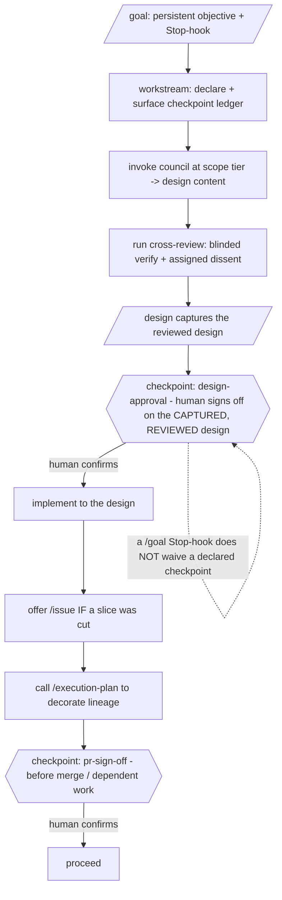

# Design: Coral framework refinements — workstream-launcher, research, product-dev arm

**Status:** Draft (revised after Coral cross-review — product-manager, product-engineer, prose-steward, technical-program-manager)
**Date:** 2026-06-13
**Issue:** PLT-500 — https://linear.app/seilabs/issue/PLT-500 (this design serves three sibling issues; see Lineage)
**Authors:** bdchatham, Claude (Coral)

> **Lineage note (TPM):** `/design`'s `Issue:` primitive is singular; this one design node serves three sibling issues (PLT-500/501/502). That is graph-valid — `betGraph` reads, per issue, whether *that issue* links this design's URL, not the design's `Issue:` field. So each of PLT-500/501/502 must carry the reverse `Design:` link to this doc. **No Impact bet is named** (these are framework-internal); the workstream therefore reads as `untaggedNearby` in any per-bet rollup unless Brandon names a bet at the checkpoint, in which case `/execution-plan ensurePlan` + three `stamp`s decorate them. **Decision D5 below.**

## Background

Over recent weeks the Coral/Tide stack solidified an opinionated framework: scope-tiered `council`, `/design` capture, blinded `/cross-review`, `/issue` for deferred slices, `/execution-plan` bet↔design↔issue↔PR lineage, the `lingua` human-vs-agent register (PLT-473 / Tide#138), the no-tombstone bar (Tide#147), and the `author-skill`/`audit-skill` RED→GREEN→REFACTOR discipline with its conventions catalog. Three arms predate or sit outside that consolidation. They are sibling Linear issues filed together:

- **PLT-500** — no first-class way to *launch a substantial workstream* on the stack with declared, enforced **human checkpoints**. Operators hand-wire the council→design→cross-review→issue→execution-plan sequence each time, and human gates ("stop for PR sign-off", "one-way-door approval") are prose-encoded in the `/goal` prompt and honored inconsistently.
- **PLT-501** — research has no first-class home. The only resource is `author-skill/references/research-recipe.md`, scoped to skill-authoring intake. There is no skill that scopes a question, fans out a sweep, adversarially verifies findings, captures a durable artifact, and threads lineage — so research is less reusable, less verifiable, and doesn't accrue into the graph.
- **PLT-502** — the product-dev personas (`product-manager`, `product-engineer`) reference only `/brevity` and `/pr-quality`. They miss the register doctrine, design/issue capture, execution-plan lineage, cross-review/council framing, the idiomatic/systems standards, and the checkpoint pattern PLT-500 introduces.

Recon (read-only) confirmed: no checkpoint/goal primitive exists anywhere; `author-skill/scripts/scaffold.sh`'s protected list is `coral, council, design, issue, bugbash, author-skill, audit-skill, chaos-suite, harbor-dev` — so a new `workstream`/`research` name is scaffoldable, but those protected skills (and `execution-plan`/`cross-review`, which the scaffold does *not* protect but which we still **compose, not edit**) must be invoked, never modified. `council` already owns the noun "workstream" (`.council/workstream.yaml` = per-phase progress state) — the new skill must disambiguate (see D1).

## Goals

1. **PLT-500** — ship a skill that (a) scaffolds the Coral lifecycle by **invoking `council` at the right scope tier and inserting checkpoints at the seams** (documenting — not auto-driving — the design/cross-review/issue/execution-plan handoffs), and (b) provides a **declarative checkpoint primitive**: named human gates the agent must surface and obtain explicit confirmation for before proceeding — gates that survive "keep going" pressure, including a `/goal` Stop hook.
2. **PLT-501** — ship a first-class research capability that scopes a question, runs a multi-modal sweep, **adversarially verifies each finding**, captures a durable research artifact, and threads lineage to issues/bets.
3. **PLT-502** — the product-dev personas default to the framework via tight reference-pointers (not methodology rewrites).
4. **Shared** — PLT-500 defines the checkpoint vocabulary that 501/502 cite; all three thread lineage and verify findings.
5. Each deliverable passes the `audit-skill` conventions catalog, ships ≥1 happy-path + 1 halt-condition eval, and is built/refined RED→GREEN via `author-skill`.

## Non-goals

- **Not** editing `council`/`coral`/`design`/`issue`/`execution-plan`/`cross-review` (compose-only).
- **Not** auto-driving the workstream sequence (PLT-500 MVP = checkpoint primitive + council-invocation + checkpoint insertion; *deferred — when an operator runs the same phase sequence ≥3 times by hand*).
- **Not** wiring the literal `/goal` Stop-hook mechanism (PLT-500 ships the checkpoint **discipline as prose**; *deferred — when the prose discipline is shown insufficient under goal-pressure in an eval*).
- **Not** a research Workflow engine in MVP (PLT-501 ships **inline**; *deferred — when an inline sweep is observably too narrow on a real question, i.e. >3 sweep angles needed repeatedly*).
- **Not** an auto-looping completeness critic (PLT-501 MVP runs **one completeness reporting pass**, human decides whether to re-sweep; *deferred — when verified-but-incomplete artifacts cause a real re-research*).
- **Not** a bundled `product-dev` skill (PLT-502; *deferred — when a multi-step product-dev procedure emerges that the persona references don't cover*).
- **Not** a research result cache / `research://` registry (*deferred — when artifacts are re-read across ≥3 workstreams*).

## Design

### Part A — PLT-500: the `workstream` skill + checkpoint primitive

**Decision D1: a new skill `workstream`** (shape: **procedural with a discipline spine**), disambiguated from council's noun: council's `.council/workstream.yaml` holds *per-phase progress state*; a **`workstream` checkpoint is a human gate**. The skill layers on the `/goal` harness mechanism (`/goal` sets the persistent objective; `workstream` governs *how* it's pursued and *where the human gates are*). *(D1 — name confirmation is a checkpoint for Brandon; `launch` is the alternative if the "workstream" collision with council's vocabulary is judged too close.)*

**The checkpoint primitive** (the product):

- **Declaration.** At workstream start the agent writes a short **checkpoint ledger** — a typed list (each entry a `name` / `trigger` / `gate` triple) of the gates this workstream honors — and surfaces it to the human up front, so the human-in-the-loop contract is explicit, not improvised.
- **Two canonical checkpoint types** (minimal set that traces to the ticket's stated pain): `design-approval` (human signs off on the captured, cross-reviewed design before implementation) and `pr-sign-off` (human confirms before a PR merges / before dependent work proceeds). **One-way-door approval is NOT re-canonized here — it reuses council's existing one-way-door gate** (`council/SKILL.md` one-way-door category) by reference. Any other gate (e.g. `outcome-alignment`) is declared via the escape hatch below.
- **Custom checkpoints (typed contract).** Operators may declare additional checkpoints inline; **each inline checkpoint MUST carry the same `name`/`trigger`/`gate` triple** as a ledger entry (no freeform gates). This is the extensibility valve, so the canonical set stays minimal.
- **The enforcement discipline (the spine).** When a checkpoint's trigger is reached the agent **MUST STOP, surface the checkpoint and the evidence the human needs, and obtain explicit confirmation before proceeding past it.** It may not self-approve, infer approval from silence, or treat a `/goal` Stop hook ("keep working toward the goal") as waiving a declared checkpoint — **a declared human gate outranks the keep-going pressure.** This is the discipline-spine failure the skill prevents (RED: an agent under goal-pressure barrels past a declared `pr-sign-off`).
- **Lineage delegation.** `workstream` **delegates** all lineage decoration to `/execution-plan` (calls it; never re-implements label/identity/stamp logic — that's how a second identity sneaks in). `/execution-plan`'s first-label-creation confirm is a **separate** gate owned by that skill; the checkpoint ledger does not subsume it.

**MVP scope:** the checkpoint primitive + the enforcement spine + a thin scaffold that invokes `council` at the right tier and inserts the checkpoints, and *documents* the recommended downstream handoffs (offer `/design`, run `/cross-review`, conditionally `/issue` if a slice was cut, call `/execution-plan`). It does **not** auto-drive those phases.

Note the order (corrected from cross-review): **council → cross-review → `/design` capture → `design-approval` checkpoint → implement → `pr-sign-off`.** `/cross-review` precedes `/design` capture (per design's Guardrail 4); the `design-approval` gate sits *after* the design is captured and reviewed, not before it exists.

### Part B — PLT-501: the `research` skill

**Decision D2: a new skill `research`** (shape: **technique with a discipline spine** — the verify gate must survive "good enough, ship it"). **Inline only for MVP** (no Workflow engine). The four-stage method:

1. **Scope** — state the question and what a *useful answer* is (the decision it informs, the falsifiable claims sought). Refuse a vague question (discipline gate, à la prfaq's input bar).
2. **Multi-modal sweep** — fan out searches each blind to the others' angle (by-source, by-entity, by-time, by-counter-thesis), inline (≤3 angles is the inline norm; broader needs the deferred Workflow engine).
3. **Adversarially verify (the differentiator)** — each material finding gets a refutation pass before it's trusted. **`research` implements its OWN refutation pass, modeled on `/cross-review`'s assigned-dissent primitive** (tag a skeptic to argue the finding is wrong); it does **not** invoke `/cross-review` (whose provider/consumer boundary table does not map onto findings). A finding that survives refutation is "verified"; one that doesn't is dropped or downgraded. **No finding ships unverified.**
4. **Completeness pass + synthesize** — **one** pass asks "what modality wasn't run, what claim is unverified, what source is unread?" and *reports* the gaps; the human decides whether to run another sweep round (no auto-loop in MVP). Then synthesize into the artifact.

**The research artifact** — captured as `design/research/<slug>.md` (**Decision D3:** reuse the existing Tide `design/research/` convention rather than introduce a second home like `docs/research/`). Shape: Question · Sweep coverage · Findings (**each tagged verified / refuted / unverified**) · Completeness assessment · Synthesis & recommendation · References. Lineage threads via the same mechanism `/design` uses: frontmatter `Issue:`/`Impact:` + an `/execution-plan` decoration call.

> **Lineage precision (TPM):** `betGraph`'s `designLinked` boolean means "this issue links the bet's *design* URL." A research-doc URL is **not** the bet's design URL, so a research doc alone would read as `label ∧ ¬designLinked` (a *false* scope-creep candidate). MVP rule: a research effort that advances a bet threads through the **issue that carries both the `impact:<slug>` label and the bet's design-URL link**; the research doc is an *additional* reference on that issue, not a competing discriminator. Treating a research-doc URL as a second valid discriminator would be a change to the `/execution-plan` contract — **out of scope; logged as a follow-up for the execution-plan owner.**

**Composition & circularity bound.** `research` is the discovery surface; it reuses `/cross-review`'s *assigned-dissent primitive* (not the skill) for refutation; `/design` is the sibling capture surface (design *decides*, research *discovers*). A `workstream` (Part A) **may checkpoint-gate** a research effort (an `outcome-alignment` custom checkpoint after synthesis), but **`research` never *launches* a `workstream`** — at scale it spawns a Workflow (an execution engine, deferred), not a lifecycle. This bounds the recursion. It generalizes `author-skill`'s `research-recipe.md`, which stays the skill-authoring-intake specialization and points at this skill.

### Part C — PLT-502: refine the product-dev arm

**Decision D4: reference-wire the two personas; defer the bundle.** Edit `product-manager.md` and `product-engineer.md` to add tight **pointer** sections (lingua R3 — each addition is a one-line pointer to the canonical skill, never a re-explanation of it; if any grows into prose restating how `/cross-review` or `/execution-plan` works, cut it to the pointer):

- **Orchestration** — how each is dispatched by `coral`/`council` (product-manager is the mandatory scope-cutter; product-engineer is the depth specialist) and re-dispatched blinded under `/cross-review`.
- **Artifact capture** — `/design` captures the design, `/issue` captures deferred slices at the handoff (persona frames the deferral / confirms scope cuts; orchestrator files).
- **Lineage** — work advancing an Impact bet is decorated via `/execution-plan` (bet = identity key).
- **Writing standards** — specs/PRDs are dual-audience org artifacts: apply the `lingua` register (typed open questions, locally-anchored constraints), expect `prose-steward` review, carry the no-tombstone bar (Tide#147) and register discipline (PLT-473) where they author prose/comments.
- **Code-quality lenses (product-engineer only)** — architecture with code-level implications gets `/idiomatic` + `/systems` cross-review.
- **Checkpoint pattern** — both cite the PLT-500 `workstream`/checkpoint **vocabulary** (not its scaffold internals, so 502 isn't coupled to 500's deferred automation).

Charters (MVP-scope discipline; product→architecture translation) are unchanged.

### Shared composition & sequencing

PLT-500 lands first (it freezes the checkpoint *vocabulary* 501/502 cite — they need only the names, not the scaffold). **The 500→{501,502} ordering is itself encoded as a declared `pr-sign-off` checkpoint** (dogfooding): 501/502 do not merge ahead of 500's vocabulary landing. All three thread `/execution-plan` lineage and verify findings.

### Validation plan

PLT-500 is validated by `author-skill` RED→GREEN→REFACTOR + the `audit-skill` conventions catalog + Coral cross-review + bugbot (it *defines* the checkpoint pattern, so it can't dogfood it). PLT-501 and PLT-502 additionally **dogfood** the checkpoint pattern (e.g. a `design-approval` gate). Each ships ≥1 happy-path + 1 halt-condition eval.

## Decisions requiring Brandon's confirmation (the design-approval checkpoint)

Per the checkpoint discipline this very design introduces, these are surfaced for sign-off before implementation (most are reversible pre-merge; flagged because others will depend on them):

- **D1 — skill name `workstream`** (vs `launch`). Recommend `workstream` with in-skill disambiguation from council's vocabulary.
- **D3 — research artifact home `design/research/`** (reuse existing Tide convention, not a new `docs/research/`). Recommend as stated.
- **D4 — PLT-502 personas-only, defer the bundle.** Recommend as stated.
- **D5 — Impact bet:** does this framework-refinements workstream roll up to an Impact bet? If yes, name it → `ensurePlan` + stamp the three issues. If no, they remain `untaggedNearby` (acceptable for framework-internal work). Recommend: proceed untagged unless Brandon names one.

Reversible MVP-scope calls already locked from the cross-review (no confirmation needed, recorded for the implementer): inline-only research (no Workflow), one completeness reporting pass (no auto-loop), checkpoint discipline as prose (no `/goal` hook wiring), two canonical checkpoint types, research implements its own dissent-modeled refutation (does not invoke `/cross-review`).

## Alternatives considered

- **PLT-500 as edits to `council`.** Rejected: council is protected; launching/governing a workstream is a distinct concern that composes council.
- **PLT-500 checkpoint as a machine-parsed manifest.** Deferred: MVP is a surfaced human-readable ledger + the discipline; a parsed/resumable manifest is a follow-up once validated.
- **Four canonical checkpoint types.** Cut to two: `one-way-door-approval` duplicated council's existing gate (now referenced, not re-canonized); `outcome-alignment` had no customer-evidence line, so it's an example of the custom-checkpoint escape hatch, not blessed canon.
- **PLT-501 as a Workflow only / always-Workflow.** Rejected/deferred: the discipline (verify, completeness, capture, lineage) needs a skill; the Workflow is the at-scale engine, deferred.
- **PLT-501 invoking `/cross-review` for finding-refutation.** Rejected: cross-review's boundary table doesn't map to findings; research reuses only the assigned-dissent *primitive*.
- **PLT-501 reusing `/design` for the artifact.** Rejected: research *discovers* (findings-with-verification), design *decides* (goals/alternatives/trade-offs) — distinct shapes; they share only the lineage-threading mechanism.
- **PLT-502 as a bundled skill.** Deferred (D4).

## Trade-offs

- **Thin scaffold (not full automation)** for PLT-500 — the operator drives phase transitions; the high-value checkpoint primitive ships first.
- **A new research-doc shape** adds an artifact type — accepted; forcing research into the design shape blurs "discovered vs decided."
- **Reference-wiring two persona files** grows them — mitigated by pointer-not-prose (lingua R3).
- **Dogfooding the framework to build it** is slower than ad-hoc edits — accepted; it validates the framework and is the standard the tickets demand.

## Open questions

- **OQ1 (execution-plan contract)** — should `betGraph` treat a research-doc URL as a second valid plan discriminator (so research docs accrue without piggybacking on an issue that also links the design)? Owner: `/execution-plan` maintainer. Decide by: a follow-up issue after PLT-501 ships. (Logged; out of scope for PLT-501 MVP.)
- **OQ2 (Linear↔GitHub integration mode)** — is the Platform team's Linear↔GitHub integration wired? If not, `betGraph` is issue-only and PR-movement signals are dark; the implementer must not infer PRs from branch names. Owner: bdchatham. Decide by: before lineage decoration.

## References

- Linear: PLT-500, PLT-501, PLT-502 (Platform); related PLT-473.
- Skills: `council`, `coral`, `cross-review`, `design`, `issue`, `execution-plan`, `author-skill`, `audit-skill`, `lingua`, `prfaq`.
- Agents: `product-manager`, `product-engineer`, `prose-steward`, `technical-program-manager`.
- Standards: Tide#147 (no-tombstone), idiomatic/systems packs, `audit-skill/references/conventions-catalog.md`.
- Cross-review of this design (this session): product-manager (scope), product-engineer (architecture), prose-steward (dual-audience), technical-program-manager (lineage).
