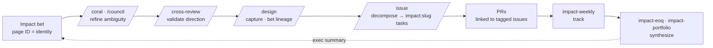
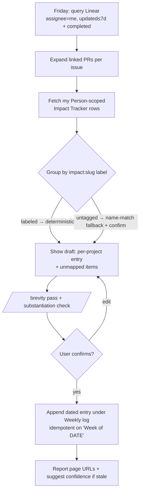

# Design: Impact Hub PM Skill Suite

**Status:** Draft
**Date:** 2026-06-06
**Authors:** bdchatham, product-manager, product-engineer (coral session)
**Impact bet:** [Platform Agentic Project Management](https://app.notion.com/p/377db6ff60578037b959c484e99b2803) (`impact:platform-agentic-project-management`) — this design *is* the captured direction for that bet; the suite dogfoods its own loop.

## Background

Our org runs an **Impact Hub** in Notion: each engineer owns 2–4 quarterly "bets," tracked as rows in the **Impact Tracker** data source (properties: Name, Overall Confidence `Not Started → On Track / At Risk / Need Help → Delivered`, Person, Quarter, Theme; body sections: *Why it matters · Success looks like · Weekly log · End-of-quarter retrospective*). Updating it weekly is manual and easy to skip, and there is no link from a project to the actual work (Linear issues / PRs) that substantiates progress.

We want skills that pull work from issues into the right Impact Hub project, track project lifecycle proactively, and make Impact Hub the centralized, substantiated source for quarter-end work summaries.

## Goals

- **Thread one tag through the whole work lifecycle** — ambiguous epic → explicit technical direction → execution tasks → PRs → synthesis — so that, *as labeling adoption rises*, downstream rollups become a deterministic group-by and engineers *and* leaders can synthesize "what got done" without archaeology. (At cold start the suite runs on a name-match fallback; determinism is earned, not assumed.) The Impact suite is the synthesis tail of this loop; the front half is net-new upstream work layered onto our existing design/decomposition skills.
- Turn an engineer's week of real work into a substantiated, executive-summary progress update on the matching Impact Hub project — fast enough to actually happen weekly.
- Make every claim in an Impact doc point to its evidence (Linear issue / PR).
- Keep Impact docs as an **index into the work, never a re-narration of it** — so they stay readable and useful.
- (Phase 2) Give a portfolio view of project lifecycle and a per-engineer quarter rollup.

## Non-goals

- No Notion schema change to the shared Impact Tracker (linkage stays in local state).
- No auto-flipping Overall Confidence (agent suggests; human decides).
- No editing project-definition fields (*Why it matters / Success looks like*) — skills only append progress.
- No always-on daemon; no **autonomous** writes to exec-facing Notion. (Phase-2 `impact-portfolio` writes a weekly report page, but human-confirmed via draft→confirm→write — the read-only "table only, no prose" sketch is superseded; see `docs/designs/impact-portfolio-weekly-report.md`.)

## The end-to-end work loop

The Impact suite is the tail of a lifecycle that turns an ambiguous epic into validated direction, then into tagged execution, then into synthesis. The **`impact:<slug>` tag (+ lineage links) is the spine** — every artifact in the chain carries it, so synthesis is a deterministic group-by, not a reconstruction. Each stage is owned by a skill we already have or are building:

Ordering matches the shipped skills: **cross-review happens at synthesis, *before* `/design` captures** (it's an anti-trigger in `/design`, `/cross-review`, and coral/council that cross-review precedes capture). The spine's identity is the **immutable Notion page ID** of the bet; `impact:<slug>` (slug = kebab of the bet Name) is a human-readable, re-derivable *display alias* layered on top — never the join key.

| Stage | Transition | Skill | Artifact (carries the spine) |
|---|---|---|---|
| 0 · Bet | ambiguous epic exists | Impact Hub | Impact Tracker row (page ID = identity); `impact:<slug>` derived from Name |
| 1 · Refine | epic → technical direction | `/coral` or `/council` | a design pass (ambiguity resolved) |
| 2 · Validate | direction → trusted | `/cross-review` (at synthesis, **before** capture) | findings table — *recommended* pre-decomposition step, not an enforced gate |
| 3 · Capture | validated direction → durable | `/design` | design doc, lineage to the bet (page ID + `impact:<slug>`) |
| 4 · Decompose | design → execution tasks | `/issue` | Linear issues, each labeled `impact:<slug>` + design lineage |
| 5 · Implement | tasks → PRs | engineer | PRs linked to the tagged issues (see PR caveat below) |
| 6 · Track | week of PRs/issues → update | `impact-weekly` | Weekly-log entry on the bet (grouped by the label) |
| 7 · Synthesize | quarter → exec summary | `impact-eoq` / `impact-portfolio` | retrospective, portfolio, per-engineer rollup |

**Where `/design` and `/cross-review` fit (the explicit ask):**
- **`/cross-review` (stage 2)** validates the direction *before* it's captured or decomposed — the right place to catch a flawed design before it shatters into a dozen tagged tasks. It is a **recommended sequence, not an enforced gate**: no skill blocks `/issue` on a cleared cross-review, so this is a convention, not a control.
- **`/design` (stage 3)** turns the validated direction into a *durable, bet-linked* doc. This needs a **new lineage class** (design↔bet via the bet's page ID + `impact:<slug>`), distinct from the existing design↔issue lineage — a real `/design` change, not a free extension.

**These front-half integrations are net-new upstream work, not "small additions."** `/issue` has no Notion awareness today; `/design`'s frontmatter is a fixed set; `/cross-review` has no gate concept. Each integration is its own scoped change with its own design — explicitly **out of the `impact-weekly` MVP** (see Design). The MVP works from day one via the name-match fallback and gets more deterministic as labeling adoption grows.

## Design

Three skills sharing one write-contract + brevity/substantiation discipline, **as the synthesis tail of the loop above**.

**MVP = `impact-weekly`, standalone.** Its value on its own: *turn your Linear week into a confirmed, substantiated, brevity-clean Weekly-log entry on the right bet — fast enough to do every Friday.* That painkiller stands without the rest of the loop; it runs day-one on the name-match fallback. **Determinism and the leader-facing rollups are Phase 2**, gated on labeling coverage actually rising — not MVP promises.

**The front-half integrations are net-new upstream work, each its own scoped change** (a new design↔bet lineage class in `/design`; Notion-bet awareness + label-stamping in `/issue`, which has none today; a documented cross-review-before-decompose *convention*, which no skill enforces). They are **out of the `impact-weekly` MVP** and should be designed/built deliberately, not assumed free. The loop is the **north-star architecture**; the MVP is one honest step into it.

| Skill | Job | Phase |
|---|---|---|
| **`impact-weekly`** | Friday: gather the engineer's Linear week → map each item to its Impact project → draft an exec progress entry → confirm → append to the project's **Weekly log**. | **MVP** |
| `impact-portfolio` | **Weekly cross-project exec report**: a human-confirmed report page per week (exec summary + per-project sections, owner + confidence + ≤3 substantiated bullets). Scope evolved from the original read-only sketch — see `docs/designs/impact-portfolio-weekly-report.md`. | Phase 2 |
| `impact-eoq` | Per-engineer quarter rollup of substantiated outcomes into the **Retrospective** section. | Phase 2 |
| `impact-standup` | **Prospective standup / sync agenda**: per-person talking points — a linked spine (in-flight / in-review / just-shipped) + a discussion layer (risks / decisions / blockers / asks / forward) mined-and-cited or prompted, never fabricated. Window = *since last sync* (not ISO week). **Zero-write** — renders only; persistence is `impact-weekly`/`impact-portfolio`. | Added (zero-write sibling) |

### `impact-weekly` flow

### Shared contracts

- **Work capture — Friday on-demand Linear query** (not a local log). `list_issues(assignee=me, updatedAt≥7d)` + completed-in-window; PRs come from each issue's linked attachments. Stateless input — can't drift from Linear, zero weekly upkeep. (A local log would need repeated daily capture with no daemon to do it, and would be a drift-prone cache of the source of truth.)
- **Work → bet decoration (primary mapping)** — a **Linear label per Impact bet**, `impact:<bet-slug>`. **The join identity is the bet's immutable Notion page ID**, not the slug: the cache is `{notionPageId → {slug, labelId}}`, and the slug is a re-derivable display alias (kebab of the Name) that keeps the label human-readable. Work that advances a bet carries the label; `impact-weekly` groups the week's issues by label → resolves label → page ID. Linear projects do **not** map to Impact bets (coarser/durable — Calm Velocity, Incidents, …), so the label is the only reliable link.
  - **Rename / split / merge resilience:** because identity is the page ID, a renamed bet doesn't orphan existing work — but the slug/label then drifts from the Name. Reconciliation detects "label slug ≠ current Name" and **surfaces it for human resolution** (relabel, or keep the alias); it never silently mis-joins or drops. Split/merge are human-resolved the same way.
  - **Stamped upstream (net-new work, not MVP):** a future `/issue` change applies `impact:<slug>` when filing Linear work tied to a bet. **PR→issue linkage is config-contingent** — it works only if the workspace's Linear↔GitHub integration is wired (magic words / branch naming); when it isn't, substantiation degrades to issue-only (stated, not assumed).
  - **Fallback for untagged/legacy work (the MVP's day-one path)** — name-match the issue against the engineer's `Person`-scoped bets → human confirms in the draft → cache by page ID. Never dropped: unmatched items surface as "assign or skip." At cold start (nothing labeled yet) this fallback carries everything; determinism grows only as labeling adoption rises.
  - **Bootstrapping** — this quarter's bets get labels created and in-flight issues bulk-labeled once (depends on a Linear label-*create* tool — verify). The coverage gate's untagged-rate is the adoption signal.
- **Notion write** — append a dated entry under **Weekly log** via block-append; idempotent on the `Week of <YYYY-MM-DD>` heading (re-runs update in place). Draft → confirm → write. Confidence is *suggested*, never set. Definition fields untouched.
- **Substantiation (FM#3)** — minimal evidence unit = the Linear issue (PR secondary). Every bullet carries ≥1 link; an unsubstantiated bullet is **refused**, not softened. Links must resolve to *this* engineer's work *this* quarter.
- **Brevity (FM#2)** — hard ceilings (≈≤60 words / project entry; phase-2 retrospective ≤150 words / engineer; portfolio report = exec summary + per-project sections, ≤3 bullets/section with a "+N more →" pointer, no prose paragraphs — see the `impact-portfolio` design). Mandatory `/brevity` pass before the draft is shown, announcing rules applied. *Link-don't-inline* enforced as a refusal. Append-only structure prevents cumulative bloat. **Genre rule: the Impact doc is the index; Linear + the PRs are the record.**
- **Trigger** — manual invocation (`/impact-weekly`). The draft→confirm gate needs a human, so a cron buys little yet.

### Coverage gate (FM#1)

Before writing, reconcile work ↔ owned rows: if a worked-on bet has no row, or an owned row got work but no entry, **report the gap — don't silently write the subset**. Coverage is the acceptance gate; its **untagged-rate** (work that fell to the name-match fallback because it lacked an `impact:` label) is the adoption signal for the decoration convention.

## Alternatives

- **Local accumulated work-log (considered, rejected for MVP).** The user's initial lean. Rejected because this harness has no daemon — "log all week" still needs repeated manual capture, and the log is a drift-prone cache of Linear. Kept only as a *deferred, additive* note-supplement for off-Linear work (never primary).
- **Name-match-only mapping (rejected as primary; kept as fallback).** Originally the MVP mapping. Demoted to fallback once it became clear Linear projects ≠ Impact bets, so name-matching a project/title to a bet is unreliable. The `impact:<slug>` label is the reliable primary; name-match handles only untagged/legacy work.
- **Notion link field on the row (rejected).** A relation/field on the shared Impact Tracker would be a clean link, but editing a shared exec data source's schema is a one-way door; a Linear label keeps the decoration on the work side and is natively filterable.
- **Restructure Linear so projects/initiatives == Impact bets (rejected).** Cleanest native grouping but a team-wide process reorg a skill shouldn't impose; the label convention gets the filterability without the restructure.
- **`/schedule` cron trigger (deferred).** Right end-state (scheduled *draft* + one-click confirm), but premature while writes need human confirmation.

## Trade-offs

- Friday query can miss work with no Linear issue (a PR with no ticket). Accepted: surfaced as off-Linear in the draft; the deferred note-supplement closes it if it becomes common.
- Name-match mapping needs a one-time human confirm per project. Accepted: it's the FM#1 safety, and it self-caches.
- Manual trigger means it only runs when invoked. Accepted: the confirm gate requires a human regardless.

## Cross-skill changes (net-new, post-MVP)

The decoration convention requires upstream changes — each its own scoped slice, **not** part of the `impact-weekly` MVP:

- **`/issue`** gains Notion-bet awareness (it has none today): resolve the engineer's `Person`-scoped bets, derive the slug, and *offer* to apply the `impact:<slug>` label on Linear-sink work. Note `/issue` is dual-sink — GitHub-sink work carries no Linear label, so the spine only reaches Linear-filed work.
- **`/design`** gains a new **design↔bet lineage class** (page ID + `impact:<slug>`), distinct from the existing design↔issue lineage (which is bidirectional/tool-backed; design↔bet is forward-only unless we later add a Notion write-back).
- The **cross-review-before-decompose sequence** is a documented convention; no skill enforces it.

The label convention (slug derivation, page-ID identity, label group) lives in a shared reference both `/issue` and `impact-weekly` read.

## Preconditions to verify before building

- **Notion MCP** must support: querying the Impact Tracker for a bet by Person/Name, **appending blocks under the in-body `Weekly log` heading**, and **read-modify-write to update a `Week of <date>` block in place** (idempotency). The only Notion precedent in-repo is page *creation* (`validate-release`), so this surface is unproven — confirm it (or rework the write mechanic) before `impact-weekly` ships.
- **Linear MCP** must support **label creation** (for bootstrapping + first-stamp), not just list/apply.

## Open questions

- Exact length ceilings and the `/brevity` floor for the Weekly-log entry — tune during authoring/evals.
- Slug derivation rule (kebab-case of row Name) and whether to use a dedicated Linear label *group* vs flat `impact:` prefix — settle during authoring.
- Bootstrapping scope: who creates this quarter's bet labels + bulk-labels in-flight issues (one-time) — a tiny helper vs a documented manual step.
- Phase-2 cross-engineer reads: **confirmed acceptable** (Impact Hub is a shared board).
- Off-Linear work frequency — determines whether the note-supplement gets un-deferred.

## References

- Impact Hub (Notion): https://app.notion.com/p/Impact-Hub-35edb6ff605780b6b023d95456209168
- Impact Tracker data source: `collection://35edb6ff-6057-8038-9d07-000b08363d40`
- Sample project (Migrate arctic-1 to K8S): https://app.notion.com/p/Migrate-arctic-1-to-K8S-35edb6ff60578031b9bad57c0c15f13c
- Precedent skills: `.claude/skills/validate-release/` (Notion write + confirm gate), `.claude/skills/issue/` (Linear + draft→confirm→write)
- Discipline: `.claude/skills/brevity/`, `CLAUDE.md` (output discipline, one-way-door gate)
