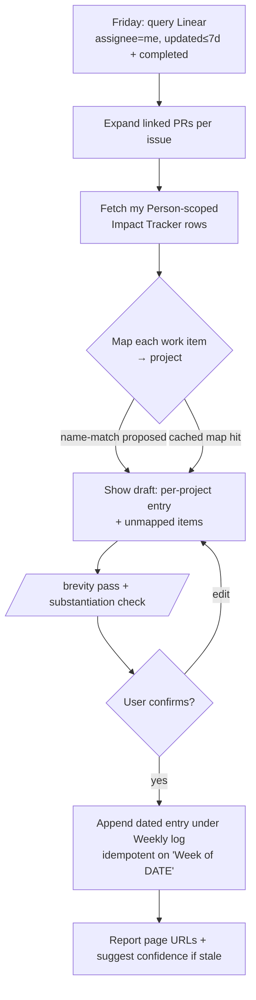

# Design: Impact Hub PM Skill Suite

**Status:** Draft
**Date:** 2026-06-06
**Authors:** bdchatham, product-manager, product-engineer (coral session)

## Background

Our org runs an **Impact Hub** in Notion: each engineer owns 2–4 quarterly "bets," tracked as rows in the **Impact Tracker** data source (properties: Name, Overall Confidence `Not Started → On Track / At Risk / Need Help → Delivered`, Person, Quarter, Theme; body sections: *Why it matters · Success looks like · Weekly log · End-of-quarter retrospective*). Updating it weekly is manual and easy to skip, and there is no link from a project to the actual work (Linear issues / PRs) that substantiates progress.

We want skills that pull work from issues into the right Impact Hub project, track project lifecycle proactively, and make Impact Hub the centralized, substantiated source for quarter-end work summaries.

## Goals

- Turn an engineer's week of real work into a substantiated, executive-summary progress update on the matching Impact Hub project — fast enough to actually happen weekly.
- Make every claim in an Impact doc point to its evidence (Linear issue / PR).
- Keep Impact docs as an **index into the work, never a re-narration of it** — so they stay readable and useful.
- (Phase 2) Give a portfolio view of project lifecycle and a per-engineer quarter rollup.

## Non-goals

- No Notion schema change to the shared Impact Tracker (linkage stays in local state).
- No auto-flipping Overall Confidence (agent suggests; human decides).
- No editing project-definition fields (*Why it matters / Success looks like*) — skills only append progress.
- No always-on daemon; no autonomous writes to exec-facing Notion.

## Design

Three skills sharing one write-contract + brevity/substantiation discipline. **MVP = `impact-weekly` only**; the other two are phase 2.

| Skill | Job | Phase |
|---|---|---|
| **`impact-weekly`** | Friday: gather the engineer's Linear week → map each item to its Impact project → draft an exec progress entry → confirm → append to the project's **Weekly log**. | **MVP** |
| `impact-portfolio` | Read-only scan across all projects: bucket by lifecycle, surface what needs attention. | Phase 2 |
| `impact-eoq` | Per-engineer quarter rollup of substantiated outcomes into the **Retrospective** section. | Phase 2 |

### `impact-weekly` flow

### Shared contracts

- **Work capture — Friday on-demand Linear query** (not a local log). `list_issues(assignee=me, updatedAt≥7d)` + completed-in-window; PRs come from each issue's linked attachments. Stateless input — can't drift from Linear, zero weekly upkeep. (A local log would need repeated daily capture with no daemon to do it, and would be a drift-prone cache of the source of truth.)
- **Work → project mapping** — propose by name-match against the engineer's `Person`-scoped rows → human confirms in the draft step → persist `{linearProjectId → notionPageId}` to gitignored `state/`. Confirmation cost decays to ~zero after week one. Unmapped items are surfaced ("assign or skip"), never dropped.
- **Notion write** — append a dated entry under **Weekly log** via block-append; idempotent on the `Week of <YYYY-MM-DD>` heading (re-runs update in place). Draft → confirm → write. Confidence is *suggested*, never set. Definition fields untouched.
- **Substantiation (FM#3)** — minimal evidence unit = the Linear issue (PR secondary). Every bullet carries ≥1 link; an unsubstantiated bullet is **refused**, not softened. Links must resolve to *this* engineer's work *this* quarter.
- **Brevity (FM#2)** — hard ceilings (≈≤60 words / project entry; phase-2 retrospective ≤150 words / engineer; portfolio = table only, no prose). Mandatory `/brevity` pass before the draft is shown, announcing rules applied. *Link-don't-inline* enforced as a refusal. Append-only structure prevents cumulative bloat. **Genre rule: the Impact doc is the index; Linear + the PRs are the record.**
- **Trigger** — manual invocation (`/impact-weekly`). The draft→confirm gate needs a human, so a cron buys little yet.

### Coverage gate (FM#1)

Before writing, reconcile work ↔ owned rows: if a worked-on project has no row, or an owned row got work but no entry, **report the gap — don't silently write the subset**. Coverage is the acceptance gate; its miss-rate is also the signal for when to adopt PR/issue tagging.

## Alternatives

- **Local accumulated work-log (considered, rejected for MVP).** The user's initial lean. Rejected because this harness has no daemon — "log all week" still needs repeated manual capture, and the log is a drift-prone cache of Linear. Kept only as a *deferred, additive* note-supplement for off-Linear work (never primary).
- **Notion link field on the row (rejected).** A relation/field on the shared Impact Tracker would be the cleanest long-term link, but editing a shared exec data source's schema is a one-way door; local-state mapping is the reversible MVP.
- **`/schedule` cron trigger (deferred).** Right end-state (scheduled *draft* + one-click confirm), but premature while writes need human confirmation.
- **PR/issue tagging for deterministic mapping (deferred).** Un-defer when the coverage gate's miss-rate from name-match proves too lossy.

## Trade-offs

- Friday query can miss work with no Linear issue (a PR with no ticket). Accepted: surfaced as off-Linear in the draft; the deferred note-supplement closes it if it becomes common.
- Name-match mapping needs a one-time human confirm per project. Accepted: it's the FM#1 safety, and it self-caches.
- Manual trigger means it only runs when invoked. Accepted: the confirm gate requires a human regardless.

## Open questions

- Exact length ceilings and the `/brevity` floor for the Weekly-log entry — tune during authoring/evals.
- Phase-2 cross-engineer reads: **confirmed acceptable** (Impact Hub is a shared board).
- Off-Linear work frequency — determines whether the note-supplement gets un-deferred.

## References

- Impact Hub (Notion): https://app.notion.com/p/Impact-Hub-35edb6ff605780b6b023d95456209168
- Impact Tracker data source: `collection://35edb6ff-6057-8038-9d07-000b08363d40`
- Sample project (Migrate arctic-1 to K8S): https://app.notion.com/p/Migrate-arctic-1-to-K8S-35edb6ff60578031b9bad57c0c15f13c
- Precedent skills: `.claude/skills/validate-release/` (Notion write + confirm gate), `.claude/skills/issue/` (Linear + draft→confirm→write)
- Discipline: `.claude/skills/brevity/`, `CLAUDE.md` (output discipline, one-way-door gate)
