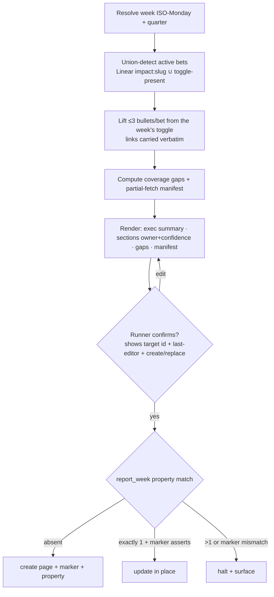

# Design: `impact-portfolio` — Weekly Cross-Project Impact Report

**Status:** Draft
**Date:** 2026-06-07
**Impact:** platform-agentic-project-management — https://app.notion.com/p/377db6ff60578037b959c484e99b2803
**Authors:** bdchatham, product-manager, product-engineer, security-specialist (cross-review)

## Background

Today a leader who wants "what got done across the portfolio this week" opens the Impact Hub and clicks into each bet one at a time. `impact-weekly` already writes a per-bet **Weekly-log toggle** (`> Week of <ISO>`, substantiated, brevity-clean). What's missing is the **one-page weekly readout across bets**.

This is the deferred Phase-2 `impact-portfolio` from `impact-hub-pm-skill-suite.md`. Its scope is **evolved** here: the parent sketched a *read-only* "table, no prose" scan; this captures a skill that **writes a human-confirmed weekly report page** to the shared board. The write stays draft→confirm→write (never autonomous), so the parent non-goal "no *autonomous* writes to exec Notion" still holds — but "read-only / table only" is superseded. **Approved one-way door** (the parent doc is updated to match).

## Update (2026-06-07): persistence resolved — Weekly Reports **database**

The Notion precondition spike (PLT-437 / Tide #119) found Notion allows custom properties only on **database rows**, not plain sub-pages — so the `report_week` identity and `generated_by` provenance cannot live on a sub-page. **Resolved (owner-approved one-way door):** "Weekly Reports" is now an inline **database** under the Impact Hub; each weekly report is a **row**.

- **Data source:** `collection://af6a7313-890d-4a8c-a936-59b7e94ef8f6`. **Approved schema (the persisted one-way door):** `Name` (title) · `report_week` (date — identity / idempotency key) · `generated_by` (select: `impact-portfolio` / `human` — provenance / clobber-guard).
- **Mechanism:** create via `notion-create-pages` `parent={data_source_id}` (proven path); idempotency = query rows by `report_week`; assert `generated_by == impact-portfolio` before any update. `generated_by` (native, always-readable) replaces the `last_edited_by` signal the MCP doesn't reliably expose.
- **This supersedes the sub-page / "Weekly Reports toggle" / page-property / last-editor language in the sections below** (kept for history). The spike open-questions are resolved: page-create parents under a `data_source_id`; rows carry custom properties; a full-body replace is safe on the skill-owned row.
- **Residuals** (enumerated in the skill's `references/write-contract.md`): unkeyed human row, hand-edited skill row (machine-managed — rebuilt each run), `generated_by` advisory, date-only representation.

The authoritative contract is the skill's `references/write-contract.md`. The sections below describe the original sketch and are retained for provenance.

## Goals

- One **report per week** a leader opens to see the week across projects, every claim clickable, in <3 minutes.
- **No silent omission**: the report is complete, or *visibly* incomplete — coverage gaps and partial-fetch failures render on the page.
- **Executive altitude**: exec summary + per-project sections, **≤3 bullets/section** ("almost never more than 3"), nothing silently dropped.
- **Substantiated**: every delivery bullet carries an evidence link, inherited from the source weekly (never invented).
- **Honest signal**: surface each bet's **Overall Confidence** so a rosy narrative under an at-risk bet is visible.
- Runs in minutes by a **single named runner** (an EM / chief-of-staff).

## Non-goals

- **Not autonomous** — human confirms every write; no daemon/cron.
- **Never mutates bets** — read-only on every bet page; writes only its own report page.
- **Doesn't author content** — lifts/condenses what `impact-weekly` already wrote; it's the index of the indexes.
- **Not a status dashboard** — lifecycle bucketing, at-risk sections, charts, cross-quarter trends are deferred.
- **Doesn't create bets** — Wave-class untracked projects are flagged, not auto-promoted (owner adds the bet).

## Design

### Output artifact

**[Superseded — see the Update above.]** One report per week, now a **row in the Weekly Reports database** under the Impact Hub. (Original sketch: a page under a "Weekly Reports" toggle — the spike showed sub-pages can't carry the identity/provenance properties, so it became a database.)

- **Title (display):** `Impact Report - Week of <Month Xth>` — human-facing only.
- **Identity (join key):** the week's **ISO Monday** (`report_week: YYYY-MM-DD`), written as a **page property**, anchored to a declared TZ. The display title is *never* the match key (it drifts on ordinal/locale/format). This mirrors `impact-weekly`'s ISO-key discipline.
- **Provenance:** a `generated_by: impact-portfolio` marker written at create. Any destructive update asserts this marker on the target first.

### Source-of-truth model

| Concern | Source | Rule |
|---|---|---|
| **Content** (the bullets) | each bet's Weekly-log `> Week of <ISO>` toggle for the **identical** ISO-Monday week | lifted/condensed; links carried through verbatim |
| **Detection** (which bets had activity) | **union**: cross-engineer Linear `impact:<slug>` scan ∪ bets that received a toggle this week | toggle-present is itself proof of activity |
| **Residual hole** (stated, not hidden) | work that is *untagged AND* has no toggle is invisible to both signals | known limitation; the untagged-rate is the signal it's high — do **not** claim total coverage |

The week window is the **same Monday-anchored calendar week** as `impact-weekly`'s toggle key; toggle lookup is by **exact ISO Monday** (not "latest" or "in range").

### Section selection & shape

Sections = current-quarter bets (Quarter = current, runner-confirmed) with a non-null `Person`, that had activity this week (union detection). Cross-engineer reads are acceptable (shared board).

```markdown
# Impact Report - Week of June 8th       ← display; identity = report_week: 2026-06-08

## Executive summary
- <portfolio-altitude bullet — a cross-cutting theme/headline, not a section restatement>   (3–5 bullets)

## <Bet Name>
**Owner:** <display name> (owner ≠ sole contributor) · **Confidence:** At Risk
- <delivery> — [SEI-123](url) ([PR #456](url))
- <delivery> — [SEI-789](url)
- <delivery> — [SEI-790](url) · +2 more in the weekly →    ← when >3 shipped, pointer not silent drop

## Coverage gaps this week
- <Bet> (Owner X): active in Linear, no weekly written — chase the weekly   ← visible to the exec, not just the runner

## Not yet tracked
- Wave — Owner Y, **(not yet a bet — needs adding)**: <delivery> — [PR](url)   ← still requires ≥1 evidence link

---
_Read 9 of 11 sources; could not load: <bet>, <bet>._        ← partial-fetch manifest; never silent
```

- **Owner** = bet `Person` (user ID → display name; degrade to raw ID, never fabricate), with the explicit "owner ≠ sole contributor" framing.
- **Confidence** = the bet's `Overall Confidence` property, surfaced as the exec counter-signal.

### Write contract

- **Read-only on all bet pages.** Writes exactly one artifact: the week's report page.
- **Idempotency (by ISO `report_week` property, not title):** fetch Weekly-Reports children → match `report_week`. **Absent** → `notion-create-pages` (write the marker + property). **Exactly 1** → assert `generated_by` marker on the target, then update in place. **>1** → halt and surface (mirrors `impact-weekly`).
- **Provenance gate before any replace** — refuse to overwrite a page lacking the skill's marker (defends against a human page with a colliding title, and against clobbering human edits).
- **Confirm the destructive action, not just prose** — the gate shows the resolved target page id, its last-editor, and the create-vs-replace decision, alongside the rendered body and exact parent.
- **Partial-fetch is conspicuous** — render the "read N of M sources" manifest; a partial run is never presented as complete.
- **Concurrency (MVP):** single named runner by convention + a pre-write re-scan (TOCTOU narrowing). No true lock — `state/report-<weekISO>.json` is an operator-local advisory backstop; the live page is authoritative for content, but a marker/property mismatch halts rather than overwrites.
- **Degrade, don't fabricate** — if Notion or a source is unavailable, say so and stop; never invent a section, bullet, owner, link, or confidence.



### Guardrails stanza

1. **Report page only — read-only on bets.** Writes one artifact under the Weekly Reports toggle; never edits a bet (no Weekly log, Confidence, or definition fields). Before write, assert the parent is the Weekly Reports toggle **and** the target page carries the skill's provenance marker — refuse on mismatch.
2. **Cover or surface — never a silent subset.** Union-detect; render coverage gaps and the partial-fetch manifest **on the page**. Incomplete coverage is *shown*, not refused; only fabrication is refused. Wave-class projects are flagged "(not yet a bet)", never laundered as tracked.
3. **Substantiate or refuse — links inherited, never invented.** Every delivery bullet (including manual Wave injections) carries ≥1 evidence link; an unsubstantiated bullet is cut. Exec-summary bullets need no own link but must trace to a substantiated section.
4. **Index of indexes — ≤3 visible/section, no inlining.** Cap narration per bullet (one line, ≤1 context sentence, no inlined bodies); when a project shipped >3, show top items + a "+N more in the weekly →" pointer — never a silent drop, never 4+ visible.
5. **Draft → confirm → write; idempotent; degrade, don't fabricate.** Always render the page + exact parent + the destructive-action summary; confirm explicitly. One page per week keyed on ISO Monday — re-run updates in place (and pulls in newly-added toggles); duplicate/marker-mismatch halts. If Notion or a source is unavailable, stop.

### Reuse vs. skill-local

- **Shared reference** (both `impact-weekly` and `impact-portfolio` read): bet **page-ID identity**, `impact:<slug>` **label-first resolution**, the canonical **ISO-Monday week-key derivation**, **`Person` → display-name resolution**, the **brevity** and **substantiation** rules.
- **`impact-portfolio`-local:** the cross-engineer/cross-quarter selection query, the report-page write contract (create/update/provenance), the exec-summary roll-up.
- **Stays `impact-weekly`-local:** the write-to-bet coverage gate and the bet-write target re-verification (portfolio never writes a bet).

## Alternatives

- **Content from a Linear re-aggregation (rejected).** Re-implements `impact-weekly`'s mapping engine and inherits the untagged-rate problem industrial-strength; risks the report and the bet log diverging in wording. Content stays lifted from toggles.
- **Pure-toggle, no Linear detection (rejected).** Can't even *detect* an omission, so a skipped weekly = a silently missing section (FM#1). Detection needs the Linear signal → union.
- **Refuse-to-write on any coverage gap (rejected).** At cold-start untagged rates the common week becomes a refusal — the adoption-killer that shaped `impact-weekly`. Gaps render on the page instead.
- **Hard ≤3 with silent "defer rest" (rejected).** Drops material outcomes from the exec view; replaced by the "+N more →" pointer.
- **Title as the idempotency key (rejected).** Display strings drift (ordinal/locale/TZ) → duplicate pages; identity is the ISO `report_week` property.
- **GitHub auto-scan for non-bet projects like Wave (deferred).** No clean PR→project filter and no `Person` to attribute; MVP handles Wave via flagged, substantiated manual injection. Un-defer when Wave is a bet, or a deterministic PR→project convention exists.

## Trade-offs

- **Residual coverage hole** (untagged AND no toggle) is accepted and *stated*; the untagged-rate is the signal to drive label adoption (the shared lever with `impact-weekly`).
- **Attribution**: owner = bet `Person`, but work is cross-engineer. MVP renders "owner ≠ sole contributor" + evidence links; a real contributor-attribution model is deferred — **do not use this page for individual credit/performance** until then.
- **Single runner, no lock** — accepted for MVP; the ISO-property key + pre-write re-scan + >1-halt bound the blast radius.
- **`notion-create-pages` under a toggle is unverified** — spike before build; fall back to `update_content` (the only live-verified Notion write) if create-under-toggle isn't supported.

## Open questions

- ~~Can `notion-create-pages` parent under a toggle/heading block? Nested content + a custom page property in one call?~~ **Resolved (spike):** no block-parent — rows in a database (`parent=data_source_id`); rows carry native custom properties. See the Update.
- Does the Notion MCP resolve `Person` user-ID → display name, and do in-page anchor links render? (Degrade paths specified.)
- Is a full-body replace allowed on a skill-owned report page, or must updates use `update_content` section-replace?
- Auto-derive "current quarter" from the report date, or keep runner-confirmed?

## References

- Parent design: `docs/designs/impact-hub-pm-skill-suite.md` (Phase-2 `impact-portfolio`; scope updated for this evolution)
- Producer skill: `.claude/skills/impact-weekly/` (`SKILL.md`, `references/write-contract.md`, `references/mapping-and-coverage.md`)
- Notion page-create precedent: `.claude/skills/validate-release/`
- Impact Hub (Notion): https://app.notion.com/p/Impact-Hub-35edb6ff605780b6b023d95456209168 — "Weekly Reports" toggle
- Impact Tracker data source: `collection://35edb6ff-6057-8038-9d07-000b08363d40`
- Wave RFC 001 (Sei Infra Modernization): https://app.notion.com/p/313db6ff6057801994bfd373b9dab77f
- Cross-review (2026-06-07): product-engineer, product-manager, security-specialist (dissent) — verdict OPEN→resolved
