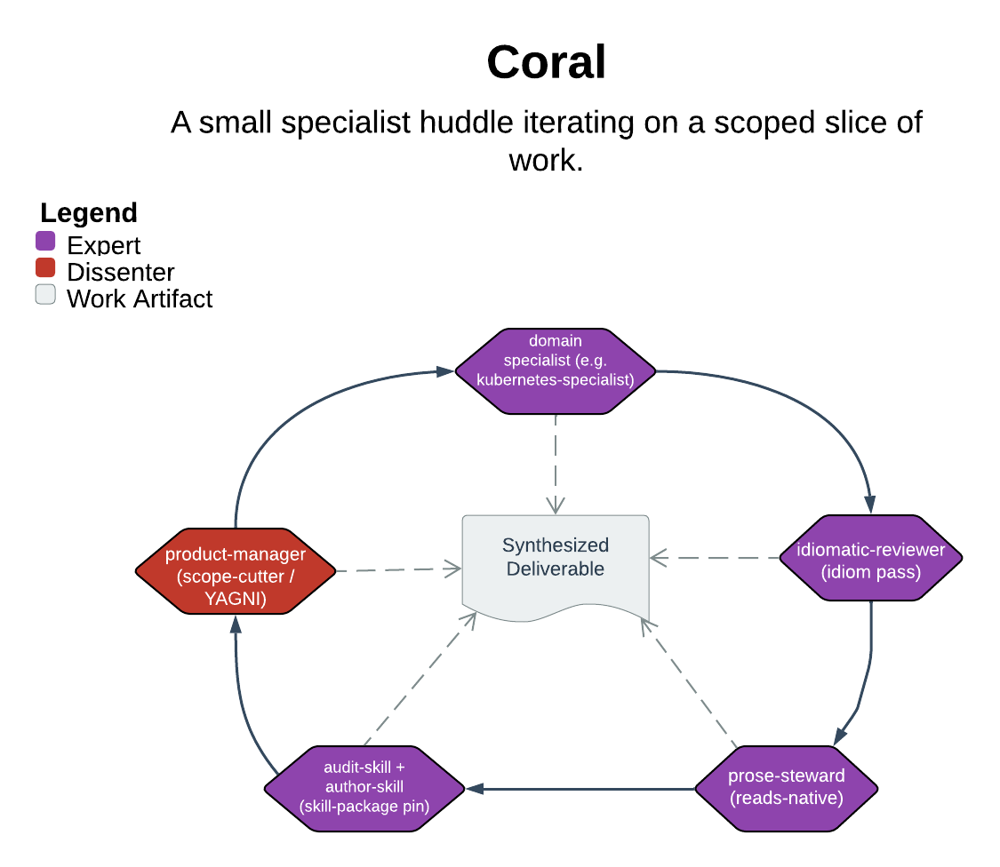

# Coral

> A small specialist huddle iterating on a scoped slice of work.

Coral is the fast path for expert iteration. Given a defined slice of work, it picks the smallest set of specialists that match. It iterates with them in a single session, no scope-tier ceremony. Its core guarantee is least-scope synthesis. Specialists give the most they would argue for, and the orchestrator ships the minimum that delivers value. Everything cut gets a "deferred — when X" line rather than a silent drop.

| | |
|---|---|
| **Diagram archetype** | circular-cohort |
| **Visual grammar** | Design 14 · Grammar-version 14.1.0 |
| **Live diagram** | [Open in Lucid](https://lucid.app/lucidchart/09936a56-6bbe-41f0-8088-b7b1b5346ea8/edit) |
| **Skill** | [`SKILL.md`](./SKILL.md) |

## What it does

- Reads the ask into a one-line slice statement that anchors dispatch and synthesis. Then routes off the shared table of change-type x tier to pick the smallest matching specialist slate (single, parallel, or sequential).
- Dispatches focused briefs framed as "the most you'd argue for," then synthesizes with a YAGNI pass — least scope that ships, rest deferred explicitly.
- Stays deliberately narrow: it flags handoff to `/council` (never auto-hands-off) when work grows past its scope. The triggers: three or more components, two or more interface boundaries, a one-way door, or multiple sessions.
- Refusal that matters most: a suggest-only reviewer is never the terminal authoring stage — author drafts, reviewer suggests, an author applies and emits.

## Reading the diagram

The circular-cohort archetype shows a ring of specialists iterating around a single shared slice rather than a one-way pipeline. The center holds the slice statement and the orchestrator that picks and synthesizes. The ring nodes are the dispatched specialists, and the arrows are iteration cycles feeding outputs back toward the center. Read the loop as repeatable — coral runs the ring multiple times against the same target as the diff stabilizes. Read the orchestrator at the hub as the one that cuts the cohort's combined output down to least scope.
