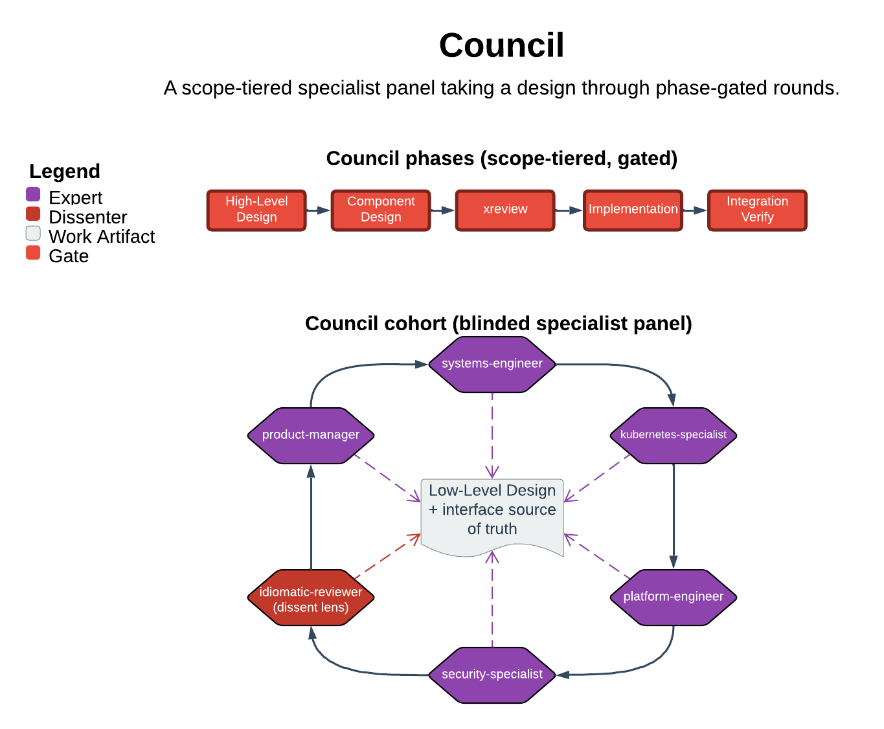

# Council

> A scope-tiered specialist panel taking a design through phase-gated rounds.

Council is the full-ceremony engineering coordinator. It convenes a panel of specialist agents to design, cross-review, and implement multi-component work whose risk warrants formal process. Its central guarantee is that process weight matches scope. Nothing dispatches without an identified tier (Product / System / Component / Feature). No interface change ships without a dedicated `/xreview` phase, and that phase must resolve every MISMATCH and MISSING finding before proceeding.

| | |
|---|---|
| **Diagram archetype** | circular-cohort |
| **Visual grammar** | Design 14 · Grammar-version 14.1.0 |
| **Live diagram** | [Open in Lucid](https://lucid.app/lucidchart/84a42837-3712-4c4f-b8d5-3c4529d39aeb/edit) |
| **Skill** | [`SKILL.md`](./SKILL.md) |

## What it does

- Assesses scope first and sizes the process to it — four tiers from Feature (just implement) up to Product (decompose and design from scratch). Hands coral-sized work back to `/coral`.
- Dispatches specialists from the repo roster, sequentializing provider-before-consumer when they share an interface boundary and parallelizing only when they do not.
- Runs `/xreview` as its own phase against provider, consumer, and the interface source of truth, and halts until the panel resolves every MISMATCH and MISSING.
- Refuses to cross a one-way door without explicit user approval. One-way doors: persisted schema/field names, public API contracts, on-disk or wire formats, signed or indexed identifiers. Reads session state in fail-loud mode rather than silently starting fresh.

## Reading the diagram

This is a circular-cohort diagram: the specialist panel sits in a ring around the council coordinator. The design under work moves through that ring in phase-gated rounds rather than down a single line. Each seat in the ring is one dispatched specialist; the arrows between them carry provider-to-consumer ordering. The `/xreview` gate sits as the round's checkpoint that the work must clear — COMPATIBLE — before the next round begins. Read it as iteration with a gate, not a one-pass pipeline. The coordinator at the center owns scope-tiering, sequencing, and the one-way-door stop.
