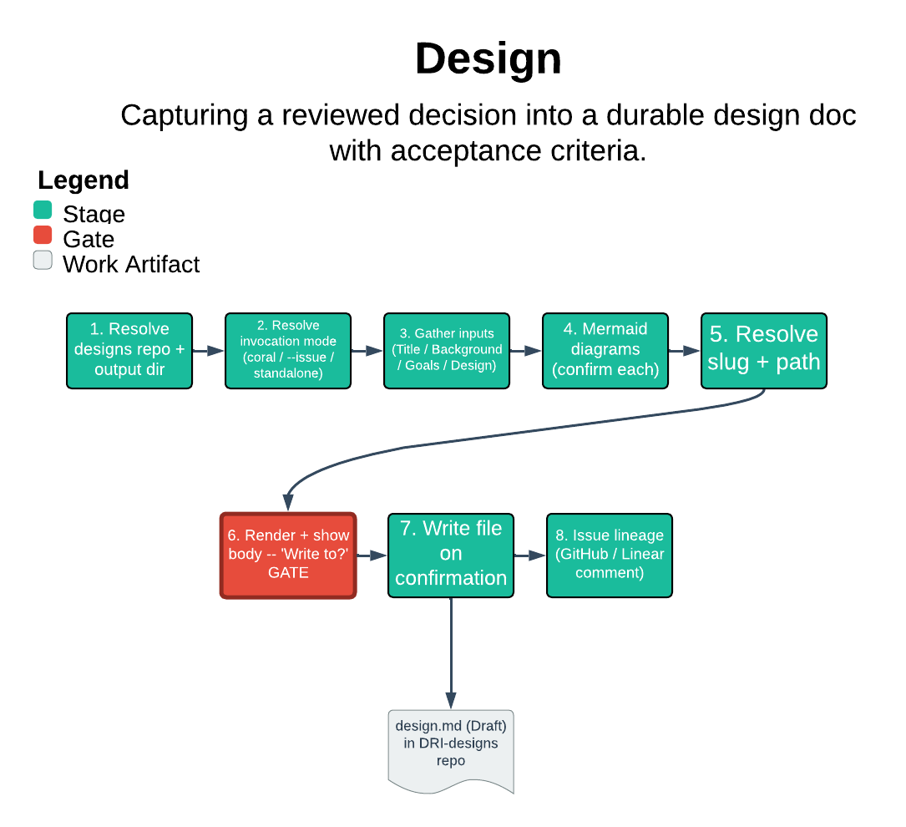

# Design

> Capturing a reviewed decision into a durable design doc with acceptance criteria.

`/design` records a design that a session already decided — an LLD, an architecture sketch, a system-tier call — as a structured markdown doc in the DRI's designs repo, threaded back to its source issue and bet. The one thing it guarantees: it never invents design content. It is the recording step, so it refuses to synthesize from training data, halts on empty required fields, and shows the full body before any write.

| | |
|---|---|
| **Diagram archetype** | linear-pipeline |
| **Visual grammar** | Design 14 · Grammar-version 14.1.0 |
| **Live diagram** | [Open in Lucid](https://lucid.app/lucidchart/c1ecec29-aac1-4e20-bebc-4e98f169ac9b/edit) |
| **Skill** | [`SKILL.md`](./SKILL.md) |

## What it does

- Captures a session's design into a fixed-shape doc (Background, Goals, optional Acceptance criteria, Non-goals, Design with mermaid, Alternatives, Trade-offs, Open questions, References).
- Seeds from a GitHub or Linear source issue and threads bidirectional lineage.
- Lands the file in the DRI's `<name>-designs` repo, arc-foldered, never in the code package.
- The refusal that matters most: no content xreview. It records what coral/council decided and will not critique, improve, or fill in the design — and it halts rather than fabricate a missing required field.

## Reading the diagram

This is a linear-pipeline: ordered stages run left-to-right, the way an invocation actually flows. Read it as resolve-repo to resolve-mode (coral handoff, `--issue`, or standalone) to gather-inputs to mermaid to render-and-show to write to issue-lineage. The arrows are the show-before-write discipline made visible — each stage feeds the next only after its gate passes, and the halt conditions branch out where a stage refuses to proceed.
