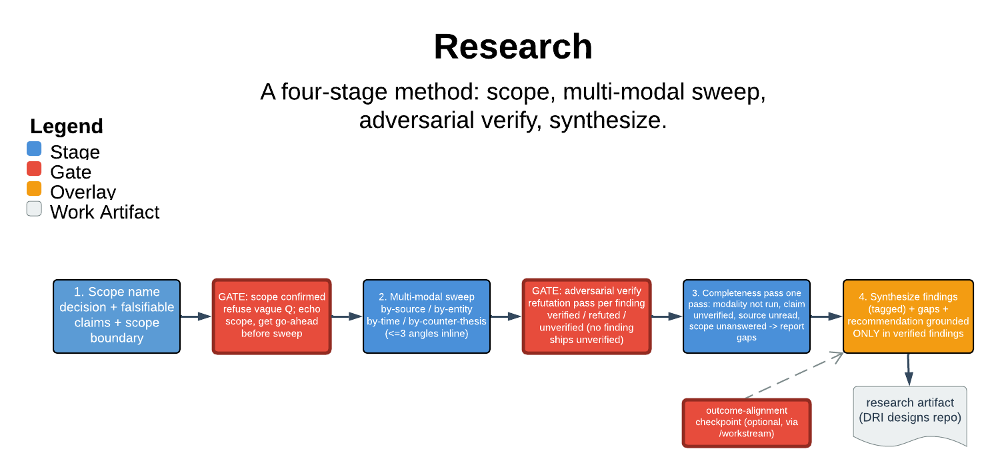

# Research

> A four-stage method: scope, multi-modal sweep, adversarial verify, synthesize.

Research answers a question with a durable, verified, lineage-threaded artifact instead of a chat reply that evaporates. Its core guarantee is the adversarial verify gate: no material finding ships unless a refutation pass tried to disprove it and failed. Anything the pass can neither confirm nor refute stays only under an `unverified` label. The skill refuses a vague question and sharpens it before any sweep begins.

| | |
|---|---|
| **Diagram archetype** | linear-pipeline |
| **Visual grammar** | Design 14 · Grammar-version 14.1.0 |
| **Live diagram** | [Open in Lucid](https://lucid.app/lucidchart/034b7da5-b5da-4d9f-b893-cd8191b9b2ae/edit) |
| **Skill** | [`SKILL.md`](./SKILL.md) |

## What it does

- Scopes the question — the decision it informs, the falsifiable claims, the in/out boundary. Refuses to sweep until it has echoed that scope and the user has confirmed it.
- Fans out a multi-modal sweep (by-source, by-entity, by-time, by-counter-thesis). Records per finding which angle surfaced it and the retrievable source.
- Adversarially verifies each finding via an assigned-skeptic refutation pass, then runs one completeness pass and synthesizes a recommendation grounded only in verified findings.
- The refusal that matters most: no finding ships unverified — an unattempted refutation yields `unverified`, never `verified`.

## Reading the diagram

This is a linear-pipeline. The four stages run left-to-right as ordered boxes — Scope, Sweep, Verify, Synthesize. The arrows between them are the gates work must pass to advance. The fan of arrows entering Verify is the multi-angle sweep converging. The refutation gate at Verify is the narrow point that holds back unverified findings rather than letting them flow through. The scoped question on the left is the contract the completeness pass checks against before synthesis on the right.
