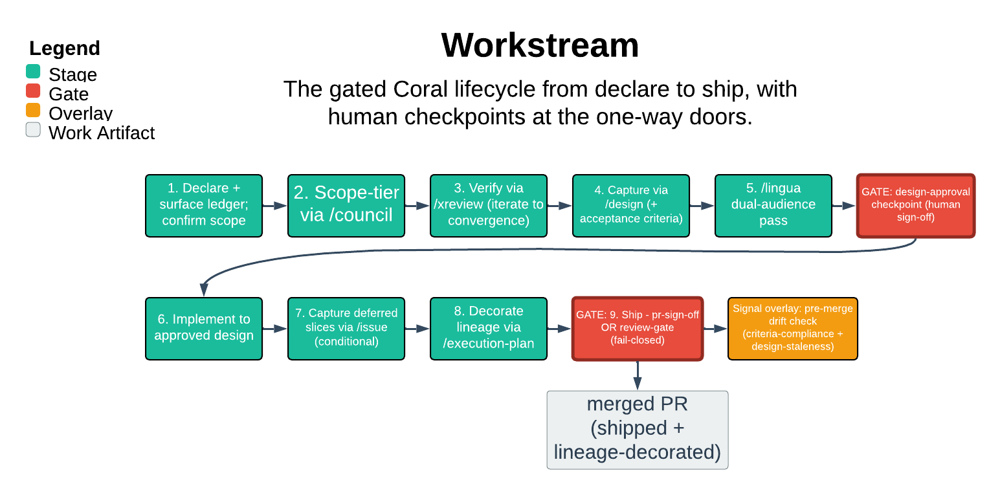

# Workstream

> The gated lifecycle from declare to ship, with human checkpoints at the one-way doors.

Workstream launches and governs a substantial, multi-step effort on the Coral stack. It walks the council -> xreview -> design -> issue lifecycle while inserting declared gates at the seams. Its core guarantee is the checkpoint discipline: a declared human gate outranks a `/goal` Stop hook. The agent therefore never self-approves walking through a one-way door. Neither green CI nor "keep going" pressure changes that. It composes the existing skills and never edits or reimplements them.

| | |
|---|---|
| **Diagram archetype** | linear-pipeline |
| **Visual grammar** | Design 14 · Grammar-version 14.1.0 |
| **Live diagram** | [Open in Lucid](https://lucid.app/lucidchart/7110ebb6-8b1a-4481-b1c0-c651be57d599/edit) |
| **Skill** | [`SKILL.md`](./SKILL.md) |

## What it does

- Scaffolds the Coral lifecycle (council, xreview, /design, /issue) and inserts gates at the transitions, composing each skill rather than driving or replacing it.
- Declares three gate kinds up front in a typed ledger. Human **checkpoints** surface and wait for explicit confirmation. Signal **guards** are fail-closed metric watches during a cutover. **Review-gates** merge on consensus, satisfied only when the /xreview ledger is unanimous and declared checks pass.
- The one refusal that matters: it never self-approves a declared checkpoint. A Stop hook governs *stopping*, not *approval* — it cannot manufacture a sign-off the human never gave. A guard or review-gate never discharges a one-way door.

## Reading the diagram

This is a linear-pipeline. Read it left-to-right as the ordered stages of one workstream. Those stages: declaring the ledger, council, xreview-to-convergence, /design, the dual-audience prose-steward review, implementation, and shipping.

The gates sit *on* the arrows between stages. A checkpoint, guard, or review-gate is not a stage of its own. It is a one-way door the flow must stop at and clear before advancing. The diagram shows where each declared gate falls in the sequence and which composed skill owns the work on either side of it.
